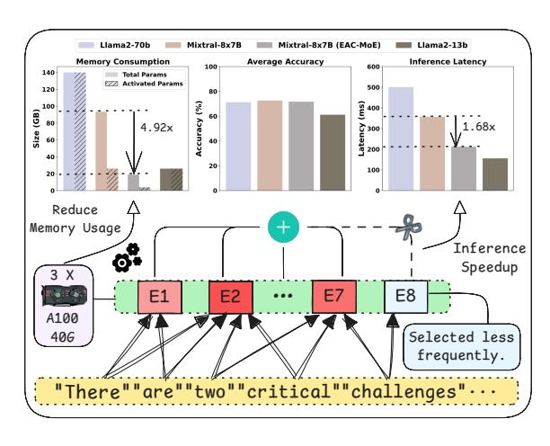
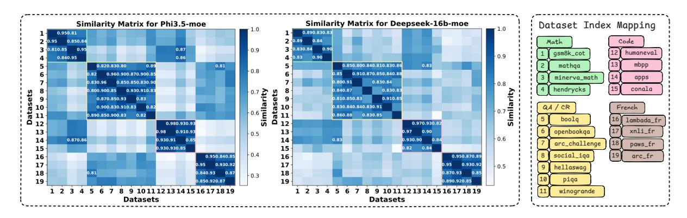
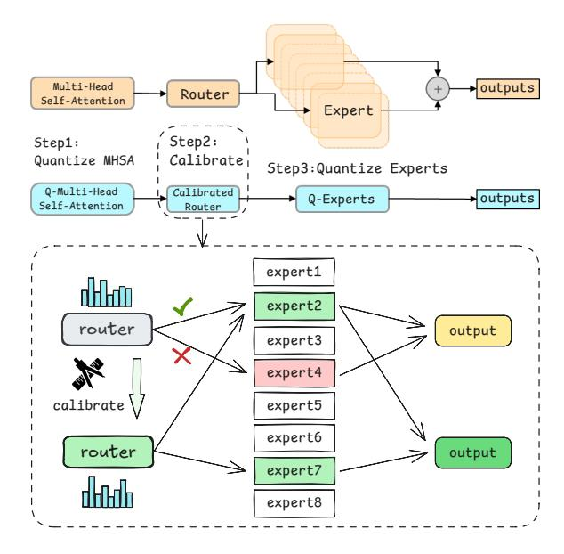
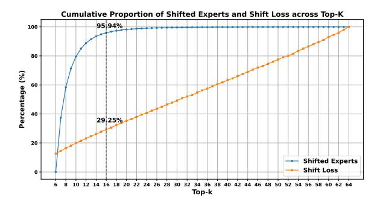
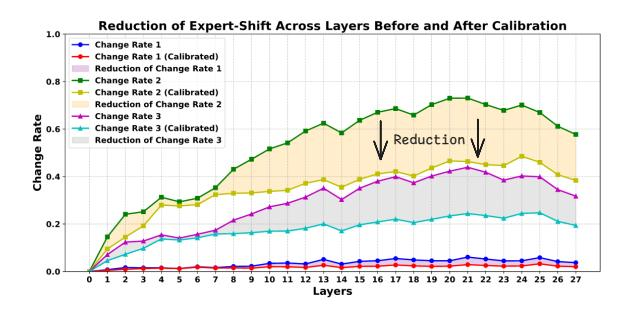
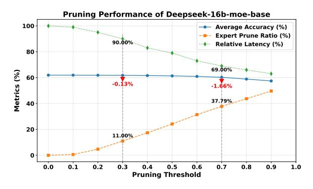

# 1 Introduction

Large Language Models (LLMs) have demonstrated remarkable capabilities in various natural language processing tasks. [\(Zhou et al.,](#page-11-0) [2024\)](#page-11-0). A recent significant breakthrough in this field is the introduction of the Mixture-of-Experts (MoE) architectures [\(Shazeer et al.,](#page-11-1) [2017;](#page-11-1) [Anonymous,](#page-9-0) [2024\)](#page-9-0). By utilizing a sparse architecture that activates a subset of experts via a dynamic routing mechanism tailored to each input, MoE enables efficient computation and scalable network capacity, matching

Figure 1: Comprehensive performance of EAC-MoE in reducing memory usage, maintaining model accuracy, and improving inference speed for Mixtral-8x7B. The average accuracy is measured across zero-shot tasks.

or exceeding the performance of dense LLMs with several times more activated parameters.

Although MoE reduces the number of activated parameters through an expert selection mechanism, it does not decrease the total number of model parameters. During inference, all expert weights must be stored in GPU memory, resulting in substantial memory pressure. As shown in Figure [1](#page-0-1) top, while Mixtral-8x7B [\(Jiang et al.,](#page-10-0) [2024\)](#page-10-0) has a similar activated parameter count to LLaMA2-13B [\(Touvron](#page-11-2) [et al.,](#page-11-2) [2023\)](#page-11-2), its total parameter count is about four times larger, occupying 94GB of GPU memory.

On the other hand, the reduction in activated parameters does not directly result in an equivalent speedup during inference. Although only a subset of experts is selected for each token, in typical long-sequence or batch inference scenarios, different tokens choose different experts. As illustrated in Figure [1](#page-0-1) bottom, MoE still requires computing the output of each expert (E1-E8) separately and performing a weighted summation to obtain the final result, experts like E8 are selected less frequently but still cause non-negligible latency.

These challenges hinder the practical deploy-

\* Equal contribution.

† Corresponding author.

ment of MoE models in resource-constrained, low-latency applications. For dense LLMs, quantization and pruning are commonly employed to address these issues. However, directly applying commonly used quantization methods (such as RTN and GPTQ (Frantar et al., 2022)) and pruning methods designed for dense LLMs to MoE models, without considering the characteristics of MoE models, results in significant performance degradation or brings negligible inference speedup. In this work, we design a method that combines quantization and sparse inference, leveraging the expert selection characteristics of MoE models.

In MoE models, the experts are trained to specialize for different types of tasks, and the router can select the most suitable experts for each token, which is the key for its success (Jordan and Jacobs, 1994). However, low-bit quantization of MoE model can bias expert selection probability and cause the router to choose the wrong experts, which we refer to as **the expert-shift problem**. To address this issue in MoE quantization, we propose Quantizaion with Expert-Selection Calibration (QESC): a layer-by-layer router calibration method to mitigate the bias caused by quantization, thereby reducing the shift in expert selection. This approach effectively preserves the performance of the quantized model.

In contrast, the focus of dynamic pruning lies in skipping experts that are relatively unimportant for the current input during inference. Specifically, certain experts are less frequently selected during inference and have minimal impact on overall performance. Notably, these relatively unimportant experts vary across different types of tasks. Based on this observation, we propose Pruning based on Expert-Selection Frequency (PESF): a dynamic expert pruning method that prunes less frequently selected experts during inference, significantly improving the inference speed of MoE models with minimal performance loss.

Combining QESC and PESF, we propose EAC-MoE, exploring the compression of MoE models from both aspects of pre-inference and during-inference. Experiments on four MoE models demonstrate that our method significantly reduces memory usage and improves inference speed. When compressing Mixtral-8x7B, as shown in Figure 1 top, we reduce the memory requirements by 4.92×, enabling deployment on a RTX 3090 GPU. Meanwhile, our method achieve 1.68× inference speedups with an average accuracy loss of less than

1% under simultaneous quantization and pruning, making it practical for real-world applications.

#### 2 Related Work

Quantization for LLMs and MoE-LLMs. Post-Training Quantization (PTQ) is an efficient technique that reduces computational and storage requirements by converting pre-trained models from high-precision to lower-precision formats without requiring extensive retraining. Methods like GPTQ (Frantar et al., 2022) and BiLLM (Huang et al., 2024b) focus on addressing weight-only quantization, while approaches such as SmoothQuant (Xiao et al., 2023a) and OmniQuant (Shao et al., 2023) aim to tackle the challenges of both weight and activation quantization. In this work, we focus primarily on weight-only quantization because the MoE deployment challenges stem mainly from the memory pressure caused by weight parameters. For MoE-LLMs, previous studies have largely focused on mixed-precision quantization strategies based on expert selection frequency (Li et al., 2024a; Huang et al., 2024a). Although these methods have shown certain effectiveness, they may face challenges in generalization and risk overfitting. Pruning of LLMs and MoE-LLMs. Post-training pruning is another key technique to compress LLMs by reducing model size by selectively removing less important parameters while preserving performance (Han et al., 2016; Zhu and Gupta, 2018; Ashkboos et al., 2024a). For MoE-LLMs, prior efforts have focused mainly on two directions: pruning experts with lower selection frequency before inference (Lu et al., 2024; Kim et al., 2021), and pruning less significant weights for each token among the selected experts (Lu et al., 2024; Huang et al., 2024a). However, while these approaches have made notable progress, there remain opportunities for further improvement. The first direction, for example, can lead to performance degradation in certain types of tasks. The second direction, on the other hand, achieves a relatively low pruning rate, resulting in limited inference speedup.

#### 3 Preliminaries and Motivation

#### 3.1 LLM Quantization

In this work, quantization techniques are employed to compress the weights. Specifically, floating-point weights distributed in  $[W_{\min}, W_{\max}]$  are mapped to the integer range  $[0, 1, \cdots, 2^B - 1]$ , where B represents the target bit-width. The quan-

Figure 2: The figure illustrates the pairwise cosine similarity of expert selection frequencies for Phi3.5-moe (left) and Deepseek-moe-16b-base (right) across 19 datasets, which are categorized into four groups distinguished by different colors. Points with cosine similarity greater than 0.8 are highlighted to emphasize high similarity regions.

tization reconstruction problem for the weights  $W \in \mathbb{R}^{n_{\text{in}} \times n_{\text{out}}}$  can be formulated as:

$$\arg\min_{\boldsymbol{W}_q} \|\boldsymbol{W}\boldsymbol{X} - \boldsymbol{W}_q \boldsymbol{X}\|_2^2, \tag{1}$$

where  $W_q$  denotes the quantized weight, and X is the input to the layer derived from a small subset of calibration data. GPTQ (Frantar et al., 2022) is currently a mainstream weight quantization method, which can efficiently reduce group-wise quantization error by employing Hessian-based estimation  $(H = 2XX^{\top})$  and error compensation techniques. It is utilized in subsequent sections of this paper.

## 3.2 Mixture-of-Experts

Decoder-only MoE models (Gale et al., 2023) are based on a transformer architecture (Vaswani et al., 2017), but the FeedForward Network (FFN) sublayers of traditional dense models are replaced with MoE layers, each containing N experts. For each input token x, the router computes routing logits  $r = \{r_0, \cdots, r_{N-1}\}$  and expert selection scores s = Softmax(r). The top-K experts are selected based on s, and their outputs  $E_{e_j}(x)$  are combined as a weighted sum, with normalized weights:

$$z = \sum_{j=0}^{K-1} \frac{s_{e_j}}{\sum_{i=0}^{K-1} s_{e_i}} \cdot E_{e_j}(x).$$
 (2)

Here,  $E_{e_j}(\boldsymbol{x})$  represents the output of the j-th selected expert for the input token  $\boldsymbol{x}$ . Based on this structure and mechanism, models such as Mixtral-8x7B (Jiang et al., 2024), GPT-4 (OpenAI et al., 2024) and DeepSeek-V3 (DeepSeek-AI et al., 2024) have achieved superior generative abilities.

## 3.3 Expert-Selection (ES) Analysis

Previous quantization studies for MoE-LLMs have primarily focused on the observation that, during inference, MoE models exhibit significant differences in the selection frequency of different experts (Li et al., 2024a). Consequently, expert selection frequency has been widely adopted as a metric to evaluate the importance of different experts within an MoE layer. However, prior works have overlooked an important pattern: MoE models often demonstrate entirely different expert preferences across different types of tasks.

To investigate this pattern, we examine three common categories of NLP tasks: Math, Code-Generation, and Question-Answering or Commonsense-Reasoning (QA/CR). Additionally, we analyze tasks in specific languages (French in our case) as a separate category. For each dataset, we record the expert selection frequency during inference. Furthermore, we calculate the similarity of expert selection frequencies between every pair of datasets to better understand the diversity in expert preferences across tasks. For a certain MoE layer m in a MoE model, the normalized expert selection frequency for dataset d is defined as:

$$P(m,d) = \frac{C(m,d)}{\sum_{i=0}^{N-1} C(m,d,i)}$$
(3)

where  $C(m,d) = [C(m,d,0), \cdots, C(m,d,N-1)]$ , with C(m,d,i) representing the count of the i-th expert in layer m is selected for all input tokens in the dataset d. Then the normalized expert selection frequencies P(m,d) of all MoE layers are flattened into a single vector P(d). Based on this, the similarity of expert preferences between two datasets  $d_i$  and  $d_j$  is computed as:

$$Sim(d_i, d_j) = \frac{P(d_i) \cdot P(d_j)}{\|P(d_i)\| \|P(d_j)\|}$$
(4)

As shown in Figure 2, we calculate the expert preference similarities of Phi3.5-moe (Abdin et al.,

[2024\)](#page-9-5) and DeepSeek-16b-moe-base models across 19 different datasets. The results indicate that both models reach similar conclusions: expert selection frequencies within datasets of the same task category exhibit high similarity, whereas expert selection frequencies across datasets of different task categories show relatively low similarity.

This observation suggests that MoE models rely primarily on different experts to handle different types of tasks and the importance of the same expert may vary drastically across different tasks, providing us with the following two insights:

- 1. For static quantization, we should focus on the expert selection process itself—ensuring that the model can still select the experts important for each task, as we cannot permanently determine the importance of any expert before inference using a calibration set.
- 2. For dynamic pruning, we should dynamically evaluate the importance of experts based on the type of the current task and prune experts that are not important for the current task.

## 4 Quantization with ES Calibration

The core idea of our method is to mitigate the performance degradation of quantized MoE models by addressing expert-shift, a critical issue where quantization errors in the multi-head self-attention (MHSA) and MoE blocks distort expert selection probabilities, causing routers to deviate from original expert assignment patterns.

## 4.1 Importance of ES Calibration

We first verify the importance of calibrating expert selection by observing performance degradation caused by expert-shift and performance improvement achieved by preserving the expert selection. We separately record the expert selection and its corresponding scores (s) for all inputs on the Wiki-Text2 [\(Merity et al.,](#page-10-9) [2016\)](#page-10-9) validation set for both full-precision model and the 3-bit quantized model. Then, we enforce the quantized model to use the expert selection scores of the original precision model for each input (quantized but without expertshift) and, conversely, enforce the original precision model to use the expert selection scores of the quantized model (not quantized but with expertshift). Finally, we calculate the perplexity (PPL) of the inputs under these four conditions respectively.

As shown in Table [1,](#page-3-0) expert-shift causes significant performance degradation for the original

Table 1: The impact of weight quantization itself and its induced expert-shift on perplexity (PPL↓) for Mixtral-8x7B and Deepseek-moe-16b-base models.

| Model        | Quantized | Expert-Shift | PPL  |
|--------------|-----------|--------------|------|
|              | ✘         | ✘            | 3.84 |
|              | ✘         | ✔            | 4.17 |
| Mixtral-8x7B | ✔         | ✘            | 4.21 |
|              | ✔         | ✔            | 4.65 |
|              | ✘         | ✘            | 6.51 |
| Deepseek-moe | ✘         | ✔            | 6.76 |
| -16b-base    | ✔         | ✘            | 6.81 |
|              | ✔         | ✔            | 7.17 |

Figure 3: Framework of our proposed Quantization with Experts-Selection Calibration.

model. Conversely, preserving the expert selection of the original model significantly improves the performance of quantized models, highlighting the importance of calibrating expert selection.

## 4.2 Layer-by-layer Calibration Framework

Then we focus on how to mitigate expert-shift problem. At a hight level, our method performs quantization and calibration layer-by-layer. Concretely, as illustrated in Figure [3,](#page-3-1) using the WikiText2 calibration dataset, we sequentially quantize the MHSA components, calibrate the routers of the MoE layers, and quantize all experts layer by layer. This process allows the router in each layer to be calibrated in a way that mitigates the expertshift caused by the quantization of the adjacent layer's MHSA and MoE layer, thereby preventing the cumulative accumulation of expert selection shift across layers.

Figure 4: Cumulative proportion of shifted experts in the top-K experts of the probability distribution (blue; i.e., number of shifted experts in top-K / total number of shifted experts), and cumulative proportion of the shift loss of the top-K experts in the probability distribution relative to the total loss of all experts (orange)

#### 4.3 TopK-MSE Loss

To calibrate the router, a natural idea is to align the router's outputs before and after input quantization, such as by using the mean squared error (MSE) loss for optimization. However, this method is not effective for MoE models with a large number of experts, such as Deepseek-moe-16b-base—which selects 6 experts out of 64 (Dai et al., 2024). Comparing expert selection before and after 2-bit quantization, as shown in Figure 4, we observe that among the experts selected in full precision but not selected after quantization (shifted experts), 95.9% still rank within the top 16 in the probability distribution. However, the loss corresponding to the top 16 experts accounts for only 29.25% of the total MSE loss. This indicates that if we directly apply MSE loss to all experts, the loss will be dominated by the majority of experts with very small selection probabilities, which are not selected in full precision, thereby introducing noise into the optimization process.

Based on this insight, we adopt the TopK-MSE loss, which computes the MSE loss over only the top-K classes with the highest probabilities, allowing the optimization process to focus on aligning the experts that are more likely to be selected. The TopK-MSE loss is calculated as follows:

$$\mathcal{L} = \frac{1}{K} \sum_{i \in \text{top-}K(\boldsymbol{W}\boldsymbol{x})} ((\boldsymbol{W}\boldsymbol{x})_i - (\boldsymbol{W}\boldsymbol{\hat{x}})_i)^2, \quad (5)$$

W represent the weight matrix of router and  $\hat{x}$  denotes the input obtained from the quantized model.

## 5 Pruning based on ES Frequency

QESC focuses on ensuring the quantized model can still correctly select the experts important for the current task. A natural consideration is that there are also experts that are not important for the current task. In this section, we introduce a dynamic expert pruning method during inference, which significantly improves inference speed while maintaining almost the same level of accuracy.

Prior work (Lu et al., 2024) has already noted the sparsity in expert selection for MoE models, where certain experts are selected with high frequency for a specific task, while others are rarely selected (shown in Appendix A.11). Meanwhile, as concluded in Section 3.3, it is crucial to dynamically evaluate the importance of each expert during inference for different tasks. Therefore, unlike prior work that performs static expert pruning based on selection frequency before inference, our approach dynamically identifies experts that are less important for the current task during the inference process. This allows us to achieve significant inference speedup with minimal performance degradation.

Figure 5: Framework of our proposed Pruning based on Experts-Selection Frequency.

In our method, the dynamic pruning criterion is set as follows: assume each layer of the MoE model has N experts, each token selects K experts, and the input sequence length is l. The dynamic **pruning threshold** is defined as  $\alpha$  ( $0 < \alpha \le 1$ ). If the number of times an expert is selected, denoted as c, satisfies the condition:

$$c < \left(\frac{l \times K}{N}\right) \times \alpha \tag{6}$$

then the expert is pruned. In other words, if an expert is selected less frequently than the average selected count multiplied by the threshold  $\alpha$  (like expert5 in Figure 5), it is pruned and excluded from the computation for this sequence.

Table 2: Comparison of the average perplexity (PPL) scores on WikiText2 validation set and the average accuracy on 8 zero-shot tasks across four different MoE models. We reproduce results of BSP and PMQ on four models using the official codebases provided in their repositories (the reproduction details are provided in Appendix A.6) and evaluated all the results under the same settings. Full results are in the Appendix A.7.

| D'4-  | Madaal      | Mixt             | ral-8x7B                | Phi3            | Phi3.5-moe              |      | Deepseek-moe-16b-base             |       | Qwen1.5-MoE-A2.7B                 |  |
|-------|-------------|------------------|-------------------------|-----------------|-------------------------|------|-----------------------------------|-------|-----------------------------------|--|
| Bits  | Bits Method | $PPL \downarrow$ | $0$ -shot $^8 \uparrow$ | $PPL\downarrow$ | $0$ -shot $^8 \uparrow$ | PPL↓ | $0$ -shot 8 $\uparrow$ | PPL ↓ | $0$ -shot 8 $\uparrow$ |  |
| 16.00 | Baseline    | 3.84             | 72.64                   | 3.99            | 69.62                   | 6.51 | 61.38                             | 7.22  | 64.72                             |  |
|       | GPTQ        | 5.51             | 62.56                   | 5.32            | 64.45                   | 8.27 | 54.88                             | 9.92  | 57.76                             |  |
| 2.06  | PMQ         | 5.41             | 63.25                   | 5.88            | 61.35                   | 8.42 | 54.79                             | 9.89  | 57.79                             |  |
|       | QESC        | 5.09             | 66.31                   | 5.22            | 65.03                   | 7.99 | 57.05                             | 8.30  | 59.52                             |  |
|       | GPTQ        | 4.74             | 68.65                   | 4.74            | 65.81                   | 7.36 | 56.83                             | 8.41  | 57.91                             |  |
| 2.54  | BSP         | 4.98             | 65.44                   | 4.72            | 66.15                   | 7.32 | 58.24                             | 8.11  | 60.40                             |  |
| 2.34  | PMQ         | 4.78             | 67.5                    | 4.73            | 66.03                   | 7.17 | 58                                | 8.09  | 60.47                             |  |
|       | QESC        | 4.54             | 69.61                   | 4.66            | 66.53                   | 7.08 | 58.33                             | 7.74  | 61.47                             |  |
|       | GPTQ        | 4.16             | 68.92                   | 4.28            | 68.12                   | 6.82 | 59.33                             | 7.69  | 62.21                             |  |
| 3.03  | BSP         | 4.25             | 67.22                   | 4.61            | 67.67                   | 7.05 | 59.39                             | 7.86  | 60.88                             |  |
|       | QESC        | 4.14             | 72.21                   | 4.24            | 68.49                   | 6.71 | 61.22                             | 7.50  | 62.89                             |  |

## 6 Experiment

In this section, we first evaluate the experimental performance of our proposed methods QESC and PESF, respectively. Then we combine quantization and pruning (QESC+PESF) to assess their performance in maintaining model accuracy, memory usage reduction, and actual inference speedup.

#### 6.1 Setup

Models and Dataset. We validate our method on four MoE models: Mixtral-8x7B, Phi3.5-moe, Deepseek-moe-16b-base and Qwen1.5-MoE-A2.7B (Yang et al., 2024). We report perplexity (PPL) on the WikiText2 testset and accuracies of eight zero-shot tasks tested by EleutherAI LM Harness (Gao et al., 2024), including Winogrande (ai2, 2019), PIQA (Bisk et al., 2020), ARC-Easy, ARC-Challenge (Clark et al., 2018), BoolQ (Clark et al., 2019), MathQA (Amini et al., 2019), HellaSwag (Zellers et al., 2019), MMLU (Hendrycks et al., 2021b). Additionally, we present the results of our method on the challenging tasks GSM8K (Cobbe et al., 2021) and HumanEval (Chen et al., 2021). Implementation Details. We follow the settings of prior work (Li et al., 2024a; Huang et al., 2024a), keeping the MHSA components at 4-bit precision, while quantizing all experts to 2 bit or 3 bit pre-

of prior work (Li et al., 2024a; Huang et al., 2024a), keeping the MHSA components at 4-bit precision, while quantizing all experts to 2-bit or 3-bit precision, and maintaining the router at its original precision. Overall, we evaluate our method under three average bit-width settings: 2.06-bit, 2.54-bit, and 3.03-bit (detailed bit-width setting is discussed in Appendix A.5). The quantization employs group-wise (group size 128) asymmetric quantization and follows the GPTQ procedure. We use 128 sequences of length 2048 from the WikiText2 training set as the calibration set for QESC.

Figure 6: The reduction of expert-shift before and after calibration measured by expert-selection change rate across layers in Deepseek-moe-16b-base under 2.06-bit quantization. Change Rate 1-3 respectively represent three metrics: all expert selections changed, at least one selection changed and half or more selections changed.

#### **6.2** Experiment on Quantization

Reduction in Expert-Shift. First, we intuitively validate the effectiveness of our calibration method by measuring the expert selection change rate before and after calibration on WikiText2 validation set. We calculate the expert selection change rates of the quantized model with or without router calibration relative to the full-precision model on Deepseek-moe-16b-base, and show the relative reduction in Figure 6. The results demonstrate that our calibration method significantly reduces the expert selection change rate in quantized MoE models across three metrics.

**Overall Performance.** We further validate the overall performance of our method. We compare our quantization method with three other methods: GPTQ, PMQ (Li et al., 2024a), and BSP (Li et al., 2024a). GPTQ serves as the baseline for uniform bit-width quantization, while PMQ (1.57–2.54 bit) and BSP (2.54–3.03 bit) are current SOTA methods for mixed-precision quantization of MoE models.

Table 3: Comparison of the average accuracy on 8 zero-shot tasks and speedup of inference across four different MoE models. The speedup is calculated based on the total inference time of the model with dynamic pruning compared to the original model across 8 tasks. We reproduce results of EES and ODP (details are provided in Appendix A.8) and evaluate all the results under the same settings. Full results can be found in Appendix A.9.

| M.d. 1                  | Mixtral-8x7B |           | Phi3.5-moe |           | Deepseek-moe-16b-base |           | Qwen1.5-MoE-A2.7B |           |
|-------------------------|--------------|-----------|------------|-----------|-----------------------|-----------|-------------------|-----------|
| Method                  | 0-shot ↑     | Speedup ↑ | 0-shot ↑   | Speedup ↑ | 0-shot ↑              | Speedup ↑ | 0-shot ↑          | Speedup ↑ |
| Baseline                | 72.64        | 1.00      | 69.62      | 1.00      | 61.38                 | 1.00      | 64.72             | 1.00      |
| EES                     | 71.40        | 1.06      | 67.96      | 1.05      | 61.15                 | 1.08      | 64.42             | 1.06      |
| ODP                     | 71.98        | 1.05      | 68.92      | 1.04      | 61.19                 | 1.08      | 64.48             | 1.06      |
| PESF ( $\alpha = 0.3$ ) | 72.19        | 1.08      | 69.27      | 1.12      | 61.28                 | 1.11      | 64.64             | 1.14      |
| PESF ( $\alpha = 0.7$ ) | 58.22        | 1.13      | 67.95      | 1.30      | 60.41                 | 1.45      | 63.87             | 1.47      |

It is worth noting that QESC is inherently orthogonal to other weight quantization approaches for LLMs that focus on minimizing quantization error.

As shown in Table 2, when only GPTO is used to reduce quantization loss, significant performance degradation is still observed. Both BSP and PMQ, as mixed-precision quantization methods, demonstrate performance improvements over GPTQ at certain quantization bit-widths for some models. However, in nearly half of the settings, their results are inferior to those of GPTQ, indicating a certain degree of lack of generalization. In contrast, the proposed QESC method significantly outperforms GPTQ, BSP, and PMQ across all results. For instance, at 2.54-bit, QESC limits the performance loss to around 3% for all four models. Notably, at 3.03-bit, QESC reduces the loss to within 0.5% for Mixtral-8x7B and Deepseek-moe-16b-base, making it suitable for practical application scenarios. Challenging Tasks. Apart from PPL and common-

Challenging Tasks. Apart from PPL and commonsense tasks, we also evaluate our QESC method on the challenging tasks GSM8K and HumanEval, with the results provided in Appendix A.2.

Figure 7: The variations in the model's average accuracy, expert pruning rate, and inference acceleration effect with respect to changes in the pruning threshold  $\alpha$ .

## **6.3** Experiment on Pruning

**Pruning Threshold Analysis.** To determine a relatively appropriate pruning threshold, we aim to trade off among model accuracy, expert pruning

rate, and relative inference latency. As shown in Figure 7, we conduct experiments on Deepseek-16b-moe-base, adjusting the pruning threshold ( $\alpha$ ) from 0 to 0.9 with an interval of 0.1. For each threshold, we calculate the average accuracy on 8 zero-shot tasks, the average expert pruning rate across all layers, and the percentage of relative inference latency compared to the original model. The results show that pruning thresholds of 0.3 and 0.7 represent two sweet spots. The former achieves approximately 10% speed improvement with almost no loss to the model (average loss within 0.5%), while the latter is more aggressive, achieving over 1.3× average inference speedup while still keeping the average loss within around 1.5%.

Overall Performance. We compare our method with the classical MoE expert pruning method, known as Efficient Experts Skipping (EES) (Lu et al., 2024), and a recently proposed MoE pruning method, ODP (Huang et al., 2024a). EES performs pruning from the perspective of individual tokens, skipping the selected experts with negligible scores for each input token, while ODP incorporates a key token protection mechanism on top of this. However, both methods can only reduce the input size for a subset of experts, resulting in limited inference speedup. In contrast, our PESF method performs pruning from the perspective of experts, directly skipping experts that are selected less frequently for the current sequence. As shown in Table 3, under the more conservative setting  $(\alpha = 0.3)$ , our method significantly outperforms EES and ODP on all four models in both average accuracy and relative speedup. Moreover, compared to EES and ODP, our pruning method demonstrates greater flexibility. Notably, when we adopt a more aggressive setting with ( $\alpha = 0.7$ ), except for Mixtral-8x7B (discussed in Appendix A.12), our method achieves an inference speedup of 1.30x or greater on the other three models, while still maintaining model accuracy comparable to ODP.

Table 4: The overall performance of our compression method which combines QESC (3.03 bit) and PESF ( $\alpha=0.3$ ). "Params" denotes the parameter size, including quantizer parameters for the compressed model.

| _                         |           |            |                                   |           |
|---------------------------|-----------|------------|-----------------------------------|-----------|
| Models                    | Method    | Params(GB) | $0$ -shot 8 $\uparrow$ | Speedup ↑ |
|                           | Baseline  | 93.41      | 72.64                             | 1.00      |
| Mixtral-8x7B              | QESC      | 18.98      | 72.21                             | 1.54      |
|                           | QESC+PESF | 18.98      | 71.68                             | 1.68      |
|                           | Baseline  | 83.75      | 69.62                             | 1.00      |
| Phi3.5-moe                | QESC      | 17.08      | 68.49                             | 1.55      |
|                           | QESC+PESF | 17.08      | 68.31                             | 1.75      |
| Doomsools man             | Baseline  | 32.75      | 61.38                             | 1.00      |
| Deepseek-moe -16b-base | QESC      | 7.19       | 61.22                             | 1.39      |
| -100-base                 | QESC+PESF | 7.19       | 61.09                             | 1.55      |
| O 15MF                    | Baseline  | 28.63      | 64.72                             | 1.00      |
| Qwen1.5-MoE               | QESC      | 6.69       | 62.89                             | 1.36      |
| -A2.7B                    | QESC+PESF | 6.69       | 62.73                             | 1.58      |

#### 6.4 Experiment on Quantization + Pruning

Finally, we apply our QESC and PESF methods together to comprehensively compress MoE-LLMs. To achieve a reasonable trade-off between reducing memory usage, inference speed, and maintaining model performance, we apply a relatively mild dynamic pruning strategy ( $\alpha=0.3$ ) on top of 3.03-bit static quantization. We report the memory usage, average accuracy on zero-shot tasks, and inference speedup measured by the context latency for a batch of 4 sentences of length 512 in Table 4.

**Maintain Accuracy.** With the aid of effective expert selection calibration, our method limits the average accuracy loss across four models to within 1.25%, effectively maintaining the accuracy of the compressed MoE models.

Memory Saving and Inference Efficiency. By leveraging the BitBLAS tool (Wang et al., 2024) to store quantized weights and efficiently handle mixed-precision BLAS operations on GPUs, we limit the memory usage of Mixtral-8x7B and Phi3.5-moe to within 19GB, and that of Deepseekmoe-16b-base and Qwen1.5-MoE-A2.7B to within 7.2GB. This optimization enables deployment on a single RTX 3090 GPU while achieving an average speedup of 1.49× under 3.03-bit quantization. Furthermore, by integrating efficient dynamic expert pruning, we attain an average actual inference speedup of 1.64× across all four models.

Comparion with MC-MoE. To the best of our knowledge, MC-MoE (Huang et al., 2024a) is currently the only method that leverages both static quantization and dynamic pruning for MoE-LLMs, providing specific implementations for 2.06-bit and 2.56-bit quantization and pruning on Mixtral-8x7B. Therefore, we compare our method with MC-MoE at the corresponding quantization bit-widths on the same model and adopt a more conservative pruning

Table 5: Comprehensive comparison of average accuracy on 8 zero-shot tasks and inference speedup of four models under quantization and pruning.

| D:    | 36.1.1         | Mixtral-8x7B |                         |           |  |
|-------|----------------|--------------|-------------------------|-----------|--|
| Bits  | Method         | PPL ↓        | $0$ -shot $^8 \uparrow$ | Speedup ↑ |  |
| 16.00 | Baseline       | 3.84         | 72.64                   | 1.00      |  |
| 2.06  | MC-MoE         | 5.51         | 62.56                   | 1.80      |  |
| 2.00  | EAC-MoE (ours) | 5.14         | 65.90                   | 1.82      |  |
| 2.56  | MC-MoE         | 4.74         | 68.65                   | 1.71      |  |
| 2.30  | EAC-MoE (ours) | 4.58         | 68.60                   | 1.74      |  |

strategy in PESF ( $\alpha=0.3$ ). As shown in Table 5, our method outperforms MC-MOE in terms of PPL, average accuracy on zero-shot tasks, and actual inference speedup under both quantization settings.

**More Results of EAC-MoE.** Additionally, we perform more detailed experiments by combining other quantization bit-widths and more aggressive pruning strategies across all four models. Detailed results can be found in Appendix A.10.

## 6.5 Ablation Study of Loss Type

We compare the average accuracy on 0-shot tasks after calibration using TopK-MSE and MSE loss on three MoE models with a larger number of experts (the search for the optimal k-values in shown in Appendix A.4). As shown in Table 6, the calibrated models optimized with TopK-MSE demonstrate significantly better performance, proving the effectiveness of our optimization method.

Table 6: The impact of different loss types on the average accuracy of the calibrated model on 0-shot tasks (under 2.06-bit quantization).

| Models       | Loss Type | PPL ↓ | $0$ -shot 8 $\uparrow$ |
|--------------|-----------|-------|-----------------------------------|
| Phi3.5-moe   | MSE       | 5.33  | 64.52                             |
| Pn13.5-moe   | TopK-MSE  | 5.22  | 65.03                             |
| Deepseek-moe | MSE       | 8.16  | 55.91                             |
| -16b-base    | TopK-MSE  | 7.99  | 57.05                             |
| Qwen1.5-MoE  | MSE       | 9.02  | 58.44                             |
| -A2.7B       | TopK-MSE  | 8.30  | 59.52                             |

#### 7 Conclusion

In this work, we aim to address the challenges faced by MoE-LLMs and the limitations of existing compression methods. Focusing on expert selection, a key characteristic of MoE-LLMs, we propose a compression method specifically designed for MoE-LLMs that combines static quantization and dynamic pruning to enhance their deployment efficiency. Our methods significantly reduce memory usage and improve inference speed while maintaining high model performance.

## 8 Expert Pruning for MoE-LLMs

Recently we have observed that expert pruning for MoE-LLMs has emerged as a prominent area of research. Based on this, we aim to offer a relatively comprehensive overview of related studies for the reference of other researchers.

First, we narrow the scope to post-training expert pruning, which can generally be divided into two main categories: static expert pruning and dynamic expert pruning. Below, we present the latest advancements under each category:

(1) static expert pruning: To the best of our knowledge, [\(Lu et al.,](#page-10-6) [2024\)](#page-10-6) was the first to propose using a calibration set to determine the usage frequency of each expert in MoE and to evaluate expert importance based on their usage frequency. Experts with lower usage frequency are pruned prior to inference. Building on this, [\(Xie et al.,](#page-11-10) [2024\)](#page-11-10) applied knowledge distillation after pre-inference expert pruning to restore the performance of the pruned MoE model. Similar to [\(Lu et al.,](#page-10-6) [2024\)](#page-10-6) but not identical, [\(Muzio et al.,](#page-10-11) [2024\)](#page-10-11) leveraged the cumulative scores from the router's softmax output to assess expert importance for pre-inference pruning. Meanwhile, [\(Liu et al.,](#page-10-12) [2024\)](#page-10-12) introduced an expert merging approach, where less frequently used experts are merged with others to maintain the overall performance of the pruned MoE.

(2) dynamic expert pruning: Research on posttraining dynamic expert pruning is relatively limited. [\(Lu et al.,](#page-10-6) [2024\)](#page-10-6) also proposed a dynamic pruning method based on the weight differences between experts selected for each token. Specifically, when the weight of the top-1 selected expert exceeds that of the top-2 expert by a certain threshold, only the top-1 expert is used. [\(Huang et al.,](#page-10-4) [2024a\)](#page-10-4) further introduced a critical token protection mechanism in dynamic pruning.

## Limitations

Our method can significantly reduce memory consumption and improve inference speed while maintaining the performance of MoE models. However, there are still certain limitations to our approach: (1) The proposed dynamic pruning method (PESF) calculates expert selection frequencies based on the current input sequence and determines the experts to prune accordingly. This method is only applicable during the prefill stage of model inference but is not suitable for the generate stage, where only a single token is input at a time. In the future, we

aim to explore an MoE model pruning method that considers both inference phases, enabling inference acceleration benefits for the whole inference phase. (2) We validated the effectiveness of our method on two MoE models with approximately 50B parameters and two MoE models with approximately 15B parameters. However, due to limited computational resources, we have not yet tested our method on larger-scale MoE models. For example, a recent significant breakthrough in the MoE field is the open release of DeepSeek-V3 [\(DeepSeek-](#page-9-4)[AI et al.,](#page-9-4) [2024\)](#page-9-4), which have a total of 671B parameters and 37B active parameters. Deepseek-V3 demonstrates comprehensive performance that even match or surpass some leading closed-source models[\(OpenAI et al.,](#page-10-8) [2024\)](#page-10-8). However, its enormous parameter count poses significant challenges for practical deployment. In the future, we will continue to explore quantization and pruning techniques for larger-scale MoE models, aiming to contribute to the advancement of MoE.

(3) The quantization method we propose, QESC, is theoretically orthogonal to other existing approaches that primarily focus on reducing quantization error itself, such as [\(Frantar et al.,](#page-9-1) [2022;](#page-9-1) [Wang et al.,](#page-11-11) [2018;](#page-11-11) [Ashkboos et al.,](#page-9-15) [2024b;](#page-9-15) [Wang](#page-11-12) [et al.,](#page-11-12) [2020;](#page-11-12) [Shao et al.,](#page-11-4) [2023\)](#page-11-4). However, in our experiments, apart from GPTQ, we have not yet evaluated the performance of our QESC method when combined with these techniques. In future work, we hope to further investigate the overall effectiveness of integrating our quantization method with these established approaches. Additionally, similar to [\(Huang et al.,](#page-10-13) [2024c;](#page-10-13) [Xiao et al.,](#page-11-13) [2023b\)](#page-11-13), we also aspire to validate our method across a broader range of benchmarks.

