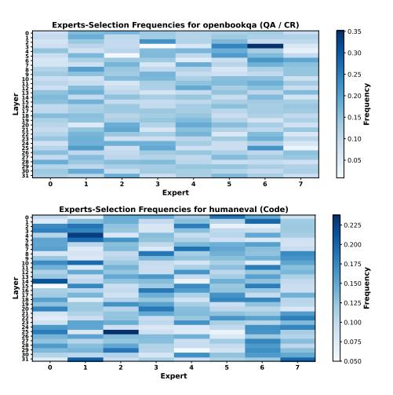

# A.13 Datasets used in Expert-Selection Analysis

In Section 3.3, we record Expert-Selection frequency on 15 datasets of three common categories of NLP tasks—Math, Code-Generation, Question-Answering or Commonsense-Reasoning (QA/CR) and 4 datasets in French language. GSM8K (Cobbe et al., 2021), MathQA (Amini

et al., 2019), Minerva\_Math (Lewkowycz et al., 2022) and Hendrycks\_Math (Hendrycks et al., 2021c) are in Math task; Winogrande (ai2, 2019), PIQA (Bisk et al., 2020), ARC-Challenge (Clark et al., 2018), BoolQ (Clark et al., 2019), MathQA (Amini et al., 2019), HellaSwag (Zellers et al., 2019), and Social\_iqa (Sap et al., 2019) are in QA/CR task; Humaneval (Chen et al., 2021), Mbpp (Austin et al., 2021), Apps (Hendrycks et al., 2021a) and Conala (Yin et al., 2018) are in code task; Lambada\_fr (Paperno et al., 2016), Xnli\_fr (Conneau et al., 2018), Paws\_fr (Zhang et al., 2019) and Arc\_fr (Clark et al., 2018) are datasets in French language.

Figure 11: The frequency of expert selection across 8 datasets spanning 4 task types for Deepseek-moe-16b-base

Figure 12: The variations in the model's average accuracy, expert pruning rate, and inference acceleration effect with respect to changes in the pruning threshold for Mixtral-8x7B.

Figure 13: The frequency of expert selection on open-bookqa and humaneval for Mixtral-8x7B.