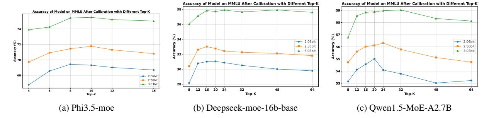

# References

- 2019. Winogrande: An adversarial winograd schema challenge at scale.
- Marah Abdin, Jyoti Aneja, Hany Awadalla, Ahmed Awadallah, Ammar Ahmad Awan, Nguyen Bach, Amit Bahree, Arash Bakhtiari, Jianmin Bao, Harkirat Behl, et al. 2024. Phi-3 technical report: A highly capable language model locally on your phone. *arXiv preprint arXiv:2404.14219*.
- Aida Amini, Saadia Gabriel, Shanchuan Lin, Rik Koncel-Kedziorski, Yejin Choi, and Hannaneh Hajishirzi. 2019. [MathQA: Towards interpretable math](https://doi.org/10.18653/v1/N19-1245) [word problem solving with operation-based for](https://doi.org/10.18653/v1/N19-1245)[malisms.](https://doi.org/10.18653/v1/N19-1245) In *Proceedings of the 2019 Conference of the North American Chapter of the Association for Computational Linguistics: Human Language Technologies, Volume 1 (Long and Short Papers)*, pages 2357–2367, Minneapolis, Minnesota. Association for Computational Linguistics.
- Anonymous. 2024. [OLMoe: Open mixture-of-experts](https://openreview.net/forum?id=xXTkbTBmqq) [language models.](https://openreview.net/forum?id=xXTkbTBmqq) In *Submitted to The Thirteenth International Conference on Learning Representations*. Under review.
- Saleh Ashkboos, Maximilian L. Croci, Marcelo Gennari do Nascimento, Torsten Hoefler, and James Hensman. 2024a. [SliceGPT: Compress large language models](https://openreview.net/forum?id=vXxardq6db) [by deleting rows and columns.](https://openreview.net/forum?id=vXxardq6db) In *The Twelfth International Conference on Learning Representations*.
- Saleh Ashkboos, Amirkeivan Mohtashami, Maximilian L Croci, Bo Li, Pashmina Cameron, Martin Jaggi, Dan Alistarh, Torsten Hoefler, and James Hensman. 2024b. Quarot: Outlier-free 4-bit inference in rotated llms. *arXiv preprint arXiv:2404.00456*.
- Jacob Austin, Augustus Odena, Maxwell Nye, Maarten Bosma, Henryk Michalewski, David Dohan, Ellen Jiang, Carrie Cai, Michael Terry, Quoc Le, et al. 2021. Program synthesis with large language models. *arXiv preprint arXiv:2108.07732*.
- Loubna Ben Allal, Niklas Muennighoff, Logesh Kumar Umapathi, Ben Lipkin, and Leandro von Werra. 2022. A framework for the evaluation of code generation models. [https://github.com/bigcode-project/](https://github.com/bigcode-project/bigcode-evaluation-harness) [bigcode-evaluation-harness](https://github.com/bigcode-project/bigcode-evaluation-harness).

- Yonatan Bisk, Rowan Zellers, Ronan Le Bras, Jianfeng Gao, and Yejin Choi. 2020. Piqa: Reasoning about physical commonsense in natural language. In *Thirty-Fourth AAAI Conference on Artificial Intelligence*.
- Mark Chen, Jerry Tworek, Heewoo Jun, Qiming Yuan, Henrique Ponde de Oliveira Pinto, Jared Kaplan, Harri Edwards, Yuri Burda, Nicholas Joseph, and et al. Greg Brockman. 2021. [Evaluating](https://arxiv.org/abs/2107.03374) [large language models trained on code.](https://arxiv.org/abs/2107.03374) *Preprint*, arXiv:2107.03374.
- Christopher Clark, Kenton Lee, Ming-Wei Chang, Tom Kwiatkowski, Michael Collins, and Kristina Toutanova. 2019. Boolq: Exploring the surprising difficulty of natural yes/no questions. In *NAACL*.
- Peter Clark, Isaac Cowhey, Oren Etzioni, Tushar Khot, Ashish Sabharwal, Carissa Schoenick, and Oyvind Tafjord. 2018. Think you have solved question answering? try arc, the ai2 reasoning challenge. *arXiv:1803.05457v1*.
- Karl Cobbe, Vineet Kosaraju, Mohammad Bavarian, Mark Chen, Heewoo Jun, Lukasz Kaiser, Matthias Plappert, Jerry Tworek, Jacob Hilton, Reiichiro Nakano, Christopher Hesse, and John Schulman. 2021. Training verifiers to solve math word problems. *arXiv preprint arXiv:2110.14168*.
- Alexis Conneau, Ruty Rinott, Guillaume Lample, Adina Williams, Samuel R. Bowman, Holger Schwenk, and Veselin Stoyanov. 2018. Xnli: Evaluating crosslingual sentence representations. In *Proceedings of the 2018 Conference on Empirical Methods in Natural Language Processing*. Association for Computational Linguistics.
- Damai Dai, Chengqi Deng, Chenggang Zhao, RX Xu, Huazuo Gao, Deli Chen, Jiashi Li, Wangding Zeng, Xingkai Yu, Y Wu, et al. 2024. Deepseekmoe: Towards ultimate expert specialization in mixture-of-experts language models. *arXiv preprint arXiv:2401.06066*.
- DeepSeek-AI, Aixin Liu, Bei Feng, Bing Xue, Bingxuan Wang, Bochao Wu, Chengda Lu, Chenggang Zhao, Chengqi Deng, Chenyu Zhang, and et al. Chong Ruan. 2024. [Deepseek-v3 technical report.](https://arxiv.org/abs/2412.19437) *Preprint*, arXiv:2412.19437.
- Elias Frantar, Saleh Ashkboos, Torsten Hoefler, and Dan Alistarh. 2022. GPTQ: Accurate post-training compression for generative pretrained transformers. *arXiv preprint arXiv:2210.17323*.
- Trevor Gale, Deepak Narayanan, Cliff Young, and Matei Zaharia. 2023. [Megablocks: Efficient sparse training](https://proceedings.mlsys.org/paper_files/paper/2023/file/5a54f79333768effe7e8927bcccffe40-Paper-mlsys2023.pdf) [with mixture-of-experts.](https://proceedings.mlsys.org/paper_files/paper/2023/file/5a54f79333768effe7e8927bcccffe40-Paper-mlsys2023.pdf) In *Proceedings of Machine Learning and Systems*, volume 5, pages 288–304. Curan.
- Leo Gao, Jonathan Tow, Baber Abbasi, Stella Biderman, Sid Black, Anthony DiPofi, Charles Foster, Laurence Golding, Jeffrey Hsu, Alain Le Noac'h, Haonan Li, Kyle McDonell, Niklas Muennighoff, Chris Ociepa,

- Jason Phang, Laria Reynolds, Hailey Schoelkopf, Aviya Skowron, Lintang Sutawika, Eric Tang, Anish Thite, Ben Wang, Kevin Wang, and Andy Zou. 2024. [A framework for few-shot language model](https://doi.org/10.5281/zenodo.12608602) [evaluation.](https://doi.org/10.5281/zenodo.12608602)
- Song Han, Huizi Mao, and William J Dally. 2016. Deep compression: Compressing deep neural networks with pruning, trained quantization and huffman coding. *ICLR*.
- Dan Hendrycks, Steven Basart, Saurav Kadavath, Mantas Mazeika, Akul Arora, Ethan Guo, Collin Burns, Samir Puranik, Horace He, Dawn Song, and Jacob Steinhardt. 2021a. Measuring coding challenge competence with apps. *NeurIPS*.
- Dan Hendrycks, Collin Burns, Steven Basart, Andrew Critch, Jerry Li, Dawn Song, and Jacob Steinhardt. 2021b. Aligning ai with shared human values. *Proceedings of the International Conference on Learning Representations (ICLR)*.
- Dan Hendrycks, Collin Burns, Saurav Kadavath, Akul Arora, Steven Basart, Eric Tang, Dawn Song, and Jacob Steinhardt. 2021c. Measuring mathematical problem solving with the math dataset. *NeurIPS*.
- Wei Huang, Yue Liao, Jianhui Liu, Ruifei He, Haoru Tan, Shiming Zhang, Hongsheng Li, Si Liu, and Xiaojuan Qi. 2024a. Mc-moe: Mixture compressor for mixture-of-experts llms gains more. *arXiv preprint arXiv:2410.06270*.
- Wei Huang, Yangdong Liu, Haotong Qin, Ying Li, Shiming Zhang, Xianglong Liu, Michele Magno, and Xiaojuan Qi. 2024b. [BiLLM: Pushing the limit of](https://proceedings.mlr.press/v235/huang24q.html) [post-training quantization for LLMs.](https://proceedings.mlr.press/v235/huang24q.html) In *Proceedings of the 41st International Conference on Machine Learning*, volume 235 of *Proceedings of Machine Learning Research*, pages 20023–20042. PMLR.
- Wei Huang, Xingyu Zheng, Xudong Ma, Haotong Qin, Chengtao Lv, Hong Chen, Jie Luo, Xiaojuan Qi, Xianglong Liu, and Michele Magno. 2024c. An empirical study of llama3 quantization: From llms to mllms. *Visual Intelligence*, 2(1):36.
- Albert Q Jiang, Alexandre Sablayrolles, Antoine Roux, Arthur Mensch, Blanche Savary, Chris Bamford, Devendra Singh Chaplot, Diego de las Casas, Emma Bou Hanna, Florian Bressand, et al. 2024. Mixtral of experts. *arXiv preprint arXiv:2401.04088*.
- Michael I. Jordan and Robert A. Jacobs. 1994. [Hier](https://doi.org/10.1162/neco.1994.6.2.181)[archical mixtures of experts and the em algorithm.](https://doi.org/10.1162/neco.1994.6.2.181) *Neural Computation*, 6(2):181–214.
- Young Jin Kim, Ammar Ahmad Awan, Alexandre Muzio, Andres Felipe Cruz Salinas, Liyang Lu, Amr Hendy, Samyam Rajbhandari, Yuxiong He, and Hany Hassan Awadalla. 2021. Scalable and efficient moe training for multitask multilingual models. *arXiv preprint arXiv:2109.10465*.

- Aitor Lewkowycz, Anders Andreassen, David Dohan, Ethan Dyer, Henryk Michalewski, Vinay Ramasesh, Ambrose Slone, Cem Anil, Imanol Schlag, Theo Gutman-Solo, Yuhuai Wu, Behnam Neyshabur, Guy Gur-Ari, and Vedant Misra. 2022. [Solving quantita](https://proceedings.neurips.cc/paper_files/paper/2022/file/18abbeef8cfe9203fdf9053c9c4fe191-Paper-Conference.pdf)[tive reasoning problems with language models.](https://proceedings.neurips.cc/paper_files/paper/2022/file/18abbeef8cfe9203fdf9053c9c4fe191-Paper-Conference.pdf) In *Advances in Neural Information Processing Systems*, volume 35, pages 3843–3857. Curran Associates, Inc.
- Pingzhi Li, Xiaolong Jin, Yu Cheng, and Tianlong Chen. 2024a. Examining post-training quantization for mixture-of-experts: A benchmark. *arXiv preprint arXiv:2406.08155*.
- Shiyao Li, Xuefei Ning, Luning Wang, Tengxuan Liu, Xiangsheng Shi, Shengen Yan, Guohao Dai, Huazhong Yang, and Yu Wang. 2024b. [Evaluat](https://arxiv.org/abs/2402.18158)[ing quantized large language models.](https://arxiv.org/abs/2402.18158) *Preprint*, arXiv:2402.18158.
- Enshu Liu, Junyi Zhu, Zinan Lin, Xuefei Ning, Matthew B. Blaschko, Shengen Yan, Guohao Dai, Huazhong Yang, and Yu Wang. 2024. [Efficient ex](https://arxiv.org/abs/2407.00945)[pert pruning for sparse mixture-of-experts language](https://arxiv.org/abs/2407.00945) [models: Enhancing performance and reducing infer](https://arxiv.org/abs/2407.00945)[ence costs.](https://arxiv.org/abs/2407.00945) *Preprint*, arXiv:2407.00945.
- Xudong Lu, Qi Liu, Yuhui Xu, Aojun Zhou, Siyuan Huang, Bo Zhang, Junchi Yan, and Hongsheng Li. 2024. [Not all experts are equal: Efficient expert](https://doi.org/10.18653/v1/2024.acl-long.334) [pruning and skipping for mixture-of-experts large](https://doi.org/10.18653/v1/2024.acl-long.334) [language models.](https://doi.org/10.18653/v1/2024.acl-long.334) In *Proceedings of the 62nd Annual Meeting of the Association for Computational Linguistics (Volume 1: Long Papers)*, pages 6159–6172, Bangkok, Thailand. Association for Computational Linguistics.
- Stephen Merity, Caiming Xiong, James Bradbury, and Richard Socher. 2016. Pointer sentinel mixture models. *arXiv preprint arXiv:1609.07843*.
- Alexandre Muzio, Alex Sun, and Churan He. 2024. [Seer-moe: Sparse expert efficiency through](https://doi.org/10.48550/ARXIV.2404.05089) [regularization for mixture-of-experts.](https://doi.org/10.48550/ARXIV.2404.05089) *CoRR*, abs/2404.05089.
- OpenAI, Josh Achiam, Steven Adler, Sandhini Agarwal, Lama Ahmad, Ilge Akkaya, Florencia Leoni Aleman, Diogo Almeida, Janko Altenschmidt, Sam Altman, and et al. Shyamal Anadkat. 2024. [Gpt-4 technical](https://arxiv.org/abs/2303.08774) [report.](https://arxiv.org/abs/2303.08774) *Preprint*, arXiv:2303.08774.
- Denis Paperno, Germán Kruszewski, Angeliki Lazaridou, Ngoc Quan Pham, Raffaella Bernardi, Sandro Pezzelle, Marco Baroni, Gemma Boleda, and Raquel Fernandez. 2016. [The LAMBADA dataset: Word](http://www.aclweb.org/anthology/P16-1144) [prediction requiring a broad discourse context.](http://www.aclweb.org/anthology/P16-1144) In *Proceedings of the 54th Annual Meeting of the Association for Computational Linguistics (Volume 1: Long Papers)*, pages 1525–1534, Berlin, Germany. Association for Computational Linguistics.
- Colin Raffel, Noam Shazeer, Adam Roberts, Katherine Lee, Sharan Narang, Michael Matena, Yanqi Zhou,

- Wei Li, and Peter J Liu. 2020. Exploring the limits of transfer learning with a unified text-to-text transformer. *Journal of machine learning research*, 21(140):1–67.
- Maarten Sap, Hannah Rashkin, Derek Chen, Ronan Le Bras, and Yejin Choi. 2019. [Social IQa: Com](https://doi.org/10.18653/v1/D19-1454)[monsense reasoning about social interactions.](https://doi.org/10.18653/v1/D19-1454) In *Proceedings of the 2019 Conference on Empirical Methods in Natural Language Processing and the 9th International Joint Conference on Natural Language Processing (EMNLP-IJCNLP)*, pages 4463– 4473, Hong Kong, China. Association for Computational Linguistics.
- Wenqi Shao, Mengzhao Chen, Zhaoyang Zhang, Peng Xu, Lirui Zhao, Zhiqian Li, Kaipeng Zhang, Peng Gao, Yu Qiao, and Ping Luo. 2023. Omniquant: Omnidirectionally calibrated quantization for large language models. *arXiv preprint arXiv:2308.13137*.
- Noam Shazeer, Azalia Mirhoseini, Krzysztof Maziarz, Andy Davis, Quoc Le, Geoffrey Hinton, and Jeff Dean. 2017. Outrageously large neural networks: The sparsely-gated mixture-of-experts layer. *arXiv preprint arXiv:1701.06538*.
- Hugo Touvron, Louis Martin, Kevin Stone, Peter Albert, Amjad Almahairi, Yasmine Babaei, Nikolay Bashlykov, Soumya Batra, Prajjwal Bhargava, Shruti Bhosale, et al. 2023. Llama 2: Open foundation and fine-tuned chat models. *arXiv preprint arXiv:2307.09288*.
- Ashish Vaswani, Noam Shazeer, Niki Parmar, Jakob Uszkoreit, Llion Jones, Aidan N. Gomez, Łukasz Kaiser, and Illia Polosukhin. 2017. Attention is all you need. In *Proceedings of the 31st International Conference on Neural Information Processing Systems*, NIPS'17, page 6000–6010, Red Hook, NY, USA. Curran Associates Inc.
- Lei Wang, Lingxiao Ma, Shijie Cao, Quanlu Zhang, Jilong Xue, Yining Shi, Ningxin Zheng, Ziming Miao, Fan Yang, Ting Cao, Yuqing Yang, and Mao Yang. 2024. [Ladder: Enabling efficient low-precision deep](https://www.usenix.org/conference/osdi24/presentation/wang-lei) [learning computing through hardware-aware tensor](https://www.usenix.org/conference/osdi24/presentation/wang-lei) [transformation.](https://www.usenix.org/conference/osdi24/presentation/wang-lei) In *18th USENIX Symposium on Operating Systems Design and Implementation (OSDI 24)*, pages 307–323, Santa Clara, CA. USENIX Association.
- Peisong Wang, Qiang Chen, Xiangyu He, and Jian Cheng. 2020. Towards accurate post-training network quantization via bit-split and stitching. In *International Conference on Machine Learning*, pages 9847–9856. PMLR.
- Peisong Wang, Qinghao Hu, Yifan Zhang, Chunjie Zhang, Yang Liu, and Jian Cheng. 2018. Two-step quantization for low-bit neural networks. In *Proceedings of the IEEE Conference on computer vision and pattern recognition*, pages 4376–4384.
- Guangxuan Xiao, Ji Lin, Mickael Seznec, Hao Wu, Julien Demouth, and Song Han. 2023a.

- [SmoothQuant: Accurate and efficient post-training](https://proceedings.mlr.press/v202/xiao23c.html) [quantization for large language models.](https://proceedings.mlr.press/v202/xiao23c.html) In *Proceedings of the 40th International Conference on Machine Learning*, volume 202 of *Proceedings of Machine Learning Research*, pages 38087–38099. PMLR.
- Yisong Xiao, Aishan Liu, Tianyuan Zhang, Haotong Qin, Jinyang Guo, and Xianglong Liu. 2023b. Robustmq: benchmarking robustness of quantized models. *Visual Intelligence*, 1(1):30.
- Yanyue Xie, Zhi Zhang, Ding Zhou, Cong Xie, Ziang Song, Xin Liu, Yanzhi Wang, Xue Lin, and An Xu. 2024. [Moe-pruner: Pruning mixture-of-experts](https://arxiv.org/abs/2410.12013) [large language model using the hints from its router.](https://arxiv.org/abs/2410.12013) *Preprint*, arXiv:2410.12013.
- An Yang, Baosong Yang, Binyuan Hui, Bo Zheng, Bowen Yu, Chang Zhou, Chengpeng Li, Chengyuan Li, Dayiheng Liu, Fei Huang, et al. 2024. Qwen2 technical report. *arXiv preprint arXiv:2407.10671*.
- Pengcheng Yin, Bowen Deng, Edgar Chen, Bogdan Vasilescu, and Graham Neubig. 2018. Learning to mine aligned code and natural language pairs from stack overflow. In *2018 IEEE/ACM 15th international conference on mining software repositories (MSR)*, pages 476–486. IEEE.
- Rowan Zellers, Ari Holtzman, Yonatan Bisk, Ali Farhadi, and Yejin Choi. 2019. Hellaswag: Can a machine really finish your sentence? In *Proceedings of the 57th Annual Meeting of the Association for Computational Linguistics*.
- Yuan Zhang, Jason Baldridge, and Luheng He. 2019. PAWS: Paraphrase Adversaries from Word Scrambling. In *Proc. of NAACL*.
- Aojun Zhou, Ke Wang, Zimu Lu, Weikang Shi, Sichun Luo, Zipeng Qin, Shaoqing Lu, Anya Jia, Linqi Song, Mingjie Zhan, and Hongsheng Li. 2024. [Solving](https://openreview.net/forum?id=c8McWs4Av0) [challenging math word problems using gpt-4 code in](https://openreview.net/forum?id=c8McWs4Av0)[terpreter with code-based self-verification.](https://openreview.net/forum?id=c8McWs4Av0) In *ICLR*.
- Michael H. Zhu and Suyog Gupta. 2018. [To prune, or](https://openreview.net/forum?id=S1lN69AT-) [not to prune: Exploring the efficacy of pruning for](https://openreview.net/forum?id=S1lN69AT-) [model compression.](https://openreview.net/forum?id=S1lN69AT-)

#### A Appendix

## A.1 Time Consumption Analysis

**QESC.** The quantization process of QESC primarily consists of two parts: GPTQ and the calibrating router, and can be executed on a single A100 40G GPU. We record the time spent on the GPTQ process and the calibration of routers separately, and calculate their respective proportions of the total time. As shown in Table 7, GPTQ accounts for the vast majority of the total quantization time, while the calibration of routers takes an average of only 1.94% of the overall process. This demonstrates that our method introduces only a minimal additional time overhead to the quantization process, making it well-suited for practical applications.

**PESF.** Our PESF method introduces only a single-step online computation, as shown in Equation (6), resulting in virtually no additional delay.

Table 7: Time consumption analysis for GPTQ and router calibration in our QESC method.

| Models        | Step of QESC       | Time(h) | Proportion(%) |
|---------------|--------------------|---------|---------------|
| Mixtral-8x7B  | GPTQ               | 1.30    | 98.48         |
| Mixirai-8x/B  | Calibrating Router | 0.02    | 1.52          |
| Phi3.5-moe    | GPTQ               | 1.39    | 97.89         |
| F1113.3-1110e | Calibrating Router | 0.03    | 2.11          |
| Deepseek-moe  | GPTQ               | 1.75    | 97.22         |
| -16b-base     | Calibrating Router | 0.05    | 2.78          |
| Qwen1.5-MoE   | GPTQ               | 1.48    | 98.67         |
| -A2.7B        | Calibrating Router | 0.02    | 1.33          |

#### A.2 Performance on Challenging Tasks

In addition to validating the performance of our QESC method in maintaining model performance through Perplexity (PPL) and accuracies on common-sense intelligence tasks, we further evaluate our approach on more challenging mathematical task GSM8K (Cobbe et al., 2021) and code generation task HumanEval (Chen et al., 2021). We compare our method with three other methods—GPTQ, BSP, and PMQ. These two evaluations are conducted within the Bigcode-Evaluation-Harness (Ben Allal et al., 2022) testing framework.

As shown in Table 8, under three different average quantization bit widths, our QESC method significantly outperforms the other three methods in preserving the performance of the post-quantization model on two challenging tasks. Notably, despite prior studies (Li et al., 2024b) indicating that post-quantization models are often highly sensitive to complex mathematical and coding tasks, we manage to limit the performance degradation of Mixtral-8x7B on GSM8K to within

Table 8: Comparison of the performance on challenging tasks GSM8K and HumanEval on Mixtral-8x7B. In the HumanEval evaluation, the hyperparameters are set as follows: temperature = 0.2, and nsamples = 10.

| Models | Method         | GSM8K | HumanEval (pass@10) |
|--------|----------------|-------|---------------------|
| 16.00  | Full Precision | 58.30 | 59.15               |
|        | GPTQ           | 33.97 | 21.13               |
| 2.06   | PMQ            | 20.17 | 11.91               |
|        | QESC           | 37.15 | 26.83               |
|        | GPTQ           | 38.97 | 27.24               |
| 2.54   | BSP            | 40.00 | 31.62               |
| 2.34   | PMQ            | 36.94 | 29.77               |
|        | QESC           | 43.14 | 33.54               |
|        | GPTQ           | 52.29 | 40.83               |
| 3.03   | BSP            | 53.72 | 42.07               |
|        | QESC           | 55.34 | 46.34               |

3% under 3.03-bit quantization, highlighting the effectiveness of our expert-selection calibration method.

## A.3 Overfitting Analysis of Mixed-Precision Ouantization Methods for MoE Models

In Section 3.3, we observe that the importance of the same expert may vary drastically across different tasks. Based on this insight, we deduce that using any calibration set to determine the importance of an expert before inference may be biased and lack generalization. Here, we further substantiate this point through comparative experiments. Specifically, we first utilize QA/CR datasets, Math datasets, Code datasets, datasets in French version, and the C4 dataset (Raffel et al., 2020) as calibration sets, obtaining five distinct expert selection frequencies from these calibration sets. Subsequently, we automatically allocate the quantization bit-width for each expert based on the expert selection frequencies, following the algorithm mentioned in the state-of-the-art mixed-precision quantization method for MoE, PMQ (Huang et al., 2024a) (details is shown in Appendix A.6). We then quantize the model to an average bit-width of 2.06 bits using the five quantization bit-width settings derived (the calibration set used in the paper is the C4 dataset). Finally, we evaluate the performance of these five quantized models on four datasets: Hellswag (QA/CR), MathQA (Math), Lambada\_fr (French), and Conala (Code), each representing a different task category. Additionally, we compare the performance of our QESC method at the same average quantization bit-width.

As shown in Table 9, the mixed-precision quantization method based on expert usage frequency exhibits significant overfitting on both models. As highlighted by the red-marked values in the table,

Table 9: A comparison of the performance of quantized Mixtral-8x7B and Deepseek-moe-16b-base, based on the mixed-precision quantization method PMQ, using five different calibration sets under an average quantization bit-width of 2.06 bits, across four types of task datasets.

|              |       |           |                     | Hellaswag | MathQA | Lambada_fr | Conala |
|--------------|-------|-----------|---------------------|-----------|--------|------------|--------|
| Models       | Bits  | Method    | Calibration Dataset | (QA/CR)   | (Math) | (French)   | (Code) |
|              | 16.00 | Baseline  | None                | 84.03     | 41.64  | 65.96      | 73.86  |
|              |       |           | QA/CR               | 75.49     | 31.06  | 49.17      | 7.25   |
|              |       |           | Math                | 69.25     | 32.26  | 47.06      | 7.64   |
| Mixtral-8x7B | 2.06  | Mixed     | French              | 65.55     | 24.39  | 51.87      | 3.80   |
|              |       | Precision | Code                | 67.67     | 31.66  | 44.50      | 37.42  |
|              |       |           | C4                  | 74.95     | 31.79  | 49.12      | 16.22  |
|              | 2.06  | QESC      | None                | 77.27     | 36.08  | 60.37      | 66.68  |
|              | 16.00 | Baseline  | None                | 77.43     | 31.66  | 58.08      | 58.76  |
|              |       |           | QA/CR               | 72.09     | 24.25  | 45.76      | 7.57   |
|              |       |           | Math                | 62.15     | 30.52  | 41.74      | 8.69   |
| Deepseek-moe | 2.06  | Mixed     | French              | 65.49     | 23.15  | 48.86      | 1.80   |
| -16b-base    |       | Precision | Code                | 54.87     | 29.61  | 35.88      | 26.34  |
|              |       |           | C4                  | 68.70     | 26.26  | 42.13      | 16.22  |
|              | 2.06  | QESC      | None                | 68.85     | 28.91  | 52.38      | 42.36  |

using a specific task dataset as the calibration set results in a post-quantization model that achieves relatively optimal performance on that specific task but shows severe performance degradation on other tasks. This overfitting phenomenon is most pronounced in Code-related tasks. When calibration is performed using datasets from other task types, the quantized models experience a drastic performance collapse on Code tasks. Only the models calibrated with Code-specific task datasets manage to achieve relatively good results on the Conala dataset.

When the C4 dataset is used as the calibration set, due to its inherently balanced nature, the quantized models achieve relatively average performance across all four task types. However, even in this case, there is still severe performance degradation on Code-related tasks. In contrast, our proposed QESC method focuses on the calibration of expert-selection. It significantly outperforms mixed-precision method across all four datasets, demonstrating superior generalization capabilities.

## A.4 Search of Optimal Value of K in TopK-MSE Loss

In this subsection, we explore the optimal kvalue settings for TopK-MSE in three MoE models with relatively larger numbers of total experts: Phi3.5-moe, Deepseek-moe-16b-base, and Qwen1.5-moe-A2.7B, under three average quantization bit widths—2.06 bits, 2.56 bits, and 3.03 bits. For Phi3.5-moe (selecting 2 experts out of 16), we set the k-values to 4, 6, 8, 10, 12, and 16 (equivalent to MSE loss). For Deepseek-moe-16b-base (selecting 6 experts out of 64) and Qwen1.5-moe-A2.7B (selecting 4 experts out of 64), the k-values are set to 8, 12, 16, 20, 24, 32, 48, and 64 (equivalent to MSE loss). For each k-value, we quantize the MoE models to the three average bit widths while keeping other configurations constant and compare their performance on the MMLU dataset [\(Hendrycks et al.,](#page-10-10) [2021b\)](#page-10-10), which serves as a comprehensive benchmark to effectively evaluate the models' capabilities across diverse tasks.

As shown in Figure [8,](#page-14-1) when the k-value is too small and approaches the number of experts selected per token in the model, significant performance degradation occurs. Referring to Figure [4,](#page-4-0) this may be attributed to a certain degree of overfitting. For Phi3.5-moe, the optimization results with k-values of 8–10 under all three average quantization bit widths are noticeably better than those with a k-value of 16. For Deepseek-moe-16b-base and Qwen1.5-moe-A2.7B, the optimal results are observed at k-values of 16–24 under 2.06-bit and 2.56-bit quantization. This aligns with our observations in Figure [4,](#page-4-0) where our optimization effectively covers over 95% of the incorrectly unselected experts while avoiding the noise introduced by experts with low selection probabilities. Under the 3.03-bit quantization, however, the optimization results show minimal variation with changes in k-value, as the higher quantization bit width in-

Figure 8: The accuracy of Phi3.5-moe (left), Deepseek-moe-16b-base (middle), and Qwen1.5-MoE-A2.7B (right) on the MMLU dataset varies under different TopK-MSE optimization under 2.06bit, 2.56bit and 3.03bit quantization.

Figure 9: The changes in Experts-Selection rates and WikiText2 perplexity (PPL) with varying MHSA quantization bit-widths on Mixtral-8x7B. "Change Rate 1" corresponds to cases where both selected experts are changed, while "Change Rate 2" corresponds to cases where one or more expert selections are altered.

herently results in a lower rate of expert selection changes.

Based on the above observations, as shown in Table 10, we set the k-values to 8, 20, and 20 for expert selection calibration for the three models, respectively. All quantization-related experimental results in this work are based on this configuration.

Table 10: K Values for expert-selection in MoE models using TopK-MSE calibration

| Model                 | <b>Total Experts</b> | Experts per Token | K  |
|-----------------------|----------------------|-------------------|----|
| Phi3.5-moe            | 16                   | 2                 | 8  |
| Deepseek-moe-16b-base | 64                   | 6                 | 20 |
| Qwen1.5-MoE-A2.7B     | 64                   | 4                 | 20 |

Table 11: Proportion of non-embedding parameters in MoE models

| Model                 | MHSA (%) | Experts (%) | Router (%) |
|-----------------------|----------|-------------|------------|
| Mixtral-8x7B          | 2.894%   | 97.104%     | 0.002%     |
| Phi3.5-moe            | 3.226%   | 96.774%     | 0.005%     |
| Deepseek-moe-16b-base | 2.852%   | 97.122%     | 0.022%     |
| Qwen1.5-MoE-A2.7B     | 2.945%   | 97.039%     | 0.022%     |

## A.5 Quantization Bit-Width Settings

In MoE-LLMs, the vast majority of non-embedding parameters come from the experts within the MoE layers, while the router in the MoE layer and MHSA account for only about 3% of the total parameters. For the four MoE models used in the experiments of this paper—Mixtral-8x7B, Deepseekmoe-16b-base, Phi3.5-moe, and Qwen1.5-MoE-A2.7B—we first conduct a detailed analysis of the parameter proportions in each component, as shown in Table 11. Considering that the router accounts for less than 0.03% of the total parameters, yet plays a crucial role in expert selection, this work retains the router at its original precision.

Unlike the experts in the MoE layer, the MHSA component affects all tokens in the input sequence. Previous studies (Li et al., 2024a) have compared the impact of increasing the quantization bit-width of MHSA and the MoE layer on overall model performance, concluding that MHSA is more bit-efficient. In this work, we investigate the effect of MHSA quantization bit-width on overall model performance from the perspective of expert selec-

tion change rate. Using Mixtral-8x7B, we conduct the following experiments: keeping the rest of the model at its original precision, the MHSA component is quantized to bit-widths ranging from 2-bit to 8-bit. We then calculate the average expert selection change rate relative to the original model and the perplexity (PPL) of the quantized model on the WikiText2 [\(Merity et al.,](#page-10-9) [2016\)](#page-10-9).

As shown in Figure [9,](#page-14-4) within the 2-4 bit range, both the expert selection change rate and PPL are highly sensitive to the quantization bit-width. As the bit-width increases, the expert selection change rate and PPL decrease significantly. This demonstrates that maintaining MHSA at a relatively high quantization bit-width is indeed important for ensuring the quantized model can still select the correct experts and maintain overall model performance. Considering that in the 4-8 bit range, both metrics change more gradually with increasing bitwidth, and from a hardware perspective, current systems are unable to achieve efficient acceleration for bit-widths like 5-bit or 6-bit, we choose to set the MHSA quantization bit-width to 4-bit. This choice strikes a balance between maintaining the performance of the quantized model and minimizing overall memory usage.

By comprehensively analyzing the above discussion, we quantize the MHSA section to 4-bit, retaine the router at its original precision, and quantize the experts to 2-bit, 2.5-bit, and 3-bit. Under the 2.5-bit setting, we align with previous research [\(Li et al.,](#page-10-3) [2024a\)](#page-10-3), which finds that the earlier layers in MoE benefit from higher quantization bit-widths. Therefore, we simply quantize the experts in the first half of the layers to 3-bit and those in the second half to 2-bit. Based on this configuration, we calculate the average bit-width of the experts for the four models under the 2-bit, 2.5-bit, and 3-bit conditions, as shown in Table [12.](#page-15-1) Since the parameter proportions of different components vary slightly across the four models, the final average

Table 12: The average quantization bit-width of the four models when the experts' quantization bit-width is set to 2-bit, 2.5-bit, and 3-bit.

| Model                 | 2-bit | 2.5-bit | 3-bit |
|-----------------------|-------|---------|-------|
| Mixtral-8x7B          | 2.058 | 2.544   | 3.029 |
| Phi3.5-moe            | 2.065 | 2.549   | 3.033 |
| Deepseek-moe-16b-base | 2.060 | 2.546   | 3.031 |
| Qwen1.5-MoE-A2.7B     | 2.062 | 2.547   | 3.032 |

bit-width also exhibits minor differences. However, as these differences are negligible, for simplicity, we represent the average quantization bit-widths of the four models in this paper as 2.06-bit, 2.54-bit, and 3.03-bit for the three respective settings.

## A.6 Reproduction Details of Quantization

BSP [\(Li et al.,](#page-10-3) [2024a\)](#page-10-3) and PMQ [\(Huang et al.,](#page-10-4) [2024a\)](#page-10-4) are two methods built upon GPTQ that focus on mixed-precision quantization. BSP reports its results on Mixtral-8x7B and Deepseek-moe-16bbase in its paper, while PMQ only reports results on Mixtral-8x7B. To ensure a fair comparison, we refer to both the papers and official repositories of these methods, and apply their respective quantization bit-width allocation strategies to the models used in this study. We then perform GPTQ quantization and evaluate the final results using the same framework as this paper.

Specifically, for BSP, we first use the same calibration datasets mentioned in its paper (WikiText2 dataset) to obtain the expert usage frequencies for Phi3.5-moe and Qwen1.5-MoE-A2.7B. In Phi3.5 moe, each MoE layer selects 2 experts out of 16. Following BSP's settings for Mixtral-8x7B, at the 3.03-bit bit-width configuration, we allocate 4-bit to the top-8 most frequently used experts and 2-bit to the remaining 8 experts. At the 2.54-bit configuration, we allocate 3-bit to the top-8 experts and 2-bit to the remaining 8 experts. For Qwen1.5- MoE-A2.7B, each MoE layer selects 4 experts out of 60, with an additional 4 shared experts. Following BSP's settings for Deepseek-moe-16b-base, all shared experts are allocated 8-bit. At the 3.03-bit configuration, we allocate 4-bit to the top-20 most frequently used experts and 2-bit to the remaining 40 experts. At the 2.54-bit configuration, we allocate 4-bit to the top-6 experts and 2-bit to the remaining 54 experts.

For PMQ, we also use the same calibration datasets mentioned in its paper (C4 dataset [\(Raffel](#page-10-15) [et al.,](#page-10-15) [2020\)](#page-10-15)) to obtain expert usage frequencies for all four models. For Mixtral-8x7B and Phi3.5 moe, we directly apply the Integer Programming (IP) optimization algorithm used in PMQ's paper to derive the corresponding mixed-precision bit-width configurations. For Deepseek-moe-16b-base and Qwen1.5-MoE-A2.7B, as PMQ's paper did not discuss MoE models with shared experts, we use the same IP optimization algorithm to determine the mixed-precision bit-width configurations for nonshared experts under the average bit-width settings

|  |  | Table 13: Comprehensive comparison of average accuracy of Mixtral-8x7B on 8 zero-shot tasks under quantization. |
|--|--|-----------------------------------------------------------------------------------------------------------------|
|  |  |                                                                                                                 |

| Bits  | Method         | PIQA  | ARC-E | ARC-C | BOOLQ | HS    | WG    | MATHQA | MMLU  | Avg   |
|-------|----------------|-------|-------|-------|-------|-------|-------|--------|-------|-------|
| 16.00 | Full Precision | 83.57 | 83.67 | 59.3  | 85.35 | 84.03 | 76.24 | 41.64  | 67.29 | 72.64 |
|       | GPTQ           | 76.16 | 75.47 | 47.91 | 77.40 | 71.57 | 71.98 | 31.84  | 48.14 | 62.56 |
| 2.06  | PMQ            | 79.16 | 73.06 | 48.38 | 80.58 | 74.95 | 71.27 | 31.79  | 46.80 | 63.25 |
|       | EAC-MoE        | 79.16 | 76.30 | 51.02 | 76.79 | 77.27 | 74.82 | 36.08  | 59.01 | 66.31 |
|       | GPTQ           | 80.56 | 79.04 | 56.06 | 85.84 | 78.20 | 73.01 | 37.62  | 58.89 | 68.65 |
|       | BSP            | 80.96 | 77.86 | 53.24 | 72.53 | 77.95 | 73.56 | 35.34  | 52.04 | 65.44 |
| 2.54  | PMQ            | 80.52 | 77.10 | 51.28 | 82.54 | 79.03 | 73.95 | 39.18  | 56.37 | 67.50 |
|       | EAC-MoE        | 81.45 | 80.77 | 55.03 | 84.85 | 79.44 | 75.3  | 37.86  | 61.37 | 69.51 |
|       | GPTQ           | 80.63 | 79.21 | 55.55 | 84.59 | 79.63 | 74.43 | 37.49  | 59.82 | 68.92 |
| 3.03  | BSP            | 81.56 | 79.71 | 54.59 | 75.75 | 80.06 | 74.74 | 36.68  | 54.69 | 67.22 |
|       | EAC-MoE        | 82.97 | 83.25 | 58.87 | 85.47 | 82.77 | 76.40 | 41.81  | 66.10 | 72.21 |

Table 14: Comprehensive comparison of average accuracy of Phi3.5-moe on 8 zero-shot tasks under quantization.

| Bits  | Method         | PIQA  | ARC-E | ARC-C | BOOLQ | HS    | WG    | MATHQA | MMLU  | Avg   |
|-------|----------------|-------|-------|-------|-------|-------|-------|--------|-------|-------|
| 16.00 | Full Precision | 77.69 | 65.70 | 53.58 | 88.35 | 79.87 | 76.80 | 38.32  | 76.62 | 69.62 |
|       | GPTQ           | 75.57 | 57.87 | 48.46 | 86.88 | 73.01 | 71.72 | 32.80  | 69.29 | 64.45 |
| 2.06  | PMQ            | 75.68 | 50.59 | 41.55 | 86.18 | 78.45 | 73.86 | 22.31  | 62.14 | 61.35 |
|       | EAC-MoE        | 76.17 | 59.47 | 49.06 | 86.80 | 73.34 | 71.35 | 34.64  | 69.43 | 65.03 |
|       | GPTQ           | 77.37 | 61.49 | 48.98 | 86.67 | 75.32 | 72.61 | 32.86  | 71.19 | 65.81 |
|       | BSP            | 76.99 | 61.41 | 50.71 | 87.22 | 76.09 | 73.51 | 32.23  | 71.05 | 66.15 |
| 2.54  | PMQ            | 77.04 | 57.32 | 48.21 | 87.68 | 77.42 | 74.27 | 33.67  | 72.66 | 66.03 |
|       | EAC-MoE        | 77.09 | 61.78 | 51.19 | 86.57 | 75.56 | 73.32 | 35.08  | 71.67 | 66.53 |
|       | GPTQ           | 78.10 | 63.17 | 51.96 | 87.70 | 78.81 | 74.59 | 35.64  | 75.01 | 68.12 |
| 3.03  | BSP            | 77.20 | 64.60 | 51.71 | 87.49 | 78.73 | 76.01 | 33.23  | 72.40 | 67.67 |
|       | EAC-MoE        | 78.24 | 62.21 | 52.56 | 87.83 | 78.59 | 76.16 | 36.85  | 75.49 | 68.49 |

of 2.06-bit and 2.54-bit. For shared experts, we allocate 2-bit at the 2.06-bit configuration and 3-bit at the 2.54-bit configuration to ensure fairness in comparative experiments with PMQ.

## A.7 Completed Results of Quantization

In Tables [13](#page-16-4) to [16,](#page-17-0) we present the full results of Table [2,](#page-5-1) including detailed accuracies on eight zeroshot tasks, and compare our approach with GPTQ [\(Frantar et al.,](#page-9-1) [2022\)](#page-9-1), BSP [\(Li et al.,](#page-10-3) [2024a\)](#page-10-3) and PMQ [\(Huang et al.,](#page-10-4) [2024a\)](#page-10-4).

## A.8 Reproduction Details of Pruning

EES [\(Lu et al.,](#page-10-6) [2024\)](#page-10-6) and ODP [\(Huang et al.,](#page-10-4) [2024a\)](#page-10-4) are two popular dynamic pruning methods for MoE models, both focusing on ignoring the least-contributing experts for each input token. ODP extends EES by incorporating a significanceaware token protection mechanism.

For EES, we use the same calibration dataset as in its paper to compute the ratio between the weight of the least-contributing expert and the weight of the most-contributing expert for each token. The median of all these ratios is selected as the pruning threshold. During inference, if the ratio of

the least-contributing expert's weight to the mostcontributing expert's weight for a given token is less than this threshold, the weight of the leastcontributing expert is set to zero.

For ODP, we follow the same procedure as EES to determine the pruning threshold. On top of this, we incorporate the Significance-Aware Token Protection mechanism mentioned in the paper. This mechanism dynamically identifies critical tokens and prevents the pruning of the least-contributing experts for these critical tokens, even if they meet the original pruning condition.

## A.9 Completed Results of Pruning

In Table [17,](#page-17-1) we present the full results of Table [3.](#page-6-1) We compare our approach with several other methods, including EES [\(Lu et al.,](#page-10-6) [2024\)](#page-10-6) and ODP [\(Huang et al.,](#page-10-4) [2024a\)](#page-10-4).

## A.10 Completed Results of QESC+PESF

In this subsection, leveraging the three quantization bit-width settings from QESC and the two pruning threshold strategies from PESF, we provide a detailed evaluation of different combinations on four models. The results include the average zero-shot

Table 15: Comprehensive comparison of average accuracy of Deepseek-moe-16b-base on 8 zero-shot tasks under quantization.

| Bits  | Method         | PIQA  | ARC-E | ARC-C | BOOLQ | HS    | WG    | MATHQA | MMLU  | Avg   |
|-------|----------------|-------|-------|-------|-------|-------|-------|--------|-------|-------|
| 16.00 | Full Precision | 80.52 | 73.19 | 47.53 | 72.57 | 77.43 | 69.93 | 31.66  | 38.18 | 61.38 |
|       | GPTQ           | 76.77 | 65.78 | 40.02 | 67.34 | 69.41 | 65.43 | 27.50  | 26.76 | 54.88 |
| 2.06  | PMQ            | 77.64 | 64.73 | 39.85 | 67.75 | 68.7  | 66.22 | 26.26  | 27.16 | 54.79 |
|       | EAC-MoE        | 77.48 | 70.24 | 42.66 | 70.20 | 68.85 | 67.01 | 28.91  | 31.04 | 57.05 |
|       | GPTQ           | 78.29 | 68.48 | 41.72 | 69.88 | 70.97 | 67.48 | 28.17  | 29.65 | 56.83 |
| 2.54  | BSP            | 78.89 | 70.24 | 42.32 | 74.34 | 72.96 | 68.59 | 27.87  | 30.68 | 58.24 |
| 2.34  | PMQ            | 78.78 | 69.70 | 41.89 | 74.29 | 71.27 | 67.96 | 29.25  | 32.89 | 58.00 |
|       | EAC-MoE        | 78.51 | 69.11 | 42.32 | 74.59 | 73.97 | 69.14 | 28.98  | 33.02 | 58.71 |
|       | GPTQ           | 78.89 | 72.22 | 44.37 | 72.42 | 75.15 | 67.01 | 29.88  | 34.72 | 59.33 |
| 3.03  | BSP            | 79.68 | 72.39 | 44.37 | 73.98 | 74.61 | 68.90 | 28.14  | 33.10 | 59.40 |
|       | EAC-MoE        | 80.03 | 73.15 | 45.90 | 75.29 | 75.68 | 70.48 | 31.42  | 37.83 | 61.22 |

Table 16: Comprehensive comparison of average accuracy of Qwen1.5-MoE-A2.7B on 8 zero-shot tasks under quantization.

| Bits  | Method         | PIQA  | ARC-E | ARC-C | BOOLQ | HS    | WG    | MATHQA | MMLU  | Avg   |
|-------|----------------|-------|-------|-------|-------|-------|-------|--------|-------|-------|
| 16.00 | Full Precision | 80.79 | 69.44 | 44.37 | 79.57 | 77.17 | 69.77 | 35.57  | 61.08 | 64.72 |
|       | GPTQ           | 75.79 | 65.53 | 40.02 | 72.14 | 67.06 | 64.48 | 30.02  | 47.07 | 57.76 |
| 2.06  | PMQ            | 76.14 | 65.69 | 40.11 | 69.88 | 68.71 | 64.52 | 29.01  | 48.23 | 57.79 |
|       | EAC-MoE        | 78.40 | 65.28 | 40.78 | 70.37 | 71.50 | 65.98 | 29.28  | 54.56 | 59.52 |
|       | GPTQ           | 77.48 | 63.17 | 39.16 | 68.69 | 70.42 | 64.17 | 29.28  | 50.88 | 57.91 |
| 2.54  | BSP            | 79.54 | 65.03 | 39.59 | 68.99 | 73.77 | 68.51 | 31.89  | 55.91 | 60.40 |
| 2.34  | PMQ            | 78.16 | 65.75 | 41.21 | 71.34 | 72.34 | 68.01 | 31.66  | 55.31 | 60.47 |
|       | EAC-MoE        | 78.73 | 66.50 | 43.17 | 73.09 | 73.53 | 68.19 | 32.43  | 56.12 | 61.47 |
|       | GPTQ           | 79.27 | 66.16 | 41.55 | 77.89 | 75.49 | 67.8  | 31.66  | 57.87 | 62.21 |
| 3.03  | BSP            | 79.68 | 65.11 | 42.32 | 70.73 | 75.36 | 66.38 | 30.79  | 56.65 | 60.88 |
|       | EAC-MoE        | 80.47 | 67.30 | 41.89 | 77.99 | 75.79 | 69.22 | 31.46  | 58.97 | 62.89 |

Table 17: Comprehensive comparison of average accuracy of four models on 8 Zero-Shot tasks under pruning.

| Model                 | Method                  | PIQA  | ARC-E | ARC-C | BOOLQ | HS    | WG    | MATHQA | MMLU  | Avg   |
|-----------------------|-------------------------|-------|-------|-------|-------|-------|-------|--------|-------|-------|
|                       | bf16                    | 83.57 | 83.67 | 59.30 | 85.35 | 84.03 | 76.24 | 41.64  | 67.29 | 72.64 |
|                       | EES                     | 82.70 | 81.40 | 58.45 | 87.74 | 83.00 | 75.24 | 41.14  | 64.50 | 71.40 |
| Mixtral-8x7B          | ODP                     | 82.87 | 83.21 | 59.01 | 84.98 | 83.69 | 75.97 | 40.93  | 65.17 | 71.98 |
|                       | PESF ( $\alpha = 0.3$ ) | 83.19 | 83.29 | 59.90 | 85.08 | 83.40 | 76.40 | 40.90  | 65.36 | 72.19 |
|                       | PESF ( $\alpha = 0.7$ ) | 68.23 | 65.15 | 45.99 | 78.10 | 69.39 | 64.80 | 29.25  | 44.86 | 58.22 |
|                       | bf16                    | 77.69 | 65.70 | 53.58 | 88.35 | 79.87 | 76.80 | 38.32  | 76.62 | 69.62 |
|                       | EES                     | 76.50 | 63.85 | 51.37 | 86.94 | 78.60 | 75.14 | 36.25  | 75.02 | 67.96 |
| Phi3.5-moe            | ODP                     | 77.23 | 64.94 | 53.55 | 88.10 | 79.21 | 74.93 | 38.27  | 75.11 | 68.92 |
|                       | PESF ( $\alpha = 0.3$ ) | 77.04 | 65.53 | 54.01 | 88.20 | 79.82 | 75.30 | 37.99  | 76.30 | 69.27 |
|                       | PESF ( $\alpha = 0.7$ ) | 75.52 | 64.94 | 51.54 | 86.91 | 79.51 | 73.16 | 37.76  | 74.24 | 67.95 |
|                       | bf16                    | 80.52 | 73.19 | 47.53 | 72.57 | 77.43 | 69.93 | 31.66  | 38.18 | 61.38 |
|                       | EES                     | 79.98 | 72.85 | 48.21 | 72.51 | 77.33 | 70.11 | 29.88  | 38.33 | 61.15 |
| Deepseek-moe-16b-base | ODP                     | 80.01 | 72.94 | 47.41 | 73.39 | 77.25 | 70.14 | 30.23  | 38.14 | 61.19 |
|                       | PESF ( $\alpha = 0.3$ ) | 80.52 | 73.02 | 46.93 | 72.72 | 77.13 | 70.32 | 31.52  | 38.07 | 61.28 |
|                       | PESF ( $\alpha = 0.7$ ) | 78.45 | 73.15 | 45.90 | 75.29 | 75.68 | 68.51 | 31.49  | 34.83 | 60.41 |
|                       | bf16                    | 80.79 | 69.44 | 44.37 | 79.57 | 77.17 | 69.77 | 35.57  | 61.08 | 64.72 |
|                       | EES                     | 80.52 | 69.11 | 44.01 | 79.45 | 76.87 | 69.32 | 35.11  | 60.97 | 64.42 |
| Qwen1.5-MoE-A2.7B     | ODP                     | 80.61 | 69.24 | 44.12 | 79.51 | 77.01 | 69.32 | 35.05  | 60.95 | 64.48 |
|                       | PESF ( $\alpha = 0.3$ ) | 80.74 | 69.28 | 44.28 | 79.36 | 77.24 | 69.77 | 35.68  | 60.80 | 64.64 |
|                       | PESF ( $\alpha = 0.7$ ) | 80.25 | 69.11 | 43.94 | 77.06 | 76.44 | 70.09 | 35.38  | 58.72 | 63.87 |

accuracy and inference speedup ratio, along with specific accuracy on each dataset.

**Detailed results.** Here, we provide detailed results of our method under three quantization bit-widths

and two pruning thresholds, as shown in Table 18. Furthermore, as shown in Tables 19 to 22, we report the specific results for various configurations of the four models on each dataset. "EAC-MoE"

Table 18: Comparison of the average accuracy on 8 zero-shot tasks and speedup of inference across four MoE models under quantization (QESC) and pruning (PESF). "EAC-MoE" represents the use of conservative PESF pruning strategy ( $\alpha=0.3$ ) based on QESC, "EAC-MoE" represents the use of PESF ( $\alpha=0.7$ ) based on QESC.

| D.,   | M.d. 1   | Mixtra                | al-8x7B   | Phi3.                             | 5-moe     | Deepseek-1            | noe-16b-base | Qwen1.5-MoE-A2.7B     |           |  |
|-------|----------|-----------------------|-----------|-----------------------------------|-----------|-----------------------|--------------|-----------------------|-----------|--|
| Bits  | Method   | 0-shot 8 ↑ | Speedup ↑ | $0$ -shot 8 $\uparrow$ | Speedup ↑ | 0-shot 8 ↑ | Speedup ↑    | 0-shot 8 ↑ | Speedup ↑ |  |
| 16.00 | Baseline | 72.64                 | 1.00      | 69.62                             | 1.00      | 61.38                 | 1.00         | 64.72                 | 1.00      |  |
| 2.06  | EAC-MoE  | 65.90                 | 1.82      | 65.26                             | 1.84      | 56.75                 | 1.59         | 61.18                 | 1.64      |  |
| 2.00  | EAC-MoE* | 49.09                 | 1.93      | 62.16                             | 2.03      | 54.81                 | 2.01         | 60.02                 | 2.08      |  |
| 2.54  | EAC-MoE  | 68.60                 | 1.74      | 65.98                             | 1.80      | 58.17                 | 1.56         | 61.41                 | 1.60      |  |
| 2.34  | EAC-MoE* | 53.01                 | 1.81      | 63.80                             | 2.02      | 56.83                 | 1.98         | 60.57                 | 2.03      |  |
| 3.03  | EAC-MoE  | 71.68                 | 1.68      | 68.31                             | 1.75      | 61.09                 | 1.55         | 62.73                 | 1.58      |  |
| 3.03  | EAC-MoE* | 57.55                 | 1.76      | 66.66                             | 1.98      | 58.82                 | 1.96         | 61.77                 | 2.01      |  |

Table 19: Detailed results of average accuracy of Mixtral-8x7B on 8 Zero-Shot tasks under quantization and pruning.

| Bits  | Method         | PIQA  | ARC-E | ARC-C | BOOLQ | HS    | WG    | MATHQA | MMLU  | Avg   |
|-------|----------------|-------|-------|-------|-------|-------|-------|--------|-------|-------|
| 16.00 | Full Precision | 83.57 | 83.67 | 59.3  | 85.35 | 84.03 | 76.24 | 41.64  | 67.29 | 72.64 |
| 2.06  | EAC-MoE        | 79.76 | 77.78 | 50.85 | 77.28 | 75.80 | 73.24 | 35.88  | 56.60 | 65.90 |
| 2.00  | EAC-MoE*       | 61.04 | 54.42 | 38.23 | 69.54 | 48.15 | 61.09 | 24.69  | 35.58 | 49.09 |
| 2.54  | EAC-MoE        | 81.28 | 80.13 | 54.44 | 83.85 | 78.66 | 74.27 | 37.39  | 58.78 | 68.60 |
| 2.34  | EAC-MoE*       | 65.29 | 58.63 | 39.25 | 75.05 | 58.27 | 61.56 | 27.10  | 38.92 | 53.01 |
| 3.03  | EAC-MoE        | 83.03 | 82.91 | 58.28 | 85.35 | 82.17 | 76.87 | 41.47  | 63.35 | 71.68 |
| 3.03  | EAC-MoE*       | 69.98 | 64.01 | 42.04 | 81.92 | 67.24 | 63.22 | 29.98  | 42.01 | 57.55 |

Table 20: Detailed results of average accuracy of Phi3.5-moe on 8 Zero-Shot tasks under quantization and pruning.

| Bits  | Method         | PIQA  | ARC-E | ARC-C | BOOLQ | HS    | WG    | MATHQA | MMLU  | Avg   |
|-------|----------------|-------|-------|-------|-------|-------|-------|--------|-------|-------|
| 16.00 | Full Precision | 77.69 | 65.70 | 53.58 | 88.35 | 79.87 | 76.80 | 38.32  | 76.62 | 69.62 |
| 2.06  | EAC-MoE        | 74.16 | 61.28 | 48.55 | 86.64 | 75.41 | 73.56 | 33.10  | 69.35 | 65.26 |
| 2.00  | EAC-MoE*       | 72.80 | 59.01 | 49.40 | 83.27 | 72.74 | 69.30 | 32.09  | 58.68 | 62.16 |
| 2.54  | EAC-MoE        | 75.73 | 60.61 | 48.72 | 86.64 | 76.84 | 72.69 | 35.44  | 71.18 | 65.98 |
| 2.34  | EAC-MoE*       | 73.01 | 58.59 | 48.38 | 84.37 | 74.10 | 68.67 | 34.44  | 68.82 | 63.80 |
| 3.03  | EAC-MoE        | 76.93 | 62.38 | 52.39 | 88.13 | 78.38 | 76.01 | 36.65  | 75.57 | 68.31 |
| 3.03  | EAC-MoE*       | 74.65 | 61.28 | 50.68 | 86.24 | 77.77 | 72.77 | 36.75  | 73.17 | 66.66 |

represents the use of conservative PESF pruning strategy ( $\alpha=0.3$ ) based on QESC, while "EAC-MoE\*" represents the use of a more aggressive PESF pruning strategy ( $\alpha=0.7$ ) based on QESC.

