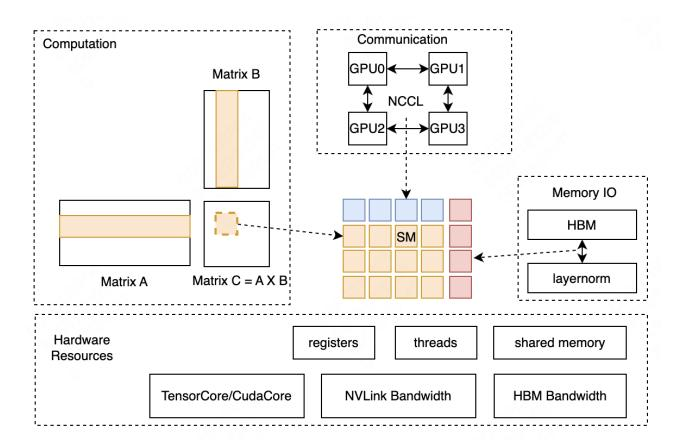

# 2.3 Operator-level Parallelism

Operator-level parallelism is a solution that takes advantage of the load characteristics of operators to achieve parallelism. Nanoflow [\[39\]](#page-13-9) implemented pipeline parallelism between operators by splitting the input into finer-grained batches. Nanoflow correctly pointed out that the computational efficiency of operators and the number of SMs are not always

linearly related; as computational efficiency increases, adding more SMs does not significantly improve computational efficiency. ScMoE [\[13\]](#page-12-12) additionally implemented kernel-level overlapping strategies for MoE to reduce communicationrelated overhead. However, these optimization methods do not design the optimal pipeline scheduling strategy based on the GEMM (General Matrix Multiply) characteristics of MoE, nor do they design parallel solutions that leverage the model characteristics of MoE. As we will see in the subsequent analysis, if operator-level parallelism does not fully utilize the characteristics of MoE, it can lead to repeated memory I/O of parameters. Furthermore, MoE inference is highly sensitive to load, ignoring load characteristics and implementing fixed scheduling strategies often fails to achieve the best overall results.

#### 3 Analysis

The inference latency of LLMs is influenced by various factors, and numerous studies have attempted to model this [\[12\]](#page-12-15) [\[36\]](#page-13-13) [\[11\]](#page-12-16). The traditional optimization approach maximizes the computational efficiency of each kernel within its respective types. For instance, if a kernel is compute-bound or memory-bound under a certain workload, ideally, it should fully utilize the hardware's computational FLOPs or memory bandwidth. Achieving such an ideal scenario is extremely challenging. As we will see in the subsequent analysis, even the disaggregated architectures that separate workloads into prefill and decode stages cannot completely resolve the issue of balanced efficiency at the kernel level. This is because both the prefill and decode stages are composed of kernels from multiple types of workloads as shown in Figure [2,](#page-2-2) and this compositional relationship does not change with the disaggregation of prefill and decode. Next, we will analyze the inference issues of MoE models from the perspectives of three types of kernels: computation, memory access, and communication.

2TTFT: Time To First Token 3TPOT: Time Per Output Token

Figure 3: Resources view of Nvidia GPU Architecture

Figure 4: *GroupGemm* demonstration. Adpoted from [\[20\]](#page-12-17). All matrix multiplication operations are performed through a single kernel launch.

