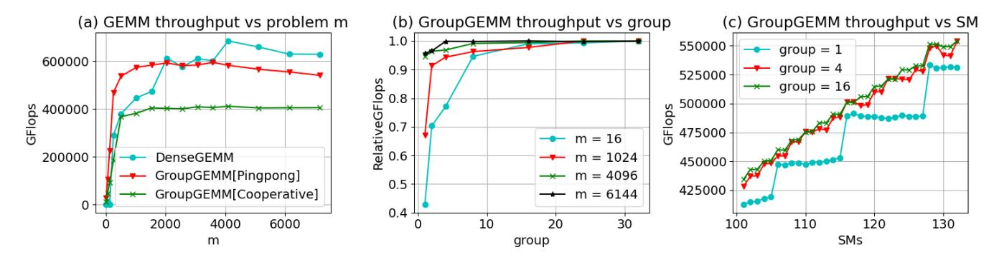
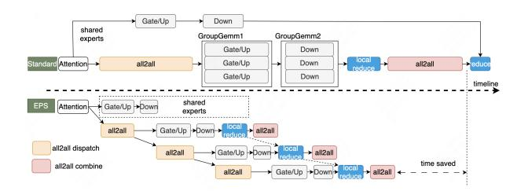

# 3.1 Modern GPU Architecture

We use NVIDIA A100-80GB SXM and H800-80GB SXM GPUs to do our tests. The matrix computation libraries used are mainly cutlass [\[3\]](#page-12-18) and cublas [\[1\]](#page-12-19). NVIDIA's matrix computations are primarily conducted using a tiling strategy. The input matrix and weight matrix are divided into different tiles along rows or columns. Each block processes one or more tiles, and each block runs on a single SM (Streaming Multiprocessor) as shown in Figure [3.](#page-3-0) The SM forms the basic computational unit. All hardware resources like Tensor Cores or CUDA Cores, memory bandwidth, and communication bandwidth are accessed through *SMs*.

### 3.2 Computation

The inference performance of the MoE model is significantly affected by the load scenario. Let *E* be the number of experts in the MoE model, and *k* be the number of experts selected by each token in a single forward pass. When the number of tokens in a single forward pass is *m*, the number of activated experts in the MoE model satisfies the following relationship:

$$Expected Activated Experts = \left(1 - \left(1 - \frac{k}{E}\right)^{m}\right) \times E$$

When *m* is relatively large, such as in the prefill stage, all experts in the MoE are activated. At this time, the MoE model inference is compute-bound. It can fully take advantage of having relatively small per-token FLOPs, thereby accelerating inference in the prefill stage.

When *m* is relatively small, such as in the decode stage, the MoE inference becomes memory-bound. As *m* increases within a certain range, the number of activated experts in the model also increases, leading to a higher amount of weight parameters that need to be loaded.

Therefore, the inference of a MoE model needs to consider the load conditions of its application scenarios.

MoE typically uses *GroupGemm* for computation, as shown in Figure [4](#page-3-1) [\[20\]](#page-12-17). Generally speaking, *GroupGemm* is a relatively efficient kernel. However, we have found that as the computation load increases, the performance of the *GroupGemm* kernel does not remain constant. We conducted some tests on *GroupGemm* and *DenseGemm* based on real model settings, as shown in Figure [5,](#page-4-0) and derived several important conclusions.

#### Conclusion 1: The computational efficiency of *GroupGemm* and *DenseGemm* varies with input size, each having advantages in different ranges.

As shown in Figure [5\(](#page-4-0)a), the computation efficiency of *GroupGemm* and *DenseGemm* gradually improves as the input *m* increases. Furthermore, when *m* ≥ 4096, the computation efficiency of *GroupGemm* will be lower than that of *DenseGemm* with the same computation load. When *m* < 2048 , the efficiency of *GroupGemm* is higher than that of *DenseGemm*. This indicates that the optimal kernel implementation changes with the input scale. This is known as kernel tuning for different problem shapes. However, we brought GEMM type into consideration in this paper. In the inference process of MoE models, variations in input load are common. For example, during the prefill stage, the input often falls within the range where *DenseGemm* is faster; whereas, during the decode stage, the input usually falls within the range where *GroupGemm* is faster.

#### Conclusion 2: For *GroupGemm*, once the input size reaches a certain number, having more groups does not lead to higher throughput.

Increasing the number of groups in *GroupGemm* has always been a method to improve computational throughput, especially in the fine-grained MoE model. This approach always works when the input size is relatively small. However, when the input size is relatively large, having more groups does not further increase computational throughput, as shown in Figure [5\(](#page-4-0)b). Therefore, when the input size is relatively large, splitting a larger *GroupGemm* into some smaller *GroupGemm*s does not lead to a decrease in throughput.

Conclusion 3: For *GroupGemm*, once the input size reaches a certain number, using more SMs does not lead to higher throughput.

Nanoflow [\[39\]](#page-13-9) has pointed out that for *DenseGemm*, the

Figure 5: GEMM profiling data. (a) Throughput of different GEMMs was tested with varying input sizes, focusing on *Gate* and *Up* matrices from MoE blocks. For *GroupGemm*, 16 Experts were used with matrix dimensions [1536,5120], ensuring equal total computation with *DenseGemm*. (b) *GroupGemm [Pingpong]* was tested for relative throughput across different groups and problem sizes, comparing current group throughput to the maximum. (c) *GroupGemm [Pingpong]* was tested with input size *m* = 6144, evaluating throughput across different SM counts and groups.

number of SMs it occupies can be reduced within a certain range without affecting GEMM's computational throughput. For *GroupGemm*, we can observe a similar trend from Figure [5\(](#page-4-0)c). Additionally, the tested results also show that for *GroupGemm*s with different numbers of groups reducing the number of SMs occupied by GEMM within a certain range also does not affect GEMM's execution efficiency.

Figure 6: Latency of the memory-bound *silu\_activation* kernel with varying loads and SMs: (a) Tensor [64, 8192] - performance degradation is negligible beyond 40 SMs. (b) Tensor [2048, 8192] - performance degradation is negligible beyond 60 SMs.

#### 3.3 Memory Access

During MoE inference, there are many memory-bound operators, such as *layernorm*, *residual*, *activation*, *topKGating*, etc and there are many traditional optimization methods such as kernel fusion, weight quantization and vectorized memory access [\[2\]](#page-12-20). Another memory-bound operator is Attention KVCache loading, many papers have studied this issue. In principle, memory-bound kernels also require more SMs to achieve optimal performance. However, practical tests on the *silu\_activation* operator show that while the execution time decreases with an increase in SMs, the performance gains

Figure 7: (a) Time Consumption of Communication and Computation across Models. (b) Latency of *all2all* kernel with varying loads and SMs. 10-20 SMs are sufficient, with no significant latency improvement beyond that. Tested on NVIDIA A100-80GB SXM with NVLink.

become negligible for MoE inference once the SM count exceeds a certain threshold. As illustrated in Figure [6,](#page-4-1) this threshold is closely related to the operator's computational load. When the number of tokens is 64, 40 SMs are sufficient to achieve good kernel performance. When the number of tokens is 128, 256, or 2048, 60 SMs perform adequately. When the input rows is small, MoE GEMM will result in memory-bound. We can find a similar trend in such situation.

### 3.4 Communication

Communication is a common issue in LLM inference because the model size is often too large to be deployed by a single GPU. However, multi-GPU parallel computation also introduces additional communication overhead between the GPUs. From Figure [7,](#page-4-2) it can be seen that the proportion of time spent on communication increases with more GPUs. If we tune the kernel to make *GroupGemm* more efficient, the proportion of communication time will become much more significant. To reduce communication time, we can use FP8 quant to decrease the communication volume, striking a balance between precision and latency. However, this does not completely solve the problem; as batch size increases, the communication volume will further increase. Moreover, as the model size grows, multi-machine parallel strategies will be introduced, where the bandwidth between machines will be much lower than that between GPUs in a single machine. At this point, the proportion of time spent on communication will become even more significant. Communication consumes SM resources, but we have observed that within a certain range, adjusting the number of SMs allocated to communication kernels has almost no impact on communication throughput, even in scenarios with high communication volumes such as in prefill, as shown in Figure [7.](#page-4-2)

### 4 Design of EPS-MoE

### 4.1 Overview of EPS-MoE

Figure [8](#page-6-0) shows how EPS-MoE works on DP + EP. It demonstrates the expert-level pipeline with communication and computation overlapping. EPS-MoE consists of three core modules: Parallel Strategy, Expert Pipeline Scheduler (EPS) and Computation and Communication Overlapping.

Parallel Strategy The parallel strategy determines the communication mode we adopt, and the communication mode dictates how we apply the overlap strategy. The choice of parallel strategy should be based on memory footprint, memory access, and changes in computation. Due to the unique nature of distributed expert computation, the MoE model introduces new changes to the parallel mode.

Expert Pipeline Scheduler To apply the pipeline strategy, we need a method to partition the MoE input tensor and MoE weights matrix. The traditional TP partitioning method is one option. In EPS-MoE, we have designed another method to partition weights according to experts, based on the characteristics of MoE models. We will see that this partitioning method is necessary for applying more efficient GEMM computations and pipeline strategies.

Computation and Communication Overlapping We split the input tensor by rows and only transmit the tokens required by the current experts to the corresponding device each time. By this method, we pipeline the computation and communication in parallel. We will discuss the design of overlapping strategy and its overheads in this section also.

#### 4.2 Parallel Strategy

The MoE model mainly consists of two parts: Attention and MoE. From this point, the inference time of an MoE model can be described as below:

$$T_{LLM} = (T_{Attention} + T_{MoE} + T_{Comm}) \times L$$

Attention can use TP (Tensor Parallelism) or DP (Data Parallelism), while MoE can adopt TP or EP (Expert Parallelism). Therefore, we have a lot of parallel strategies for MoE inference. We will discuss Attention TP + MoE TP, Attention DP + MoE EP and Attention TP + MoE EP in detail. The notations we will use are listed as below.

- *F*(·) : Computation FLOPs of a certain block.
- *W*(·) : Memory I/O data volume of a certain block.
- *VS*(*x*): Communication volume of strategy *S* for data volume *x* on a device.[4](#page-5-0) *VO* is communication overhead.
- *Min*,*Mout*: Input/output activation volumes per device; *MKVCache* : Total KVCache volume (0 during prefill); *Mweight*: Parameter volume.
- *k*: Number of experts selected by a token in MoE model.
- *D*: Device number of TP, EP or DP.
- *FP*, *BW*, *NW*: Computational FLOPS, memory bandwidth, and NVLink bandwidth between devices.
- *P*: Activation size for batched requests.

For different parallel strategies, the computation throughput of a single device is the same. The core impacts of different parallel strategies are: 1. the computing resources for a single token, considering the parallel mechanism of modern gpus; 2. the memory footprint on different devices, as some parallel strategies cause redundant storage of parameters across different devices; 3. the amount of memory access on different devices. So, the computational throughput of Attention or MoE depends on the maximum memory access volume and computation flops and the communication time.

$$T_{Attn} = max \left\{ \frac{F(Attn)}{D \times FP}, \frac{W(Attn)}{D \times BW} \right\}$$

$$T_{MoE} = max \left\{ \frac{F(MoE)}{D \times FP}, \frac{W(MoE)}{D \times BW} \right\}$$

$$T_{Comm} = max \left\{ \frac{V_{S}(\cdot)}{NW}, V_{O} \right\}$$

We will focus on discussing *W*(·) and *V*(·).

TP + TP The Attention part uses the TP mode, and the MoE part also uses the TP mode.

$$W(Attn) = M_{in} + M_{out} + \frac{[M_{KVCache}]}{D} + \frac{M_{weight}}{D}$$

$$W(MoE) = M_{in} \cdot k + M_{out} \cdot k + \frac{M_{weight}}{D}$$

As we can see, if the top-k of MoE is large, the impact caused by the activation value I/O is significant.

4We only consider the output volume from a device.

(a) Expert Pipeline Scheduler. Expert number=6, topk=2, DP=2, EP=2. The outputs of Attention Blocks on GPU0 and GPU1 are token [0,1,2,3,4] and token [5,6,7,8,9] respectively. Expert0 takes token [0,1,5,9], Expert1 takes token [0,2,5,6], and so on.

(b) Overlapping of communication and computation. *LocalReduce* is memory-bound operation. When the computation for all experts of a token is finished, the next round of all2all communication for this token can be initiated.

Figure 8: Illustration of Expert Pipeline Scheduler.

Since all tokens are present on each device and *ncclAllReduce* communication is used, the communication volume of one device for TP+TP is:

$$V_{TP+TP}(P,D) = 2\frac{P}{D}(D-1).$$

DP + EP The problem with using TP for the Attention part is that when Attention applies the MLA (Multi-head Latent Attention) structure, extra communication needs to be introduced. Therefore, we use DP to accelerate the MLA Attention part and EP for MoE.

$$W(Attn) = \frac{M_{in} + M_{out} + [M_{KVCache}]}{D} + M_{weight}$$

$$W(MoE) = \frac{M_{in} \cdot k}{D} + \frac{M_{out} \cdot k}{D} + \frac{M_{weight}}{D}$$

For DP+EP, the communication time mainly depends on how the experts are deployed. If all experts selected by a token are on the same device, the communication volume is optimal. However, if all experts selected by a token are distributed across different devices, there will inevitably be an amplification in communication. So, DeepSeekV2 has designed a device-limited routing mechanism to restrict MoErelated communication costs [\[15\]](#page-12-2). Let *g* be the device number one token will be routed to, *g* is bounded by min(*k*,*D*), i.e. *g* ≤ min(*k*,*D*). Therefore, the total data volume of communication of one device for DP+TP is listed below:

$$\frac{P}{D^2}(D-1) \le V_{DP+EP}(P/D,D) \le g\frac{P}{D^2}(D-1).$$

Therefore, we have

$$V_{DP+EP}(P/D,D) \leq V_{TP+TP}(P,D).$$

TP + EP DP will result in deduped parameters storage between different devices, so for models whose attention is MHA (Multi Head Attention), GQA (Grouped Query Attention) or MQA (Multi Query Attention), it's better to use TP for attention part.

$$W(Attn) = M_{in} + M_{out} + \frac{[M_{KVCache}]}{D} + \frac{M_{weight}}{D}$$

$$W(MoE) = \frac{M_{in} \cdot k}{D} + \frac{M_{out} \cdot k}{D} + \frac{M_{weight}}{D}$$

As for communication, normally, we use *ncclAllReduce* for TP communication. However, in order to apply expert pipeline, we decompose *ncclAllReduce* into two steps to make better communication effeciency. For dispatch stage, we use *ncclReduceScatter* + *all2all* instead of *ncclAllReduce*. For combine stage, we use *all2all* + *ncclAllGather* instead of *ncclAllReduce*.This will make communication volume much less for MoE models. For dispatch stage, we have

$$V_{TP+EP}(P,D) = \frac{P}{D}(D-1) + V_{DP+EP}(P/D,D).$$

We could easily find that the communication volume of combine stage is the same as dispatch stage. By splitting the *ncclAllReduce* operator in this way, we can parallelize the *all2all* operator and GEMM using the expert pipeline strategy. Subsequently, we can also apply *ncclReduceScatter* and *ncclAllGather* with Flux [\[14\]](#page-12-21) to integrate with the preceding and following GEMM operations.

Summary Different parallel patterns affect the amount of data accessed in memory and the communication data volume, but do not impact the time taken for computation. For memory accessed data volume of Attention block, which one is the best depends on the relationship between attention weight and attention activation. For memory accessed data volume of MoE block, we have

$$W_{DP+EP}(MoE) = W_{TP+EP}(MoE) < W_{TP+TP}(MoE).$$

For communication data volume, we have

$$V_{DP+EP} < V_{TP+EP} < V_{TP+TP}$$
.

DP does not change the overall computational throughput, but it leads to three issues: 1. Increased computation time for individual tokens; 2. Redundant storage of parameters; 3. Load balancing problems. For issue 1 and 2, we will trade them for improved throughput. For balancing problems, we will use chunked prefill to solve this problem. For EP balance strategy, methods such as balance loss or token drop [\[15\]](#page-12-2) [\[22\]](#page-12-10) [\[35\]](#page-13-14) have already been studied, which we will skip here.

#### 4.3 Expert Pipeline Scheduler

Figure 9: Two different ways to split input tensor, horizontal split and vertical split. (a) Horizontal split. Split rows of input tensor. Weights split by experts. (b) Vertical split. Split cols of input tensor. Weights split by columns.

There are two data partitioning methods that can achieve pipeline parallelism for computation and communication in MoE models. As shown in Figure [9,](#page-7-0) horizontal split organizes the input data by row partitioning on the input tensor, while vertical split organizes the input data by column partitioning on the input tensor. The traditional horizontal splitting method leads to repeated memory I/O of the parameter matrix. When applying horizontal splitting, we utilized the sparsity characteristics of MoE parameters and split the parameters according to experts, which can effectively avoid repeated memory I/O of the parameter matrix.

Based on this, let's consider the memory I/O efficiency differences between these two splitting methods. Let the number of samples be *m*, the size of a single input and output activation be *P*0 and *P*1, the size of each expert parameters be *W*, the total number of experts be *E*, and the number of pipelines be *N*. The total I/O data volume *V* is given by:

$$V(a) = m \cdot P_0 + E \cdot W + m \cdot P_1$$

$$V(b) = m \cdot P_0 + E \cdot W + N \cdot m \cdot P_1$$

Method (a) results in much less I/O data volume compared to method (b). Let the computational workload of a single expert be*C*, and the computational throughput of *GroupGemm* with group size *G* be *R*(FLOPS|*G*). The computational time difference between the two methods is:

$$T(a) = \frac{C \cdot E/N}{R(\text{FLOPS}|E/N)} \cdot N = \frac{E \cdot C}{R(\text{FLOPS}|E/N)}$$
 
$$T(b) = \frac{C \cdot E/N}{R(\text{FLOPS}|E)} \cdot N = \frac{E \cdot C}{R(\text{FLOPS}|E)}$$

The final difference is reflected in the computational efficiency of *GroupGemm* with different group sizes. When *E* = *N*, *GroupGemm* can be replaced by *DenseGemm* to achieve better performance for larger input *m*. We can see that the core advantages of using a horizontal split are a more efficient GEMM implementation and a lower memory I/O data volume. Therefore, the Expert Pipeline Scheduler implements pipeline scheduling by horizontally splitting the input tensor. Meanwhile, the weights are partitioned according to the experts, and each time only the tokens required by a specific group of experts are transmitted. From the previous analysis data, we can see that the comparative advantage of *GroupGemm* and *DenseGemm* varies under different computational loads. Based on this, we designed a load-aware adaptive scheduling strategy to dynamically select different efficient implementations based on the type of load. Through this parallel strategy, we can relatively easily establish parallelism of token-level transmission and computation, as shown in Figure [8a.](#page-6-0)

