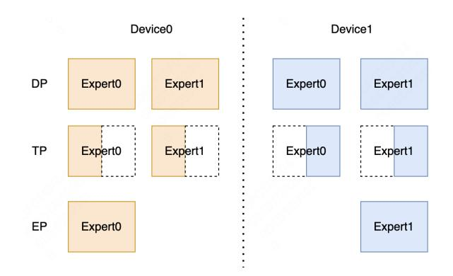

# EPS-MoE: Expert Pipeline Scheduler for Cost-Efficient MoE Inference

*Yulei Qian, Fengcun Li, Xiangyang Ji, Xiaoyu Zhao, Jianchao Tan, Kefeng Zhang, Xunliang Cai {qianyulei02, lifengcun, jixiangyang, zhaoxiaoyu17, tanjianchao02, zhangkefeng, caixunliang}@meituan.com*

#### Abstract

The Mixture-of-Experts (MoE) model has emerged as a prominent architecture in the field of Large Language Models (LLMs), providing a better balance between model performance and computational efficiency. However the General Matrix Multiply (GEMM) operations and large parameters introduce challenges related to computational efficiency and communication overhead, which become throughput bottlenecks during inference. Applying a single parallelism strategy like EP, DP, TP or a straightforward combination of them to MoE usually achieves sub-optimal inference throughput. This paper introduces EPS-MoE, a novel expert pipeline scheduler for MoE that surpasses the existing parallelism schemes. Our approach optimizes the computation of MoE FeedForward Network (FFN) modules by dynamically selecting the best kernel implementation of GroupGemm and DenseGemm for different loads and adaptively overlapping these computations with communication, leading to a substantial increase in throughput. Our experimental results demonstrate at most 52.4% improvement in prefill throughput compared to existing parallel inference methods. Specifically, our method accelerated the highly optimized DeepSeekV2 model from a claimed 100K tokens per second to at least 120K tokens per second.

#### 1 Introduction

The remarkable capabilities of the LLM have attracted various organizations to devote resources to optimize their architectures for better performance and efficiency, leading to the development of advanced MoE architectures like Mixtral [\[6\]](#page-12-0), DBRX [\[4\]](#page-12-1), DeepSeekV2 [\[15\]](#page-12-2), Grok [\[5\]](#page-12-3), Gemini 1.5 [\[10\]](#page-12-4), Snowflake [\[8\]](#page-12-5) [\[23\]](#page-12-6) and others [\[9\]](#page-12-7) [\[34\]](#page-13-0) [\[40\]](#page-13-1) [\[17\]](#page-12-8) [\[24\]](#page-13-2) [\[31\]](#page-13-3) [\[32\]](#page-13-4) [\[28\]](#page-13-5) [\[25\]](#page-13-6). These architectures offer significant advantages by enabling the dynamic selection of specialized experts, thus optimizing performance and computational efficiency. MoE models have demonstrated the ability to scale up model parameters significantly for improved performance while maintaining a manageable computational footprint. Typically, MoE

Table 1: Prefill Throughput Gains of EPS-MoE.

| Prefill Throughput         |
|----------------------------|
| 100 k (token/s)            |
| 121.8 k (token/s) , +21.8% |
| 71.84 k (token/s)          |
| 94.89 k (token/s), +32.2%  |
| 37.23 k (token/s)          |
| 56.74 k (token/s), +52.4%  |
|                            |

1 DeepSeekV2 and DBRX were tested on 8xH800-80GB SXM, Mixtral(8x7B) tested on 4xH800-80GB SXM.

incorporates a gating mechanism that directs the output of the attention mechanism to a subset of experts, thereby activating only a fraction of the model's parameters. This approach can expand model capacity with far fewer activated parameters to achieve performance comparable to larger dense models. For instance, DeepSeekV2, with only 21 billion activated parameters, rivals the performance of Llama3's 70 billion parameters. [\[15\]](#page-12-2)

However, MoE architectures encounter significant challenges when scaling to accommodate large sequence lengths and batch sizes. For example, Mixtral 8x7B requires only 12.6 billion activated parameters per token but can demand up to 46 billion parameters for large batch sizes. Due to the large total number of parameters, MoE models often require multi-GPU parallel inference, which also leads to an increase in communication time. Moreover, the router's top-k gating mechanism, while beneficial for selecting relevant experts, intensifies the communication when k is large. In such scenarios, the communication requirement can be magnified k-fold, as information must be exchanged with k different experts simultaneously. This can result in bottlenecks in the inference pipeline, as the computation for each expert's output cannot commence until the communication of inputs is complete. In addition to communication challenges, MoE models also face issues with low computation density, particularly when the

Figure 1: Weight partition of DP, TP and EP for two devices and two experts.

distribution of tokens leads to fragmented workloads across the experts. The resulting imbalance can leave some computational resources underutilized, further impacting the overall efficiency of the inference process.

Due to the rapid scaling of the model parameters, distributed serving architectures have become indispensable for serving MoE models at scale. Common strategies [\[30\]](#page-13-7) [\[7\]](#page-12-9) include Data Parallelism (DP), Tensor Parallelism (TP) and Expert Parallelism (EP), as shown in Figure [1.](#page-1-0) Each method targets different aspects of model serving, such as reducing communication overhead and enhancing computational efficiency. However, a single strategy or a straightforward combination of them cannot obtain optimal inference throughput.

To address these inference challenges from MoE architectures and go beyond these suboptimal solutions, we propose EPS-MoE, a novel expert pipeline scheduler for efficiently serving MoE architectures. The framework consists of three main highlights. *1) Parallel Strategy* With a theoretical analysis, we choose to apply DP or TP on Attention blocks based on the Attention algorithms and EP on MoE blocks. We provide a detailed analysis in the following section. *2) Expert Pipeline Scheduler* We demonstrate a new tensor or weight split method to achieve better memory I/O performance and to take the advantage of switching from *GroupGemm* to *DenseGemm*[1](#page-1-1) . Based on this split method, we propose the expert pipeline scheduler to submit experts sequentially to a kernel for computation. We overlap this sequential computation with pipeline parallel to address the overhead. *3) Computation and Communication Overlapping* With a pipeline between computation and communication at the kernel level, we will show how EPS-MoE achieves better performance on the inference of MoE models. We summarize the core contributions as follows:

• Contribution 1: We introduced a novel expert pipeline parallel scheduler for efficient MoE model inference, which involves a fine-grained overlapping between computation and communication at the kernel level.

- Contribution 2: We conducted an in-depth analysis of GEMM efficiency and designed a horizontal split for inputs and an expert split for MoE weights. Based on these splitting methods, we implemented a switching strategy from *GroupGemm* to *DenseGemm* under specified loads to improve computational efficiency.
- Contribution 3: We explored different concurrency modes for Attention and MoE: TP+TP, DP+EP, and TP+EP and analyzed the efficiency of these modes.
- Contribution 4: We applied our method to a variety of different models for testing. The experiments showed that our method can improve the prefill throughput 52.4% at most.

#### 2 Related Work

#### 2.1 MoE architectures

The groundbreaking work by Shazeer et al. [\[29\]](#page-13-8) introduced the Sparsely-Gated Mixture-of-Experts (MoE) layer, which laid the foundation for scaling neural networks by utilizing a sparse activation pattern. This approach allows for efficient training of large models with a mixture of experts, where each expert is only activated for specific inputs. However, the original MoE layer suffers from challenges in balancing the load among experts and may lead to the underutilization of some experts. Fedus et al. [\[22\]](#page-12-10) proposed GShard, a method to scale giant models by employing conditional computation and automatic sharding. GShard addresses some of the limitations of the original MoE by enabling dynamic routing and sharding of experts across different devices, thus improving scalability. Nonetheless, GShard may face difficulties in maintaining model coherence across shards and requires sophisticated infrastructure to manage the distributed computation. Switch Transformers by Fedus et al. [\[16\]](#page-12-11) takes sparsity to the next level by introducing a simple and efficient sparsity pattern that allows scaling to trillion-parameter models. The Switch Transformers utilizes a gating mechanism to activate experts based on the input data, which can significantly reduce computational overhead. However, the gating mechanism adds complexity to the model, and the benefits of sparsity may diminish as the model size increases. Besides the advanced MoE foundational models such as Mixtral [\[6\]](#page-12-0), DB RX [\[4\]](#page-12-1), DeepSeekV2 [\[15\]](#page-12-2), Grok [\[5\]](#page-12-3), Gemini 1.5 [\[10\]](#page-12-4), there are some novel parallel designs on MoE architectures. ScMoE [\[13\]](#page-12-12) and Snowflake Arctic [\[8\]](#page-12-5) [\[23\]](#page-12-6) proposed to add a long shortcut for parallelism between the multi-experts branch and the whole dense branch. These designs significantly enhance both training and inference speeds. Nevertheless, the reliance on

1For convenience, we use *GroupGemm* to refer to grouped GEMM from *cutlass* and *DenseGemm* to refer to *cublas* GEMM for dense matrix multiplication.

Figure 2: MoE architecture. Adpoted from [\[39\]](#page-13-9). The operations in the yellow boxes are compute-bound, mostly *GEMMs*. The light blue box operations are memory-bound. The operations in the green boxes are communication operations.

these specific network topologies for shortcuts might cause sub-optimal inference efficiency in some scenarios.

