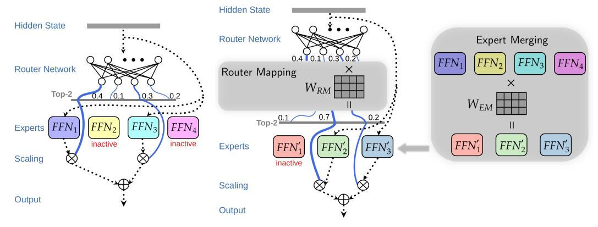

# Efficient Expert Pruning for Sparse Mixture-of-Experts Language Models: Enhancing Performance and Reducing Inference Costs

Enshu Liu $^{1,2*}$ , Junyi Zhu $^{3*}$ , Zinan Lin $^{4\dagger\ddagger}$ , Xuefei Ning $^{1\dagger\ddagger}$ , Matthew B. Blaschko $^3$ , Shengen Yan $^2$ , Guohao Dai $^{2,5}$ , Huazhong Yang $^1$ , Yu Wang $^{1\dagger}$ 

1Tsinghua University, 2Infinigence AI, 3KU Leuven, 4Microsoft Research, 5Shanghai Jiao Tong University

\*Equal Contribution, †Corresponding authors, ‡Co-advise

#### **Abstract**

The rapid advancement of large language models (LLMs) has led to architectures with billions to trillions of parameters, posing significant deployment challenges due to their substantial demands on memory, processing power, and energy consumption. Sparse Mixture-of-Experts (SMoE) architectures have emerged as a solution, activating only a subset of parameters per token, thereby achieving faster inference while maintaining performance. However, SMoE models still face limitations in broader deployment due to their large parameter counts and significant GPU memory requirements. In this work, we introduce a gradient-free evolutionary strategy named Efficient Expert Pruning (EEP) to enhance the pruning of experts in SMoE models. Specifically, EEP searches the pruning pattern and use expert merging as an memory-efficient way of fine-tuning the pruned model. EEP relies solely on model inference (i.e., no gradient computation) and achieves greater sparsity while maintaining or even improving performance on downstream tasks. EEP can be used to reduce both the total number of experts (thus saving GPU memory) and the number of active experts (thus accelerating inference). For example, we demonstrate that pruning up to 75% of experts in Mixtral 8 × 7B-Instruct results in a substantial reduction in parameters with minimal performance loss. Remarkably, we observe improved performance on certain tasks, such as a significant increase in accuracy on the SQuAD dataset (from 53.4% to 75.4%), when pruning half of the experts. With these results, EEP not only lowers the barrier to deploying SMoE models, but also challenges the conventional understanding of model pruning by showing that fewer experts can lead to better task-specific performance without any fine-tuning. Code is available at https://github.com/imagination-research/EEP.

#### 1 Introduction

Large language models have significantly advanced, evolving into highly versatile tools [23, 7, 3, 46, 61, 33]. As these models grow in accordance with scaling laws [21], the norm has shifted towards architectures with billions to trillions of parameters. However, the larger scale brings considerable deployment challenges due to increased demands on memory, processing power, and energy consumption [65, 53]. In response to these challenges, there is a notable trend towards adopting sparse Mixture-of-Experts (SMoE) architectures [45, 14, 27, 19], as seen in models such as Mixtral  $8 \times 7B$  and  $8 \times 22B$  [20], Qwen1.5-MoE-A2.7B [4], Qwen 2-57B-A14B [40], DBRX [50],

Correspondence to Yu Wang <yu-wang@mail.tsinghua.edu.cn>, Zinan Lin <zinanlin@microsoft.com>, Xuefei Ning <foxdoraame@gmail.com>.

- (a) A SMoE block before pruning. (b) Parameter space designed for expert pruning and merging.

Figure 1: (a) the original SMoE block and (b) our implementation of EEP. We introduce the expert merging matrix WEM, and the router mapping matrix WRM, to enable the search for the optimal pruning configuration. When WEM and WRM have one-hot vectors as their rows, pruning is performed. When their elements are continuous values, routing weights and experts are aggregated to generate new weights and experts. We use an evolutionary strategy to search for the optimal WEM and WRM.

and Grok-1 [\[57\]](#page-14-2). SMoE models activate only a subset of parameters for each token, resulting in faster inference while maintaining competitive performance compared to dense models of the same scale. For example, Mixtral 8 × 7B outperforms or matches Llama-2 70B [\[51\]](#page-13-4) and GPT-3.5 on many benchmarks, while it only activates 13B parameters to process each token. Although SMoE models have less computation per token, they remain parameter-heavy, e.g. Mixtral 8 × 7B has 47B parameters in total while Grok-1 reaches 314B (see Tab. [6](#page-16-0) for other models). This limits their broader deployment due to the substantial GPU memory requirements. Additionally, their throughput may not be ideal as the batch size needs to be restricted to fit the model within the available device memory. Therefore, it is vital to innovate methods that can reduce the size of SMoE models without compromising their performance.

Many studies have shown that only a subset of parameters significantly contributes to performance when applying LLMs to downstream tasks [\[6,](#page-10-3) [26,](#page-12-2) [42,](#page-13-5) [58\]](#page-14-3). Pruning is a crucial technique for eliminating redundancy in neural networks. It can be unstructured, achieving high sparsity while maintaining performance [\[6,](#page-10-3) [15,](#page-11-5) [47\]](#page-13-6), or structured, removing entire channels or layers to provide computational efficiency and reduced latency [\[35,](#page-12-3) [49,](#page-13-7) [58,](#page-14-3) [18,](#page-11-6) [54,](#page-14-4) [26\]](#page-12-2). One particularly efficient way is expert pruning in SMoE LLMs, a type of structured pruning with coarse granularity, which enhances overall efficiency. Recent expert pruning methods achieve 25%-50% sparsity and accelerate inference, but struggle to maintain performance [\[34\]](#page-12-4) or need fine-tuning, requiring substantial GPU memory and resources [\[8,](#page-10-4) [37\]](#page-13-8). Thus, there is a pressing need for efficient pruning methods that operate within the constraints of inference resources for SMoE LLMs.

In this work, we propose a gradient-free evolutionary strategy that achieves high sparsity while maintaining performance given a small train set on the downstream tasks. Our method is divided into two phases: expert pruning and expert merging. To facilitate the search for optimal pruning configurations, we design a parameter space for router mapping and expert merging, represented by two weight matrices, WRM and WEM. These matrices are applied to the router weighting and expert modules, as illustrated in Fig. [1.](#page-1-0) In the first phase, expert pruning, we search through the weight matrices to retain the most prominent experts without updating any network parameters. In the second phase, expert merging, we retrieve knowledge from the pruned experts and consolidate it into the retained experts. To these ends, WRM and WEM are set to one-hot rows in the first phase and to real numbers in the second phase. Since our method is gradient-free, it can be conducted on devices capable of inference. Our contributions can be summarized as follows:

• Pruning the total number of experts: smaller memory consumption and better performance. Our approach enables more aggressive pruning of experts compared to current methods [\[34,](#page-12-4) [37\]](#page-13-8). In experiments on Mixtral 8×7B-Instruct, we reduce the number of experts in each SMoE block from 8 to 2, a 72% reduction in parameters, while maintaining comparable performance across various downstream tasks. *Surprisingly, we observe that fewer experts can lead to better performance.* For instance, on the SQuAD dataset, pruning 4 out of 8 experts result in a performance increase from 53.4% to 75.4% without updating the remaining experts.

- Pruning the number of *active* experts: better inference efficiency. We explore the pruning of active experts and find that effective expert merging compensates for the loss of active experts across downstream tasks. This process significantly improves efficiency without compromising the model's utility on these tasks. For instance, by reducing the active experts in Mixtral 8 × 7B from two to one, we observe a prefill acceleration of up to 1.63×.
- Generalization ability. We test the performance of our method on datasets with higher diversity and out-of-distribution tasks using MMLU [\[17\]](#page-11-7). Specifically, we take 50 of the 57 datasets included in MMLU and conduct EEP using data from a small subset of each of the 50 datasets. We then evaluate the pruned model on the test data of i) the 50 datasets and ii) the 7 unseen datasets. In both evaluation tasks, we observe that EEP consistently outperforms other pruning methods, demonstrating the strong generalization ability of our method.
- A novel and efficient pruning paradigm. Common pruning paradigm usually conducts two steps. In the first step, parameters are pruned using empirical criteria. This operation often lowers performance. In the second step, retained parameters are fine-tuned through stochastic gradient descent to recover performance. This operation often requires substantial GPU memory and computation time, making it prohibitive for most users of LLMs. EEP adopts a gradient-free evolutionary strategy for both pruning and fine-tuning. As a result, our pruned model significantly outperforms the pruned models of other methods, while our pruning and fine-tuning processes can run on devices affordable for inference, making EEP more widely applicable. In addition, to inherit knowledge from the unpruned model, existing methods either select a subset of weights based on predefined importance criteria [\[16,](#page-11-8) [60,](#page-14-5) [38\]](#page-13-9), or rely on distillation techniques [\[39,](#page-13-10) [62,](#page-14-6) [1\]](#page-10-5). In contrast, EEP introduces a novel approach as a third paradigm, employing weight merging [\[56\]](#page-14-7) to transfer knowledge during the model compression process.

