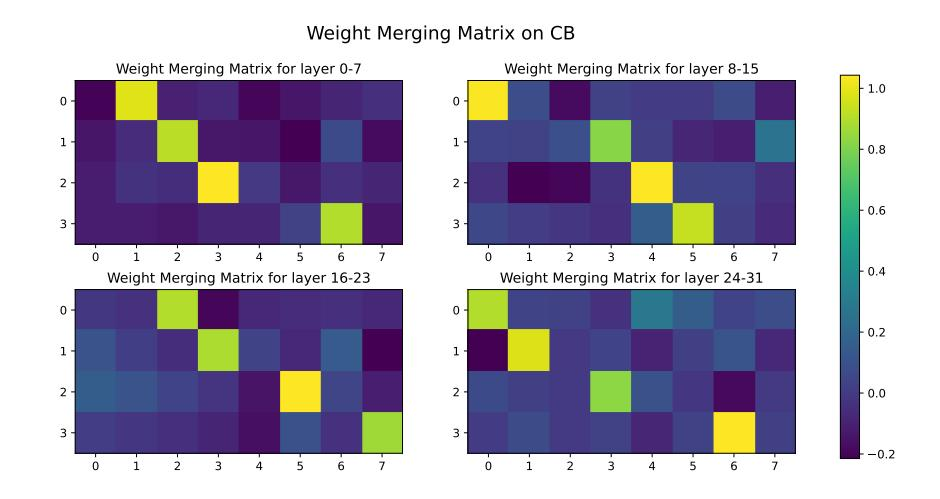
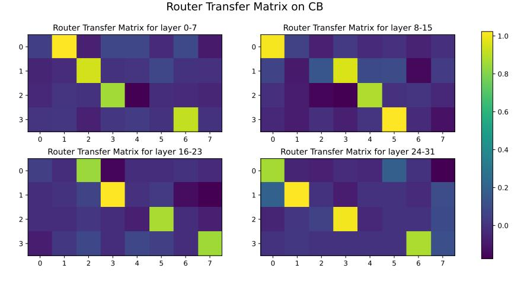

# F Examples of model outputs, and metric evaluations

In this section, we provide examples of different approaches' output in Fig. 9, Fig. 10 and Fig. 11.

(a) Accuracy-Iteration curve on CB dataset.

(b) Accuracy-Iteration curve on BoolQ dataset.

Figure 5: Accuracy-Iteration curves on different datasets. The model is Mixtral 8 × 7B and the total number of expert is 4.

- (a) Activation correlation before and after pruning.
- (b) Accumulated activation times before and after pruning.
- (c) Accumulated routing weights before and after pruning.

Figure 6: Statistics of the expert activation patterns before and after pruning. The data represents the 15-th transformer block of Mixtral 8 × 7B-Instruct on the SQuAD dataset. In (a), four retained experts are re-indexed from 0 to 3 for clarity.

- (a) Activation correlation before and after pruning.
- (b) Accumulated activation times before and after pruning.
- (c) Accumulated routing weights before and after pruning.

Figure 7: Statistics of the expert activation patterns before and after pruning. The data represents the 31-th transformer block of Mixtral 8 × 7B-Instruct on the SQuAD dataset. In (a), four retained experts are re-indexed from 0 to 3 for clarity.

(a) Visualization of the searched expert merging matrix.

(b) Visualization of the searched router mapping matrix.

Figure 8: Visualization of the searched patterns on the CB dataset.

User: <s>[INST]There is also a growing number of new forms of procurement that involve relationship contracting where the emphasis is ... \nAccording to the above passage, answer the following question. If it is impossible to answer according to the passage, answer 'impossible to answer':\nQuestion: Focus on what is to ameliorate the many problems that arise from the often highly competitive and adversarial practices within the construction industry[/INST]

Full Model: The focus is on cooperation to ameliorate the many problems that arise from the often highly competitive and adversarial practices within the construction industry. Evaluation: ✓

#### Expert Num=4:

EEP: The focus is on cooperation to ameliorate the many problems that arise from the often highly competitive and adversarial practices within the construction industry. Evaluation: ✓

NAEE: The focus is to ameliorate the many problems that arise from the often highly competitive and adversarial practices within the construction industry. This is achieved through the emphasis on a co-operative relationship between the principal and contractor and other stake. Evaluation: ×

Frequency: The focus on co-operation in new forms of procurement is to ameliorate the many problems that arise from the often highly competitive and adversarial practices within the construction industry.

Evaluation: ✓

Soft Activation: The focus in these new forms of procurement is to ameliorate (improve) the many problems that arise from the often highly competitive and adversarial (hostile) practices within the construction industry.\n\nThe problems that

Evaluation: ×

#### Expert Num=2:

EEP: Focus on co-operation is to ameliorate the many problems that arise from the often highly competitive and adversarial practices within the construction industry. Evaluation: ✓

NAEE: The focus is to ameliorate the many problems that arise from the often highly competitive and adversarial practices within the construction industry. is not a clear or concise enough statement to be able to answer the question.

Evaluation: ×

Frequency: I ameliorate the many problems that arise from the often highly competitive and adversarial practices within the construction industry.\n\nAccording to the passage, answer:\n\n> Focus on what is to ameliorate the many problems

Evaluation: ×

| Soft Activation: \n\n —————————————————————————— |  |  |
|--------------------------------------------------|--|--|
| —————————————————————————————————————            |  |  |
| —————————————————————————————————————            |  |  |
| —————————————————————- Evaluation: ×          |  |  |

Figure 9: Example of Mixtral 8 × 7B-Instruct on SQuAD.

User: <s>[INST]For the 2012–13 school year annual tuition was \$38,000, with a total cost of attendance of \$57,000. Beginning 2007, families with incomes below \$60,000 pay nothing for their children to attend, including room and board...\nAccording to the above passage, answer the following question. If it is impossible to answer according to the passage, answer 'impossible to answer':\nQuestion: How much did students pay in total to go to Harvard in 2007?[/INST]

Full Model: It is impossible to answer according to the passage. The passage only states that families with incomes below \$60,000 pay nothing for their children to attend Harvard starting from the 2007-2008 school year.

Evaluation: ✓

#### Expert Num=4:

EEP: It is impossible to answer according to the passage. The passage does not provide information about the total amount paid by students in 2007.

Evaluation: ✓

NAEE: The passage states that families with incomes below \$60,000 pay nothing for their children to attend Harvard in 2007, and families with incomes between \$60,000 to \$80,0 Evaluation: ×

Frequency: It is not possible to answer this question because the total cost of attendance for the year 2007 is not provided in the passage. The passage only mentions that families with incomes below \$60,000 pay nothing for

Evaluation: ×\*

Soft Activation: It is impossible to answer this question according to the passage. The passage only provides total cost information for one year (2012-13) and the total amount of grants for 2009, but it does not provide information

Evaluation: ✓

#### Expert Num=2:

EEP: Impossible to answer. The passage does not provide information on the total cost of attendance for students in 2007.

Evaluation: ✓

NAEE: The passage states that families with incomes below \$60,000 pay nothing for their children to attend Harvard in 2007, and families with incomes between \$60,000 to \$80,0.

Evaluation: ×

Frequency: The average cost for the 2007 students is \$120,000.\n\n 2007 students paid \$120,000 for the 2009 students.\n\n

Evaluation: ×

Soft Activation: The average cost of the students's 2007 is \$38,000, with a total cost of \$57,000.\n\n 2008: How much did the students's

Evaluation: ×

Figure 10: Example of Mixtral 8 × 7B-Instruct on SQuAD. \* means the answer is actually right but was marked as wrong due to the mismatch with the template.

User: <s>[INST]Economist Simon Kuznets argued that levels of economic inequality are in large part the result of stages of development. According to Kuznets, countries with low levels of development have relatively equal distributions of wealth... \nAccording to the above passage, answer the following question. If it is impossible to answer according to the passage, answer 'impossible to answer':\nQuestion: What profession does Simon Kuznets have?[/INST]

Full Model: The passage does not provide information on Simon Kuznets' profession. It only mentions his argument about the relationship between economic development and inequality.

Evaluation: ×

