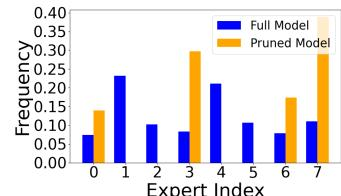

# 5.5 Improvements in memory usage and inference speed

We profile the memory overhead and inference speed of Mixtral 8 × 7B model for the two use cases. We conduct tests on SQuAD with a batch size of 256 using two NVIDIA A100 GPU cards. We report the peak memory usage and the wall-time acceleration ratio in Tab. [5.](#page-9-1) As shown in Tab. [5,](#page-9-1) retaining only 4 and 2 experts from the whole model decreases the memory overhead by 47% and 71%, respectively. Additionally, reducing the total number of experts improves inference speed due to higher parallelism, achieving a speedup of 1.11× and 1.18× with 4 and 2 experts, respectively.

Table 5: Profiling the memory footprint and inference speedup of Mixtral 8 × 7B.

| Total | Active | Method     | Speedup        | GPU Mem(GB) |
|-------|--------|------------|----------------|-------------|
| 8     | 2      | Full Model | 1.0×           |             |
|       | 1      | EEP        | 1.24×          | 88.6        |
| 4     | 2 1 | EEP EEP | 1.11× 1.41× | 46.6        |
| 2     | 2      | EEP        | 1.18×          | 25.6        |

- (a) Activation (1/0 means activated/not activated) correlation before and after pruning.
- (b) Accumulated activation times before and after pruning.
- (c) Accumulated routing weights before and after pruning.

Figure 4: Statistics of the expert activation patterns before and after the Expert Pruning Phase. The data represents the first transformer block of Mixtral 8 × 7B-Instruct on the SQuAD dataset. In (a), four retained experts are re-indexed from 0 to 3 for clarity.

In the use case of reducing active experts, an acceleration ratio of 1.24× is achieved. Finally, when combining the two use cases with 4 total experts and 1 active expert per token, EEP saves 47% of GPU memory and achieves a 1.41× increase in inference speed. The profiling results indicate that EEP can significantly reduce the computational cost and memory consumption of SMoE LLMs.

#### 5.6 Why fewer experts leads to better performance

At first glance, it may seem counterintuitive that reducing the number of experts can improve performance as shown in Tabs. [1](#page-6-2) and [2,](#page-7-1) especially when the remaining parameters are not retrained. Our hypothesis is that the router network operates differently after expert pruning, leading to this improvement. Typically, the router network is implemented as a smaller network, such as a one-layer perceptron. This makes it challenging to accurately partition the high-dimensional hidden space among experts. The issue of imbalanced activation has been identified in several works [\[14,](#page-11-2) [9\]](#page-10-9). If the router network does not function optimally before pruning, there may be potential for improvement by enabling the router to focus on a smaller subset of experts.

Although it is difficult to directly evaluate the router network's performance, we have observed that its behavior changes significantly after pruning. This change occurs because the pruning process eliminates some experts, and the routing weights for the remaining experts are normalized to sum to one. In Fig. [4,](#page-9-2) we observe distinct patterns in the accumulated activation times of the experts, their accumulated routing weights, and the activation correlation across experts. More demonstration of the expert activation pattern can be found in App. [D.6.](#page-19-1)

