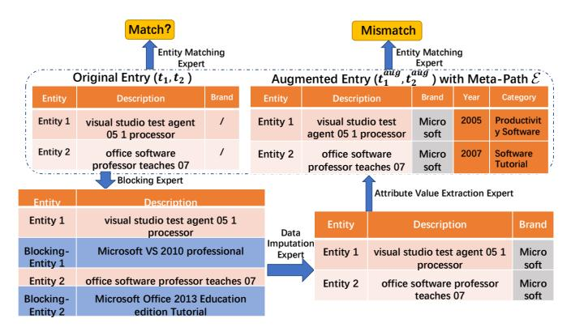
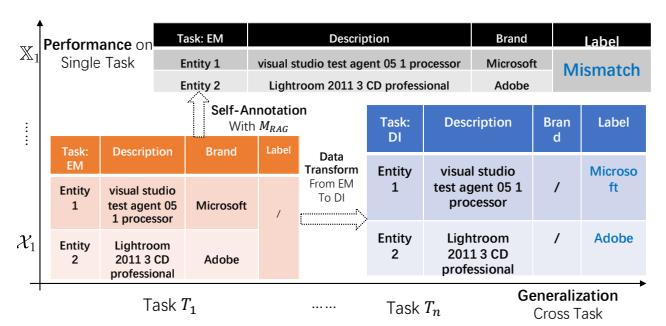

# 2.1 Preliminary

Large Language Models (LLMs) Representative LLMs, e.g., GPT-3 [25] and LLaMa [111], are pre-trained on enormous corpora, and have been shown incredible performance on various generative tasks in few-shot or zero-shot scenarios. LLMs are well known for their emergent abilities (i.e., the sudden appearance of unseen behavior) [33], with no or few labeled data as demonstration on unseen tasks. Moreover, open-source LLMs, e.g., LLaMa [111], Mistral [62] can be fine-tuned locally with more tasks, to improve their specialized abilities, while close-source LLMs, e.g., OpenAI's GPT series (in particular GPT-3, 3.5 and 4) can only be queried online with APIs.

However, LLMs may suffer from the hallucination problem when demonstration is beyond the knowledge/scope of LLMs, leading to factual errors or unrelated answers [35]. To alleviate this, strategies below are typically adopted to constrain the responses of LLMs:

- Instruction: a combo of prompts and options (i.e., candidate outputs/answers) for guiding LLMs to accomplish a given task.
- (2) In-Context Learning (ICL): a method of prompt engineering that provides LLMs with demonstrations in the instruction [26].
- (3) Retrieval Augmented Generation (RAG): a method to improve the quality of responses by feeding LLMs with relevant context retrieved, without updating the parameters of LLMs [29].

<u>Mixture of Experts (MoE)</u> The Mixture of Experts (MoE) architecture [60] is the basis of many state-of-the-art deep learning models. For example, MoE-based layers are being used to perform efficient computation in high-capacity neural networks and to improve parameter sharing in multi-task learning (MTL) [69, 81].

The original MoE model can be formulated as  $y(x) = \sum_{i=1}^{n} g(x)_i$   $e_i(x)$ , where  $E = \{e_1, \dots, e_n\}$  represents n expert networks, and g represents a gate network that ensembles the results from all experts. Specifically, g produces a distribution over n experts based

Figure 1: A toy example of multiple experts for enhanced EM (entity matching). A meta-path "BLK (blocking)  $\rightarrow$  DI (data imputation)  $\rightarrow$  AVE (attribute value extraction)  $\rightarrow$  EM " is found to help the EM expert to make the correct prediction.

on input x, and the final output is a weighted sum of the outputs of all experts. When truncated to top-k experts, each input only needs to activate k experts in inference without much information loss.

While MoE was first developed as an ensemble method of multiple individual models, recent works, e.g., Switch Transformer [41], Mixtral [62], successfully turn it into basic building blocks (a.k.a. a router layer, MoE layer) and stack them into transformer layer. These router layers allocate input examples to different experts in E, and are jointly trained with these experts. During inference, only the parameters of top-k experts are activated for each example (e.g., top-2 for Mixtral). However, such design requires to train experts all in once, lacking the flexibility for fine-tuning a single expert. It is also hard to guarantee the experts are specialized in different domains, as observed in The Pile dataset [43] for Mixtral [62].

In light of this, we focus on external router networks as [18].

<u>Multi-task Learning(MTL)</u> Multi-task learning (MTL) solves multiple tasks at the same time, by exploiting commonalities and differences across tasks. In MTL, deep learning-based architectures that perform soft (*i.e.*, partial) parameter sharing have been proven to be effective [97, 102]. Inspired by this, we can cast DP tasks into a MTL problem, and solve such problem by multi-gate MoE [81].

#### 2.2 Problem Definition

In data management and data mining, DP is a critical step to deal with noises, missing values, inconsistencies and moreover, capture relations and associations between entries. Major DP procedures include data cleaning, data integration, data transformation and data reduction [49]. In this work, we mainly focus on tabular data, including both relational tables and web tables.

Inspired by the success of *instruction-tuning* paradigm from the NLP literature[17], we adopt a universal DP task definition.

Assume that we are given a set  $\mathcal{T}$  of DP tasks  $\{\mathcal{T}_1, \mathcal{T}_2, \dots, \mathcal{T}_n\}$ . Each  $\mathcal{T}_i$  is provided with a set of training *queries* and associated *labels*, denoted as  $X_i = \{q_1, q_2, \dots\}$  and  $\mathcal{Y}_i = \{l_1, l_2, \dots\}$ , respectively.

**Definition 2.1:** (Data Preprocessing Query): A DP query for task  $\mathcal{T}_i$  on table T is defined as a quadruple  $q = (Ins^{\mathcal{T}_i}, D^{\mathcal{T}_i}, t, C^{\mathcal{T}_i})$ , where (a)  $Ins^{\mathcal{T}_i}$  is the natural-language instruction that specifies the task  $\mathcal{T}_i$  (e.g., entity matching, EM), (b)  $D^{\mathcal{T}_i}$  is a set of  $\mathcal{T}_i$ -related

demonstrations (*e.g.*, labeled examples of EM), (c)  $t \in T$  is a *tuple* (*a.k.a. entry*) from table T, on which  $T_i$  is performed and (d)  $C^{T_i}$  is the expected output domain by performing the task following the instructions on the tuple t (*e.g.*, {match, mismatch} for EM).  $\square$ 

Given a training query q for task  $\mathcal{T}_i$ , its associated label l gives the ground truth from the expected output domain  $C^{\mathcal{T}_i}$ . To conduct a task  $\mathcal{T}_i$ , one should query an expert with q. To illustrate, we give a few representative tasks below, and a complete list with illustrating examples can be accessed in full version[1]:

*Entity Matching (EM).* Given a pair of tuples  $t_1$ ,  $t_2$  in T, EM is to infer whether they refer to the same real-world entity.

*Error Detection (ED).* Given a tuple t and an attribute  $a_i$ , ED is to detect whether there is an error in the  $a_i$ -attribute value of tuple t.

Data Imputation (DI). Given a tuple t and an attribute  $a_i$  such that the  $a_i$ -attribute value of t is missing, DI is to infer its correct value.

<u>Column Type Annotation (CTA)</u> Given a table *T*, CTA is to infer the type of each column *h* of *T* from a set of predefined semantic types.

**Definition 2.2: (Expert):** An expert  $e_i$  trained on DP task  $\mathcal{T}_i$ , is defined as a fine-tuned language model, which takes the query q as input, and return the task-specific output from the output domain.  $\Box$ 

Note that each single expert  $e_i$  can response to queries of different tasks, since the experts in  $E = \{e_1, \dots, e_n\}$  share the same architecture and most parameters with each other.

**Definition 2.3: (Few-shot Learning):** Each task  $\mathcal{T}_i \in \mathcal{T}$  is provided with few-shot training queries and labels  $\{X_i, \mathcal{Y}_i\}$ , and the remaining unlabeled queries are denoted as  $\widetilde{X}_i$ . The training set  $\mathbb{X}_i$  for  $\mathcal{T}_i$  contains both labeled and unlabeled queries, i.e.,  $\mathbb{X}_i = X_i \cup \widetilde{X}_i$ . The overall training set  $\mathbb{X} = \bigcup_{i=1}^n \mathbb{X}_i$  is the training set cross all tasks.  $\square$ 

For task  $\mathcal{T}_i$  with training queries and labels  $(X_i, \mathcal{Y}_i)$ , we denote  $Eval(e_i, X_i)$  as the performance evaluation, between  $\mathcal{Y}_i$  and the output of expert  $e_i$  over  $X_i$ . For binary classification DP tasks, the evaluation metrics is F-measure, for the other tasks is accuracy.

Note that given a training query  $q \in \mathbb{X}_i$  for task  $\mathcal{T}_i$ , e.g., EM, it may be possible to transform q (and its associated label) to a new query-label pair (q', l') for another task  $\mathcal{T}_i$ , e.g., DI, via self-supervised learning, or masking strategies. Here the label l' can be a masked attribute from the original query q, or self-annotated, depending on tasks. The horizontal axis of Figure 2 give a toy example that transforms a query for EM to a new query-label pair for DI.

**Definition 2.4: (Low-resource DP)**: DP tasks are solved by LLMs trained and deployed in consumer-level small-memory GPUs with few-shot labeled data. □

Here we refer to a consumer-level small-memory GPU as one with memory not exceeding 24GB, and few-shot labeled data as comprising up to 10% of the original labeled benchmark data.

**Problem.** The problem studied in this paper is stated as follows.

- *Input*: A set of tasks  $\{\mathcal{T}_1, \dots, \mathcal{T}_n\}$  with few-shot training data  $\mathbb{X}$  in the low-resource DP setting.
- Output: An universal LLM-based system under the MoE architecture that is able to answer the (unseen) query of all \( \tilde{T}\_i \).

Figure 2: Illustration of our data augmentation method.

Figure 3: Illustration of Intrinsic Task Subspace (ITS) over task vectors. The left part [54] shows how LLM responses a task-specific query q with demonstrations. The right part is a 2d t-SNE plot of task vectors for different DP tasks over ITS. Dotted lines indicate decision boundary over different tasks.

#### 3 THEORETICAL ANALYSIS

Despite the empirical success of the MoE architecture in MTL, the theoretical understanding of such architecture is still elusive. It is unclear why the experts can be specialized to make predictions for different inputs, and why the router can automatically learn to dispatch data. To this end, we provide some theoretical analysis in this section, answering the following questions:

- Q1: Can various DP tasks (e.g., EM and DI) over different domains (e.g., scholar and e-commerce) be represented and learned over a compact low-dimension space, i.e., a intrinsic task subspace?
- o Q2: Why cannot a single expert fit well for multiple domains?
- Q3: How the router learn to dispatch data to the right experts?

To answer these questions, we provide the following three theorems. For the lack of space, the proofs are provided in full version[1].

**Theorem 1:** (Intrinsic Task Subspace) With unified representation of different tasks  $\{\mathcal{T}_1, \mathcal{T}_2, \cdots, \mathcal{T}_n\}$  and in-context learning (ICL) demonstrations  $D_i$  (i.e.,  $D^{\mathcal{T}_i}$ ), fine-tuning a LLM on task  $\mathcal{T}_i$  is equivalent to learn a **task vector**  $\theta_i(D_i)$ , and such vector is embed in a low-dimensional and compact intrinsic task subspace (ITS).

Theorem 1 [54, 97] indicates that with unified representation and proper ICL for each task  $\mathcal{T}_i$ , we can represent and learn multiple DP tasks  $\mathcal{T}$  in a small ITS, denoted by V. In other words, fine-tuning a small set of parameters in a LLM can generalize it to multiple tasks. Figure 3 gives a intuitive visualization of ITS over task vectors.

**Theorem 2:** (Error Bound for Single and Mixture of Experts) Consider fine-tuning a single expert  $h_N$  from the base LLM model  $h_0$ , to apply MTL over all DP tasks. Let  $C \sim \bigcup_{i=1}^{|\mathcal{T}|} X_i$  be the sampled distribution over all tasks  $\mathcal{T}$  with N samples,  $\mathbb{C} \sim \bigcup_{i=1}^{|\mathcal{T}|} \mathbb{X}_i$  be the

actual distribution over  $\mathcal{T}$ , S be the source domain distribution from  $h_0$ ,  $\epsilon_{\mathbb{C}}(h_N)$  be the expected error bound of the single fine-tuned expert, and  $\epsilon_C(h_N)$  be the empirical error. The expected error  $\epsilon_{\mathbb{C}}(h_N)$  for single fine-tuned expert is upper bounded, i.e.,

$$\epsilon_{\mathbb{C}}\left(h_{N}\right) \leq \epsilon_{C}\left(h_{N}\right) + \sqrt{\frac{KL(h_{N}||h_{0}) + ln\sqrt{4N} - ln(\delta)}{2N}} + 2D(S,C)$$

where D(S, C) is a distance function representing the gap between the source domain S and the target domain C, and  $\delta$  is a constant.

Let  $\mathcal{R}_N(H)$  be the Rademacher complexity of the hypothesis space H associated with expert models,  $d_N$  be the Natarajan dimension of the gating network N within its hypothesis space  $\mathcal{B}$ ,  $n=|\mathbf{E}|$  and k is the number of experts selected per query. For mixture of experts, the error bound is:

$$O(4C\mathcal{R}_N(H) + 2\sqrt{\frac{2kd_N(1 + \ln(\frac{n}{k}) + d_N \ln(2N) + \ln(4/\delta)}{2N}})$$

which holds with a probability of at least  $1 - \delta$ .

Theorem 2 [77, 134] shows that in few-shot learning, single expert cannot fit well for multiple target domains if (a) the model capacity is small, *i.e.*,  $KL(h_N||h_0)$ , which is negatively correlated with the model capacity [20], correspondingly large, (b) the sample number N in the target domain is small, and (c) the empirical error  $\epsilon_C$  ( $h_N$ ) is high, *i.e.*, there is a large bias between the sampled example distribution C and the actual distribution C. And the error bound of the mixture of experts is directly proportional to the sparse factor  $s = O(\sqrt{\frac{k}{N}(1 + \log(\frac{n}{k}))})$ . This implies that, with a constant total number of experts n selecting fewer experts k leads to a more sparse network architecture, which consequently reduces the bound on the generalization error. Moreover, an increase in the number of training samples N can also minimize the error bound.

These conclusions have been validated through the experimental results and hyperparameter analysis in Section 5.2.

**Theorem 3:** (Router learns Clusters in ITS) Given  $N = \Gamma(dk \log k)$  samples drawn from a mixture of k spherical Gaussian in d-dimensions which are c-separated for some constant c, and an instantiation of the MoE architecture with  $O(k \log k)$  experts, if we initialize the router weights  $g_i$  randomly, the router will learn to route examples according to the ITS task cluster distribution.

Theorem 3 [11, 18] guarantees the converge of the router network, the core of MoE architecture. However, such performance relies on a proper set of demonstration  $D_i$ , a suitable division of experts E, and a stratified sampling strategy for training the router network.

