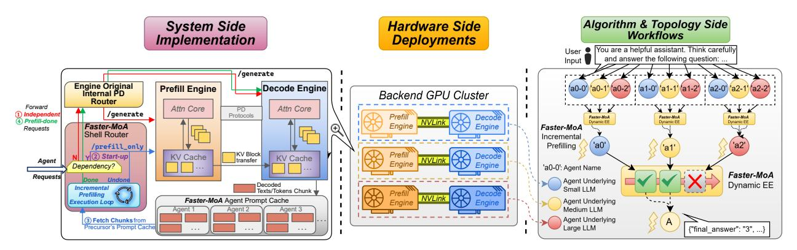
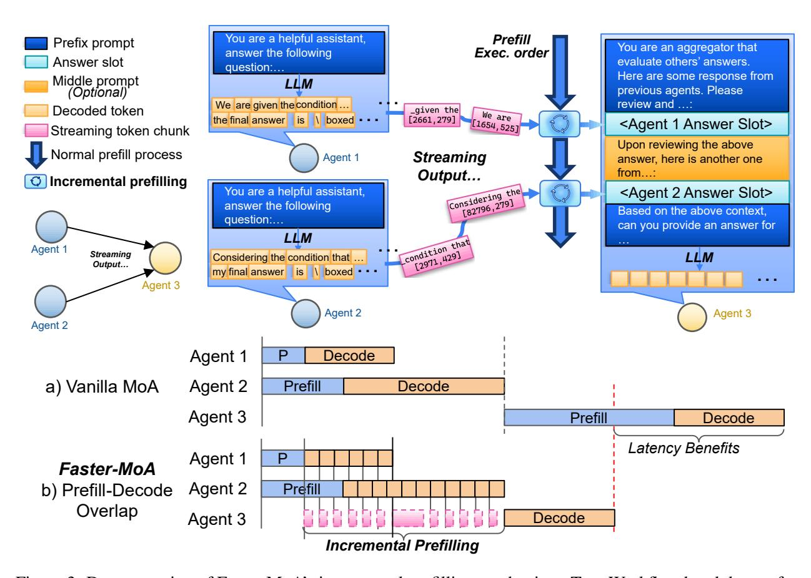

# 3 Feasibility Analysis

### 3.1 Explorations on Tree Topology

The vanilla all-to-all connected MoA topology tends to accumulate redundant rationales and suffer from high E2E latency without proportional gains in accuracy. Tree-structured architectures have a long history in modular and mixture-of-experts (MoE) models, and have provisioned efficient solutions in solving nonlinear supervised learning tasks [\[16,](#page-11-5) [17,](#page-11-6) [18\]](#page-11-7). In LLM era, tree-based search has also emerged as a strong alternative to naive Chain-of-Thoughts (CoT) [\[19\]](#page-11-8). Tree-of-Thoughts (ToT) explicitly explores a branching search tree of partial solutions and uses lookahead and backtracking to select promising branches, significantly boosting success rates on tasks like Game of 24 and planning puzzles compared to single-chain CoT [\[20\]](#page-11-9). Graph-of-Thoughts (GoT) further generalizes to arbitrary graphs of "thoughts," showing that structured, sparse connectivity among intermediate solutions can outperform naive repetition while reducing token usage [\[21\]](#page-11-10).

Motivated by the success of tree topology in previous works, we are the first to adopt a hierarchical tree as MoA topology. This is because tree topology is theoretically grounded by a lot of existing works on hierarchical MoEs, empirically supported by tree-/graph-based reasoning frameworks, and crucially matches the needs of latency-sensitive LLM serving where sparse and localized coordination is more beneficial than unconstrained connectivity.

#### <span id="page-3-0"></span>3.2 Optimizations on Connection Pruning

With the tree topology fixed, the influence of each agent on overall system behavior remains unclear, particularly whether adding more agents and connections actually improves MoA performance. We study this from two perspectives: (i) Mutual semantic similarity across agents. Motivated by prior observations that different agents often produce highly similar outputs [\[22,](#page-11-11) [23,](#page-11-12) [24\]](#page-11-13), we use Frobenius Cosine Similarity (FCS) [\[25,](#page-11-14) [26,](#page-11-15) [27\]](#page-12-0) on last-layer hidden states of a shared embedding model (*Qwen3-Embedding-4B*) to measure semantic similarity between each pair of models (Fig. [1\(](#page-1-0)ii)). Within all the clusters of 1st layer of tree topology, we observe higher similarity among the 4B, 8B and 32B *Qwen3-VL-Instruct* models on simpler tasks (*MATH-500* [\[28\]](#page-12-1), Fig. [1\(](#page-1-0)ii(a))) and lower similarity on harder tasks (*IFBench* [\[29\]](#page-12-2), Fig. [1\(](#page-1-0)ii(c))), suggesting that on straightforward tasks, incorporating larger models often adds limited auxiliary information beyond what smaller models already provide. (ii) Impact of saturated connections. We evaluate a one-layer all-to-all MoA with varying width (number of proposer agents) while using an identical *Qwen3-VL-Instruct-4B* as underlying LLM. As shown in Fig. [1\(](#page-1-0)iii), task accuracy on *MATH-500*, *AIME25* [\[30\]](#page-12-3) and *MMLU-ProX-Lite* [\[31\]](#page-12-4) quickly saturates or even declines as the number of agents grows, while latency monotonically increases.

These results yield two key takeaways: (1) For relatively simple tasks, aggregating outputs from smaller models is typically sufficient, whereas for more challenging benchmarks it can be beneficial to selectively wait for outputs from larger, stronger models; (2) Simply adding more fully connected agents does not guarantee higher-quality outputs. Consequently, adaptively truncating or dropping straggler agents can preserve competitive performance while largely reducing end-to-end latency.

### 3.3 Intuition of Incremental Prefilling

When serving a request, depending on model size and prompt length, the prefill stage can account for up to 10%–30% of E2E latency [\[15\]](#page-11-4). And as discussed, in dependency-coupled systems, naive scheduling launches the successor agent's prefill only *after* all precursor agents finish decoding and their outputs are collected—successor agents idle while waiting, paying the full cost on the critical path. Therefore, based on the tree topology, we further develop a hardware efficient incremental prefilling technique, successfully overlapping the precursor agents decoding and successor agents prefilling, reducing exposed prefilling latency without affecting final outputs (Fig. [3\)](#page-7-0).

The key intuition behind our incremental prefilling is the reusage of KV blocks in the prefilling stage. As illustrated in an example in Fig. [3,](#page-7-0) agent 3 depends on the outputs of agents 1 and 2. We partition agent 3's input prompt into three segments: its own prefix, followed by the answer slots for agents 1 and 2. The prefix segment can be prefilled immediately since it has no data dependencies. Once agent 3 receives the first decoded

<span id="page-4-1"></span>

Figure 2: Faster-MoA overview from three dimensions. We show an example design with three different sizes underlying LLMs. (1) *Algorithm & topology workflow*. User's input is distributed to three agent clusters with different sizes underlying LLMs. Between layers, we perform agent dependency-aware incremental prefilling for PD overlapping. (2) *Hardware deployments*. Faster-MoA is served upon a 6-GPU cluster. (3) *System Implementation*. Within each pair of PD engines, a dedicated shell router and agent prompt cache are designed for run-time task orchestrations.

tokens from agent 1, the corresponding answer segment is appended directly after the prefix. Since this new content is contiguous with the already-prefilled prefix, we can reuse the existing KV blocks and compute KV only for the newly appended tokens, significantly reducing computation. Consequently, decoded tokens from agent 1 can be streamed to agent 3 on-the-fly, enabling overlap between decoding (agent 1) and prefilling (agent 3) despite dependency constraints. Note that agent 2 cannot begin incremental prefilling as soon as its first token arrives, because its answer segment is not contiguous with agent 3's prefix. This autoregressive characteristic requires that agent 2 must wait until agent 1 finishes decoding so that the preceding segment is complete.

### 4 Design Details

#### <span id="page-4-0"></span>4.1 Hierarchical Tree Topology

As an optimization to all-to-all connections, we propose the **hierarchical, tree-structured MoA topology**. Fig. 2 (right) illustrates the overall structure and workflow of the framework.

General Definitions. Let the tree have depth L with leaves at layer 1 and the root at layer L. Input flows from leaves to the root as output. Denote the set of agents at layer  $\ell$  by  $\mathcal{A}_{\ell}$  and a particular agent by  $a_{\ell,j} \in \mathcal{A}_{\ell}$ . Each  $a_{\ell,j}$  depends only on a *local* subset cluster of precursor agents  $\mathcal{C}(a_{\ell,j}) \subseteq \mathcal{A}_{\ell-1}$  with total length  $|\mathcal{C}(a_{\ell,j})| \ll |\mathcal{A}_{\ell-1}|$ . This sparsifies dependencies and replaces all-to-all connected layer with *localized readiness*: an agent at layer  $\ell$  may proceed as soon as its designated precursors in  $\mathcal{C}(a_{\ell,j})$  have produced outputs, independent of unrelated subtrees.

**Latency implications.** Under an all-to-all design, progress at layer  $\ell$  is gated by the slowest agent, yielding a layer inference latency:

$$T_{\ell}^{\text{all}} = \max_{i \in [|\mathcal{A}_{\ell}|]} t_{\ell,i}$$

where  $t_{\ell,i}$  is the runtime of agent  $a_{\ell,i}$ . The E2E latency accumulates these worst-case layer times,  $\sum_{\ell=1}^{L} T_{\ell}^{\text{all}}$ . In the proposed tree topology, each successor agent waits only for its connected precursor agents, so the inference latency of a layer is optimized to:

$$T_{\ell}^{\text{tree}} \, \approx \, \max_{a_{\ell,j} \in \mathcal{A}_{\ell}} \, \max_{c \in \mathcal{C}(a_{\ell,j})} t_c,$$

#### <span id="page-5-1"></span>Algorithm 1 Semantic Similarity & Confidence-based Early Exit

```
Let \langle U, V \rangle_F = \operatorname{trace}(U^\top V), \|U\|_F = \sqrt{\langle U, U \rangle_F}

FrobCosSim(U, V) = \frac{\langle \operatorname{Corr}(U), \operatorname{Corr}(V) \rangle_F}{\|\operatorname{Corr}(U)\|_F \|\operatorname{Corr}(V)\|_F}

1: function METRICQ(\{O_i\}_{i=1}^\ell, \{\log p_\ell^i\}_{i=1}^{n_a})

2: C_\ell \leftarrow \exp\left(\frac{1}{n_a} \sum_{i=1}^{n_a} \log p_\ell^i\right)

                   \bar{C} \leftarrow \sqrt{\frac{1}{\ell} \sum_{i=1}^{\ell} C_i^2} \in [0, 1]
  3:

    ► RMS average

  4:
                          T_i \leftarrow Embed(O_i), T_\ell \leftarrow Embed(O_\ell)
   5:
                             U \leftarrow T_i^t \times T_i \in \mathbb{R}^{h \times h}, V \leftarrow T_\ell^t \times T_\ell \in \mathbb{R}^{h \times h}
Sim[i, \ell] \leftarrow \text{FrobCosSim}(U, V)
  6:
  7:
                              \operatorname{Sim}[\ell, i] \leftarrow \operatorname{Sim}[i, \ell]
  8:
                    end for
  9:
                   W \leftarrow \sum_{i=1}^{\ell} \sum_{j=1}^{i} C_i C_j
10:
                   P \leftarrow \frac{1}{W} \sum_{i=1}^{\ell} \sum_{j=1}^{i} C_i C_j \operatorname{Sim}[i,j]
11:
                  B \leftarrow 1 - \frac{|P - \tau|}{T} \in [0, 1]
Q \leftarrow \sqrt{\bar{C} \cdot B}^{\tau}
12:
13:
                    Early exit with probability Q upon receiving T_{\ell} and \{\log p_i\}_{i=1}^{n_a}
15: end function
```

which is typically much smaller when  $|\mathcal{C}(a_{\ell,j})| \ll |\mathcal{A}_{\ell-1}|$ . Besides, the request on different tree branches can also run concurrently, reducing the end-to-end accumulated inference latency from leaf to root, rather than waiting for layer-wise synchronization.

Context-length and prefill savings. Because each precursor agent consumes only  $|\mathcal{C}(a_{\ell,j})|$  messages instead of the entire previous layer's outputs, the input context per precursor shrinks from  $|\mathcal{A}_{\ell-1}|$  to  $|\mathcal{C}(a_{\ell,j})|$ . Given that prefill cost scales approximately linearly with prompt length, this yields a proportional reduction in prefill latency and memory traffic.

**Redundancy control and variance isolation.** The tree structure naturally reduces redundancy: a successor agent aggregates only its precursors' outputs rather than the full layer. Stragglers or unusually long generations are confined to their subtrees. A slow leaf agent will not delay unrelated branches inference except for its successors, largely improving robustness in long-tailed decoding situations.

As an empirical demonstration, we set 3 precursor agents per successor agent in the tree setting, forming a 9-3-1 three-layered tree structure, with three heterogeneous sized LLMs deployed as underlying model backbones. In this paper, all terminologies related to "tree topology/structure" refer to this setting.

### <span id="page-5-0"></span>4.2 Dynamic Early-Exit Routing

Algorithm 1 shows our innovative agent early-exit mechanism that jointly considers output confidence and semantic-level similarity. The goal is to compute the early-exit probability Q on-the-fly using the outputs of the LLMs that have already completed within the same tree layer. With the computed Q, we terminate the remaining unfinished LLMs in the layer and discard their results following the probability Q.

Our algorithm first computes the geometric mean confidence  $C_{\ell}$  ( $\ell$  stands for the number of currently completed LLMs in a tree layer) from the token-level log-probabilities  $\{\log p_{\ell}^i\}_{i=1}^{n_a}$ , which is predicted by agent model, 4B, 8B, and 32B *Qwen3-VL-Instruct* (Line 2), and aggregates all previous confidences into  $\bar{C}$  by an RMS average (Line 3), where consistently high-confidence steps yield larger overall confidence  $\bar{C}$ .

To quantify the semantic similarity of answers that might have different lengths, we first encode each output sentence with a shared embedding model (Qwen3-Embedding-4B) (Line 5) and project the last-layer hidden states ( $T_i, T_\ell \in \mathbb{R}^{n \times h}$ ) from embedding model into corresponding feature-wise correlation matrix by left multiplying it with its associated transpose matrix ( $T_i^t \times T_i, T_\ell^t \times T_\ell \in \mathbb{R}^{h \times h}$ ) (Line 6). And then, we

compute FCS based on these feature-domain matrices (Line 7). All embeddings are produced by a single, shared embedding model so that this similarity is comparable across backbone models from different families. Normalizing matrices into correlation matrices within FCS removes the influence of scales and units, ensuring that they are solely subject to intrinsic semantic variation.

We obtain a universal confidence-weighted similarity score P by averaging Sim[i, j] with corresponding confidence weights CiC<sup>j</sup> (Line 11), so that steps which are both semantically consistent and high-confidence have the greatest influence, while low-confidence or noisy outputs contribute minimally to entire answer quality. As mentioned in Sec. [3.2,](#page-3-0) higher similarity is not always better [\[23,](#page-11-12) [24\]](#page-11-13), we calibrate P by comparing it against the preference similarity threshold τ , generating adjusted similarity measure B (Line 12). The score of B is supposed to favor the scenario when agents are confident and similar enough yet not overly identical, so that their combined responses still offer diverse, complementary information for the next layer. Empirically, we set τ to 0.7 by default based on our experiment results, thus achieving higher task accuracy with lower agents connectivity compared with other settings.

Finally, Algorithm [1](#page-5-1) combines this calibrated similarity B with the geometric-mean confidence score C¯ to produce the synthesized quality score Q = √ C¯ · B (Line 13), which stochastically triggers early exit.

#### <span id="page-6-0"></span>4.3 Incremental Prefilling for PD Overlapping

Fig. [2](#page-4-1) (left & middle) illustrates our PD disaggregation deployments on GPUs with incremental prefilling. To serve one model, we instantiate two engines running on separate GPUs within the same node. Each engine maintains its own attention compute core and an engine-local KV cache. A high-bandwidth intra-node fabric (NVLink) transfers prefilled KV blocks from the prefill engine (PE) to the decode engine (DE). Our proposed design techniques can be classified into three aspects.

First, we expose two API entrypoints: (i) /generate, standard prefill+decode via conventional PD pipeline following SGLang, and (ii) /prefill\_only, execute prefill only requests on the PE and cache the KV blocks. Notably, even we can treat prefill requests as a "zero-length-output" generate request theoretically, those requests will also introduce massive KV block transmissions from PE to DE while never being processed. This could introduce large communication latency and memory allocations, thus we separate the prefill API to avoid this situation.

Second, we develop an *Agent Prompt Cache* (APC) that stores partial decoded texts for each dependent agent, enabling incremental prompt construction for successor agent prefilling. For example, in Fig. [3,](#page-7-0) partially decoded text from agent 1 and agent 2 will be stored in APC for agent 3's incremental prefilling. When using different sized models in the same model family that share the same tokenizer, APC stores the intermediate tokens instead of text, avoiding extra tokenize-detokenize process. The chunk size of partially decoded text or tokens stored in APC should be chosen empirically by users based on workload characteristics. It must balance the need to reduce successor agent's exposed prefilling latency and the risk of generating excessive incremental prefill requests, which can incur significant prefill-engine initialization overhead.

Third, an individual shell router outside the two engines is implemented as the core of our incremental prefilling mechanism, with details shown in Fig. [2.](#page-4-1) All agents' requests will be sent to shell router first, enabling further efficient dispatching and orchestration with the native PD routers and engines. Our shell router will handle the coming agent requests in four steps: 1 Dependency identification. If the upcoming agent request is independent, it is directly forwarded to the native PD router for direct prefilling and decoding, with decoded text/tokens streaming back to corresponding agent's APC. 2 Dependent requests handling. If the input agent request depends on the output of other agents, the input prompt of this request will be segmented by precursor agents' output slots. The shell router then initiates incremental prefilling by first processing the prefix segment (the agent's own prompt prefix) and continuously monitoring the first dependent agent's APC (whose slot directly attached to the prefix) so that its corresponding segment can start prefilling immediately once the APC receives decoded tokens from that agent. 3 Incremental prefilling loop. The shell router then periodically fetches text/token chunks from APC, concatenates them with the prefilled prefix and issues a lightweight /prefill\_only update. Because these increments are short and the prefix KV remains resident in HBM due to previous prefilling, incremental updates attain near 100% KV cache hit rates. This fetch→append→incremental-prefill loop continues until current slot is fulfilled. If the request has multiple

<span id="page-7-0"></span>

Figure 3: Demonstration of Faster-MoA's incremental prefilling mechanism: Top: Workflow breakdown of a 3-agent dependency. Bottom: Execution bubble comparison between a) vanilla MoA, b) Our prefill-decode overlap pipeline.

dependencies (as Fig. 3 shown), the shell router will repeat this step until all slots are fulfilled. **④ Forward prefill-done requests.** Once all slots are filled and the agent's input prompt is complete, its prefilling stage is already finished due to the on-the-fly overlap with precursor decoding. The router then forwards the subsequent decoding request for this agent to the internal PD router, which proceeds through the standard /generate path.

