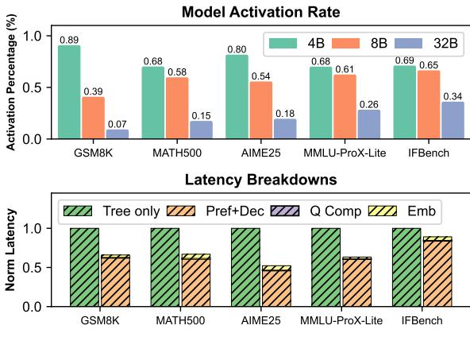
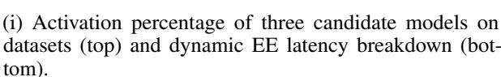
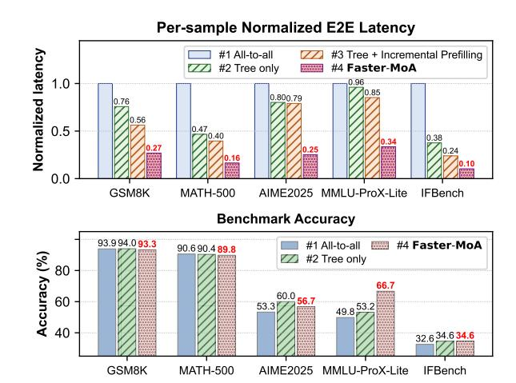
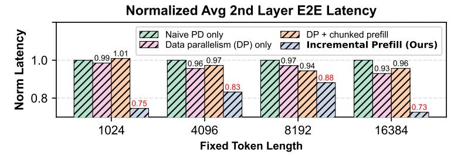

# 5 Experimental Evaluation

#### 5.1 Experiment Setup

In order to collect convincing data, we implemented our framework on two independent LLM serving engines. For accurate latency metrics, we modified SGLang v0.5.3 [32] and integrated our overlapping and early-exit mechanism, with single concurrency for exact per-sample latency. For large-batch dataset-wise verification, we adapted our framework upon vLLM v0.11.0 [33], with careful prompt designs and hyperparameter tunings, and enabled concurrency=32 questions/batch to accelerate verification.

**Datasets.** We evaluated our framework on five datasets: *GSM8K* [34], *MATH-500*, *AIME2025*, *MMLU-ProX-Lite* and *IFBench*, covering a vast majority of categories while emphasizing math reasoning and scientific Q&A. In which, *GSM8K*, *MATH-500* and *AIME25* represent math problems from easy to hard, *MMLU-Prox-Lite* provides a wide set of general scientific questions within multiple STEM majors, and *IFBench* is an instruction following testbench as an addition.

Models. For implementation simplicity, we chose the *Qwen* model family as our candidate model pool to avoid extra heterogeneous tokenizer orchestration issues. From the pool, we finally picked three models: *Qwen3-VL-4B-Instruct*, *Qwen3-VL-8B-Instruct*, and *Qwen3-VL-32B-Instruct*, plus an extra *Qwen3-Embedding-4B* in dynamic EE routing. These three state-of-the-art models exhibit great reasoning ability in text generation [\[35\]](#page-12-8), while their increasing dense weights perfectly show the direct proportion to growth in performance, making it a good fit for our prerequisites. On both engines, we applied the same sampling parameters as suggested in model cards for consistency.

Hardware. We run the models on six NVIDIA H200 GPUs (within a single NVIDIA H200 HGX Server), configured as one prefill engine and one decode engine per model. The maximum output tokens were capped at 65535, and the scheduling conservativeness was set to 0 to enforce aggressive request scheduling in native SGLang Router [\[36\]](#page-12-9), further maximizing memory utilization.

#### 5.2 Dynamic EE and Incremental Prefill Impact

In this section, we analyze the individual impact of dynamic agent-level early exit and incremental prefilling on end-to-end latency. We first employ each mechanism in isolation under identical settings to quantify its standalone role in reducing the critical path. We then study their combined effect in Sec. [5.3,](#page-9-0) highlighting how early exit and incremental prefilling interact to further shrink exposed latency without accuracy degradation.

#### 5.2.1 Dynamic EE

Before the integration of our dynamic early-exit method, the following questions still remained unsolved: 1) What is the explicit criterion of dynamic EE? 2) How much latency overhead will dynamic EE introduce?

With these in mind, we carried out experiments with only tree topology + dynamic EE deployed, and verified the framework on the five datasets. To visualize the process of dynamic EE, we collected the activation percentage of each model (4B, 8B and 32B) by calculating invoked\_times/total\_samples, as well as detailed latency breakdowns in performing dynamic EE.

As illustrated in Fig. [4\(](#page-9-1)i), we observed that: (i) With dynamic EE, large model is significantly less likely to be invoked compared to small models. (ii) For harder datasets compared with easier ones (e.g, *IFBench* to *GSM8K*), more invocations of large model happen in IFBench, the harder one. These two observations validate the effectiveness of score Q, which guides the early exit process adaptively towards different-level questions. Additionally, as observed from the latency breakdowns, the calculation in our proposed method would only introduce ∼5% additional latency, however brings about 10% ∼ 50% E2E latency reduction in total, thus the effectiveness is ensured.

#### 5.2.2 Incremental Prefilling

We then investigated the latency metrics on second layer aggregators in the tree structure with random tokens. This specified metric is critical in our framework, since it explicitly impacts the next final aggregator's input. If we accelerate the E2E latency for all second layer aggregators, we can establish an early decision in our dynamic EE routing.

We consider three model deployment baselines in contrast to our proposed method here: 1) Naive PD disaggregation only. 2) Data parallelism (DP) only. Since we are utilizing two GPUs for a single model, the worth of resources is vital. 3) DP + chunked prefill [\[37\]](#page-12-10), as an addition to 2). We use random generated tokens as input with uniformly distributed length L ∼ U(1, 2048), and control output token length (denoted as fixed\_tokens), then collect the E2E latency on the second layer.

As shown in Fig. [4\(](#page-9-1)iii), our proposed method generally outperformed the three baseline, with a maximum of 27.4% E2E latency reduction while the baselines reaching only ∼10%. The above concretely illustrates the feasibility of our proposed overlapping method.

(ii) Experiment results of FaSTeR-MoA on datasets. Top: per-sample normalized E2E latency. Bottom: overall test accuracies.

(iii) Normalized average second-layer E2E latency with different pre-fill-decode optimizations.

Figure 4: Summary of FaSTeR-MoA performance and ablation results across benchmarks.

#### 5.3 Final Experiment & Result Discussions

**Settings.** For our ultimate experiment, we considered the following four settings: 1) **All-to-all Baseline:** three layers with 9 agents  $\rightarrow$  9 agents  $\rightarrow$  aggregator. 2) **Tree structure only:** replace baseline with our three-layered 9-3-1 tree structure, without further optimizations. 3) **Tree structure + Incremental Prefilling:** only enables the incremental prefilling method. 4) **fully-integrated Faster-MoA framework.** 

Figure 4(ii) illustrates the final experiment results. We observed a significant E2E latency reduction in each category. Maximum reduction of  $\sim$ 62% with tree-only,  $\sim$ 76% with tree+overlapped prefill and  $\sim$ 90% with fully integrated setting is achieved by the proposed frameworks, indicating the effectiveness of our methodology.

We also benchmark accuracy to verify that these optimizations do not compromise reasoning quality (Fig. 4ii (bottom)). Since incremental prefilling only restructures the timing of prefill and decode without modifying any prompt content, it does not affect the model's accuracy performance; therefore, we focus our accuracy comparison on the tree-only and the fully integrated configuration versus the all-to-all baseline.

Across the five benchmarks, our fully integrated Faster-MoA achieves accuracy comparable to the all-to-all baseline on GSM8K, MATH-500, and IFBench, within an acceptable  $\pm 1\%$  absolute margin. This behavior is consistent with the saturation effect of aggregating many agents on relatively easier tasks, as discussed in Fig. 1iii. For the remaining two datasets, MMLU-ProX-Lite and AIME2025, we even observe noticeably higher accuracy than the all-to-all baseline. These gains suggest that dynamic EE can selectively truncate redundant or low-quality answers produced by weaker proposer agents, yielding a more reliable aggregate

answer. Assembling together, these results demonstrate that Faster-MoA can substantially reduce latency while preserving or even improving end-task accuracy.

## 6 Conclusion

In this paper, we propose Faster-MoA, a unified algorithm-system co-design for efficient MoA serving. Our hierarchical tree-structured agent topology replaces all-to-all connectivity, substantially reducing redundant interactions through structural sparsity while still enabling both localized and global information aggregation. A run-time dynamic agent early-exit mechanism further prunes unnecessary agent connections based on both output similarity and confidence. To further improve hardware efficiency, we introduce dependency-aware incremental prefilling, which overlaps prefilling and decoding stages during inference across dependent agents. Together, these techniques enable Faster-MoA to reduce end-to-end serving latency by up to 90% while maintaining comparable (within ±1%) or higher task accuracy compared to all-to-all MoA baselines.

## References

- [1] Xinyi Li, Sai Wang, Siqi Zeng, Yu Wu, and Yi Yang. A survey on llm-based multi-agent systems: workflow, infrastructure, and challenges. *Vicinagearth*, 1(1):9, 2024.
- [2] Dongfu Jiang, Xiang Ren, and Bill Yuchen Lin. Llm-blender: Ensembling large language models with pairwise ranking and generative fusion, 2023.
- [3] Yanda Chen, Xinyu Tang, Yuanhao Yue, Tao Ge, and Furu Wei. Reconcile: Round-table conference improves reasoning via consensus among diverse LLMs. In *Proceedings of the 62nd Annual Meeting of the Association for Computational Linguistics (Volume 1: Long Papers)*, pages 7066–7085. Association for Computational Linguistics, 2024.
- [4] Zishen Wan, Yuhang Du, Mohamed Ibrahim, Jiayi Qian, Jason Jabbour, Yang Zhao, Tushar Krishna, Arijit Raychowdhury, and Vijay Janapa Reddi. Reca: Integrated acceleration for real-time and efficient cooperative embodied autonomous agents. In *Proceedings of the 30th ACM International Conference on Architectural Support for Programming Languages and Operating Systems, Volume 2*, pages 982–997, 2025.
- [5] Yilun Du, Shuang Li, Joshua Tenenbaum, Antonio Torralba, Igor Mordatch, et al. Improving factuality and reasoning in language models through multi-agent debate, 2023.
- [6] Yongliang Shen, Kaitao Song, Xu Tan, Dongsheng Li, et al. Hugginggpt: Solving ai tasks with chatgpt and its friends in hugging face, 2023.
- [7] Joon Sung Park, Joseph C. O'Brien, Carrie J. Cai, Meredith Ringel Morris, Percy Liang, and Michael S. Bernstein. Generative agents: Interactive simulacra of human behavior. In *Proceedings of the 36th Annual ACM Symposium on User Interface Software and Technology*, UIST '23. Association for Computing Machinery, 2023.
- [8] Zhiwei Liu, Weiran Yao, Jianguo Zhang, Le Xue, Shelby Heinecke, et al. Dylan: Dynamic large language model collaboration. In *The 12th International Conference on Learning Representations*, ICLR 2024. OpenReview, 2024. OpenReview preprint; pages not assigned.
- [9] Chenyu Wang, Zishen Wan, Hao Kang, Emma Chen, Zhiqiang Xie, Tushar Krishna, Vijay Janapa Reddi, and Yilun Du. Slm-mux: Orchestrating small language models for reasoning, 2025.
- [10] Tian Liang, Zhiwei He, Wenxiang Jiao, Xing Wang, Yan Wang, Rui Wang, Yujiu Yang, Shuming Shi, and Zhaopeng Tu. Encouraging divergent thinking in large language models through multi-agent debate. In Yaser Al-Onaizan, Mohit Bansal, and Yun-Nung Chen, editors, *Proceedings of the 2024 Conference on Empirical Methods in Natural Language Processing*, pages 17889–17904, Miami, Florida, USA, November 2024. Association for Computational Linguistics.

- [11] Kai Xiong, Xiao Ding, Yixin Cao, Ting Liu, and Bing Qin. Examining inter-consistency of large language models collaboration: An in-depth analysis via debate. In *Findings of the Association for Computational Linguistics: EMNLP 2023*, page 7572–7590. Association for Computational Linguistics, 2023.
- [12] Guibin Zhang, Yanwei Yue, Zhixun Li, Sukwon Yun, Guancheng Wan, Kun Wang, Dawei Cheng, Jeffrey Xu Yu, and Tianlong Chen. Cut the crap: An economical communication pipeline for llm-based multi-agent systems, 2024.
- [13] Weize Chen, Yusheng Su, Jingwei Zuo, Cheng Yang, Chenfei Yuan, Chi-Min Chan, Heyang Yu, Yaxi Lu, Yi-Hsin Hung, Chen Qian, Yujia Qin, Xin Cong, Ruobing Xie, Zhiyuan Liu, Maosong Sun, and Jie Zhou. Agentverse: Facilitating multi-agent collaboration and exploring emergent behaviors, 2023.
- [14] Yuvraj Patel, Jack Sampson, and Lorenzo Mai. Splitwise: Efficient expert selection for moe inference. In *Proceedings of the 51st Annual International Symposium on Computer Architecture*, ISCA '24, pages 118–132. IEEE / ACM, 2024.
- [15] Yinmin Zhong, Shengyu Liu, Junda Chen, Jianbo Hu, Yibo Zhu, Xuanzhe Liu, Xin Jin, and Hao Zhang. Distserve: Disaggregating prefill and decoding for goodput-optimized large language model serving. In *Proceedings of the 18th USENIX Symposium on Operating Systems Design and Implementation*, OSDI '24. USENIX Association, 2024.
- [16] Michael I. Jordan and Robert A. Jacobs. Hierarchical mixtures of experts and the em algorithm. *Neural Computation*, 6(2):181–214, 1994.
- [17] Christopher M. Bishop and Markus Svensen. Bayesian hierarchical mixtures of experts, 2012.
- [18] Wenxin Jiang and Martin A Tanner. Hierarchical mixtures-of-experts for generalized linear models: some results on denseness and consistency. In *Seventh International Workshop on Artificial Intelligence and Statistics*. PMLR, 1999.
- [19] Jason Wei, Xuezhi Wang, Dale Schuurmans, Maarten Bosma, Fei Xia, Ed Chi, Quoc V Le, Denny Zhou, et al. Chain-of-thought prompting elicits reasoning in large language models. *Advances in neural information processing systems*, 35:24824–24837, 2022.
- [20] Shunyu Yao, Dian Yu, Jeffrey Zhao, Izhak Shafran, Thomas L. Griffiths, Yuan Cao, and Karthik Narasimhan. Tree of thoughts: Deliberate problem solving with large language models, 2023.
- [21] Maciej Besta, Nils Blach, Ales Kubicek, Robert Gerstenberger, Michal Podstawski, Lukas Gianinazzi, Joanna Gajda, Tomasz Lehmann, Hubert Niewiadomski, Piotr Nyczyk, and Torsten Hoefler. Graph of thoughts: Solving elaborate problems with large language models. *Proceedings of the AAAI Conference on Artificial Intelligence*, 38(16):17682–17690, March 2024.
- [22] Brandon Smith, Mohamed Reda Bouadjenek, Tahsin Alamgir Kheya, Phillip Dawson, and Sunil Aryal. A comprehensive analysis of large language model outputs: Similarity, diversity, and bias, 2025.
- [23] Kaikai An, Shuzheng Si, Helan Hu, Haozhe Zhao, Yuchi Wang, Qingyan Guo, and Baobao Chang. Rethinking semantic parsing for large language models: Enhancing llm performance with semantic hints, 2025.
- [24] Punya Syon Pandey, Yongjin Yang, Jiarui Liu, and Zhijing Jin. Core: Measuring multi-agent llm interaction quality under game-theoretic pressures, 2025.
- [25] Jasper Albers, Anno C. Kurth, Robin Gutzen, Aitor Morales-Gregorio, Michael Denker, Sonja Grün, Sacha J. van Albada, and Markus Diesmann. Assessing the similarity of real matrices with arbitrary shape. *PRX Life*, 3:023005, May 2025.
- [26] Arnav Sharma, Ahmed Wez, and Karthik Srikumar. On the relationship between neural tangent kernel frobenius distance and distillation sample complexity. In *Lock-LLM Workshop: Prevent Unauthorized Knowledge Use from Large Language Models*, 2025.

- [27] Pingjie Wang, Hongcheng Liu, Yusheng Liao, Ziqing Fan, Yaxin Du, Shuo Tang, Yanfeng Wang, and Yu Wang. Selecting auxiliary data via neural tangent kernels for low-resource domains, 2025.
- [28] Hunter Lightman, Vineet Kosaraju, Yura Burda, Harri Edwards, Bowen Baker, Teddy Lee, Jan Leike, John Schulman, Ilya Sutskever, and Karl Cobbe. Let's verify step by step, 2023.
- [29] Hao Peng, Yunjia Qi, Xiaozhi Wang, Zijun Yao, Bin Xu, Lei Hou, and Juanzi Li. Agentic reward modeling: Integrating human preferences with verifiable correctness signals for reliable reward systems, 2025.
- [30] OpenCompass. Aime 2025 dataset card, 2025.
- [31] Weihao Xuan, Rui Yang, Heli Qi, Qingcheng Zeng, Yunze Xiao, Aosong Feng, Dairui Liu, Yun Xing, Junjue Wang, Fan Gao, et al. Mmlu-prox: A multilingual benchmark for advanced large language model evaluation, 2025.
- [32] Lianmin Zheng, Liangsheng Yin, Zhiqiang Xie, Jeff Huang, Chuyue Sun, Cody\_Hao Yu, Shiyi Cao, Christos Kozyrakis, Ion Stoica, Joseph E Gonzalez, et al. Sglang: Efficient execution of structured language model programs, 2023.
- [33] Woosuk Kwon, Zhuohan Li, Siyuan Zhuang, Ying Sheng, Lianmin Zheng, Cody Hao Yu, Joseph E. Gonzalez, Hao Zhang, and Ion Stoica. Efficient memory management for large language model serving with pagedattention. In *Proceedings of the 29th ACM Symposium on Operating Systems Principles*, SOSP '23, pages 611–626. Association for Computing Machinery, 2023.
- [34] Karl Cobbe, Vineet Kosaraju, Mohammad Bavarian, Mark Chen, Heewoo Jun, Lukasz Kaiser, Matthias Plappert, Jerry Tworek, Jacob Hilton, Reiichiro Nakano, Christopher Hesse, and John Schulman. Training verifiers to solve math word problems, 2021.
- [35] Qwen Team. Qwen3 technical report, 2025.
- [36] SGLang Team. Sglang model gateway (formerly sglang router) documentation, 2025.
- [37] Amey Agrawal, Ashish Panwar, Jayashree Mohan, Nipun Kwatra, Bhargav S. Gulavani, and Ramachandran Ramjee. Sarathi: Efficient llm inference by piggybacking decodes with chunked prefills, 2023.