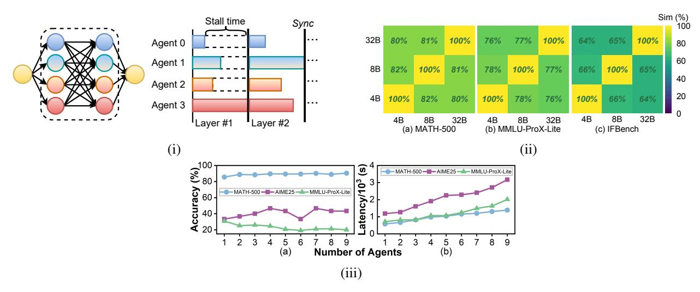

# Efficient Mixture-of-Agents Serving via Tree-Structured Routing, Adaptive Pruning, and Dependency-Aware Prefill-Decode Overlap

Zijun Wang1,∗ Yijiahao Qi2,∗ Hanqiu Chen1 Zishen Wan1 Gongjin Sun3 Dongyang Li3 Shuyi Pei3 Cong Hao1

1Georgia Institute of Technology, 2Peking University, 3Samsung Semiconductors, Inc. {zwang3547, hanqiu.chen, zishenwan, callie.hao}@gatech.edu

## ABSTRACT

Mixture-of-Agents (MoA) inference can suffer from dense inter-agent communication and low hardware utilization, which jointly inflate serving latency. We present a serving design that targets these bottlenecks through an algorithm-system co-design. First, we replace dense agent interaction graphs with a hierarchical tree topology that induces structured sparsity in inter-agent communication. Second, we introduce a runtime adaptive early exit mechanism that selectively terminates or skips downstream agent invocations using semantic agreement and confidence signals from intermediate outputs. Third, we pipeline agent execution by overlapping incremental prefilling with decoding across dependency-related agents, improving utilization and reducing inference latency. Across representative tasks, this approach substantially reduces end-to-end latency (up to 90%) while maintaining comparable accuracy (within ±1%) relative to dense-connectivity MoA baselines, and can improve accuracy in certain settings.

## 1 Introduction

Large language models (LLMs) are widely used across diverse natural language processing (NLP) tasks. A growing trend in agentic AI is to combine multiple LLMs with complementary strengths as different agents to enhance reasoning [\[1\]](#page-10-0). Among such LLM-based multi-agent paradigms, Mixture-of-Agents (MoA) is a powerful style that uses multiple LLMs (agents) as parallel proposers, each generating its own answer, and then uses an aggregator model to fuse these outputs into a final response. MoA has demonstrated strong empirical gains in reasoning, QA, and coding [\[2,](#page-10-1) [3,](#page-10-2) [4\]](#page-10-3). Although prior works [\[5,](#page-10-4) [6,](#page-10-5) [7,](#page-10-6) [8,](#page-10-7) [9\]](#page-10-8) have demonstrated the promise and effectiveness of MoA-style multi-agent systems across tasks such as planning, problem solving, debate, critique, and adaptive team formation, two major challenges remain for improving MoA system performance at both the software and hardware levels.

1 Redundant connections among agents. Most existing MoA systems adopt an all-to-all agent connection topology, as illustrated in Fig. [1\(](#page-1-0)i). These MoA systems are typically organized into multiple layers, each containing several agents. Agents in adjacent layers are fully connected, with each agent receiving the outputs of all agents in the preceding layer. Although this connection topology intuitively preserves all information exchanged among agents, many of these connections do not transmit meaningful messages, thus may have limited contributions to the quality of the final output. As a result, intelligently orchestrating the connectivity structure and dynamically pruning unnecessary agent connections can not only substantially reduce redundant inter-agent communication for response time improvement, but also preserve the quality

∗The first two authors contributed equally to this paper.

Figure 1: (1) Conventional all-to-all connected MoA system. Layer synchronization for all agents leads to pipeline stall time, causing low inference efficiency. (2) Semantic similarity within clusters of 1st layer of the tree topology MoA. (3) The relationship between the number of agents, task accuracy and end-to-end latency using all-to-all connection.

of intermediate results so that downstream agents will not be overwhelmed by unnecessary, low-quality, or misleading information.

**2** Inefficient MoA system serving on hardware. The hardware inefficiency arises from two sources. First, the all-to-all agent connectivity widely used in existing MoA systems introduces substantial GPU poor computation resource utilization. As shown in Fig. 1(i), this is because each agent consumes outputs from all agents in the previous layer, and one layer's latency is determined by the slowest agent request. Second, existing LLM serving frameworks with prefill-decode (PD) disaggregation provide limited support for efficient MoA execution. They overlook both the heterogeneous latencies of different agents and their complex inter-agent data dependencies, treating the precursor agent's decoding and the successor agent's prefilling as strictly sequential operations rather than exploiting potential overlapping opportunities.

Motivated by these two challenges, in this paper, we present **Faster-MoA**, a unified *algorithm-system* co-design for efficient and low-latency MoA system serving. Our major contributions can be summarized as follows.

- **1** Topology innovation Hierarchical tree structure for agents connection. Instead of the conventional all-to-all connectivity in MoA systems, we propose a novel hierarchical tree topology with two key features. Agents within each layer are grouped into clusters, and each agent in the next layer connects only to a specific cluster for localized information aggregation. The number of agents in the next layer matches the number of clusters in the previous layer. This structure enables efficient local aggregation followed by global aggregation, producing high-quality outputs while avoiding the redundant information exchange in fully connected designs.
- 2 Algorithm innovation Semantic-guided run-time dynamic early-exit. Different tasks exhibit varying levels of difficulty, requiring different numbers and sizes of LLM agents. To dynamically prune unnecessary inter-agent connections at run time based on output similarity and confidence, we introduce a novel agent-level early-exit (EE) mechanism. This mechanism evaluates the semantic similarity and confidence of intermediate outputs from small-LLM agents on the fly. When these small-size agents produce sufficiently high-quality outputs, we prune the connections to the large-LLM agents and proceed to the next layer's inference without waiting for them to finish. This strategy can largely reduce the GPU idle time for waiting.
- **3** System innovation Agent dependency-aware incremental prefilling for PD overlapping. To further improve hardware efficiency, we overlap decoding and prefilling stages of agents with data dependencies.

We divide precursor agent's decoding phase into smaller sub-stages and, after each sub-stage, immediately stream the generated tokens to the successor agent for prefilling. This increases the overlap between decoding and prefilling computations for higher GPU resource utilization.

4 Evaluation. We evaluate the performance of Faster-MoA on five popular benchmarks with model deployment on NVIDIA H200 GPUs. In comparison with baseline all-to-all connected MoA systems, Faster-MoA achieves 73% to 90% decrease in end-to-end (E2E) latency with similar (only ±1% variation) or even higher task accuracy.

## 2 Preliminary and Related Works

#### 2.1 Topology of MoA Systems

MoA instantiates an ensemble of proposer agents whose generations are fused by an aggregator agent, sometimes over multiple layers. In such agent organization, the definition of agent dependency between proposer and aggregator agents is defined as follows. Let o1, o2, o3 denote the generated texts from three distinct proposer agents A1, A2, A3, all connecting to an aggregator agent Aagg, then the input prompt S(Aagg) of the aggregator agent is assembled by:

$$S(A_{\text{agg}}) = \cup (S_{\text{prefix}}, o_1, o_2, o_3, S_{\text{suffix}})$$

where Sprefix and Ssuffix are the prefix and suffix prompts. This "output fusion" behavior is the core of agent dependency, and also the root cause of many workflow inefficiencies. As we mentioned in Sec. [1,](#page-0-0) many prevailing MoA debating systems [\[5,](#page-10-4) [10,](#page-10-9) [11\]](#page-11-0) adopted an all-to-all topology, which means each aggregator agent in the subsequent layer is connected to *all* agents in the previous layer, just like fully-connected layer in neural networks. However, the effectiveness and contribution of one agent to its successor agent remains unexplored, and the E2E latency of such system is very high [\[10\]](#page-10-9). Besides, as presented in Fig. [1\(](#page-1-0)i), the slowest agent request always determines the latency of one layer, slowing down the entire system with low GPU utilization because of the stall time. Therefore, dynamically pruning agent dependencies to keep and transfer only important information based on intermediate outcomes becomes an essential and vital topic. Although recent works [\[8,](#page-10-7) [12,](#page-11-1) [13\]](#page-11-2) have shown great potential in on-the-fly LLM active agent selection and collaborative agent communication pruning, they still ignore the hardware and system efficiency by only focusing on task accuracy. Drawn by these insights, we introduce a hierarchical tree-structured agent topology (Sec. [4.1\)](#page-4-0) and a semantic-informed, run-time dynamic agent-level early-exit (EE) mechanism (Sec. [4.2\)](#page-5-0), both of which significantly improve hardware efficiency while maintaining task accuracy comparable to all-to-all connectivity.

### 2.2 PD Disaggregation in LLM Serving

In modern LLM serving infrastructures, a single user inference request is typically decomposed into a *prefill* stage and a *decode* stage, which are often mapped to distinct sets of GPUs and executed asynchronously. Recent works [\[14,](#page-11-3) [15\]](#page-11-4) have demonstrated that this PD disaggregation yields both high throughput and substantial flexibility in capacity planning. In particular, the two-stage decomposition naturally enables tasklevel pipelining: once a request completes its prefill stage and enters decode stage, the prefilling of the next request can immediately begin on the prefill engine, thereby overlapping computation and improving hardware utilization. However, this pipeline implicitly assumes that *each request's input is independent of all others*, i.e., one request's prompt does not depend on another request's generated output. This assumption fails in MoA systems, where in most cases agent requests need to follow certain dependencies, causing one request cannot start to prefill until all dependent results from previous agents are collected. As a result, naive PD disaggregated MoA serving is forced into a largely sequential schedule, where a dependent agent's prefill must wait until all necessary upstream results are fully materialized, severely limiting potential overlap.

To our best knowledge, existing LLM serving frameworks do not explicitly address agent dependencyaware orchestration under PD disaggregation in MoA settings. Motivated by this gap, we propose an agent dependency-aware prefill–decode overlapping mechanism (Sec. [4.3\)](#page-6-0) that exploits the key-value (KV) handoff boundary between stages to partially hide the prefilling cost of dependent agents behind their precursors' decoding.

