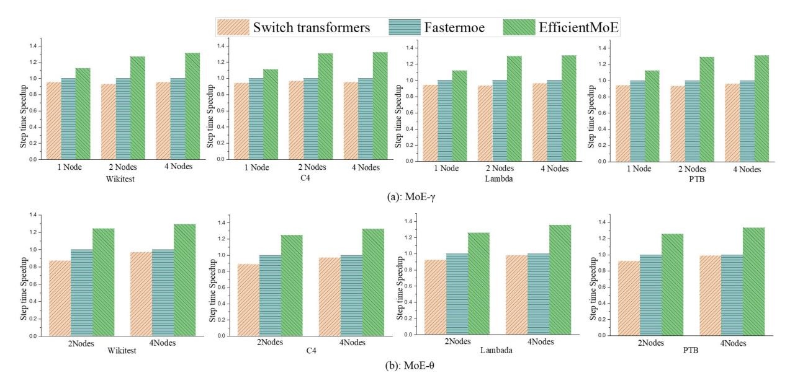
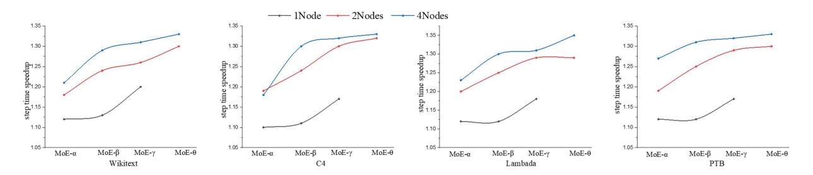
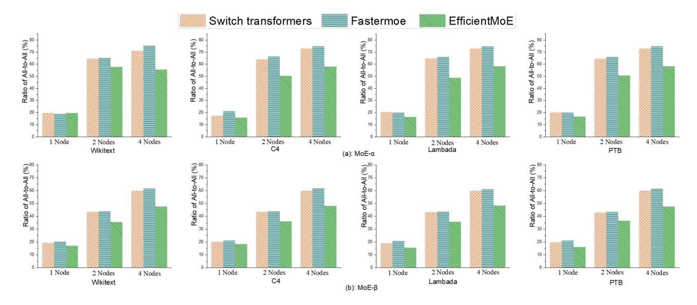
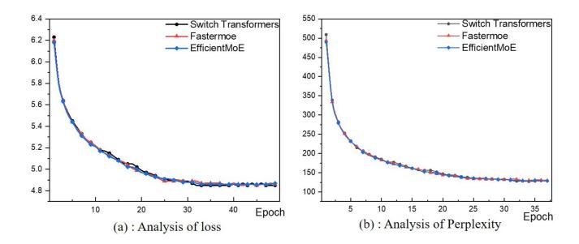
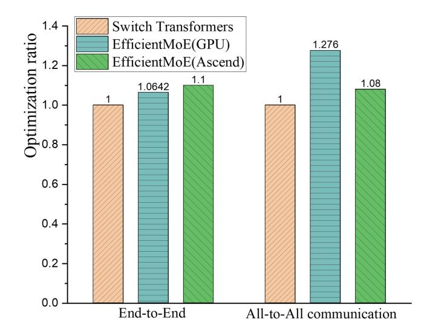

# *A. Experiment Setup*

- *1) Hardware & Software:* Experiments on an Ascend cluster with 4 nodes including 32 Ascend 910 AI accelerators [\[30\],](#page-10-0) and a GPU cluster with one node including eight NVIDIA V100. The clusters were built on a Linux 4.15.0-123-generic operating system, and each node had eight accelerators with 32 GB of memory. The Ascend 910 was equipped with a 100 GB/s RoCE, and the V100 was equipped with a 300 GB/s NVLink. Efficient-MoE trains the MoE model utilizing MindSpore2.0 and Mindformers1.0. Mindformers is a powerful, comprehensive, and full-flow development suite for large model training, inference, and deployment. It has training methods, inference algorithms, and deployment methods. Mindformer is an efficient tool that enables the rapid implementation of multiple parallel strategies.
- *2) Models:* GPT-MoE model was chosen to verify the effectiveness and scalability of EfficientMoE; the models are listed in Table III. The parameters of the GPT-MoE models were expanded from 2.3 billion to 21 billion, and the experiment used typical batch sizes and numbers of experts for each model.
- *3) Datasets:* As the data distribution has a significant influence on load balancing and All-to-All communication of MoE models, four types of datasets were chosen, including Wikitext [\[31\],](#page-10-0) Colossal Clean Crawled Corpus(C4) [\[32\],](#page-10-0) Lambada [\[33\],](#page-10-0) and Penn Treebank(PTB) [\[34\]](#page-10-0) datasets, where are

TABLE III MODELS

| Models        | Size(Billion) | Number of experts | Layers |
|---------------|---------------|-------------------|--------|
| MoE-α         | 2.3           | 16                | 16     |
| MoE- $\beta$  | 7.4           | 32                | 20     |
| MoE- $\gamma$ | 10.4          | 32                | 32     |
| $MoE-\theta$  | 21            | 32                | 40     |

commonly used in NLP and machine learning, to verify their generalizability.

*Wikitext:* Wikitext is a dataset derived from Wikipedia and is used as a benchmark for language modeling and other NLP tasks. Wikitext-2 contains approximately 2 million words from curated Wikipedia articles, ensuring high-quality text is suitable for language modeling. It is typically used in language model training, evaluation, and text generation.

*C4:* The C4 is a large dataset created by scraping and cleaning web pages. It comprises hundreds of gigabytes of text and is filtered for quality and diversity. C4 is primarily used for largescale pretraining of language models, offering extensive topics and style coverage.

*Lambada:* The Lambada dataset tests language understanding by predicting the last word in a passage based on its context. It includes 10,022 passages, focusing on long-range dependencies. Lambada evaluated models for tasks that require deep context comprehension and coherent text generation.

*PTB:* The Penn Treebank (PTB) is a dataset from the Wall Street Journal corpus, annotated for syntactic structure. It includes approximately 1 million words and is used for partof-speech tagging, syntactic parsing, and language modeling. The PTB is valuable for tasks involving linguistic and syntactic predictions.

*4) Baselines:* Experimentally implemented Switch transformers [\[10\]](#page-10-0) and Fastermoe [\[14\]](#page-10-0) were used as the baseline for MindSpore, leveraging the operator migration for implementation. To achieve efficient MoE training, both models were configured using Data Parallelism (DP) = 16, Model Parallelism (MP) = 2, and Expert Parallelism (EP) = 16.

*Switch Transformers* [\[10\],](#page-10-0) originally developed by Google and based on the TPU [\[35\],](#page-10-0) were implemented using Mesh-TensorFlow [\[21\],](#page-10-0) which is a technique designed for static computational graphs. This approach assigns multiple experts across devices using expert parallelism and utilizes token-based routing to activate specific experts for each input. Switch transformers were reimplemented in the experiments on MindSpore by adapting their static graph operations, to MindSpore's operator execution environment.

*Fastermoe* [\[14\],](#page-10-0) in contrast, is a dynamic graph-based framework that achieves expert load balancing through dynamic shadow strategies. Fastermoe alleviates the load imbalance and communication challenges that often occur in MoE models. Fastermoe's dynamic graph logic was migrated to MindSpore's operator framework, and the expert capacity was fixed to fit the static graph mode.

Fig. 4. Speedup compare with Switch transformers and Fastermoe for static graphs.

Fig. 5. Speedup of EfficientMoE compared with Switch transformers with scaling of model parameters.

#### *B. Comparison With State-of-The-Art*

*1) End-to-End Speedup:* EfficientMoE evaluated the end-toend performance of EfficientMoE with GPT-MoE models on three different clusters. First, based on the four datasets for MoE-θ and MoE-γ, compared with Switch transformers and Fastermoe, EfficientMoE achieved 30% and 33% speedup in a cluster with four nodes, respectively, as shown in Fig. 4. As the nodes increased, the training speedup ratio of MoE-θ also increased from 12% to 30% compared with Switch transformers, indicating that EfficientMoE performed better for large models. Fig. 5 shows the speedup achieved by EfficientMoE compared with Switch transformers, based on four datasets for MoE-α, MOE-β, MoE-γ, and MoE-θ. With the increase in model parameter scale, EfficientMoE showed better performance, and the training effect of MoE was improved from 20% for MoE-α to 30% for MoE-θ. Finally, for the problem of MoE load imbalance caused by differences in datasets, EfficientMoE had similar effects on various datasets, demonstrating the generalization of EfficientMoE.

Notably, it was observed that Fastermoe was weaker than Switch transformers in end-to-end acceleration, which indicated that Fastermoe, as an MoE optimization training system based on dynamic graphs, was not suitable for static graphs.

*2) Optimization in All-to-All Communication:* The experiment used four datasets to train the MoE models and presented the communication optimization in three clusters. By comparing Fastermoe and Switch transformers, it was observed that EfficientMoE optimization was reflected in two aspects: (1) With an increase in cluster size, the communication optimization effect was improved; (2) the size of the model parameter affected the optimization of the communication.

The first phenomenon was analyzed based on four datasets and MoE-α and MoE-β, as shown in Fig. [6.](#page-8-0) By comparing one, two, and four nodes, it was observed that the communication optimization improved from 3.2% to 13.8%. This enhancement was attributed to the increased cluster size, which resulted in increased inter-node communication. As the cluster size increased, the distribution of tokens across multiple AI accelerators increased the necessity for All-to-All communication, thereby amplifying the effectiveness of our optimization strategy.

As shown in Fig. [7,](#page-8-0) this study analyzed the second phenomenon based on four datasets and three clusters and compared it with Switch transformers. By comparing with MoE-α, MOE-β, MoE-γ, and MoE-θ, it found that the communication optimization decreased from 20% to 7%. This reduction was due to the increase in computational demands associated with larger

Fig. 6. Optimization in All-to-All communication in scaling of the cluster.

Fig. 7. Optimization in All-to-All communication in scaling of model parameters.

Fig. 8. Speedup of EfficientMoE compared with Fastermoe.

model parameters, which led to a proportional increase in the need for synchronized communication.

The observed communication optimization improvements were due to the increased complexity of synchronizing larger model parameters and the greater inter-node communication requirements of larger clusters. These results validated the scalability and effectiveness of EfficientMoE for model parameter size variations and cluster size expansions.

*3) Optimizations in computation With Dynamic Capacity:* Based on four datasets and three clusters, EfficientMoE improved the training efficiency by up to approximately 35% compared to Fastermoe, as shown in Fig. 8. This was achieved by dynamically adjusting expert capacities, reducing the token loss for hot experts, and optimizing resource allocation. This demonstrates that EfficientMoE effectively addresses the expert capacity issue, achieving dynamic optimization of expert capacity without sacrificing accuracy. This, approach is particularly effective for large-scale cluster environments. As the cluster size increases, the benefits of EfficientMoE become more pronounced, making it well-suited for extensive distributed training.

Fig. 9. Accuracy and Perplexity of the MoE model.

Fig. 10. Performance Analysis of EfficientMoE between NVIDIA GPU and Ascend AI-accelerator.

#### *C. Correctness of EfficientMoE*

In this section, this study verified the effect of EfficientMoE on the correctness of the model. Fig. 9 verifies the correctness of Switch transformers, EfficientMoE, and Fastermoe, indicating that implementing Fastermoe based a static graph does not affect the performance of the model. Similarly, EfficientMoE does not affect the performance of the MoE model during the design process. The above verification is mainly reflected in two aspects; Figure (a) shows the correctness of the accuracy, and Figure (b) shows the correctness of Perplexity (PPL).

#### *D. Generality of EfficientMoE*

This study analyzed the generality of EfficientMoE across different hardware types, particularly on NVIDIA AI accelerators. Fig. 10 shows the optimizations achieved by EfficientMoE on V100 and Ascend 910, respectively, compared with the Switch transformers. Two phenomena were observed: 1) EfficientMoE achieved a 6.42% improvement in V100, which was less than the 10% improvement in Ascend 910. Because MindSpore is a deep-learning framework specifically designed for the Ascend AI-accelerator, EfficientMoE achieved a higher level of performance on the Ascend hardware. 2) EfficientMoE achieved a 27.6% improvement on V100, which was more than an 8%

Fig. 11. Distribution of experts and tokens in training of MoE models .

improvement on Ascend 910. Because the Ascend cluster has an inter-node bandwidth of only 100 Gbps, which is significantly less than the bandwidth of NVLink, V100 can achieve better communication results. This analysis highlighted the generality of EfficientMoE across multiple hardware, making it clear that its design is superior to that of Ascend, whereas other AI accelerators may require additional tuning to match the efficiency observed in the Ascend environment.

#### *E. Load Predication Model for EfficientMoE*

EfficientMoE distributes 4000 tokens in 20,000 steps and collects the expert selection for each token while training the MoE model of 16 experts to observe the actual popularity of the different experts, as shown in Fig. 11. Some iterations during training were sampled and visualized, and it was observed that the popularity of experts changed continuously throughout the training process over 20,000 iterations. Moreover, Efficient-MoE tested four different datasets: Wikitext, C4, Lambada, and PTB, and observed that different datasets led to different degrees of expert load, which would be beneficial for researchers to verify the effectiveness of EfficientMoE in dealing with different expert load cases. This study integrates this part of the visualization code into MindSpore for researchers to intuitively understand the token distribution when training MoE models at [https://gitee.com/mindspore/mindformers/blob/r1.0/](https://gitee.com/mindspore/mindformers/blob/r1.0/mindformers/modules/transformer/moe.py) [mindformers/modules/transformer/moe.py](https://gitee.com/mindspore/mindformers/blob/r1.0/mindformers/modules/transformer/moe.py)

