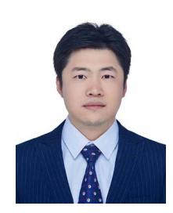

# VI. CONCLUSION

This study introduced and implemented EfficientMoE based on static computational graphs and MindSpore for MoE training. EfficientMoE analyzes the load and parameter characteristics of different experts and evaluates their loads through real-time sampling. It then dynamically schedules experts based on the expert load, converting token transfers into expert parameter transfers to reduce All-to-All communication. In addition, to improve the accuracy of the model and reduce the wastage of AI-accelerator resources, an expert capacity model was proposed to set appropriate expert capacity values for different types of experts. Experiments showed that EfficientMoE achieves an average improvement of 30% in end-to-end speedup, approximately 12% reduction in communication time, and saved 35% computational resources across different clusters, compared with Switch transformers and Fastermoe for static graphs. However, this study focused on load imbalance and communication optimization and did not consider the computational optimization of the token distribution, which includes considerable high-dimensional matrix multiplications. Future work will focus on improving the training time of MoE models.

## REFERENCES

- [1] A. Vaswani et al., "Attention is all you need," in *Proc. Adv. Neural Inf. Process. Syst.*, 2017, pp. 6000–6010.
- [2] M. Shoeybi et al., "Megatron-LM: Training multi-billion parameter language models using model parallelism," 2019, *arXiv: 1909.08053*.
- [3] J. Devlin, M.-W. Chang, K. Lee, and K. Toutanova, "BERT: Pre-training of deep bidirectional transformers for language understanding," 2018, *arXiv: 1810.04805*.
- [4] A. Dosovitskiy et al., "An image is worth 16x16 words: Transformers for image recognition at scale," 2020, *arXiv: 2010.11929*.
- [5] N. Parmar et al., "Image transformer," in *Proc. Int. Conf. Mach. Learn.*, PMLR, 2018, pp. 4055–4064.
- [6] T. Brown et al., "Language models are few-shot learners," in *Proc. Adv. Neural Inf. Process. Syst.*, 2020, pp. 1877–1901.
- [7] H. Touvron et al., "Llama 2: Open foundation and fine-tuned chat models," 2023, *arXiv:2307.09288*.
- [8] J. Lin et al., "M6: A chinese multimodal pretrainer," 2021, *arXiv: 2103.00823*.
- [9] R. A. Jacobs, M. I. Jordan, S. J. Nowlan, and G. E. Hinton, "Adaptive mixtures of local experts," *Neural Comput.*, vol. 3, no. 1, pp. 79–87, 1991.
- [10] W. Fedus, B. Zoph, and N. Shazeer, "Switch transformers: Scaling to trillion parameter models with simple and efficient sparsity," *J. Mach. Learn. Res.*, vol. 23, no. 120, pp. 1–39, 2022.
- [11] D. Dai et al., "DeepSeekMoE: Towards ultimate expert specialization in mixture-of-experts language models," 2024, *arXiv:2401.06066*. [Online]. Available:<https://arxiv.org/abs/2401.06066>
- [12] A. Q. Jiang et al., "Mixtral of experts," 2024, *arXiv:2401.04088*.
- [13] J. Achiam et al., "GPT-4 technical report," 2023, *arXiv:2303.08774*.
- [14] J. He et al., "Fastermoe: Modeling and optimizing training of large-scale dynamic pre-trained models," in *Proc. 27th ACM SIGPLAN Symp. Princ. Pract. Parallel Program.*, 2022, pp. 120–134.
- [15] J. Yao et al., "Exploiting inter-layer expert affinity for accelerating mixtureof-experts model inference," 2024, *arXiv:2401.08383*.
- [16] A. Paszke et al., "Pytorch: An imperative style, high-performance deep learning library," in *Proc. Adv. Neural Inf. Process. Syst.*, 2019, pp. 8024–8035.
- [17] S. Pal et al., "Optimizing multi-GPU parallelization strategies for deep learning training," *IEEE Micro*, vol. 39, no. 5, pp. 91–101, Sep./Oct. 2019.
- [18] B. Ginsburg, I. Gitman, and Y. You, "Large batch training of convolutional networks with layer-wise adaptive rate scaling," 2018.
- [19] Y. Huang et al., "GPipe: Efficient training of giant neural networks using pipeline parallelism," in *Proc. Adv. Neural Inf. Process. Syst.*, 2019, pp. 103–112.
- [20] D. Narayanan et al., "PipeDream: Generalized pipeline parallelism for DNN training," in *Proc. 27th ACM Symp. Operating Syst. Princ.*, 2019, pp. 1–15.
- [21] N. Shazeer et al., "Mesh-tensorflow: Deep learning for supercomputers," in *Proc. Adv. Neural Inf. Process. Syst.*, 2018, pp. 10435–10444.
- [22] S. Rajbhandari, J. Rasley, O. Ruwase, and Y. He, "Zero: Memory optimizations toward training trillion parameter models," in *Proc. Int. Conf. High Perform. Comput., Netw., Storage Anal.*, 2020, pp. 1–16.
- [23] S. Li et al., "Colossal-AI: A unified deep learning system for largescale parallel training," in *Proc. 52nd Int. Conf. Parallel Process.*, 2023, pp. 766–775.
- [24] D. Lepikhin et al., "GShard: Scaling giant models with conditional computation and automatic sharding," 2020, *arXiv: 2006.16668*.
- [25] J. Liu, J. H. Wang, and Y. Jiang, "Janus: A unified distributed training framework for sparse mixture-of-experts models," in *Proc. ACM SIG-COMM Conf.*, 2023, pp. 486–498.
- [26] J. Li, Y. Jiang, Y. Zhu, C. Wang, and H. Xu, "Accelerating distributed MoE training and inference with lina," in *Proc. USENIX Annu. Tech. Conf.*, 2023, pp. 945–959.
- [27] T. Gale, D. Narayanan, C. Young, and M. Zaharia, "MegaBlocks: Efficient sparse training with mixture-of-experts," in*Proc. Mach. Learn. Syst.*, 2023, vol. 5, pp. 288–304.
- [28] C. Hwang et al., "Tutel: Adaptive mixture-of-experts at scale," in *Proc. Mach. Learn. Syst.*, 2023, vol. 5, pp. 269–287.

- [29] Z. Cai et al., "TensorOpt: Exploring the tradeoffs in distributed DNN training with auto-parallelism," *IEEE Trans. Parallel Distrib. Syst.*, vol. 33, no. 8, pp. 1967–1981, Aug. 2022.
- [30] H. Liao et al., "Ascend: A scalable and unified architecture for ubiquitous deep neural network computing: Industry track paper," in *Proc. IEEE Int. Symp. High- Perform. Comput. Archit.*, 2021, pp. 789–801.
- [31] H. Dohrn and D. Riehle, "Design and implementation of the sweble wikitext parser: Unlocking the structured data of wikipedia," in *Proc. 7th Int. Symp. Wikis Open Collaboration*, 2011, pp. 72–81.
- [32] J. Dodge et al., "Documenting large webtext corpora: A case study on the colossal clean crawled corpus," 2021, *arXiv:2104.08758*.
- [33] D. Paperno et al., "The LAMBADA dataset: Word prediction requiring a broad discourse context," 2016, *arXiv:1606.06031*.
- [34] M. Marcus, B. Santorini, and M. A. Marcinkiewicz, "Building a large annotated corpus of English: The Penn Treebank," *Comput. Linguistics*, vol. 19, no. 2, pp. 313–330, 1993.
- [35] Y. E. Wang, G.-Y. Wei, and D. Brooks, "Benchmarking TPU, GPU, and CPU platforms for deep learning," 2019, *arXiv: 1907.10701*.
- [36] J. W. Rae et al., "Scaling language models: Methods, analysis & insights from training gopher," 2021, *arXiv:2112.11446*.
- [37] N. Shazeer et al., "Outrageously large neural networks: The sparsely-gated mixture-of-experts layer," 2017, *arXiv: 1701.06538*.
- [38] S. Rajbhandari et al., "DeepSpeed-MoE: Advancing mixture-of-experts inference and training to power next-generation AI scale," in *Proc. Int. Conf. Mach. Learn.*, PMLR, 2022, pp. 18332–18346.
- [39] M. Lewis, S. Bhosale, T. Dettmers, N. Goyal, and L. Zettlemoyer, "Base layers: Simplifying training of large, sparse models," in *Proc. Int. Conf. Mach. Learn.*, PMLR, 2021, pp. 6265–6274.

**Yan Zeng** received the PhD degree from the Institute of Software, Chinese Academy of Sciences, in 2016. She is currently an associate professor with the School of Computer Science, Hangzhou Dianzi University. Her research interests include distributed and parallel computing, distributed machine learning, and Big Data.

**Chengchuang Huang** is currently working toward the master's degree with Hangzhou Dianzi University. His research interests include distributed and parallel computing and distributed machine learning.

**Yipeng Mei** is working toward the master's degree with the School of Computer Science of Hangzhou Dianzi University. His research fields are distributed machine learning and distributed computing.

**Lifu Zhang** received the graduate degree from the Chongqing University of Posts and Telecommunications, in 2022. He is currently working toward the master's degree with Hangzhou Dianzi University, specializing in distributed machine learning.

**Teng Su** received the PhD degree from Zhejiang University, in 2010. He is a MindSpore hyper-scale AI technology leader with Huawei. He long-term engaged in large-scale distributed parallel basic software research and development. He has rich practical experience in the direction of large-scale distributed systems.

**Wenqi Shi** received the PhD degree from Tsinghua University. He is a Huawei MindSpore senior engineer. He engaged in deep learning framework research and development. His research interests include parallel training technology and cluster training inference performance optimization.

**Wei Ye** is currently working toward the master's degree with Hangzhou Dianzi University. He focuses on distributed machine learning and parallel computing.

**Shengnan Wang** reveived the PhD degree in electronic science and technology from Zhejiang University, HangZhou, China, in 2019. He is currently a chief engineer with Huawei Technologies Company, Ltd. His current research interest includes machine learning, natural language processing.