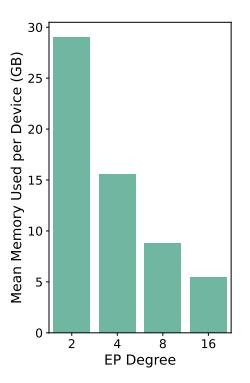
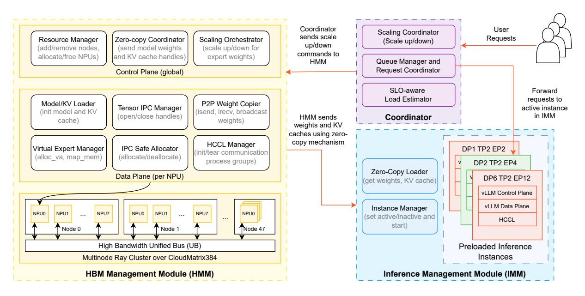

# 3 Opportunities and Key Insights

LLM serving systems deployed in production must elastically scale to handle dynamic and often unpredictable workloads while maintaining strict performance guarantees. However, current autoscaling strategies—both horizontal and vertical—fall short in several key areas. We highlight four core limitations that motivate the need for a more responsive and resource-efficient solution.

L1: High scaling latency. Existing systems lack the responsiveness needed to handle sudden, short-lived spikes in request load—a frequent pattern in production deployments [\[26\]](#page-14-1). The root cause is cold starting the new instance that undergo long boot-up sequences, including weight loading, memory allocation, and communication initialization, which together introduce scaling latencies of tens of seconds

- (a) Instance initialization latency.
- (b) Model memory usage.

**Figure 4.** Boot-up and memory analysis: (a) instance initialization latency breakdown, and (b) per-device memory consumption for model weights across EP degrees.

to minutes (Fig. 4a). This high provisioning inertia causes requests during traffic spikes to suffer SLO violations due to inadequate resources, directly harming end-user experience.

**Insight 1:** Booting up new instances adds substantial delays that worsens with model size and accelerator count; scaling must therefore avoid naive cold-starts to remain responsive.

L2: High downtime during scaling. Vertical scaling often requires tearing down the current instance before bringing up a new one, causing unavoidable service interruptions. During this transition, in-flight and incoming requests are dropped or delayed, leading to immediate SLO violations. Meanwhile, new requests continue to queue, creating a backlog that amplifies latency even after recovery and may require additional overprovisioning to drain. These cascading effects make traditional scaling unsuitable for environments with strict latency guarantees and continuous traffic.

**Insight 2:** Downtime during scaling is unacceptable for SLO compliance; scaling must therefore proceed concurrently while the active instance continues serving requests.

L3: Coarse scaling granularity. Large-scale MoE inference relies on extensive model parallelism, for example, a single DeepSeek V3 instance spans 32–320 accelerators across multiple nodes [4]. Horizontal autoscaling must launch entire replicas of this size, so even a modest increase in demand requires allocating a minimum of 32–320 accelerators. This coarse scaling granularity prevents incremental adjustments: small spikes force massive overprovisioning, lowering resource efficiency, and inflating cost.

**Insight 3:** Scaling must support fine-grained resource adjustment so that small load fluctuations can be handled without massive overprovisioning.

L4: Inefficient expert redistribution. In MoE models, expert layers dominate model size and are therefore distributed across accelerators using expert parallelism (EP) [11]. Naïve horizontal scaling replicates these experts in every new instance, effectively limiting the EP degree within each instance. This replication inflates memory consumption (Fig. 4b) and leaves less capacity for KV cache and activations, leading to smaller batch sizes, and degraded throughput (Fig. 1a. Furthermore, because each scaled instance operates in isolation, experts cannot be coordinated across instances. Without a unified token routing mechanism, load balancing [4, 22] across accelerators is impeded, further diminishing the efficiency gains of MoE sparsity.

**Insight 4:** Scaling solutions for MoE must allow flexible expert redistribution across accelerators to avoid parameter duplication and unlock efficient load balancing.

L5: High peak memory requirement. To prevent downtime, some vertical scaling approaches launch the new configuration alongside the existing one [18]. However, this raises the peak memory requirement during scaling that manifests in either of two ways. If the same accelerators are reused, they must temporarily hold two copies of the model, reducing space for KV caches and activations and risking OOM failures. Alternatively, launching the new configuration on additional accelerators avoids memory pressure but doubles resource consumption during the transition, inflating cost. Both approaches are inefficient—the first undermines stability, while the second sacrifices cost-efficiency.

**Insight 5:** Additional resources and high peak memory during scaling are undesirable; effective solutions must minimize peak memory by avoiding redundant allocation of model weights and KV caches on shared accelerators.

#### 4 ElasticMoE: System and Design

Following the above insights, we advocate for an *elastic scaling framework*, **ElasticMoE**, that enables fine-grained, low-latency, and zero-downtime scaling of MoE models in production. To achieve these goals, the system must satisfy several requirements: (i) enable fast transitions between configurations with minimal latency and memory overhead to remain responsive under bursty workloads; (ii) without using additional resources, support concurrent scaling while the active configuration continues serving requests, ensuring uninterrupted availability; and (iii) provide MoE-aware, fine-grained allocation and deallocation of resources, so that scaling preserves memory efficiency, runtime efficiency, and cost-effectiveness. Meeting these requirements introduces several intertwined **challenges**:

First, reducing scaling latency requires avoiding or minimizing costly boot-up tasks such as model initialization,

weight loading, and KV-cache setup. Achieving this is nontrivial, especially as these tasks are specific to the target configuration and are typically performed sequentially. Second, the system must continue serving requests while concurrently bringing up a new configuration. Coordinating execution and reconfiguration without using additional accelerators or high peak memory during scaling is particularly challenging when token routing or expert redistribution are involved. Finally, supporting fine-grained scaling requires major adjustments to the serving instance, like resharding model weights, adjusting parallelism degrees, etc. Doing this without restarting the entire instance or disrupting ongoing inference service is a major challenge.

#### 4.1 Design Choices

In this section, we present key design choices that allow ElasticMoE to scale efficiently and asynchronously, with minimal peak memory overhead, scaling latency, and MoEaware adaptability.

Scaling via DP and EP Reconfiguration. In MoE models, the model architecture combines shared attention layers with sparsely activated experts. Attention modules are typically partitioned with TP, while DP and EP determine the number of attention replicas and the distribution of experts across devices (see Section [2.1\)](#page-2-0). In ElasticMoE, TP is fixed during scaling so that attention modules and KV caches remain unchanged on accelerators already in use. This allows the new configuration to be brought up without disrupting the active instance, while preserving consistency in shared components. Because the common accelerators in both configurations retain the same layout, part of model weights (except expert layers) and KV caches can be directly reused instead of reallocated, avoiding peak memory pressure. Scaling is therefore achieved by adjusting only the DP and EP degrees, enabling incremental resizing of inference instances with low latency, avoiding disruption, and minimal overhead.

OS-level Asynchronous Process Management. To support concurrent inference and scaling, ElasticMoE uses a process-level isolation strategy. When a scale-up operation is triggered, a new inference process is launched with access to a superset of the original accelerators (i.e., both shared and newly added devices). This process performs initialization—including model loading on new devices and communication group setup—independently, while the original inference process continues to serve requests. Once the new instance is ready, traffic is rerouted, and the old process is terminated. This "scale-while-serve" model avoids service downtime and enables scaling to occur without blocking ongoing inference, even under bursty workloads.

Decoupled Memory and Execution Layers. ElasticMoE adopts a two-tier architecture that separates HBM management from inference execution. A dedicated memory management daemon is responsible for loading model weights and KV caches, maintaining them in device memory, and applying any reconfigurations. Execution processes, by contrast, never load weights or KV caches directly; instead, they obtain reference handles to the tensors managed by the memory daemon. This decoupling offers two main advantages. First, inference instances can be started or shut down without forcing reloads, since the memory state persists independently. Second, reconfiguration can be carried out efficiently and asynchronously: the daemon knows the current and the target configuration and can apply minimal changes to provision newly added devices, avoiding costly disk I/O and ensuring that active inference continues without disruption.

Fast Model Loading and KV Cache Initialization. As shown in Fig. [4a,](#page-3-0) naively loading model weights from disk during scaling is prohibitively expensive. ElasticMoE accelerates this process with two key techniques. First, devices shared between the old and new configurations reuse existing weight tensors and KV caches via zero-copy mechanisms, making scaling on these devices essentially free. Second, for newly added accelerators, ElasticMoE performs only the necessary peer-to-peer (P2P) transfers over high-bandwidth interconnects such as the Ascend Unified Bus or RDMAcapable links. The system explicitly plans scaling transitions to maximize zero-copy reuse and restrict weight transfers to the minimal required set of devices. Together, these optimizations eliminate redundant disk I/O, lower scale-up latency, and mitigate peak memory pressure during transitions.

Virtual Expert Management. Expert weights in MoE layers are stored as large contiguous tensors for kernel efficiency. During scaling, such as changing from EP=4 to EP=6, some experts must be migrated to new devices while the remaining on existing devices are rebuilt from a subset of the original experts. Naïvely reshaping these tensors requires allocating new contiguous buffers and copying large portions of data in memory, which both increases latency and creates high peak memory demand. ElasticMoE addresses this with a virtual memory abstraction that enables (1) expert reshaping. Experts are stored as non-contiguous pages in physical memory but are mapped into contiguous regions in virtual memory, satisfying kernel requirements while avoiding bulk copies. This allows experts to be remapped dynamically during scaling with minimal latency and without incurring memory pressure.

#### 4.2 System Overview

Fig. [5](#page-5-0) presents an architectural overview of ElasticMoE. The system is organized into three main components: the Coordinator, the HBM Management Module (HMM), and the Inference Management Module (IMD).

**Figure 5.** System architecture of ElasticMoE with three components: (i) persistent HMM for weight and KV-cache management, (ii) Coordinator for scheduling, SLO monitoring, and scaling, and (iii) IMM with transient preloaded but selectively activated instances. Zero-copy sharing and high-bandwidth transfers enable fine-grained, low-latency scaling without downtime.

The **Coordinator** serves as the entry point for user requests, routing queries to the active inference instance and orchestrating scaling decisions by coordinating the HMM and IMM. The HMM manages model weights and KV caches in device memory, separating costly initialization from inference execution. It loads weights once, maintains them persistently, and enables efficient scaling through zero-copy reuse and high-speed peer-to-peer transfers. The **IMM** runs inference, keeping multiple pre-initialized instances ready but activating only one at a time. It obtains model weights and KV caches for the active instance through zero-copy reference handles provided by the HMM. During scaling, the IMM prepares the target configuration while the current instance continues serving requests, ensuring uninterrupted service. In the following subsections, we describe these components in greater detail.

#### 4.3 Coordinator

It acts as the entry point for user queries and manages the overall control flow of *ElasticMoE*. It maintains an active request queue, monitors SLOs, and routes queries to the currently active inference instance. At initialization, the Coordinator prepares the runtime environment to ensure that scaling operations can be executed efficiently.

A key component of the Coordinator is the *SLO-aware Load Estimator*, which continuously tracks SLO attainment rates. When the estimator detects persistent violations (e.g., SLO attainment falling below 90%), it triggers a scale-up command; conversely, it can initiate scale-down to reduce overprovisioning during low-load periods. Once the target

configuration is ready, the Coordinator seamlessly redirects traffic from the old instance to the new one, ensuring uninterrupted service and stable request latency.

#### 4.4 HBM Management Module (HMM)

The HMM is the core of *ElasticMoE*, responsible for managing HBM initialization state operations like model weights and KV caches in device memory and decoupling these expensive operations from inference execution. It loads weights and initializes KV caches only once, keeps them persistently available, and reuses them across inference instances in IMM. During inference, HMM, shares the loaded model weights and KV caches to active instance in IMM. During scaling, HMM computes a scaling plan that allows reuse of HBM state on shared accelerators and provisions new devices through high-speed peer-to-peer transfers, avoiding repeated disk I/O. This design minimizes redundant weight movement, reduces peak memory usage, and ensures that scaling transitions can be completed with minimal latency while inference continues uninterrupted.

HMM is organized into a *global control plane* and a set of *per-device workers*, both implemented on top of a distributed runtime (Ray). The control plane maintains cluster-wide state and coordinates scaling by tracking resources, distributing zero-copy references to active inference instance in IMM, and orchestrating when and how scaling actions occur. The per-device workers, each bound to a physical accelerator, carry out the actual data-plane operations: loading model weights and KV caches, managing inter-process memory handles using Ascend IPC, performing peer-to-peer weight

transfers using HCCL, and remapping experts during EP reconfiguration. More details about these operations are explained in § [4.6.](#page-6-0) Communication between the control plane and workers is exposed through Ray primitives, enabling fine-grained, asynchronous operations on each accelerator under centralized coordination.

## 4.5 Inference Management Module (IMM)

The IMM is responsible for executing model inference using the weights and KV caches provided by the HMM. Unlike traditional systems where each instance must independently load weights and initialize caches, ElasticMoE allows IMM processes to attach to existing memory through zero-copy reference handles. This eliminates redundant initialization, reduces startup latency, and ensures that active instances can immediately begin serving requests with minimal overhead.

IMM maintains multiple inference instances but activates only one at a time. Idle instances can be pre-initialized on CPUs for anticipated configurations, kept in a standby state, and switched in with minimal delay when scaling is triggered. This design allows ElasticMoE to prepare a new configuration while the current one continues serving queries, avoiding downtime. Once the new instance is fully ready, the IMM seamlessly transitions user traffic to it and retires the old configuration.

Internally, the IMM provides two key functions. First, the Zero-Copy Loader retrieves model weights and KV caches from the HMM through reference handles, replacing the standard disk-based weight loader (DiskLoader) used in systems like vLLM. Second, the Instance Manager tracks the lifecycle of inference instances, marking them active or inactive, maintaining an LRU cache of standby instances, and orchestrating smooth handoff during scale-up or scale-down.

## 4.6 Low-level Primitives

ElasticMoE builds on a set of lightweight primitives that enable memory reuse, fast weight movement, and efficient expert redistribution across NPUs. These primitives are implemented in C++ within the HMM and IMM's data plane and exposed to Python via PyBind, forming the foundation for fine-grained, low-latency scaling. Below, we briefly describe the core APIs; more details are provided in Appendix [D.](#page-16-0)

zero-copy. Enables sharing of tensors across multiple processes using the Ascend IPC mechanism. Tensors are first allocated with an IpcSafeAllocator, which replaces Py-Torch's default TorchCachingAllocator and ensures allocations are IPC-compatible in device memory. The HMM exports handles via export\_handle, which the IMM can open through the open\_tensor primitive in the ZeroCopy-Loader. This eliminates redundant copies and reduces peak memory usage during scaling.

p2p-copy. Provides high-speed peer-to-peer transfers between devices using Ascend's HCCL collective communication library. As a one-time setup, the HMM initializes an HCCL domain across all devices and nodes with init\_ process\_group. During scaling, tensors are moved using HCCL directives such as isend, irecv, and broadcast. Transfers occur over the Ascend Unified Bus (or RDMA links), bypassing host memory and minimizing latency.

vpage-remap. Introduces a virtual memory abstraction in which expert weights are split into physical pages but exposed contiguously in virtual address space. Pages allocated with the MallocPhysical are grouped into a virtual range using alloc\_va, and mapped into this space with map\_mem. This enables (1) expert reshaping with minimal latency and peak memory overhead during EP reconfiguration.

