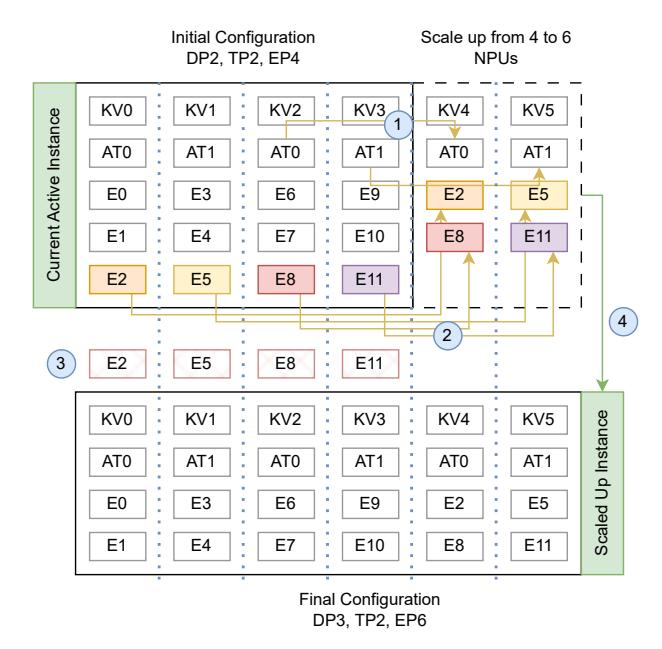

# 5 Elastic Inference Lifecycle

In this section, we describe the lifecycle of inference in ElasticMoE. We begin with the initialization process, where the system boots up and starts serving with the initial configuration. We then explain how the lifecycle evolves during a scale-up operation. For brevity, the corresponding details of a scale-down process is deferred to Appendix [E.](#page-18-0)

#### 5.1 Initialization

The initialization phase prepares both the HMM and IMM for fast, low-overhead scaling while ensuring the system can begin serving requests immediately.

Upon startup, the HMM loads the model weights and KV caches for the initial configuration from disk, persists them in device memory, and exposes them through the zero\_copy mechanism. The IMM then instantiates the active inference instance, which attaches to these tensors, and once connected begins receiving queries from the Coordinator and serving them. In addition, the IMM can pre-initialize a set of lightweight standby instances (kept in CPU memory only) for anticipated configurations. These instances are tracked in an LRU cache and remain ready to attach to the HMM's weights and KV caches on demand, saving significant initialization time during cold starting instances (see Fig. [4a](#page-3-0) for details).

To this end, each inference instance performs one-time setup tasks such as initializing workers, creating communication groups, and any preparations to bind to the HMMmanaged memory state. Only the active instance actually binds to HMM and receives requests from the Coordinator, while suspended instances wait in a ready-to-attach state, minimizing overhead yet allowing fast transition during scale-up or scale-down.

#### 5.2 Scale Up Operation

A scale-up operation in ElasticMoE dynamically expands the set of NPUs allocated to an active inference instance, allowing the system to meet higher request loads without

Figure 6. Scale-up lifecycle of HMM during reconfiguration from 4 to 6 NPUs. While the initial instance continues serving, (1) attention weights are copied to the new NPUs via HCCL P2P transfer (yellow arrows), (2) expert weights are migrated to the new NPUs, (3) redundant experts on old NPUs are removed, and (4) weights are zero-copied to activate the scaled-up instance.

downtime. This operation is jointly orchestrated by the Coordinator, the HMM, and the IMM, each contributing to a staged transition that ensures correctness, performance, and memory efficiency.

Consider a running instance using NPUs 0–3 under a configuration of DP2-TP2-EP4, and a scale-up request transitions the system to use NPUs 0–5 with a configuration of DP3-TP2-EP6. This process unfolds in the following steps:

Scale Command Issued. The process begins when the Coordinator receives a scale-up command, either triggered manually or via autoscaling logic in response to load metrics. It identifies the target configuration and initiates the scaling process by signaling both the HMM and IMM.

HMM Reconfigures Memory Layout. Upon receiving the scale-up trigger, the HMM first analyzes the current and target configurations to generate a minimal cost plan for weight redistribution. The objective is to maximize zero-copy reuse of existing weights and KV caches, while minimizing the relatively slower P2P transfers. The process is illustrated in Fig. [6.](#page-7-0)

Attention Weights: Since we keep the TP degree fixed during scaling, the attention layers retain their structural layout. This design choice ensures that the attention weights already

residing on NPUs 0–3 can be directly reused by the new inference instance via the zero-copy primitive. For newly added NPUs 4–5, attention weights are transferred in a P2P manner from NPUs 0-1 using the p2p\_copy primitive.

KV Cache: Similarly, the KV cache structure is also preserved across scale-up, due to the fixed TP configuration. This allows the new inference instance to obtain the existing KV cache directly from NPUs 0–3, without reinitialization. Crucially, this prevents memory duplication and avoids allocation spikes during the transition. While the new instance is being prepared, the original instance continues serving in-flight requests using the same existing KV cache. Once the new instance becomes active, it begins serving using this shared cache, allowing seamless handoff and zero service disruption. For NPUs 4,5, KV cache is initialized from scratch.

Expert Weights: When the EP degree changes during scaling, ElasticMoE performs a global remapping of experts to balance placement across NPUs while minimizing data transfer. Expert migration uses p2p\_copy for transferring weights to target devices and vpage\_remap to update virtual–physical mappings in place, eliminating the need to reallocate large contiguous buffers. Old mappings remain active on source devices until the new inference instance takes over, avoiding peak memory bloat and ensuring uninterrupted service.

IMM Prepares New Inference Instance. While the HMM is finalizing weight configuration, the IMM retrieves the corresponding inference instance from its LRU cache. If the instance does not yet exist (e.g., a 6-NPU configuration), it is booted in parallel and stored in the cache for future reuse.

The IMM prepares this instance up to the point of readiness but defers any weight loading or KV cache allocation. Instead, once the HMM signals readiness, the IMM performs zero-copy attachment of all shared weights and KV caches. At this point, the new inference instance is fully active and ready to serve.

Coordinator Performs Instance Switchover. Once both the HMM and IMM report that the scaled instance is fully initialized and ready, the Coordinator finalizes the handover. It stops routing new requests to the old instance but allows in-flight requests to finish execution. As soon as the old instance completes all pending queries, it is marked inactive, and all future requests are directed to the newly scaled-up instance.

This switchover is seamless and incurs zero downtime from the perspective of end users. Because both the old and new inference instances share the same memory layout (via zero-copy) and the same KV cache, request latency and batch sizes remain stable throughout the transition.

