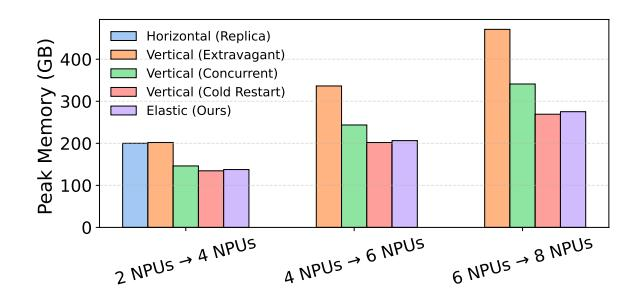
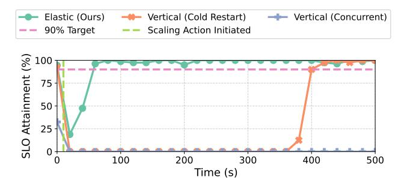

# 7 Evaluation

We evaluate ElasticMoE against state-of-the-art baselines along five dimensions. First, we measure scaling efficiency (§ [7.4\)](#page-9-0). Second, we analyze SLO recovery after scaling (§ [7.5\)](#page-9-1). Third, we evaluate SLO attainment under varying request rates (§ [7.6\)](#page-10-0). Finally, we perform ablations to quantify component contributions (§ [7.7\)](#page-10-1). Additional experiments, including throughput during scaling (§ [A.1\)](#page-15-0) and scale-down latency (§ [A.2\)](#page-15-1), are provided in the appendix.

#### 7.1 Experimental Setup

We evaluate the performance of our system under a controlled synthetic workload. The synthetic dataset consists of fixed-length input/output (IO) sequences, enabling deterministic evaluation of scaling behavior. This setup allows for precise measurement of system responsiveness and resource utilization under repeatable conditions. Experiments are conducted in an online (SLO-focused) and offline (throughputfocused) modes. To simulate diverse production-like scenarios, we vary request rates across fixed, variable, and patterned load profiles.

For our experiments, we used the Huawei CloudMatrix384 supernode [\[30\]](#page-14-0), which integrates 384 Ascend 910C accelerators and 192 Kunpeng CPUs across 24 nodes. Each node contains 16 Ascend 910C accelerators (64 GB HBM each) and 4 Kunpeng 920 CPUs with 1.5 TB of system RAM. All CPUs and accelerators are interconnected through the Unified Bus (UB), an ultra-high-bandwidth peer-to-peer fabric that offers non-blocking, all-to-all connectivity with near-uniform intra-node and inter-node communication. This tightly coupled design allows CloudMatrix384 to operate as a single large-scale logical node, enabling efficient large-model inference with fine-grained parallelism strategies such as TP and EP.

## 7.2 Models and Baselines

We conduct experiments using three state-of-the-art language models: DeepSeekV2 Lite, a 16B-parameter Mixture-of-Experts (MoE) model with 64 routed experts and 6 activated per token; Qwen3-30B-A3B, a 30.5B-parameter MoE model with 128 experts and 8 activated per token; and DeepSeek V3, a 671B-parameter MoE model with 256 routed experts per layer, of which 8 are activated per token, designed for efficient inference and enhanced reasoning capabilities.

Further, we compare ElasticMoE against four baselines, implemented on top of vLLM [\[10\]](#page-12-7). To cover both scaling paradigms, we include one horizontal and four vertical approaches.

- Horizontal (Replica): Launches a new instance as an independent replica on additional accelerators. The old instance continues serving while the new one initializes, ensuring no downtime. However, scaling occurs only in fixed quanta, so even the smallest scaling step effectively doubles the accelerator count.
- Vertical (Cold Restart): Stops the old instance and restarts a new one with the expanded configuration. For example, scaling from 4 to 6 requires exactly 6 accelerators in the final setup, but the system incurs downtime while the old instance is terminated and the new one initializes.
- Vertical (Extravagant): Starts the new instance on fresh accelerators in parallel with the old one. For example, scaling from 4 to 6 requires 10 accelerators in total (4 old + 6 new). This avoids downtime but increases cost by reserving extra accelerators.
- Vertical (Colocated): Starts the new instance on the same accelerators as the old one. For example, when scaling from 4 to 6, the new instance launches on 6 accelerators but reuses the same 4. During scaling, those 4 accelerators must temporarily host two copies of model weights and KV caches, creating high peak memory pressure. To prevent OOM, the KV cache must be reduced in advance, degrading performance.

## 7.3 Metrics

In order to comprehensively compare various scale-up approaches, we test various baselines on two classes of metrics.

Scaling Metrics: These metrics capture the responsiveness and overhead of the system as it reacts to changing load.

- Scaling Latency: Time taken from the scale-up command being issued to the new instance being ready to serve.
- Downtime: Interval during scaling when no inference instance (old or new) was available to serve requests.
- Peak Memory Usage: Maximum memory (across all involved NPUs) used during a scaling event.

Performance Metrics: These metrics evaluate the overall serving quality and efficiency of the system post-scaleup.

Figure 7. Scale-up latency comparison across baseline methods for three MoE models. The x-axis indicates scaling configurations, represented as source  $\rightarrow$  destination NPU transitions, corresponding to fixed step size for (a) and (b), and progressively larger steps for (c). In all cases, ElasticMoE consistently achieves substantially lower latency than competing baselines.

- *TTFT* (*Time-To-First-Token*): The elapsed time between a request being submitted to the system and the delivery of the first output token to the user.
- *TPOT (Time-Per-Output-Token)*: The average time taken to generate each output token, excluding the first token.
- *SLO Attainment*: The proportion of requests that satisfy predefined SLOs, such as thresholds on TTFT and TPOT, for example TTFT  $< \alpha$  and TPOT  $< \beta$ .
- *SLO / XPU:* Proportion of requests meeting SLO latency at a fixed RPS, normalized by the number of accelerators.

**Figure 8.** Scale-up peak memory across methods for DeepSeek V2 Lite.

#### 7.4 Scaling Efficiency

We evaluate the efficiency of *ElasticMoE* in scale-up operations by measuring scaling latency across different configurations. For DeepSeek V2 Lite and Qwen 30B-A3B, each step corresponds to a 2-NPU increase (e.g.,  $2\rightarrow4$ ,  $4\rightarrow6$ ). For DeepSeek V3, we also consider larger jumps of 2, 4, 8, and 16 NPUs to study scaling under more aggressive expansions.

Figure 7 summarizes the results. Subfigures (a)–(c) show scale-up latency for DeepSeek V2 Lite, Qwen 30B-A3B, and DeepSeek V3, respectively. The x-axis denotes source  $\rightarrow$  destination NPU transitions, while the y-axis reports the time to complete the transition. Notice that, only baselines that are feasible under each configuration are included: the

*Extravagant* baseline requires source+target NPUs and is omitted when exceeding available hardware, and the *Horizontal* baseline is feasible only when resources are doubled.

Across all settings, *ElasticMoE* consistently achieves much lower latency than competing methods. Its scale-up latency is only  $\approx 0.11 \times$  that of the best-performing baseline, yielding an improvement of approximately 80.9%. These gains arise from ElasticMoE's design, which combines pre-initialization of inference instances that eliminate cold-start overhead, along with zero-copy sharing of weights and KV caches, and fast peer-to-peer transfers that avoid redundant reloading. This allows scaling to complete rapidly while avoiding the cold restarts or redundant weight loading that dominate baseline costs.

Finally, Fig. 8 shows peak memory usage during scale-up on DeepSeek V2 Lite. *Horizontal* and *Vertical (Extravagant)* incur the highest footprints, since they allocate a full new instance in parallel with the old one. *Vertical (Cold Restart)* achieves the lowest as it tears down the old instance before starting the new one. ElasticMoE closely matches Cold Restart, only 2–3% higher due to live reconfiguration, yet avoids downtime. Compared to Extravagant scaling, it cuts peak memory by 35–40%.

#### 7.5 Performance Analysis

We now evaluate how different methods respond to autoscaling events by tracking SLO dynamics over time. Experiments are conducted on the *DeepSeek V2 Lite* model under synthetic workloads designed to induce scaling actions. At t=0, we increase or decrease request load such that the current configuration becomes unsustainable, forcing a scale-up or scale-down decision. Figure 9 reports results, with subfigures (a) and (b) corresponding to scale-up ( $4\rightarrow 6$  NPUs, target TTFT  $\leq 5.0$ s and TPOT  $\leq 1.5$ s) and scale-down ( $6\rightarrow 4$  NPUs, target TTFT  $\leq 2.0$ s and TPOT  $\leq 1.0$ s), respectively. The vertical dotted line indicates when the scaling command is issued

simultaneously across methods. Only relevant baselines are included and infeasible ones (e.g., horizontal) are omitted.

In Fig. 9a, all methods initially suffer degraded SLO attainment under rising load. ElasticMoE, however, recovers almost immediately after the scaling trigger and sustains compliance above the 90% target. In Fig. 9b, the workload decreases, and the system scales from 6→4 NPUs. Since overall demand is lower, all methods eventually meet SLO requirements. The key difference lies in cost efficiency, measured as normalized SLO attainment per NPU. ElasticMoE maintains high compliance while releasing resources almost immediately after the command, achieving the best SLO-per-NPU.

Overall, ElasticMoE scales up quickly to restore compliance under rising load and scales down smoothly to cut costs under lighter load, all without downtime. In contrast, baselines either suffer from degraded performance or waste resources. ElasticMoE's advantage stems from rapid response due to zero downtime and low scaling latency. By contrast, Vertical (Cold Restart) incurs long outages as the old instance is torn down before the new one initializes. Vertical (Concurrent) avoids downtime but remains unstable due to overlapping configurations that strain memory and reduce throughput.

(a) Scale-up from  $4\rightarrow 6$  NPUs. Under rising load, all methods initially drop, but ElasticMoE recovers quickly and sustains compliance.

**(b)** Scale-down from  $6\rightarrow 4$  NPUs. With reduced load, ElasticMoE achieves the best normalized SLO attainment by scaling down rapidly and preserving cost efficiency, unlike baselines.

**Figure 9.** SLO dynamics on *DeepSeek V2 Lite.* At t = 0, workload shifts make the current configuration unsustainable, triggering a scaling action (vertical dotted line).

#### 7.6 SLO Compliance Analysis

To assess each system's ability to maintain SLOs under increasing load, we use the *DeepSeek V2 Lite* model with a synthetic workload where RPS grows over time as rps(t) = f(t), simulating realistic traffic patterns. SLO thresholds are fixed (TTFT  $\leq$  1000 ms, TPOT  $\leq$  1000 ms), and all baselines begin with identical resources. A scale-up command is issued at a fixed time to emulate reactive autoscaling. Horizontal scaling is excluded due to infeasibility in this setup. The synthetic workload ensures deterministic behavior, with prompts of 2000 tokens and decode lengths randomly sampled between 500–750 tokens. This experiment reveals each system's resource efficiency and scaling responsiveness as load increases.

**Figure 10.** SLO compliance across increasing RPS levels for DeepSeek V2 Lite with a target TTFT  $\leq$  1000 ms, TPOT  $\leq$  1000 ms. Our method sustains higher SLO% across load conditions compared to other baselines.

Figure 10 reports the percentage of requests meeting SLOs (y-axis) as the RPS increases (x-axis). Our method consistently maintains compliance above the 90% threshold up to ~8.7 RPS, demonstrating both high goodput and robustness under rising load. In contrast, *Naive Cold Start* degrades steadily as the load increases, while *Concurrent Vertical* collapses almost immediately, with compliance dropping below 40% at just 1 RPS and approaching zero as load grows. These results reaffirm earlier conclusions: Naive Cold Start incurs downtime, and Concurrent Vertical sacrifices throughput due to memory constraints. In contrast, our approach eliminates both issues, achieving markedly higher SLOs across all loads.

#### 7.7 Ablation Analysis

To quantify the contribution of each design choice, we progressively disable ElasticMoE components (Table 1). We report scale time, downtime, and peak memory for a scale-up from DP3 $\rightarrow$ DP4; the corresponding results for scale-down event appear in Appendix A.3.

The progression reveals three insights. Removing the IPC-safe allocator slightly increases latency but see a significant raise in peak memory. Disabling HCCL P2P transfers

Table 1. Progressive ablation study of ElasticMoE on scaling from DP3→DP4. Components are disabled cumulatively from top to bottom: first IPC-safe allocator, then HCCL P2P copy, then pre-initialization, and finally zero-copy reuse. We report average results over 3 runs on Ascend 910C.

| Configuration     | Scale Time (s) | Down Time (s) | Peak Mem. (GB) |
|-------------------|-------------------|------------------|-------------------|
| ElasticMoE (full) | 2.43 ± 0.10       | 0                | 275.2             |
| – IPCAlloc        | 3.14 ± 0.21       | 0                | 290.0             |
| – HCCL            | 10.42 ± 1.03      | 0                | 290.0             |
| – PreInit         | 62.78 ± 1.82      | 0                | 290.0             |
| – ZeroCopy        | 67.40 ± 1.65      | 67.40 ± 1.65     | 290.0             |

causes an order-of-magnitude slowdown, confirming their importance for fast device provisioning. Eliminating preinitialization or zero-copy reuse further degrades performance: scale-up latency exceeds 60s, and without zero-copy, downtime is introduced as weights and KV caches must be duplicated complicating reuse.

Overall, ElasticMoE's efficiency and zero-downtime scaling rely on the combined effect of memory-efficient allocation, high-bandwidth P2P transfers, pre-initialization, and zero-copy reuse.

Figure 11. Latency breakdown of ElasticMoE scale-up (Qwen 30B-A3B, 12→16 NPUs). Warmup dominates total time, while data movement and zero-copy reuse add negligible overhead.

We now present the latency breakdown of ElasticMoE during scale-up, shown in Fig. [11.](#page-11-1) The majority of time is spent in model warmup (≈4.2s), whereas P2P transfers, zerocopy weight mapping, and KV-cache reuse only account for a couple of seconds in total. This indicates that the core reconfiguration mechanisms impose minimal overhead. In practice, we assume the target configuration has already been pre-initialized by the IMM, which can anticipate demand and preload nearby configurations. Under this assumption, warmup becomes the dominant cost. If pre-initialization is not available, additional time for full instance preinitialization (on CPU) must be included, which can be significant, as highlighted earlier in Fig. [4a.](#page-3-0)

