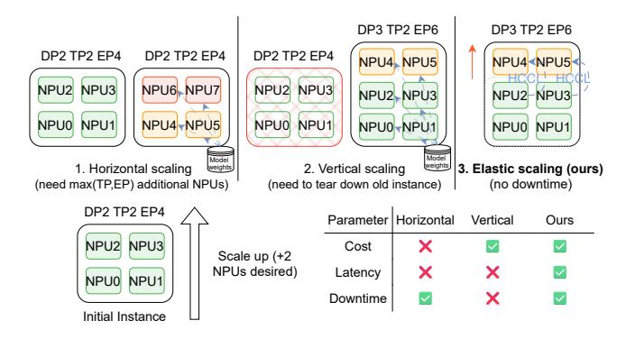
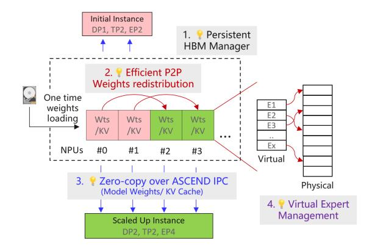

# ElasticMoE: An Efficient Auto Scaling Method for **Mixture-of-Experts Models**

Gursimran Singh\* Huawei Technologies Canada

Cheng Chen Huawei Technologies Canada

Yu Zhang Huawei Technologies China

Timothy Yu\* Huawei Technologies Canada

Hanieh Sadri Huawei Technologies Canada

Ying Xiong Huawei Technologies Canada

Zhenan Fan† Huawei Technologies Canada

Haley Li Huawei Technologies Canada

Qintao Zhang Huawei Technologies China

Yong Zhang† Huawei Technologies Canada

## **Abstract**

Mixture-of-Experts (MoE) models promise efficient scaling of large language models (LLMs) by activating only a small subset of experts per token, but their parallelized inference pipelines make elastic serving challenging. Existing strategies fall short: horizontal scaling provisions entire replicas of the current configuration, often tens to hundreds of accelerators, leading to coarse granularity, long provisioning delays, and costly overprovisioning; vertical scaling offers finer adjustments but typically requires instance restarts, incurring downtime. These limitations make current approaches illsuited for the bursty, short-lived traffic patterns common in cloud deployments.

We present ElasticMoE, an elastic scaling framework for MoE LLMs that achieves fine-grained, low latency, and zerodowntime scaling. ElasticMoE decouples inference execution from memory operations, enabling scaling steps to proceed concurrently with serving. An HBM Management Module (HMM) reuses weights and KV caches via zero-copy remapping, while high-bandwidth peer-to-peer transfers bring newly added accelerators online without interrupting service. A virtual memory-based expert redistribution mechanism migrates MoE experts without costly buffer reallocations, reducing peak memory usage during expert parallelism reconfiguration.

Our evaluation on Ascend NPUs with three popular MoE LLMs shows that ElasticMoE achieves up to ≈9X lower scaleup latency, up to  $\approx 2X$  better throughput during scaling, and results in significant improvement in SLO attainment compared to baselines. By enabling fine-grained, concurrent scaling with minimal disruption, ElasticMoE advances the practicality of deploying massive MoE LLMs in dynamic cloud environments.

the number of devices.

(a) Achievable throughput given (b) Hardware required to achieve a desired goodput.

Figure 1. ElasticMoE (proposed) achieves better goodput (in terms of RPS) (a) and requires less hardware (b) due to more granular and flexible scaling for MoE models.

## Introduction

Mixture-of-Experts (MoE) models, such as DeepSeek V3 [13] and Owen variants [24, 25], have emerged as a compelling architecture for growing parameter counts without proportional compute cost. By activating only a subset of experts per token, MoE models significantly reduce per-inference computation while preserving the expressive power of massive parameter counts. This efficiency advantage has fueled their adoption in enterprise automation, code generation, and conversational AI, where state-of-the-art performance must coexist with practical serving costs.

However, serving large models in cloud environments poses unique challenges. Cloud workloads often exhibit highly variable and bursty request patterns [9], which means that serving systems must balance two competing objectives: sustaining high Service Level Objective (SLO) attainment and minimizing infrastructure cost. Achieving these goals requires the ability to adapt rapidly to fluctuating demand by scaling resources up during traffic spikes and scaling down during idle periods to avoid waste.

\*Equal Contribution.

†Corresponding authors (<yong.zhang3, zhenan.fan1>@huawei.com).

Figure 2. Comparison of scaling methods. Horizontal scaling adds a full replica, requiring coarse-grained capacity increases. Vertical scaling resizes an instance but requires cold restart incurring downtime. ElasticMoE scales in place, avoiding both inefficiency and downtime.

Current autoscaling strategies are dominated by horizontal scaling (scale-out/scale-in), which provisions or decommissions independent inference pipelines, each representing a full model instance spread across many accelerators. While simple to orchestrate, this approach has several drawbacks. First, it is coarse-grained. Scaling requires adding or removing a fixed quantum of accelerators. For example, even a minimal DeepSeek V3 inference instance may span 32 accelerators [\[4\]](#page-12-2), making finer adjustments infeasible. As a result, modest increases in traffic often force substantial overprovisioning, driving up infrastructure cost as shown in Fig. [1b.](#page-0-0) Second, instance startup sequences, such as container instantiation, model weight loading, communication setup, and KVcache allocation can take tens of minutes for large models, which introduces significant scaling latency. This inertia prevents timely responses to short-lived traffic bursts, degrading SLO attainment during those periods. Finally, independently scaled instances in MoE models replicate expert-layer parameters, which dominate the model size [\[4,](#page-12-2) [11,](#page-12-3) [20\]](#page-13-2). This redundancy wastes memory that could otherwise be used for activations or KV-cache, lowering throughput and SLO efficiency as shown in Fig. [1a.](#page-0-0)

In contrast, vertical scaling (scale-up/scale-down) adjusts the resource footprint of an existing inference instance by adding or removing only a few accelerators—for example, scaling from 32 NPUs to 34 NPUs. While more fine-grained, naïve approaches lack support for live reconfiguration. They typically require tearing down the current instance and restarting it with the new configuration, incurring downtime and cold-start latency. Other methods attempt to launch the scaled-up instance concurrently on the same accelerators, but this creates peak memory spikes as old and new instances temporarily coexist. Both approaches undermine the benefits of elastic scaling in cloud environments, where

downtime or memory pressure during reconfiguration can further exacerbate SLO violations.

These trade-offs are illustrated in Fig. [2,](#page-1-0) which shows horizontal scaling's coarse granularity and high cost with vertical scaling's downtime and high latency. To cope with these limitations, production systems often adopt conservative fallback policies such as static overprovisioning or aggressive cooldown timers. These reduce the frequency of autoscaling events but at the cost of resource inefficiency and sluggish adaptation. Such rigidity is particularly problematic under bursty or short-lived traffic patterns, where effective scaling must be fast, precise, and minimally disruptive.

Figure 3. Key innovations of ElasticMoE: (i) decoupled HBM management from inference, (ii) zero-copy reuse of weights and KV-caches along with high-speed P2P transfers for reconfiguration, and (iii) virtual expert managemnt.

Our approach: This paper introduces ElasticMoE, a system for elastically serving large-scale MoE models that enables low-latency, fine-grained, and zero-downtime vertical scaling in production. ElasticMoE builds on three key ideas, summarized in Fig. [3.](#page-1-1)

First, ElasticMoE decouples inference execution from memory management tasks such as model weight loading and KV-cache setup. At its core is a memory manager for the high bandwidth memory (HBM) called the HBM Management Module (HMM), which manages model weights and KV-caches independently of inference instances. Instances do not allocate these resources directly but instead receive the corresponding "pointers" in HBM via Ascend's IPC mechanism [\[1\]](#page-12-4). This decoupling allows the HMM to reconfigure asynchronously during scaling, enabling the active instance to continue serving requests without interruption.

Second, ElasticMoE performs scaling in place while minimizing expensive weight movements and memory reallocations. Specifically, it adjusts data parallel (DP) and expert parallel (EP) degrees while keeping tensor parallel (TP) fixed. This design reduces inter-accelerator weight transfers and allows KV-caches on existing devices to be reused, ensuring

uninterrupted inference. Reconfiguration is further accelerated by high-bandwidth peer-to-peer (P2P) transfers using Ascend's HCCL [\[2\]](#page-12-5), resulting in low-latency scale-up.

Finally, ElasticMoE employs a virtual memory and pagebased expert weight management mechanism that supports dynamic MoE expert reconfiguration. By treating expert weights as a contiguous logical tensor mapped to underlying pages, experts can be remapped in place without large buffer reallocations or full weight copies. This approach lowers scaling latency, peak memory pressure, and preserves throughput stability during scaling.

Contributions. We make the following contributions:

- 1. Elastic scaling framework for MoE models. We design ElasticMoE, a novel system that incrementally resizes inference instances by adding or removing NPUs, enabling fine-grained vertical scaling beyond the coarse granularity of horizontal approaches.
- 2. Novel mechanisms for efficient scaling. ElasticMoE introduces several novel techniques: (i) decoupled memory and inference management, (ii) low-overhead reconfiguration using zero-copy sharing and high-bandwidth P2P transfers, and (iii) virtual expert management for efficient redistribution of MoE experts. Together, these mechanisms minimize scale-up latency, avoid downtime, and reduce peak memory overhead.
- 3. Prototype and evaluation. We implement ElasticMoE on a Huawei CloudMatrix384 supernode [\[30\]](#page-14-0) and evaluate it on three large MoE LLMs across two workload settings. Results show substantial improvements in scaling latency (≈9X better), memory usage, and throughput stability ( ≈2X better) compared to horizontal and vertical scaling baselines, while consistently sustaining target SLOs.

