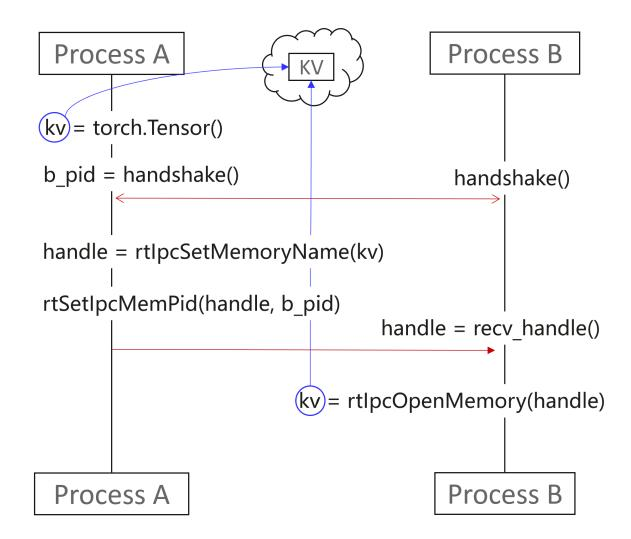
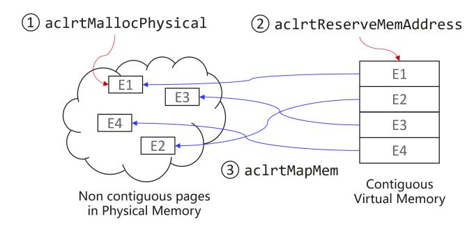

# D Implementation Details for Low-level Primitives

ElasticMoE implements a set of low-level memory and communication primitives within the HMM and the IMM to enable fine-grained, low-latency scaling with minimal peak memory overhead. These primitives provide the foundational mechanisms for weight allocation, transfer, and sharing across NPUs, allowing the system to efficiently reuse model state and avoid redundant data movement during scale operations. Specifically, these allow to allocate, distribute, and share model weights and KV caches across NPUs efficiently. These are explained as follows:

## D.1 IPC-Compatible Tensor Allocation (**IpcSafeAllocator**)

To enable zero-copy memory sharing across processes, ElasticMoE overrides PyTorch's default memory allocator, Torch CachingAllocator, with a custom allocator designed for IPC-safe memory allocation. While the default allocator uses a device memory pool, the resulting allocations are typically managed as a single block, making them incompatible with inter-process communication (IPC) sharing.

In contrast, our IpcSafeAllocator directly allocates physical memory regions using hardware-specific APIs that mark the memory as IPC-compatible. We override core PyTorch allocation functions such as torch.ones(), torch.empty() and torch.full() to ensure that all model weights intended for sharing are allocated via this mechanism. This makes tensors accessible across processes and avoids the need for redundant copies during scaling transitions.

#### D.2 Direct Disk-to-NPU Weight Loading (**disk-copy**)

Naively using the accelerator device map functionality to load model weights may lead to same tensors (across different NPUs) being read and loaded from disk. This is suboptimal because the disk-to-NPU transfer is the slowest link in the data path, which typically stages tensors in host memory before moving them to device memory. Hence, we implement the disk-copy primitive that can read and load only a subset of tensors—selected by name, partition index (e.g., TP rank), or layer type—from disk to the target NPU. This ensures no tensor is loaded from disk more than once, minimizing the slow disk-to-NPU transfers. For example, in a DP2TP2EP4 configuration, only one DP instance's attention weights are read from disk; the other DP instance relies on faster P2P transfers without additional disk I/O.

Figure 13. Peer-to-Peer (P2P) copy process. The target NPU allocates memory via aclrtMalloc, after which data is transferred asynchronously using aclrtMemcpyAsync across NPUs over the Ascend Unified Bus or equivalent interconnect.

#### D.3 Fast Peer-to-Peer Tensor Transfer (**p2p-copy**)

To avoid costly disk I/O during scale-up, we define a highspeed peer-to-peer (P2P) transfers to move weights between

NPUs. The p2p-copy primitive uses the Ascend Unified Bus or similar high-bandwidth interconnects to achieve this transfer efficiently. Specifically, a target NPU receives the required weights from a source NPU via an asynchronous transfer initiated by the aclrtMemcpyAsync API. This operation involves allocating the destination tensor on the target device and performing direct memory-to-memory transfer, bypassing host memory entirely. Optionally, it can be started on a separate stream to avoid blocking existing computation and memory operations inside the current NPU context. Because P2P transfers are typically an order of magnitude faster than disk I/O, this primitive is the preferred method for weight propagation during scale-out.

## D.4 Zero-Copy Sharing Across Processes (**zero-copy**)

To support sharing or reference-copy of a memory across independent processes, we implement a zero-copy primitive that allows a tensor allocated in a source process to be shared with a newly spawned destination process, effectively passing a reference without any memory duplication. Speficailly, this is achieved by exporting the tensor memory handle via rtIpcSetMemoryName() and whitelisting the destination process using rtSetIpcMemPid(). The handle is transmitted through an IPC channel (e.g., a UNIX domain socket), and the receiver imports the tensor using rtIpcOpenMemory(). The physical pointer is then wrapped into a PyTorch tensor using torch::from\_blob(). Because this process avoids any actual data transfer, it is significantly faster than P2P copying and helps reduce peak memory pressure on shared NPUs. It

Figure 14. Zero-copy process. A tensor allocated in Process A is shared directly with Process B without duplication. The memory handle is registered via rtIpcSetMemoryName and shared with the destination process through IPC. Process B imports it with rtIpcOpenMemory, allowing both processes to reference the same physical memory.

is the core mechanism that enables concurrent scaling and inference without service interruption.

Figure 15. Virtual page allocation and remapping process. The primitive first allocates non-contiguous physical pages via aclrtMallocPhysical, reserves a contiguous virtual address range with aclrtReserveMemAddress, and then maps the physical pages into the virtual space using aclrtMapMem. This enables kernels to access expert weights as if they were contiguous in memory while preserving flexibility in the underlying physical placement.

## D.5 Virtual Page Allocation and Remapping (**vpage-remap**)

To enable virtual memory–based expert weight management, ElasticMoE implements a primitive that allocates physical memory pages and binds them to a contiguous region in virtual address space. Using Ascend ACL memory APIs, the vpage-remap primitive first reserves the required contiguous virtual address range for all experts assigned to a device. It then allocates individual physical pages for each expert and binds them into the corresponding virtual offsets, allowing the logical layout to appear contiguous to kernels while the underlying physical placement remains flexible.

During scaling, when experts are migrated to or from a device, vpage-remap updates the virtual–physical mapping to point to the new pages—either locally allocated or received via p2p-copy—without reallocating or reshuffling the entire buffer. This remapping is performed asynchronously to allow the old inference instance to continue using the existing mappings until the new instance is fully activated. Once the transition completes, unused physical pages are unbound and released, minimizing peak memory usage.

#### D.6 Adding new nodes to HMM (**add-nodes**)

Dynamically expands the number of nodes and NPUs managed by the HMM at runtime. A new node is first joined to the Ray cluster using its standard scaling API. The existing HCCL process group is then torn down via destroy\_process\_ group, new Ray workers are launched for the added devices, and finally HCCL is reinitialized with init\_process\_ group over the enlarged device set. This allows ElasticMoE to elastically grow cluster resources without restarting the system.

