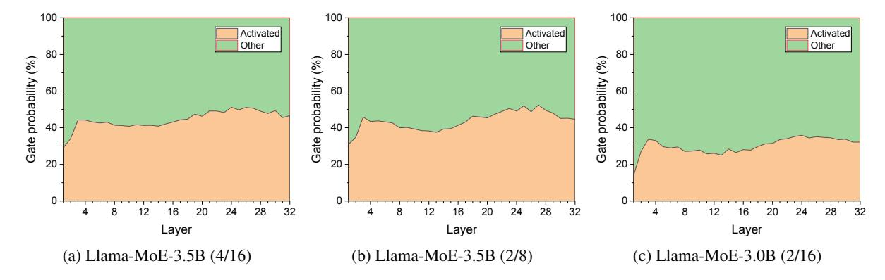
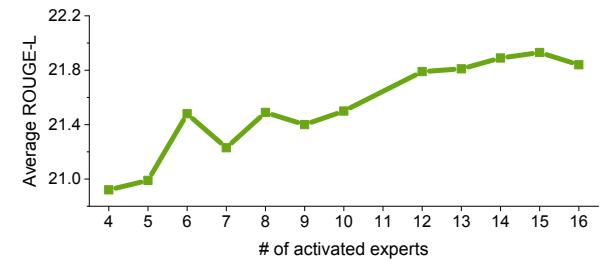
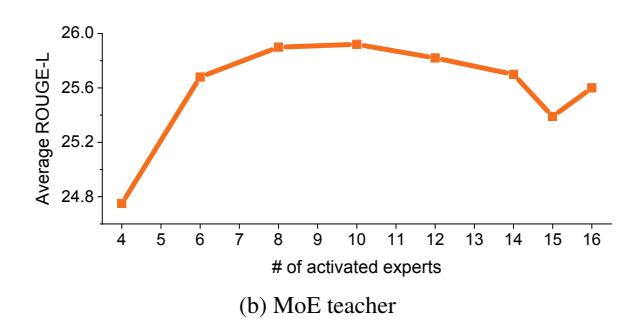
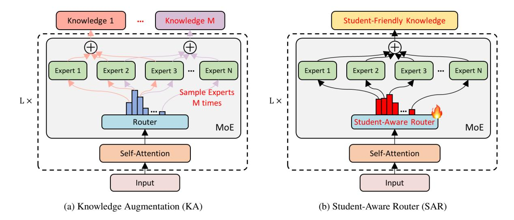
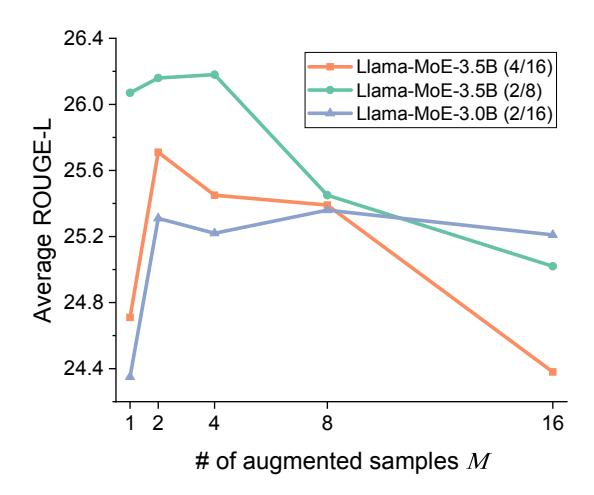
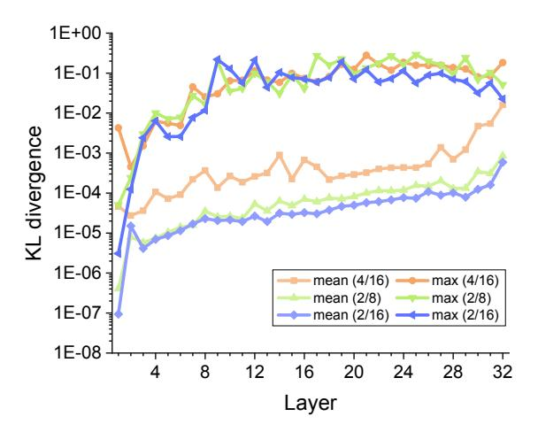

# Every Expert Matters: Towards Effective Knowledge Distillation for Mixture-of-Experts Language Models

Gyeongman Kim<sup>1</sup><sup>∗</sup> Gyouk Chu<sup>1</sup><sup>∗</sup> Eunho Yang1,2

<sup>1</sup>Korea Advanced Institute of Science and Technology (KAIST), South Korea <sup>2</sup>AITRICS, South Korea {gmkim, kyouwook, eunhoy}@kaist.ac.kr

## Abstract

With the emergence of Mixture-of-Experts (MoE), the efficient scaling of model size has accelerated the development of large language models in recent years. However, their high memory requirements prevent their use in resource-constrained environments. While knowledge distillation (KD) has been a proven method for model compression, its application to MoE teacher models remains underexplored. Through our investigation, we discover that non-activated experts in MoE models possess valuable knowledge that benefits student models. We further demonstrate that existing KD methods are not optimal for compressing MoE models, as they fail to leverage this knowledge effectively. To address this, we propose two intuitive MoE-specific KD methods for the first time: Knowledge Augmentation (KA) and Student-Aware Router (SAR), both designed to effectively extract knowledge from all experts. Specifically, KA augments knowledge by sampling experts multiple times, while SAR uses all experts and adjusts the expert weights through router training to provide optimal knowledge. Extensive experiments show that our methods outperform conventional KD methods, demonstrating their effectiveness for MoE teacher models.

## 1 Introduction

Mixture-of-Experts (MoE) architecture [\(Jacobs](#page-8-0) [et al.,](#page-8-0) [1991;](#page-8-0) [Shazeer et al.,](#page-9-0) [2017\)](#page-9-0) is one of the major contributing factors to the rapid advancements of Large Language Models (LLMs) [\(Jiang](#page-8-1) [et al.,](#page-8-1) [2024;](#page-8-1) [Team,](#page-9-1) [2024;](#page-9-1) [Liu et al.,](#page-9-2) [2024\)](#page-9-2). It allows the model to scale up while effectively improving the computational cost by utilizing only a subset of multiple experts during inference. Despite the advantages afforded by MoE architectures in scaling model capacity, several limitations persist. One such challenge is that it requires significant GPU memory compared to the dense model due to a number of non-active parameters. For this reason, the practical application of MoE models in resource-limited environments is generally challenging. Hence, research into effectively compressing recent large-scale MoE models becomes imperative, particularly for deployment in resourceconstrained environments.

One of the notable compression techniques is knowledge distillation (KD) [\(Hinton,](#page-8-2) [2015\)](#page-8-2). To facilitate student learning under teacher guidance, both the approach of using the teacher's output as supervised data [\(Kim and Rush,](#page-9-3) [2016;](#page-9-3) [Peng](#page-9-4) [et al.,](#page-9-4) [2023;](#page-9-4) [Fu et al.,](#page-8-3) [2023\)](#page-8-3) and the method to match the teacher's distribution with appropriate objective functions are widely adopted and actively researched. Specifically, concerning the second method, many works have focused on designing suitable objective functions [\(Wen et al.,](#page-10-0) [2023;](#page-10-0) [Ko](#page-9-5) [et al.,](#page-9-5) [2024;](#page-9-5) [Agarwal et al.,](#page-8-4) [2024;](#page-8-4) [Wu et al.,](#page-10-1) [2024\)](#page-10-1) or on using student-generated output [\(Lin et al.,](#page-9-6) [2020;](#page-9-6) [Gu et al.,](#page-8-5) [2024;](#page-8-5) [Agarwal et al.,](#page-8-4) [2024\)](#page-8-4). Indeed, several models have successfully employed KD in practice, such as Phi [\(Abdin et al.,](#page-8-6) [2024\)](#page-8-6) and Minitron [\(Muralidharan et al.,](#page-9-7) [2024;](#page-9-7) [Sreenivas](#page-9-8) [et al.,](#page-9-8) [2024\)](#page-9-8).

However, there has been no systematic development of KD methods specifically designed for the MoE teacher. Recent KD studies have largely overlooked scenarios where the model to be compressed is based on the MoE structure. While a few studies have applied KD to MoE teacher models [\(Artetxe et al.,](#page-8-7) [2021;](#page-8-7) [Fedus et al.,](#page-8-8) [2022;](#page-8-8) [Xue](#page-10-2) [et al.,](#page-10-2) [2022\)](#page-10-2), they have used the conventional KD and have not thoroughly explored the effectiveness or challenges of distilling knowledge from MoE. Therefore, these generalized approaches might not fully exploit the potential of MoE as a teacher.

In this paper, we introduce MoE-specific knowledge distillation, which can effectively distill knowledge from the MoE teacher. To design such

<sup>\*</sup> Equal Contribution.

a specialized mechanism, we first conduct an indepth analysis of MoE teacher during the basic KD process proposed by [Sanh](#page-9-9) [\(2019\)](#page-9-9). We found that even non-selected experts have a significant amount of potentially useful knowledge, which remains unutilized. Inspired by this observation, we propose two different intuitive solutions for effectively extracting knowledge from all experts (see Figure [3\)](#page-4-0). The first method, *knowledge augmentation* (KA), employs sampling multiple times to decide which experts to activate based on their gate probabilities. Through this approach, a student can be provided with a variety of augmented knowledge from a single input data. The second method, *student-aware router* (SAR), optimizes the router based on student feedback before distillation, enabling the router to determine optimal weights to aggregate knowledge from all experts.

We apply our two approaches to Llama-MoE [\(Zhu et al.,](#page-10-3) [2024\)](#page-10-3) models with five instruction datasets. Considering the common practice of employing KD in memory-constrained settings, we utilize a dense student Sheared-Llama [\(Xia et al.,](#page-10-4) [2023\)](#page-10-4) rather than a MoE student. The experimental results show that when the teacher model is MoE, our method consistently outperforms the existing KD baselines. Additionally, the analysis of KA confirms that having a moderate amount of augmented knowledge is indeed beneficial. Moreover, in SAR, we confirm that router updates in fact induce subtle changes in gate values, and these changes demonstrably enhance the performance of KD.

To summarize, our contributions are three-fold:

- We empirically found that non-activated experts from MoE teacher also possess knowledge that is of great benefit to a student, yet remains unexploited by existing methods.
- We propose two novel methods, knowledge augmentation (KA) and student-aware router (SAR), effectively utilizing the distributed knowledge from the entire experts. To the best of our knowledge, these are the first KD methods specifically designed for MoE teacher.
- We evaluate our framework on 5 instructionfollowing datasets. The result shows that KA and SAR outperform the existing KD methods, underscoring the effectiveness and importance of leveraging the architectural characteristics of MoE teacher.

## 2 Related Works

Knowledge distillation Knowledge distillation (KD) [\(Hinton,](#page-8-2) [2015\)](#page-8-2) is a prevalent model compression technique, transferring knowledge from a large teacher model to a small student model. Most of the early works focused on applying KD to the text classification tasks by imitating all the possible things of the teacher model, from output distribution [\(Song et al.,](#page-9-10) [2020;](#page-9-10) [Liang et al.,](#page-9-11) [2020\)](#page-9-11) to hidden states [\(Jiao et al.,](#page-9-12) [2020;](#page-9-12) [Sun et al.,](#page-9-13) [2019;](#page-9-13) [Park et al.,](#page-9-14) [2021b\)](#page-9-14), attention scores [\(Wang et al.,](#page-10-5) [2020\)](#page-10-5), and so forth. However, these methods relied on a fixed teacher that generates knowledge without being aware of the student's learning characteristics, which often limited its effectiveness. Thus, several methods are also devised to provide studentfriendly knowledge [\(Park et al.,](#page-9-15) [2021a;](#page-9-15) [Zhou et al.,](#page-10-6) [2022;](#page-10-6) [Ren et al.,](#page-9-16) [2023\)](#page-9-16).

On the other hand, various studies are actively examining its application to text generation tasks. The standard KD method minimizes the forward KL divergence between the output distributions of student and teacher at each time step [\(Sanh,](#page-9-9) [2019\)](#page-9-9) or directly trains the student with the generated text from the teacher [\(Kim and Rush,](#page-9-3) [2016;](#page-9-3) [Taori](#page-9-17) [et al.,](#page-9-17) [2023;](#page-9-17) [Chiang et al.,](#page-8-9) [2023;](#page-8-9) [Peng et al.,](#page-9-4) [2023\)](#page-9-4). Recently, MiniLLM [\(Gu et al.,](#page-8-5) [2024\)](#page-8-5) explores a method to mix the distribution of the teacher with that of the student and use a policy gradient approach by optimizing the reverse KL divergence. GKD [\(Agarwal et al.,](#page-8-4) [2024\)](#page-8-4) utilizes the studentgenerated on-policy data to receive feedback from the teacher with a generalized Jensen–Shannon (JS) divergence objective. DistiLLM [\(Ko et al.,](#page-9-5) [2024\)](#page-9-5) applies skew KL divergence with their proposed adaptive off-policy mechanism. Although these methods have shown remarkable results, all of the experiments have used dense models, and whether they also show good results for distilling the Mixture-of-Experts model has not yet been studied.

Mixture-of-Experts Mixture-of-Experts (MoE) [\(Shazeer et al.,](#page-9-0) [2017;](#page-9-0) [Lepikhin et al.,](#page-9-18) [2020;](#page-9-18) [Fe](#page-8-8)[dus et al.,](#page-8-8) [2022\)](#page-8-8) is an efficient way to increase the model size by replacing the feed-forward network (FFN) with multiple experts and a gating network. It dynamically activates different experts for each input token instead of using all parameters. Since it has been known that MoE provides advantages including more efficient training [\(He](#page-8-10) [et al.,](#page-8-10) [2022;](#page-8-10) [Gale et al.,](#page-8-11) [2023\)](#page-8-11) and faster inference

than a dense model of the same size, many models such as Mixtral (Jiang et al., 2024) and Deepseek-MoE (Dai et al., 2024) have introduced MoE or its variants, demonstrating remarkably strong performance. However, due to the disadvantage of high memory requirements, there have been some efforts to compress MoE into smaller dense models (Artetxe et al., 2021; Fedus et al., 2022; Xue et al., 2022; Guo et al., 2025). Nevertheless, they use the conventional KD (Sanh, 2019) or train on the teacher's output sentence directly. To the best of our knowledge, there has been no attempt to develop the KD specifically optimized for MoE teacher.

### 3 Preliminary

#### 3.1 Knowledge Distillation

KD minimizes the token-level distributional discrepancy between teacher and student. A standard approach to accomplish this minimization in the instruction-following setting is using the forward KL divergence (Sanh. 2019):

$$\mathcal{L}_{KD} = D_{KL}(p(\boldsymbol{y}|\boldsymbol{x}) \parallel q_{\theta}(\boldsymbol{y}|\boldsymbol{x})), \qquad (1)$$

where  $(x, y) \in \mathcal{D}$ ,  $\mathcal{D}$  denotes a dataset. x and y represent the request and response, respectively, and this objective guides the student to learn by minimizing the distributional discrepancy in the only response part. p and  $q_{\theta}$  denote the probability distributions of the teacher and student, respectively.

Recently, MiniLLM (Gu et al., 2024) and GKD (Agarwal et al., 2024) suggest using reverse KL divergence and student-generated sequences to address the exposure bias problem. The objective reflecting these is as follows:

<span id="page-2-1"></span>
$$\mathcal{L}_{\text{student}} = D_{KL} (q_{\theta}(\boldsymbol{y}|\boldsymbol{x}) \parallel p(\boldsymbol{y}|\boldsymbol{x})), \quad (2)$$

where  $(\boldsymbol{x},\cdot) \in \mathcal{D}$  and  $\boldsymbol{y} \sim q_{\theta}(\cdot|\boldsymbol{x})$ .

#### 3.2 Mixture-of-Experts

The sparse MoE layer consists of N expert networks  $\{E_1, \cdots, E_N\}$  and a router network G. The router first computes the gate logits  $H(x) \in \mathbb{R}^N$  for a single token representation x, which determines the likelihood of selecting each expert. After normalization with a softmax function, top k experts are selected based on this distribution, and their outputs are aggregated through a weighted sum. In this work, we only focus on the noisy Top-k gating introduced by Shazeer et al. (2017). This

gating adds trainable Gaussian noise before Top-k experts selection. The process can be described as follows:

$$H(x)_i = (x \cdot W_g)_i + \text{StandardNormal}() \cdot \\ \text{Softplus}((x \cdot W_{\text{noise}})_i),$$
 (3)

$$G(x) = \text{Softmax}(\text{KeepTopK}(H(x), k)),$$
 (4)

<span id="page-2-2"></span>
$$y = \sum_{i=1}^{N} G(x)_i E_i(x),$$
 (5)

where  $G(x)_i$  denotes the probability of *i*th experts being selected and

<span id="page-2-0"></span>
$$\text{KeepTopK}(v, k)_i = \begin{cases} v_i & \text{if } v_i \in \text{TopK}(v, k), \\ -\infty & \text{otherwise.} \end{cases}$$

The intrinsic characteristic of Top-k routing may lead to a scenario where certain experts are always favored in the selection process. In order not to negate the potential benefits of the MoE, distributing the workload across multiple experts to ensure their collective engagement is essential, which is called load balancing. The noise term in H(x) or the auxiliary loss as in Eq. (6) helps prevent the model from always relying on the same few experts, allowing a more balanced distribution of workload among experts. The auxiliary loss (Zhu et al., 2024) is as follows:

$$\mathcal{L}_{b} = CV(\boldsymbol{m})^{2} + CV(\boldsymbol{P})^{2}, \tag{6}$$

where  $\boldsymbol{m} \in \mathbb{R}^N$  represents the set of token counts assigned to each of the N experts within a batch, and  $\boldsymbol{P} \in \mathbb{R}^N$  denotes the set of summed probabilities assigned to each expert in the batch. The coefficient of variation (CV) is defined as the ratio of the standard deviation  $\sigma$  to the mean  $\mu$ , i.e.,  $CV(\boldsymbol{x}) = \sigma(\boldsymbol{x})/\mu(\boldsymbol{x})$ . Minimizing this encourages a more uniform distribution, which is desirable for balancing the expert load.

#### 4 Method

#### <span id="page-2-3"></span>4.1 Motivation

To investigate how the MoE teacher distills the knowledge during the classical KD process, we first analyze the distribution of gate probabilities. The gate probability refers to the normalized values of the gate logits H through the softmax function. The Top-k experts are selected based on these gate logits, and gate logits are also used to compute the weights during the weighted summation of expert

<span id="page-3-0"></span>

Figure 1: Sum of the gate probabilities for activated and non-activated experts per layer during distillation. The (k/N) after each model name indicates that k out of N experts are activated. Across most layers of all Llama-MoE models, the sum of gated probabilities of activated experts is less than 50%.

outputs. Therefore, the gate probability can be considered an indicator of how useful each expert is. In this section, we use Llama-MoE (Zhu et al., 2024) models as teachers and do the conventional KD (Sanh, 2019) into Sheared-Llama (Xia et al., 2023) model which is a dense model. The training data is a subset of Dolly (Conover et al., 2023), and we evaluate our model on five instruction datasets. For further details, please see the Section 5.1.

Figure 1 presents a visualization of the average of the sum of gate probabilities for used experts and that for unused experts in each layer across all training data during distillation. As shown in Figure 1, the sum of gate probabilities for the group of activated experts never exceeds 50% in most of the layers of all models. Although this may be an effect of the auxiliary loss for load balancing, considering that gate probability reflects how useful an expert is, it implies that a significant portion of potentially valuable knowledge from non-activated experts is not being leveraged. Thus, effective extraction and utilization of this unexploited knowledge could bring additional benefits to the student model during the distillation process, as more diverse and complementary knowledge would be incorporated into the learning.

To reflect this observation, we simply increase the number of selected experts k during the distillation process. Using the Llama-MoE-3.5B (4/16) model as the teacher model, we perform knowledge distillation by gradually increasing k from 4 to 16 and evaluate the performance of both the teacher and student models. The model performance is measured by the average ROUGE-L scores across five instruction-following datasets (Section 5.1 for more details). The results are shown in Figure 2.

Based on the results, we observe that using more

<span id="page-3-1"></span>

(a) Distilled student under MoE teacher



Figure 2: Performance of the MoE teacher model and the student model after distillation with varying numbers of utilized experts k (originally 4). As k increases, the effectiveness of distillation improves, leading to better student performance. However, the performance of the teacher model itself does not necessarily improve with a larger k.

experts does not necessarily increase the performance of the teacher, but it certainly increases the performance of the student, except when all are used. This suggests that the improvement in the student's performance is not directly due to the teacher's performance enhancement. Nevertheless, we observe that using most of the non-activated experts proves to be practically beneficial for the student, and this implies that non-activated experts hold valuable knowledge. The reason for this could be that during the MoE training process, due to load balancing, different sets of experts are activated for

<span id="page-4-0"></span>

Figure 3: An overview of our proposed KD methods specifically designed for the MoE. In knowledge augmentation, we either select the top N − 1 experts or sample N − 1 experts based on the gate probability. We do this M times to augment various knowledge. In student-aware router, we train the router network with student feedback before the distillation. It enables the router to determine the optimal weights, thereby facilitating the student's acquisition of knowledge from all experts.

```
Algorithm 1 : Knowledge Augmentation (KA)
Input: student model qθ, data distribution px,
  number of teacher forward M, training step K,
  learning rate η
  for each step k = 1, ..., K do
      Sample a request x from px
      Sample a response y from qθ(·|x)
      for each step m = 1, ..., M do
         Update θ ← θ − η∇Lstudent ▷ Eq. (2)
      end for
  end for
  return θ
```

the same input data, causing the knowledge to be distributed across multiple experts. However, conventional KD typically relies on using only the Top-k experts, which fails to account for this.

Therefore, the core challenge in knowledge distillation for MoE teacher lies in effectively extracting and transferring the knowledge that is distributed across all experts to empower student learning. Successfully addressing this challenge is the key to fully leveraging the architectural characteristics of MoE teacher models in guiding student models.

#### 4.2 Knowledge Augmentation

The first method to effectively utilize distributed knowledge across all experts is the knowledge augmentation (KA). Following the previous observa-

tion, we use N − 1 experts for each layer where N is the total number of experts. Specifically, in each MoE layer, N − 1 experts are selected by sampling from a gate probability distribution with probability λ. Therefore, by selecting the Top N − 1 experts with probability 1 − λ, we can consistently generate knowledge that is similar to the Top-k selection while incorporating slightly different knowledge. This strategy allows the augmentation of diverse knowledge and balances the trade-off between consistency and diversity of knowledge with parameter λ. The formulation of KA is as follows:

$$\mathbf{E} = \begin{cases} \text{Sampled } N - 1 \text{ experts} & \text{w.p. } \lambda, \\ \text{Top } N - 1 \text{ experts} & \text{w.p. } 1 - \lambda, \end{cases}$$

$$KA(v, \mathbf{E})_i = \begin{cases} v_i & \text{if } (i\text{th expert}) \in \mathbf{E}, \\ -\infty & \text{otherwise,} \end{cases}$$
 (7)

$$G^{KA}(x) = Softmax(KA(H(x), \mathbf{E})),$$
 (8)

where E denotes the set of selected experts.

In each iteration, the teacher is forwarded M times for the same input using the KA method, augmenting M pieces of knowledge, which are transferred to the student. Following GKD [\(Agar](#page-8-4)[wal et al.,](#page-8-4) [2024\)](#page-8-4), the response part y of the input is generated by the student, treating it as a pseudotarget, to mitigate exposure bias [\(Arora et al.,](#page-8-15) [2022\)](#page-8-15). Furthermore, the student's learning objective is the reverse KL divergence. We summarize the entire KA procedure in Algorithm [1.](#page-4-1)

### 4.3 Student-Aware Router

The second method is the student-aware router (SAR). Instead of merely selecting which experts to use, SAR takes a step further by directly optimizing the router to achieve an optimal weighted sum across all expert outputs. Inspired by the concept of student-friendly knowledge distillation, SAR updates the teacher's router using student feedback, ensuring that the generated knowledge is more useful to the student.

SAR undergoes two stages in each iteration: router update and knowledge distillation. First, the router weights, W<sup>g</sup> and Wnoise in Eq. [\(3\)](#page-2-2), are optimized using student feedback [\(Kim et al.,](#page-9-19) [2024\)](#page-9-19) and auxiliary loss for load balancing. Only the router components of the MoE teacher are updated, while all other parameters remain fixed. After updating the router, the modified router is used to generate knowledge, which is then distilled into the student. At this stage, all experts are activated, and their outputs are aggregated through a weighted sum based on the modified router.

Similar to KA, SAR also uses pseudo-targets generated by the student and trains the router using reverse KL divergence:

$$\mathcal{L}_{SAR} = D_{KL}(p(\boldsymbol{y}|\boldsymbol{x}) \parallel q_{\theta}(\boldsymbol{y}|\boldsymbol{x})) + \beta \mathcal{L}_{b}. \quad (9)$$

Here, β is a coefficient for the auxiliary loss, which is set to 0.01 following the teacher model [\(Zhu](#page-10-3) [et al.,](#page-10-3) [2024\)](#page-10-3). The entire SAR process is summarized in Algorithm [2.](#page-5-1)

### 5 Experiments

### <span id="page-5-0"></span>5.1 Experimental Setup

Settings Following [Gu et al.](#page-8-5) [\(2024\)](#page-8-5), databricks -dolly-15k [\(Conover et al.,](#page-8-14) [2023\)](#page-8-14) is partitioned into 14k samples for the training set, 500 samples for the validation and test sets, respectively. In addition to the test set of Dolly, we evaluate 4 extra instruction-following datasets: SelfInst [\(Wang et al.,](#page-10-7) [2023\)](#page-10-7), 252 user-oriented instruction-following samples, Vicuna [\(Chiang](#page-8-9) [et al.,](#page-8-9) [2023\)](#page-8-9), 80 questions used in the Vicuna evaluation, S-NI, 9k samples from the test set of SUPER-NATURALINSTRUCTIONS [\(Wang et al.,](#page-10-8) [2022\)](#page-10-8), and UnNI, randomly sampled 10k samples from the core set of UNNATURALINSTRUCTIONS [\(Hon](#page-8-16)[ovich et al.,](#page-8-16) [2023\)](#page-8-16). We adopt the ROUGE-L [\(Lin,](#page-9-20) [2004\)](#page-9-20) score as the evaluation metric.

#### <span id="page-5-1"></span>Algorithm 2 : Student-Aware Router (SAR)

```
Input: student model qθ, data distribution px,
  teacher's router Wg and Wnoise, training step K,
  learning rate η
  for each step k = 1, ..., K do
     Sample a request x from px
     Sample a response y from qθ(·|x)
     Update Wg ← Wg − η∇LSAR ▷ Eq. (9)
     Update Wnoise ← Wnoise − η∇LSAR
     Update θ ← θ − η∇Lstudent ▷ Eq. (2)
  end for
  return θ
```

Models To verify the effectiveness of proposed KD methods tailored for MoE, we need to compare the performance of KD from dense to dense with that from MoE to dense. For this comparison to be fair, dense teacher and MoE teacher should have comparable performances. This ensures that any performance improvements can be directly ascribed to the proposed method rather than the teacher's inherent capability. Additionally, the tokenizers of both models must be the same to compare token-level distributions.

<span id="page-5-2"></span>To satisfy the above critical conditions, we use three Llama-MoE [\(Zhu et al.,](#page-10-3) [2024\)](#page-10-3) models as the MoE teachers, Sheared-Llama [\(Xia et al.,](#page-10-4) [2023\)](#page-10-4) 2.7B as the dense teacher, and Sheared-Llama 1.3B as the dense student. Sheared-Llama 2.7B exhibits comparable performance to Llama-MoE model, with a lower number of activated parameters. Both teacher models and the student model were initially fine-tuned with the Dolly training set before knowledge distillation, following the previous works [\(Agarwal et al.,](#page-8-4) [2024;](#page-8-4) [Gu et al.,](#page-8-5) [2024\)](#page-8-5).

Baseline We compare our two approaches with three baselines: (1) supervised fine-tuning (SFT) directly fine-tunes the model on golden responses, which does not involve knowledge distillation; (2) KD [\(Sanh,](#page-9-9) [2019\)](#page-9-9) uses the teacher's distribution with forward KL divergence; (3) GKD [\(Agarwal](#page-8-4) [et al.,](#page-8-4) [2024\)](#page-8-4) uses the mixture of fixed data and on-policy student-generated outputs. Despite recent advancements and variants, GKD remains a representative study utilizing KL divergence or its variants and student-generated outputs, making it a suitable baseline for our experiment. Based on their reported performance, GKD computes reverse KL divergence with only student-generated outputs in this paper. For our methods, we set a sampling ratio

<span id="page-6-0"></span>

| Model                                            | Method     | Instruction-following datasets |          |        |       |       |         |
|--------------------------------------------------|------------|--------------------------------|----------|--------|-------|-------|---------|
| (Teacher →<br>Student)                           |            | Dolly                          | SelfInst | Vicuna | S-NI  | UnNI  | Average |
| Llama-MoE-3.5B (4/16)                            | SFT        | 26.20                          | 18.61    | 16.88  | 30.29 | 31.79 | 24.75   |
| Llama-MoE-3.5B (2/8)                             | SFT        | 26.39                          | 16.97    | 17.20  | 30.40 | 32.81 | 24.76   |
| Llama-MoE-3.0B (2/16)                            | SFT        | 26.35                          | 17.64    | 16.86  | 27.59 | 30.42 | 23.77   |
| Sheared-Llama-2.7B                               | SFT        | 26.07                          | 18.55    | 17.50  | 27.64 | 31.13 | 24.18   |
| Sheared-Llama-1.3B                               | SFT        | 23.83                          | 14.82    | 15.93  | 26.33 | 28.21 | 21.82   |
| Sheared-Llama-2.7B<br>→<br>Sheared-Llama-1.3B    | KD         | 24.68                          | 13.44    | 16.16  | 26.37 | 29.09 | 21.95   |
|                                                  | GKD        | 26.36                          | 16.67    | 18.20  | 29.09 | 34.12 | 24.89   |
|                                                  | KD         | 23.58                          | 13.82    | 15.25  | 24.59 | 27.37 | 20.92   |
|                                                  | GKD        | 25.86                          | 16.72    | 18.61  | 29.61 | 34.55 | 25.07   |
| Llama-MoE-3.5B (4/16)<br>→<br>Sheared-Llama-1.3B | ALL (Ours) | 26.03                          | 16.98    | 18.59  | 30.13 | 34.88 | 25.32   |
|                                                  | KA (Ours)  | 26.58                          | 16.98    | 18.38  | 30.51 | 36.11 | 25.71   |
|                                                  | SAR (Ours) | 26.32                          | 18.24    | 18.06  | 31.88 | 35.05 | 25.91   |
|                                                  | KD         | 23.07                          | 13.92    | 15.29  | 24.87 | 27.40 | 20.91   |
| Llama-MoE-3.5B (2/8)<br>→<br>Sheared-Llama-1.3B  | GKD        | 25.64                          | 15.54    | 18.29  | 29.11 | 32.80 | 24.28   |
|                                                  | ALL (Ours) | 26.40                          | 16.78    | 18.45  | 28.68 | 33.57 | 24.78   |
|                                                  | KA (Ours)  | 26.32                          | 17.30    | 17.11  | 32.49 | 37.58 | 26.16   |
|                                                  | SAR (Ours) | 26.30                          | 18.31    | 17.11  | 31.47 | 35.00 | 25.64   |
| Llama-MoE-3.0B (2/16)<br>→<br>Sheared-Llama-1.3B | KD         | 23.20                          | 13.51    | 15.01  | 23.85 | 26.92 | 20.50   |
|                                                  | GKD        | 25.43                          | 16.43    | 18.52  | 28.15 | 34.71 | 24.65   |
|                                                  | ALL (Ours) | 25.99                          | 15.05    | 18.06  | 29.15 | 33.55 | 24.36   |
|                                                  | KA (Ours)  | 26.06                          | 16.18    | 18.30  | 30.10 | 35.92 | 25.31   |
|                                                  | SAR (Ours) | 25.87                          | 17.39    | 17.84  | 31.20 | 34.92 | 25.44   |

Table 1: Evaluation results on five instruction-following datasets and their average, assessed using the ROUGE-L metric. Each reported score represents the average across five distinct random seeds. The best score for each case is highlighted in boldface.

λ = 0.05 and the number of augmented samples M = 2 in the KA method. To validate our observation on the MoE teacher, we exclude the router update stage from SAR and simply activate all experts. This approach is referred to as ALL. Further details on the experimental setup are summarized in the Appendix [A.](#page-10-9)

### 5.2 Results

We present the results of KA and SAR with baselines on 5 datasets in Table [1.](#page-6-0)

First, when comparing the SFT results of three Llama-MoE models, the performance is better when there are more activated experts with the same total number of experts. Also, if the total activated parameters are similar, the performance is also comparable. Note that the dense teacher Sheared-Llama-2.7B indeed shows a similar performance compared to MoE teachers.

Second, we compare the performance between dense and MoE teachers for the two baselines, KD and GKD. Surprisingly, despite the MoE teacher having performance that is similar to or even slightly better than the dense teacher, both methods demonstrate that the dense model serves as a better teacher for the student. For KD, the student trained by the dense teacher always outperforms the student trained by the MoE teachers. This holds true under GKD as well, except for the Llama-MoE-3.5B (4/16) case. These results highlight that the existing KD methods are not optimized for extracting knowledge from the MoE teacher.

Third, our proposed methods, knowledge augmentation and student-aware router, achieve higher performance than baselines when the teacher model is MoE. This result highlights that both methods are specifically designed for the MoE teacher. Therefore, when the teacher model is MoE, it is important to carefully consider the architectural characteristics of MoE and effectively extract knowledge that is distributed across all experts.

Lastly, the ALL approach, which simply activates all experts, outperforms the baselines in most cases but falls short of our proposed methods. This

<span id="page-7-0"></span>

Figure 4: Average performance of KA for a different number of samples, M, across all test data.  $\lambda$  is fixed at 0.05. For each MoE teacher, the best performing M differs. If M is too large, all models exhibit reduced performance.

result aligns with the observation in Section 4.1, suggesting that while non-activated experts contain useful knowledge, simply utilizing all of them may not be the optimal strategy. Furthermore, the comparison with SAR demonstrates the effectiveness of router updates.

The qualitative results of our methods and the baselines are summarized in Appendix C, demonstrating that our methods produce responses most closely resembling the ground truth.

#### 5.3 Analysis

Hyperparameters in KA We ablate various values of M, the number of augmented samples in KA. Figure 4 shows the performance for different numbers of samples, M. It indicates that the optimal M value varied across different models. Nevertheless, the appropriate value of M generally leads to beneficial augmentation. However, when M is excessively large, performance consistently degrades across all models. This is because too large values can lead to the generation of overly diverse knowledge for identical input due to the inherent randomness of sampling. Consequently, such excessive diversity can be detrimental to the overall performance, as it may introduce nonsense or unhelpful knowledge.

We also ablate various values of  $\lambda$ , the probability of randomly sampling experts. The results are in Appendix B.

**Shift of gate probability in SAR** In Table 1, we compared the results of ALL and SAR and verified that training the routers of MoE teacher is indeed

<span id="page-7-1"></span>

Figure 5: KL divergence of gate probabilities between original router and router trained with SAR method. The mean value is averaged over all tokens in training data. Consistently, KL divergence increases with layer depth.

helpful. For a more rigorous analysis, we examine the changes in the gate probability distribution that occurred as the router network learned to be more student-aware.

Figure 5 presents the layer-wise KL divergence of gate probabilities between the original teacher MoE and the teacher whose routers are trained with SAR. For all tokens of the training data, the maximum and average values are shown. For every teacher model, KL divergence increases with greater layer depth. The reason is that by learning the router in a student-friendly way, the modified gate probability affects the representation of the layer immediately following. This effect accumulates so that later layers have more different gate probabilities than the existing router. Eventually, these changes in gate probability have led to a more effective knowledge delivery to the student.

#### 6 Conclusion

In this paper, we first observe that non-activated experts in MoE teachers contain valuable knowledge that can benefit the student model. Based on this observation, we assert that existing KD methods are suboptimal for distilling MoE models, as they do not fully utilize all experts. To address this issue, we propose two MoE-specific KD methods for the first time: knowledge augmentation and student-aware router. Our experimental results show that our methods outperform the baseline, clearly demonstrating the effectiveness of our approach in leveraging the full potential of MoE teacher models.

## Limitations

We acknowledge the limitations arising from the rigorous experimental conditions. In addition to the common yet imperfect situation where teacher and student must use the same tokenizer, dense teacher and MoE teacher should have comparable performances. This condition is necessary to show that our method is an effective KD specialized for MoE. However, it is difficult to find a setup that satisfies these conditions other than the setting that we used in our experiment (Llama-MoE [\(Zhu et al.,](#page-10-3) [2024\)](#page-10-3) for the teacher and Sheared-Llama [\(Xia et al.,](#page-10-4) [2023\)](#page-10-4) for the student). We leave this for future work to explore, in conjunction with either emerging new methods [\(Boizard et al.,](#page-8-17) [2024;](#page-8-17) [Zhang et al.,](#page-10-11) [2024\)](#page-10-11) or by combining our method with existing ways [\(Xue et al.,](#page-10-2) [2022\)](#page-10-2).

## References

- <span id="page-8-6"></span>Marah Abdin, Jyoti Aneja, Hany Awadalla, Ahmed Awadallah, Ammar Ahmad Awan, Nguyen Bach, Amit Bahree, Arash Bakhtiari, Jianmin Bao, Harkirat Behl, et al. 2024. Phi-3 technical report: A highly capable language model locally on your phone. *arXiv preprint arXiv:2404.14219*.
- <span id="page-8-4"></span>Rishabh Agarwal, Nino Vieillard, Yongchao Zhou, Piotr Stanczyk, Sabela Ramos, Matthieu Geist, and Olivier Bachem. 2024. Generalized knowledge distillation for auto-regressive language models. In *The Twelfth International Conference on Learning Representations*.
- <span id="page-8-15"></span>Kushal Arora, Layla El Asri, Hareesh Bahuleyan, and Jackie Chi Kit Cheung. 2022. Why exposure bias matters: An imitation learning perspective of error accumulation in language generation. In *Findings of the Association for Computational Linguistics: ACL 2022*, pages 700–710.
- <span id="page-8-7"></span>Mikel Artetxe, Shruti Bhosale, Naman Goyal, Todor Mihaylov, Myle Ott, Sam Shleifer, Xi Victoria Lin, Jingfei Du, Srinivasan Iyer, Ramakanth Pasunuru, et al. 2021. Efficient large scale language modeling with mixtures of experts. *arXiv preprint arXiv:2112.10684*.
- <span id="page-8-17"></span>Nicolas Boizard, Kevin El Haddad, Céline Hudelot, and Pierre Colombo. 2024. Towards cross-tokenizer distillation: the universal logit distillation loss for llms. *arXiv preprint arXiv:2402.12030*.
- <span id="page-8-9"></span>Wei-Lin Chiang, Zhuohan Li, Zi Lin, Ying Sheng, Zhanghao Wu, Hao Zhang, Lianmin Zheng, Siyuan Zhuang, Yonghao Zhuang, Joseph E Gonzalez, et al. 2023. Vicuna: An open-source chatbot impressing gpt-4 with 90%\* chatgpt quality, march 2023. *URL https://lmsys. org/blog/2023-03-30-vicuna*, 3(5).

- <span id="page-8-14"></span>Mike Conover, Matt Hayes, Ankit Mathur, Jianwei Xie, Jun Wan, Sam Shah, Ali Ghodsi, Patrick Wendell, Matei Zaharia, and Reynold Xin. 2023. [Free dolly:](https://www.databricks.com/blog/2023/04/12/dolly-first-open-commercially-viable-instruction-tuned-llm) [Introducing the world's first truly open instruction](https://www.databricks.com/blog/2023/04/12/dolly-first-open-commercially-viable-instruction-tuned-llm)[tuned llm.](https://www.databricks.com/blog/2023/04/12/dolly-first-open-commercially-viable-instruction-tuned-llm)
- <span id="page-8-12"></span>Damai Dai, Chengqi Deng, Chenggang Zhao, RX Xu, Huazuo Gao, Deli Chen, Jiashi Li, Wangding Zeng, Xingkai Yu, Y Wu, et al. 2024. Deepseekmoe: Towards ultimate expert specialization in mixture-of-experts language models. *arXiv preprint arXiv:2401.06066*.
- <span id="page-8-8"></span>William Fedus, Barret Zoph, and Noam Shazeer. 2022. Switch transformers: Scaling to trillion parameter models with simple and efficient sparsity. *Journal of Machine Learning Research*, 23(120):1–39.
- <span id="page-8-3"></span>Yao Fu, Hao Peng, Litu Ou, Ashish Sabharwal, and Tushar Khot. 2023. Specializing smaller language models towards multi-step reasoning. In *International Conference on Machine Learning*, pages 10421–10430. PMLR.
- <span id="page-8-11"></span>Trevor Gale, Deepak Narayanan, Cliff Young, and Matei Zaharia. 2023. Megablocks: Efficient sparse training with mixture-of-experts. *Proceedings of Machine Learning and Systems*, 5:288–304.
- <span id="page-8-5"></span>Yuxian Gu, Li Dong, Furu Wei, and Minlie Huang. 2024. Minillm: Knowledge distillation of large language models. In *The Twelfth International Conference on Learning Representations*.
- <span id="page-8-13"></span>Daya Guo, Dejian Yang, Haowei Zhang, Junxiao Song, Ruoyu Zhang, Runxin Xu, Qihao Zhu, Shirong Ma, Peiyi Wang, Xiao Bi, et al. 2025. Deepseek-r1: Incentivizing reasoning capability in llms via reinforcement learning. *arXiv preprint arXiv:2501.12948*.
- <span id="page-8-10"></span>Jiaao He, Jidong Zhai, Tiago Antunes, Haojie Wang, Fuwen Luo, Shangfeng Shi, and Qin Li. 2022. Fastermoe: modeling and optimizing training of large-scale dynamic pre-trained models. In *Proceedings of the 27th ACM SIGPLAN Symposium on Principles and Practice of Parallel Programming*, pages 120–134.
- <span id="page-8-2"></span>Geoffrey Hinton. 2015. Distilling the knowledge in a neural network. *arXiv preprint arXiv:1503.02531*.
- <span id="page-8-16"></span>Or Honovich, Thomas Scialom, Omer Levy, and Timo Schick. 2023. [Unnatural instructions: Tuning lan](https://doi.org/10.18653/v1/2023.acl-long.806)[guage models with \(almost\) no human labor.](https://doi.org/10.18653/v1/2023.acl-long.806) In *Proceedings of the 61st Annual Meeting of the Association for Computational Linguistics (Volume 1: Long Papers)*, pages 14409–14428, Toronto, Canada. Association for Computational Linguistics.
- <span id="page-8-0"></span>Robert A Jacobs, Michael I Jordan, Steven J Nowlan, and Geoffrey E Hinton. 1991. Adaptive mixtures of local experts. *Neural computation*, 3(1):79–87.
- <span id="page-8-1"></span>Albert Q Jiang, Alexandre Sablayrolles, Antoine Roux, Arthur Mensch, Blanche Savary, Chris Bamford, Devendra Singh Chaplot, Diego de las Casas, Emma Bou Hanna, Florian Bressand, et al. 2024. Mixtral of experts. *arXiv preprint arXiv:2401.04088*.

- <span id="page-9-12"></span>Xiaoqi Jiao, Yichun Yin, Lifeng Shang, Xin Jiang, Xiao Chen, Linlin Li, Fang Wang, and Qun Liu. 2020. Tinybert: Distilling bert for natural language understanding. In *Findings of the Association for Computational Linguistics: EMNLP 2020*, pages 4163–4174.
- <span id="page-9-19"></span>Gyeongman Kim, Doohyuk Jang, and Eunho Yang. 2024. [PromptKD: Distilling student-friendly knowl](https://doi.org/10.18653/v1/2024.findings-emnlp.364)[edge for generative language models via prompt tun](https://doi.org/10.18653/v1/2024.findings-emnlp.364)[ing.](https://doi.org/10.18653/v1/2024.findings-emnlp.364) In *Findings of the Association for Computational Linguistics: EMNLP 2024*, pages 6266–6282, Miami, Florida, USA. Association for Computational Linguistics.
- <span id="page-9-3"></span>Yoon Kim and Alexander M Rush. 2016. Sequencelevel knowledge distillation. In *Proceedings of the 2016 Conference on Empirical Methods in Natural Language Processing*, pages 1317–1327.
- <span id="page-9-5"></span>Jongwoo Ko, Sungnyun Kim, Tianyi Chen, and Se-Young Yun. 2024. Distillm: Towards streamlined distillation for large language models. *arXiv preprint arXiv:2402.03898*.
- <span id="page-9-18"></span>Dmitry Lepikhin, HyoukJoong Lee, Yuanzhong Xu, Dehao Chen, Orhan Firat, Yanping Huang, Maxim Krikun, Noam Shazeer, and Zhifeng Chen. 2020. Gshard: Scaling giant models with conditional computation and automatic sharding. *arXiv preprint arXiv:2006.16668*.
- <span id="page-9-11"></span>Kevin J Liang, Weituo Hao, Dinghan Shen, Yufan Zhou, Weizhu Chen, Changyou Chen, and Lawrence Carin. 2020. Mixkd: Towards efficient distillation of large-scale language models. *arXiv preprint arXiv:2011.00593*.
- <span id="page-9-6"></span>Alexander Lin, Jeremy Wohlwend, Howard Chen, and Tao Lei. 2020. Autoregressive knowledge distillation through imitation learning. In *Proceedings of the 2020 Conference on Empirical Methods in Natural Language Processing (EMNLP)*, pages 6121–6133.
- <span id="page-9-20"></span>Chin-Yew Lin. 2004. Rouge: A package for automatic evaluation of summaries. In *Text summarization branches out*, pages 74–81.
- <span id="page-9-2"></span>Aixin Liu, Bei Feng, Bing Xue, Bingxuan Wang, Bochao Wu, Chengda Lu, Chenggang Zhao, Chengqi Deng, Chenyu Zhang, Chong Ruan, et al. 2024. Deepseek-v3 technical report. *arXiv preprint arXiv:2412.19437*.
- <span id="page-9-21"></span>I Loshchilov. 2017. Decoupled weight decay regularization. *arXiv preprint arXiv:1711.05101*.
- <span id="page-9-7"></span>Saurav Muralidharan, Sharath Turuvekere Sreenivas, Raviraj Bhuminand Joshi, Marcin Chochowski, Mostofa Patwary, Mohammad Shoeybi, Bryan Catanzaro, Jan Kautz, and Pavlo Molchanov. 2024. Compact language models via pruning and knowledge distillation. In *The Thirty-eighth Annual Conference on Neural Information Processing Systems*.

- <span id="page-9-15"></span>Dae Young Park, Moon-Hyun Cha, Daesin Kim, Bohyung Han, et al. 2021a. Learning student-friendly teacher networks for knowledge distillation. *Advances in neural information processing systems*, 34:13292–13303.
- <span id="page-9-14"></span>Geondo Park, Gyeongman Kim, and Eunho Yang. 2021b. [Distilling linguistic context for language](https://doi.org/10.18653/v1/2021.emnlp-main.30) [model compression.](https://doi.org/10.18653/v1/2021.emnlp-main.30) In *Proceedings of the 2021 Conference on Empirical Methods in Natural Language Processing*, pages 364–378, Online and Punta Cana, Dominican Republic. Association for Computational Linguistics.
- <span id="page-9-4"></span>Baolin Peng, Chunyuan Li, Pengcheng He, Michel Galley, and Jianfeng Gao. 2023. Instruction tuning with gpt-4. *arXiv preprint arXiv:2304.03277*.
- <span id="page-9-16"></span>Yuxin Ren, Zihan Zhong, Xingjian Shi, Yi Zhu, Chun Yuan, and Mu Li. 2023. [Tailoring instructions to stu](https://doi.org/10.18653/v1/2023.acl-long.111)[dent's learning levels boosts knowledge distillation.](https://doi.org/10.18653/v1/2023.acl-long.111) In *Proceedings of the 61st Annual Meeting of the Association for Computational Linguistics (Volume 1: Long Papers)*, pages 1990–2006, Toronto, Canada. Association for Computational Linguistics.
- <span id="page-9-9"></span>V Sanh. 2019. Distilbert, a distilled version of bert: smaller, faster, cheaper and lighter. *arXiv preprint arXiv:1910.01108*.
- <span id="page-9-0"></span>Noam Shazeer, Azalia Mirhoseini, Krzysztof Maziarz, Andy Davis, Quoc Le, Geoffrey Hinton, and Jeff Dean. 2017. Outrageously large neural networks: The sparsely-gated mixture-of-experts layer. *arXiv preprint arXiv:1701.06538*.
- <span id="page-9-10"></span>Kaitao Song, Hao Sun, Xu Tan, Tao Qin, Jianfeng Lu, Hongzhi Liu, and Tie-Yan Liu. 2020. Lightpaff: A two-stage distillation framework for pre-training and fine-tuning. *arXiv preprint arXiv:2004.12817*.
- <span id="page-9-8"></span>Sharath Turuvekere Sreenivas, Saurav Muralidharan, Raviraj Joshi, Marcin Chochowski, Mostofa Patwary, Mohammad Shoeybi, Bryan Catanzaro, Jan Kautz, and Pavlo Molchanov. 2024. Llm pruning and distillation in practice: The minitron approach. *arXiv preprint arXiv:2408.11796*.
- <span id="page-9-13"></span>Siqi Sun, Yu Cheng, Zhe Gan, and Jingjing Liu. 2019. Patient knowledge distillation for bert model compression. In *Proceedings of the 2019 Conference on Empirical Methods in Natural Language Processing and the 9th International Joint Conference on Natural Language Processing (EMNLP-IJCNLP)*, pages 4323–4332.
- <span id="page-9-17"></span>Rohan Taori, Ishaan Gulrajani, Tianyi Zhang, Yann Dubois, Xuechen Li, Carlos Guestrin, Percy Liang, and Tatsunori B Hashimoto. 2023. Stanford alpaca: An instruction-following llama model.
- <span id="page-9-1"></span>Qwen Team. 2024. Qwen1.5-moe: Matching 7b model performance with 1/3 activated parameters.

<span id="page-10-5"></span>Wenhui Wang, Furu Wei, Li Dong, Hangbo Bao, Nan Yang, and Ming Zhou. 2020. Minilm: Deep self-attention distillation for task-agnostic compression of pre-trained transformers. *Advances in Neural Information Processing Systems*, 33:5776–5788.

<span id="page-10-7"></span>Yizhong Wang, Yeganeh Kordi, Swaroop Mishra, Alisa Liu, Noah A. Smith, Daniel Khashabi, and Hannaneh Hajishirzi. 2023. Self-instruct: Aligning language models with self-generated instructions. In *Proceedings of the 61st Annual Meeting of the Association for Computational Linguistics (Volume 1: Long Papers)*, pages 13484–13508, Toronto, Canada. Association for Computational Linguistics.

<span id="page-10-8"></span>Yizhong Wang, Swaroop Mishra, Pegah Alipoormolabashi, Yeganeh Kordi, Amirreza Mirzaei, Atharva Naik, Arjun Ashok, Arut Selvan Dhanasekaran, Anjana Arunkumar, David Stap, et al. 2022. Supernaturalinstructions: Generalization via declarative instructions on 1600+ nlp tasks. In *Proceedings of the 2022 Conference on Empirical Methods in Natural Language Processing*, pages 5085–5109.

<span id="page-10-0"></span>Yuqiao Wen, Zichao Li, Wenyu Du, and Lili Mou. 2023. f-divergence minimization for sequence-level knowledge distillation. In *Proceedings of the 61st Annual Meeting of the Association for Computational Linguistics (Volume 1: Long Papers)*, pages 10817–10834

<span id="page-10-1"></span>Taiqiang Wu, Chaofan Tao, Jiahao Wang, Runming Yang, Zhe Zhao, and Ngai Wong. 2024. Rethinking kullback-leibler divergence in knowledge distillation for large language models. *arXiv preprint arXiv:2404.02657*.

<span id="page-10-4"></span>Mengzhou Xia, Tianyu Gao, Zhiyuan Zeng, and Danqi Chen. 2023. Sheared llama: Accelerating language model pre-training via structured pruning. *arXiv* preprint arXiv:2310.06694.

<span id="page-10-2"></span>Fuzhao Xue, Xiaoxin He, Xiaozhe Ren, Yuxuan Lou, and Yang You. 2022. One student knows all experts know: From sparse to dense. *arXiv preprint arXiv:2201.10890*.

<span id="page-10-11"></span>Songming Zhang, Xue Zhang, Zengkui Sun, Yufeng Chen, and Jinan Xu. 2024. Dual-space knowledge distillation for large language models. *arXiv preprint arXiv:2406.17328*.

<span id="page-10-6"></span>Wangchunshu Zhou, Canwen Xu, and Julian McAuley. 2022. Bert learns to teach: Knowledge distillation with meta learning. In *Proceedings of the 60th Annual Meeting of the Association for Computational Linguistics (Volume 1: Long Papers)*, pages 7037–7049.

<span id="page-10-3"></span>Tong Zhu, Xiaoye Qu, Daize Dong, Jiacheng Ruan, Jingqi Tong, Conghui He, and Yu Cheng. 2024. Llama-moe: Building mixture-of-experts from llama with continual pre-training. In *Proceedings of the 2024 Conference on Empirical Methods in Natural Language Processing*, pages 15913–15923.

#### <span id="page-10-9"></span>A Experimental Setup Details

For training, we utilize the AdamW optimizer (Loshchilov, 2017) with a batch size of 16. The learning rates for both the router and student models are set to 1e-5, and training is conducted for 10 epochs. The training and generation processes are conducted with a maximum sequence length of 512 and a maximum request length of 256. During generation, we apply top-k and top-p sampling with values of 0 and 1.0, respectively, while maintaining a fixed temperature of 1.0. All experiments in this study are conducted on 4 Intel Gaudi v2 accelerators using SynapseAI 1.18.0.

To ensure consistency in instruction-following tasks, all datasets are pre-processed by converting instruction-response pairs into a standardized sentence structure, following the approach used in previous studies (Gu et al., 2024). Model evaluation is performed using the ROUGE-L score (Lin, 2004), which has been shown to correlate well with human preferences in instruction-following assessments (Wang et al., 2022). The best-performing checkpoint on the validation set, determined by the ROUGE-L score, is selected for final evaluation. All evaluations are performed across five different random seeds, and the reported results reflect the average performance.

#### <span id="page-10-10"></span>**B** Effects of $\lambda$ in KA

<span id="page-10-12"></span>

| $\overline{\lambda}$ | Dolly | SelfInst | Vicuna | S-NI  | UnNI  | Average |
|----------------------|-------|----------|--------|-------|-------|---------|
| 0.01                 | 26.23 | 17.55    | 18.10  | 31.19 | 35.52 | 25.72   |
| 0.03                 | 26.35 | 17.15    | 18.65  | 29.90 | 34.68 | 25.35   |
| 0.05                 | 26.58 | 16.98    | 18.38  | 30.51 | 36.11 | 25.71   |
|                      |       | 16.32    | 18.96  | 30.99 | 36.01 | 25.73   |
| 0.2                  | 26.49 | 16.24    | 18.88  | 29.99 | 34.08 | 25.14   |

Table 2: Instruction-following performance of KA across all test data for different values of  $\lambda$ , which represents the probability of sampling experts. Here, we only use Llama-MoE-3.5B (4/16) model and set M=2.

Table 2 shows the performance for different values of  $\lambda$ , which represent the probability of sampling experts. In this experiment, we use the Llama-MoE-3.5B (4/16) model as a teacher and fix the value M, the number of augmented samples, as 2. The result indicates that too large  $\lambda$  leads to performance degradation. This result is similar to the pattern observed in Figure 4, likely due to the analogous reason. In other words, the proper value of  $\lambda$  generally makes augmentation helpful, whereas the excessive value of  $\lambda$  compromises the knowledge.

<span id="page-11-1"></span>

|              | Case 1                                                                                   |
|--------------|------------------------------------------------------------------------------------------|
| Instruction  | Convert a disfluent question to a proper question. A disfluent question is a question    |
|              | that has some interruptions in it while framing. A proper question is the correct form   |
|              | of the question without any disfluency.                                                  |
| Input        | What do no I meant Who do some tax agents want to make an impression on during           |
|              | an arrest?                                                                               |
| Ground Truth | Who do some tax agents want to make an impression on during an arrest?                   |
| SFT          | Tax agents want to make an impression on during an arrest.                               |
| KD           | An arrest is usually a life changing event. Ensure that the police officer Who makes     |
|              | the arrest understands that you do not do it on a conscious level. Use the hook offered  |
|              | to manually fill in the blank to make sure that the question sounds proper.              |
| GKD          | They want to make an impression on during an arrest that they will be able to collect    |
|              | from the tax payer on the charge of fraud. They want to make an impression that          |
|              | they will be able collect from the tax pater on the charge of fraude.                    |
| ALL          | During an arrest, tax agents want to make an impression on who do some tax agents        |
|              | want                                                                                     |
| KA           | The proper form of the question is "Who do some tax agents wantto make and               |
|              | impression on during a arrest?".                                                         |
| SAR          | I meant Who do some tax agent want to make and impression upon during an arrest?         |
|              | Case 2                                                                                   |
| Instruction  | Given an entity, a before event, an after event, and an attribute related to the entity, |
|              | generate a sentence as output. Your sentence should show the changes in the attribute    |
|              | of the entity.                                                                           |
| Input        | entity: rope, before: separate from ball, after: through slot in ball, attr: location    |
| Ground Truth | The location of the rope was separate from the ball before and through a slot in the     |
|              | ball afterwards.                                                                         |
| SFT          | Rope is strong because it can be wrapped around many things, including a ball. Rope      |
|              | can be wrapped around a ball, and this ability to be wrapped around things makes         |
|              | rope stronger.                                                                           |
| KD           | Rope is stronger when it is through the slot in the ball                                 |
| GKD          | rope: separation from ball, after: slot in ball, attr: location                          |
| ALL          | Rope separates from ball.\nRope through slot in ball.\nAttr location changes.            |
| KA           | The rope has changed location. It was once separated from the ball. Now it is through    |
|              | the slot in the ball.                                                                    |
| SAR          | The rope was separated from the ball. The rope was through the slot in the ball.         |

Table 3: Response examples on the S-NI dataset for student models distilled from MoE teacher. Response examples from the S-NI dataset demonstrate that student models trained using our proposed MoE-specific KD methodologies (KA, SAR) follow instructions more accurately.

### <span id="page-11-0"></span>C Qualitative Results

For the qualitative results, we present samples generated by student models trained using various methods. The samples are drawn from the S-NI dataset and utilize LLaMA-MoE-3.5B (4/16) as the teacher model, with Sheared-LLaMA-1.3B employed as the student model. Results are shown in Table [3.](#page-11-1) It is shown that our proposed methods generate responses most similar to the ground truth.