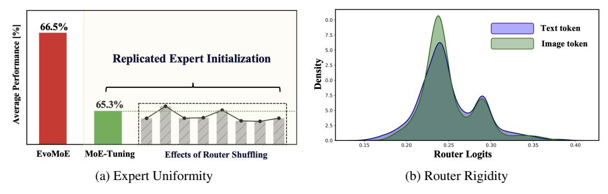

# 1 Introduction

Multi-modal Large Language Models (MLLMs), such as GPT-4 [1] and Llama 3 [14], have achieved significant success in addressing open-world tasks, thanks to their scaled-up architectures. However, scaling up models often increases computational demands and is limited by device capacity. To address these challenges, sparsely activated mixture-of-expert (MoE) models have gained popularity in large language models (LLMs) [51, 29, 47, 36, 53, 52], reducing computational costs and enhancing efficiency. MoE models typically include multiple experts and a routing network that selects the optimal expert for each input token. This design minimizes interference among diverse input tokens, enabling each expert to specialize more effectively in specific tasks. For example, DeepSeek V3 [26]

\*This work was completed during his internship at Ant Group.

†Corresponding author

employ MoE language models with 671B parameters, activating 37B parameters, and have achieved notable results.

Figure 1: Two key challenges in MoE-tuning. (a) Expert Uniformity: Randomly shuffling the router during inference results in negligible performance degradation, suggesting uniformity among experts derived from replicated initialization. (b) Router Rigidity: Kernel density estimation (KDE) of the logits for image and text tokens reveals that the linear router generates input-insensitive selections, leading to static distributions with significant overlap in the density of logits for image and text token.

The success of MoE in LLMs has spurred significant interest in its application to MLLMs [\[20,](#page-10-2) [25,](#page-10-3) [26,](#page-10-1) [37,](#page-11-3) [44,](#page-11-4) [49,](#page-11-5) [54\]](#page-12-2). A recent prominent approach is MoE-LLaVA [\[25\]](#page-10-3), which introduces MoE-tuning, a multi-stage process that converts dense MLLM models into sparse MoE structures during instruction tuning, specifically tailored for multi-modal tasks. However, in MoE-tuning, experts are typically initialized by replication, leading to the first critical challenge: *expert uniformity*. This results in expert homogenization during multi-stage tuning, thereby impeding specialization and undermining the efficacy of the MoE framework. Figure [1a](#page-1-0) illustrates an experiment on expert uniformity, in which we repeatedly shuffled the logits across router layers during evaluation and found no significant drop in average performance. This indicates that experts, which were initially replicated from a common source, tend to become homogeneous after training rather than developing specialized functions. This finding contradicts the fundamental principle of the Mixture-of-Experts (MoE) approach, which aims to enhance task-specific performance through the use of diverse experts. Additionally, MoE-tuning commonly employs a simple linear layer for expert assignment, mimicking the approach used in LLMs. This leads to the second challenge: *router rigidity*. The shared linear router struggles to differentiate between visual and text tokens in MLLMs, resulting in uniform predictions. This limits the model's adaptability and effectiveness in multi-modal tasks. Figure [1b](#page-1-0) illustrates this rigidity using Kernel Density Estimation (KDE) plot, revealing significant overlap in the logit distributions of image and text tokens. This overlap indicates that the router becomes inflexible during training, producing uniform output distributions regardless of the input type, thus restricting the model's adaptability in multi-modal tasks.

To tackle the aforementioned challenges, we introduce EvoMoE, a sparse MoE framework tailored for MLLM. Our method builds on MoE-tuning framework, gradually transforming dense models into MoE structures. To address the challenge of *expert uniformity* and enhance the diversity of expert initialization, we introduce a novel approach called Expert Evolution, which generates diverse MoE experts by iteratively adapting expert parameters through a dynamic evolution value. This evolution value integrates prior expertise with gradient-based updates, enabling continuous refinement and evolution. Consequently, the technique evolves multiple robust MoE experts from a single trainable expert. To address *router rigidity* and enhance the connection between the router and input modalities, we propose the Dynamic Token-aware Router (DTR). This router dynamically allocates input tokens to specific experts. Specifically, we employ a hypernetwork to generate unique parameters for each router, tailored to the unique value of each token.

Our core contributions are summarized as follows:

- We introduce EvoMoE, an innovative MoE-tuning framework specifically designed for MLLMs, which effectively addresses two critical challenges: expert uniformity and router rigidity.
- To tackle expert uniformity, we propose a novel method termed expert evolution, which flexibly generates a diverse set of MoE experts. Furthermore, to mitigate router rigidity, we introduce DTR, which assigns input tokens to specific experts based on their modality and intrinsic value.

• Extensive experiments on language models of various sizes demonstrate that EvoMoE achieves better performance with fewer activated parameters.

