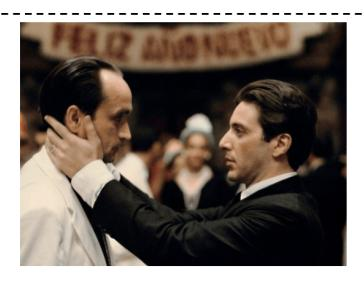

# B Ablation Studies

#### B.1 Training Details.

Table [7](#page-13-0) presents the training hyperparameters used across three stages for all models evaluated within our framework, including Qwen2-0.5B, StableLM-1.6B, Qwen-1.8B, Phi2-2.7B, and OpenChat-7B.

Table 7: Training hyperparameters.

| Configuration         | Stage I   | Stage II       | Stage III     |
|-----------------------|-----------|----------------|---------------|
| Experts               | -         | -              | 4             |
| Top-k                 | -         | -              | 1             |
| Data                  | Hybird-PT | LLaVA-FT       | LLaVA-FT      |
| Deepspeed             | Zero2     | Zero2          | Zero2_offload |
| Image Resolution      |           | 336*336        |               |
| Image encoder         |           | CLIP-Large/336 |               |
| Image projector       |           | MLP with GeLU  |               |
| Epoch                 |           | 1              |               |
| Learning rate         |           | 2e-5           |               |
| Learning rate schdule |           | Cosine decay   |               |
| Weight decay          |           | 0.0            |               |
| Text max length       |           | 2048           |               |
| Precision             |           | Bf16           |               |
| Global batch size     | 256       | 64             | 64            |
| Training steps        | 5200      | 10395          | 10395         |
| Training hours        | 6.0       | 12.0           | 7.0           |
| Epoch                 |           | 1              |               |
| GPU                   |           | 8xA100-80G     |               |

## B.2 Training Objective.

The overall loss function of EvoMoE consists of two components: the regression loss: Lregressive and the auxiliary loss Laux. Regression loss is designed to optimize model performance, while auxiliary loss aims to promote a balanced load distribution across the router:

$$\mathcal{L}_{\text{total}} = \mathcal{L}_{\text{regressive}} + \alpha \cdot \mathcal{L}_{\text{aux}}. \tag{10}$$

Here, α is a hyperparameter that controls the weight of the auxiliary loss and is set to 0.001 during the training process.

Auto-Regressive Loss. The output of EvoMoE is denoted by Υ, which represents a sequence generated progressively, with each text element produced step-by-step:

$$\mathcal{L}_{\text{regressive}} = -\sum_{i=1}^{N} \log p \left( \Upsilon^{[i]} \mid \vartheta, \Gamma^{[:i-1]} \right)$$
 (11)

where ϑ denote the output of the vision embedding from the projection layer, Γ represent the output of the text embedding from the word embedding layer. N is the length of the output sequence.

Balance Loss. A differentiable load balance loss is employed in each router layer to encourage experts to process tokens in a balanced manner, as defined below:

$$\mathcal{L}_{\text{aux}} = E \cdot \sum_{i=1}^{E} \mathcal{F}_i \cdot \mathcal{G}_i$$
 (12)

where  $\mathcal{F}$  denotes the fraction of tokens processed by each expert.  $\mathcal{G}$  epresents the average routing probability for each expert, and E=4 is the total number of experts in our paper.

#### **B.3** More experiments.

MoE-LLaVA

EvoMoE

4

2

16

16

32000

78.9

**Architecture details of EvoMoE.** Table 8 details the activated and training parameters for the dense model, EvoMoE, and our baseline, MoE-LLaVA, across multiple LLMs. The results show that EvoMoE activates only the top-1 expert while adding a minimal number of parameters through Dynamic Token-aware Router (DTR). Consequently, the number of activated parameters in EvoMoE is lower than that of MoE-LLaVA. Notably, during training, EvoMoE updates only a single FFN, with additional experts generated through the evolution of this primary FFN. This approach leads to a significant reduction in the total parameter count compared to MoE-LLaVA, thereby enhancing overall efficiency.

FFN Activated Training Embedding Width Layers FFN Model Experts Top-k Heads Router Layers Param. Param. Qwen2-0.5B 0.5B 0.5B MoE-LLaVA 2 12 151936 1024 24 2816 3 24 2048 0.6B 0.8BEvoMoE 4 12 34760 0.7B0.7BStableLM-1.6B 1.6B 1.6B MoE-LLaVA 4 2 16 100352 2560 32 10240 2 32 2048 2.0B 2.9B EvoMoE 16 34760 1.8B 1.8B Qwen-1.8B 1.8B 1.8B MoE-LLaVA 2 12 151936 4 2048 24 5504 3 16 2048 2.2B 3.1B EvoMoE 12 34760 2.0B2.0B1 Phi2-2.7B 2.7B 2.7B 2 MoE-LLaVA 4 16 51200 2560 32 10240 2 32 2048 3.6B 5.3B EvoMoE 34760 4.5B 7 8B 4 1 16 OpenChat-7B 6.7B 6.7B

Table 8: Architecture details of EvoMoE

**Performance Comparison of Different Model Sizes.** Table 9 presents a comprehensive performance comparison of dense, MoE, and EvoMoE models across various LLM sizes. Utilizing EvoMoE significantly enhances the final performance of the LLMs.

32

14366

3

32

2048

34760

9.6B

7.3B

15.2B

7.3B

4096

|          |      |              | ,            |                     | .,   |      |                  |      |        |      |      |
|----------|------|--------------|--------------|---------------------|------|------|------------------|------|--------|------|------|
| Model    | Size | MoE          | Evo.         | $\mathbf{VQA}^{v2}$ | GQA  | SQA  | $\mathbf{VQA}^t$ | POPE | MME    | MMB  | AVG  |
|          |      | ×            | ×            | 71.8                | 56.1 | 57.7 | 39.7             | 84.3 | 1168.8 | 57.9 | 60.7 |
| Qwen2    | 0.5B | ✓            | ×            | 72.0                | 56.1 | 58.0 | 39.6             | 84.4 | 1170.1 | 57.8 | 60.9 |
|          |      | $\checkmark$ | ✓            | 74.4                | 57.4 | 59.1 | 42.4             | 85.0 | 1188.6 | 58.2 | 62.3 |
|          |      | ×            | ×            | 76.6                | 60.1 | 62.5 | 50.1             | 85.2 | 1315.1 | 60.1 | 65.7 |
| StableLM | 1.6B | ✓            | ×            | 76.7                | 60.3 | 62.6 | 50.1             | 85.7 | 1318.2 | 60.2 | 65.9 |
|          |      | ✓            | ✓            | 76.9                | 61.2 | 63.5 | 51.5             | 86.4 | 1359.7 | 60.9 | 67.0 |
|          |      | ×            | ×            | 76.3                | 61.0 | 62.1 | 48.2             | 86.4 | 1286.7 | 59.7 | 65.4 |
| Qwen     | 1.8B | ✓            | ×            | 76.2                | 61.0 | 62.6 | 48.0             | 86.5 | 12881  | 59.4 | 65.5 |
|          |      | ✓            | ✓            | 76.9                | 61.2 | 63.3 | 49.3             | 87.1 | 1315.6 | 61.6 | 66.5 |
|          |      | ×            | ×            | 77.4                | 61.1 | 68.5 | 51.5             | 86.0 | 1418.1 | 65.1 | 68.5 |
| Phi-2    | 2.7B | ✓            | ×            | 77.6                | 61.4 | 68.5 | 51.4             | 86.3 | 1423.0 | 65.2 | 68.7 |
|          |      | $\checkmark$ | $\checkmark$ | 77.8                | 61.6 | 69.5 | 52.0             | 86.6 | 1450.5 | 66.8 | 69.6 |
|          |      | ×            | ×            | 78.2                | 61.5 | 62.9 | 52.6             | 86.8 | 1355.5 | 65.1 | 67.8 |
| OpenChat | 7B   | ✓            | ×            | 78.1                | 61.5 | 62.8 | 52.7             | 86.8 | 1384.5 | 64.8 | 67.9 |

Table 9: Ablation study about the model size of EvoMoE.

**Shuffle Router in MoE-tuning.** In Table 10, we conducted multiple tests to evaluate the impact of the shuffle router on MoE-tuning. MoE tuning was performed using replicate initialization, serving

63.8

53.8

87.3

1391.5

65.8

62.6

as a supplement to Figure 1(a) in the paper. The results demonstrate that the shuffle router does not affect the overall average performance. This finding confirms our hypothesis that traditional MoE-tuning methods suffer from significant expert homogeneity issues. Consequently, randomly selecting different routers makes no substantial difference, a phenomenon we refer to as expert uniformity.

Table 10: Shuffle Router in MoE-tuning.

|                |       | Image Question Answering |      |      |      | Benchmark Toolkit |      |      |
|----------------|-------|--------------------------|------|------|------|-------------------|------|------|
| Methods        | VQAv2 | GQA                      | SQA  | VQAt | POPE | MME               | MMB  | AVG  |
| MoE-tuning     | 76.2  | 61.0                     | 62.6 | 48.0 | 86.5 | 1288.1            | 59.4 | 65.5 |
| Shuffle Router |       |                          |      |      |      |                   |      |      |
| 1              | 76.2  | 60.0                     | 62.3 | 48.2 | 86.4 | 1288.5            | 59.6 | 65.3 |
| 2              | 76.2  | 60.1                     | 62.1 | 48.2 | 86.3 | 1288.8            | 59.4 | 65.2 |
| 3              | 76.2  | 60.4                     | 62.6 | 47.7 | 86.5 | 1290.2            | 59.8 | 65.4 |
| 4              | 76.3  | 60.6                     | 62.5 | 48.3 | 86.4 | 1293.2            | 59.5 | 65.6 |
| 5              | 76.1  | 60.9                     | 62.6 | 47.9 | 86.5 | 1289.9            | 59.3 | 65.5 |
| 6              | 76.2  | 60.6                     | 62.5 | 47.8 | 86.4 | 1287.8            | 59.6 | 65.5 |
| 7              | 76.1  | 60.7                     | 62.6 | 47.9 | 86.3 | 1286.9            | 59.3 | 65.4 |
| 8              | 76.0  | 60.1                     | 62.2 | 47.9 | 86.4 | 12887.1           | 59.2 | 65.2 |

Training setting. Tables [11,](#page-15-1) [12,](#page-15-2) and [13](#page-15-3) outline the training settings for EvoMoE. To evaluate the effect of the number of activated experts, we compare the performance using different top-k strategies. As shown in Table [11,](#page-15-1) our method demonstrates that top-1 experts performs significantly better than top-2, which is contrary to previous MoE experimental results, thereby confirming the greater efficiency of our approach. To verify the impact of the number of experts on the results, we conducted experiments presented in Table [12.](#page-15-2) Increasing the number of experts slightly enhances performance, validating previous findings that more sparse experts can achieve better results. Finally, we examine the influence of training epochs. Table [13](#page-15-3) shows that when training for 2 epochs, performance on GQA increases significantly, while other metrics experience varying degrees of decline. This indicates that the network tends to overfit on large-scale datasets.

Table 11: The value of top-k.

| Top-k | VQAv2 | GQA  | SQA  | VQAt | POPE | MME    | MMB  |
|-------|-------|------|------|------|------|--------|------|
| 1     | 76.9  | 61.2 | 63.3 | 49.3 | 87.1 | 1315.6 | 61.6 |
| 2     | 76.6  | 61.0 | 62.4 | 48.8 | 86.8 | 1304.7 | 60.9 |

Table 12: The number of experts.

| Experts | VQAv2 | GQA  | SQA  | VQAt | POPE | MME    | MMB  |
|---------|-------|------|------|------|------|--------|------|
| 2       | 76.5  | 61.1 | 62.5 | 48.5 | 86.6 | 1302.6 | 61.3 |
| 4       | 76.9  | 61.2 | 63.3 | 49.3 | 87.1 | 1315.6 | 61.6 |

Table 13: Training Epochs.

| Epoch | VQAv2 | GQA  | SQA  | VQAt | POPE | MME    | MMB  |
|-------|-------|------|------|------|------|--------|------|
| 1     | 76.9  | 61.2 | 63.3 | 49.3 | 87.1 | 1315.6 | 61.6 |
| 2     | 76.2  | 62.4 | 61.8 | 48.4 | 86.5 | 1262.2 | 61.0 |

Details in Increasing Expert Diversity. Figure [14](#page-16-0) illustrates the experimental details related to noise and dropout as discussed in the "Increasing Expert Diversity" section of the paper. We introduced various types of noise during expert initialization and experimented with different levels of dropout during training. However, the results did not show significant improvements, which led us to develop the expert evolution approach for MoE experts.

Exploring the Selection of Evolution Value β. To further explore the selection of the evolution value β, we first fixed β,and individually evaluated its impact on each expert. As shown in Table 1, when β > 0.5, different values perform optimally on their respective benchmarks. In contrast, when β

Table 14: Noise and Dropout Parameters Comparison

(a) Noise (b) Dropout

| Noise | GQA  | SQA  | VQAt | POPE |
|-------|------|------|------|------|
| 1e-5  | 60.8 | 63.1 | 48.0 | 86.5 |
| 1e-4  | 61.3 | 62.2 | 47.5 | 86.4 |
| 1e-3  | 61.2 | 63.1 | 47.4 | 85.5 |
| 1e-2  | 60.4 | 58.7 | 47.1 | 85.1 |
| 1e-1  | 58.5 | 51.1 | 45.5 | 84.3 |

| Dropout | GQA  | SQA  | VQAt | POPE |
|---------|------|------|------|------|
| 0.1     | 60.6 | 62.1 | 47.5 | 86.1 |
| 0.2     | 60.5 | 62.2 | 47.4 | 86.2 |
| 0.3     | 60.6 | 62.1 | 47.7 | 86.3 |
| 0.4     | 60.4 | 62.0 | 47.4 | 86.1 |
| 0.5     | 60.3 | 62.0 | 47.2 | 86.2 |

< 0.5, most experts exhibit update frequencies similar to the FFN with β = 0, resulting in performance comparable to the β = 0 case. To achieve stronger generalization capabilities, we opted not to fix β. Instead, we randomly selected β within a specific range at each training step. For instance, as demonstrated in Table 1, randomly choosing β between 0.9 and 0.99 yielded the best experimental results. Therefore, in our study, we randomly select β from multiple ranges to generate multiple evolved experts.

Table 15: Evolution value β.

| β            | VQAvv2 | GQA  | SQA  | textbfVQAT | POPE | MME    | MMB  |
|--------------|--------|------|------|------------|------|--------|------|
| 0            | 76.3   | 61.0 | 62.1 | 48.2       | 86.4 | 1286.7 | 59.7 |
| 0.9          | 76.8   | 60.8 | 62.7 | 48.6       | 87.3 | 1290.7 | 58.4 |
| 0.8          | 76.4   | 60.9 | 62.4 | 49.0       | 86.6 | 1277.3 | 61.4 |
| 0.7          | 76.9   | 61.0 | 62.8 | 48.7       | 86.4 | 1284.5 | 59.5 |
| 0.4          | 76.3   | 61.0 | 62.2 | 48.3       | 86.5 | 1285.9 | 59.7 |
| 0.2          | 76.3   | 61.0 | 62.1 | 48.2       | 86.4 | 1286.1 | 59.6 |
| [0.9 - 0.99] | 76.7   | 61.1 | 63.0 | 48.9       | 87.0 | 1300.7 | 61.5 |

Visualization. In Figure [6,](#page-17-0) we present some VQA examples to demonstrate the capabilities of EvoMoE.

Figure 6: Visual input examples.