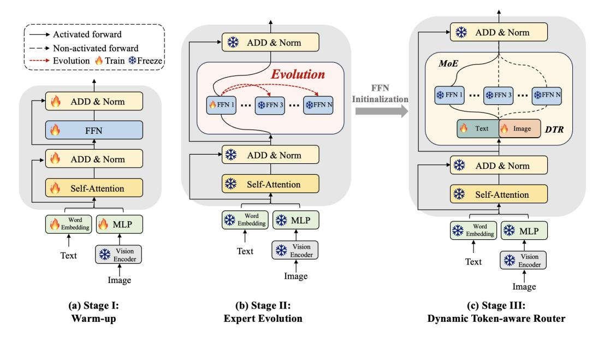
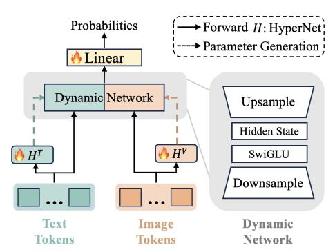

# 3.1 Framework Overview

In the MoE-tuning approach, the initial pre-training phase establishes cross-modal alignment by utilizing an MLP projector to map image tokens into the LLM's latent space, equipping the model with foundational visual-language understanding capabilities. Leveraging this groundwork, we introduce EvoMoE, building upon the pre-training phase of MoE-LLaVAA [\[25\]](#page-10-3) as our initialization base. Our methodology further advances this foundation through a three-stage framework designed to systematically evolve the dense pre-trained backbone into a sparse MoE architecture. This framework

Figure 2: The framework of EvoMoE. EvoMoE comprises three stages of instruction-tuning: (a) Warm-up: Begin training with multi-modal instruction data to familiarize the model with understanding capabilities, utilizing parameters initialized during the MoE-LLaVA [\[25\]](#page-10-3) pretraining stage. (b) Expert Evolution: Train only FFN1, while evolving other experts from FFN1, and (c) Dynamic Token-aware Router: Use FFNs evolved in Stage II for expert initialization and incorporate the DTR for MoE, with only the DTR trainable during this stage, while all other parameters remain frozen.

incorporates two key components: (1) Expert Evolution: Gradually generate new experts using an evolution strategy. (2) Dynamic Token-aware Routing: Implement a dynamic routing mechanism that prioritizes input-relevant experts. Figure [2,](#page-3-1) coupled with the subsequent description, clarifies the details of the three-stage framework:

*Stage I: Understanding Warm-up.* To equip the model with basic instruction-following capabilities, we utilize a collection of instruction datasets to train all parameters of the dense LLM and the corresponding Multi-Layer Perceptron (MLP) layer.

*Stage II: Expert Evolution.* In this stage, we introduce a novel methodology for constructing Mixtureof-Experts (MoE) experts, where each expert is instantiated as a unique Feed-Forward Network (FFN) layer within the LLM. By employing expert evolution, a process that dynamically balances prior expertise with gradient-based updates, we progressively derive multiple robust FFN experts from a single trainable FFN during training. This iterative approach enables continuous refinement and adaptation, enhancing the diversity, specialization, and robustness of the experts. As a result, the model's adaptability and overall performance are significantly improved.

*Stage III: Dynamic Token-aware Router.* In this stage, we introduce the Dynamic Token-aware Router (DTR), which dynamically allocates input tokens to appropriate experts based on their modality. The DTR parameters are generated by a hypernetwork, creating routing decisions specifically tailored for each input token. The experts are initialized through the evolutionary process described in Stage II.

#### 3.2 MoE Expert Evolution

The existing MoE-tuning approach typically replicates the FFN parameters to initialize multiple MoE experts, resulting in expert uniformity issues during training. To address this challenge, as illustrated in Figure [2](#page-3-1) (b), we propose a novel initialization strategy, expert evolution, which gradually evolves new experts by dynamically balancing prior expertise with gradient-based updates:

$$\theta_n \leftarrow \beta \cdot \theta_1 + (1 - \beta) \cdot \nabla \theta_1,$$
 (1)

where  $\theta_1$  represents the network parameters of the original trainable FFN, initialized using the output of stage I and designated as expert 1.  $\theta_n$  denotes the newly generated FFN experts, where the index  $n=[2,3,\cdots,N]$  represents each of the N experts. Meanwhile,  $\nabla\theta_1$  represents the gradient update for the trainable expert.  $\beta$  denotes the evolution value within the range [0,1] which controls the evolution rate. A larger  $\beta$  emphasizes historical data, producing a smoother average by diminishing the impact of recent changes. In our experiments,  $\beta$  is randomly assigned a value within a specified range at each training step for improved generalization, as detailed in Section 4.1.

We exclusively train  $\theta_1$  of expert 1, allowing it to evolve into different experts through varying evolution rates  $\beta$ . Importantly, these evolved experts and all other LLM and MLP parameters remain frozen during training.

#### 3.3 Dynamic Token-aware Router (DTR)

In the MoE-tuning approach, a shared linear router selects the top K experts for both visual tokens  $V = [v_1, v_2, \cdots, v_P] \in \mathbb{R}^{P \times C}$  and text tokens  $T = [t_1, t_2, \cdots, t_M] \in \mathbb{R}^{M \times C}$ , here, P is the sequence length of visual tokens, M is the sequence length of text tokens, and C denotes the hidden size of the LLM. This setup might not differentiate between visual and text tokens, limiting effectiveness in multi-modal tasks and resulting in uniform predictions, known as router rigidity.

To address this challenge, we introduce the Dynamic Token-aware Router (DTR) as a key component of the EvoMoE framework. EvoMoE consists of L blocks, each integrating multi-head self-attention (MSA),

Figure 3: **Dynamic Token-aware Router** (**DTR**). Two input-guided hypernetworks dynamically generate network parameters for the up-sampling and down-sampling layers based on visual and text tokens. The final linear layer predicts probabilities and selects the top-k experts. In this module, only the hypernetworks and the linear layer are trainable.

feed-forward neural networks (FFN), layer normalization (LN) and residual connections. The framework is structured as follows:

$$z_0^V = [v_1, v_2, \cdots, v_P], \quad z_0^T = [t_1, t_2, \cdots, t_M], \quad l = 1 \dots L.$$
 (2)

$$z_l^{V\prime} = \text{MSA}\left(\text{LN}\left(z_{l-1}^V\right)\right) + z_{l-1}^V, \quad z_l^{T\prime} = \text{MSA}\left(\text{LN}\left(z_{l-1}^T\right)\right) + z_{l-1}^T. \tag{3}$$

$$z_l^V = \text{FFN}(\text{DTR}\left(\text{LN}\left(z_l^{U\prime}\right)\right)) + z_l^{U\prime}, \quad z_l^T = \text{FFN}(\text{DTR}\left(\text{LN}\left(z_l^{U\prime}\right)\right)) + z_l^{T\prime}. \tag{4}$$

The architecture of DTR, as depicted in Figure 3, innovatively manages input visual and text tokens through two hypernetworks, denoted as  $\mathcal{H}^V$  and  $\mathcal{H}^T$ . Each hypernetwork consists of two MLP layers, allowing it to generate adaptive parameters customized to each token. For instance, when processing visual tokens V, the hypernetwork  $\mathcal{H}^V$  predicts modality-specific parameters  $\Theta^V$ , optimized for visual inputs, as detailed below:

$$\Theta^{V} = \left(w_1 \mathbf{z}^{\prime(V)} + b_1\right) w_2 + b_2,\tag{5}$$

where w1 and w2 denote the weights for two MLPs in  $H^V$ , while  $b_1$  and  $b_2$  represent the corresponding biases. Similarly,  $\Theta^T$  denotes the dynamic weights for the text token input, which are generated in a manner analogous to that of the visual.

DTR consists of a pair of down-sampling and up-sampling layers designed to dynamically extract visual and textual information from various input tokens. Finally, the prediction of expert probabilities  $\rho$  is formulated as follows:

$$\Theta_{\text{up}}^{\tau}, \Theta_{\text{down}}^{\tau} = \mathcal{H}^{\tau}(z^{\tau\prime}), \text{ where } \tau \in V, T$$
 (6)

$$\mathcal{E}^{\tau} = \Theta_{\text{up}}^{\tau} \left( \text{SwiGLU} \left( \Theta_{\text{down}}^{\tau} \left( z^{\tau \prime} \right) \right) \right), \tag{7}$$

$$\rho^{\tau} = (\phi\left(\mathcal{E}^{\tau}\right)),\tag{8}$$

where  $\tau$  denotes the visual and text input tokens. z' is the output of a single MSA block.  $\Theta_{up}$  and  $\Theta_{down}$  correspond to the weights of the up-sampling and down-sampling layers, respectively, which are generated by the hypernetwork  $\mathcal{H}$ . In this context, the SwiGLU activation function is utilized. The symbol  $\phi$  denotes an MLP layer that serves as the final router. During training, only  $\mathcal{H}^V$ ,  $\mathcal{H}^T$ , and  $\phi$  are fine-tuned. Each token is processed by the top K experts with the highest probability.

### 3.4 Training Objective

In alignment with [\[25\]](#page-10-3), the overall loss function of EvoMoE consists of two components: the regression loss: Lregressive and the auxiliary loss Laux. Regression loss is designed to optimize model performance, while auxiliary loss aims to promote a balanced load distribution across the router ϕ:

$$\mathcal{L}_{\text{total}} = \mathcal{L}_{\text{regressive}} + \alpha \cdot \mathcal{L}_{\text{aux}}. \tag{9}$$

Here, α is a hyperparameter that controls the weight of the auxiliary loss and is set to 0.001 during the training process. The detailed formulas are provided in the supplementary materials.

