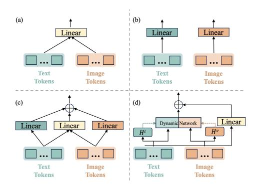
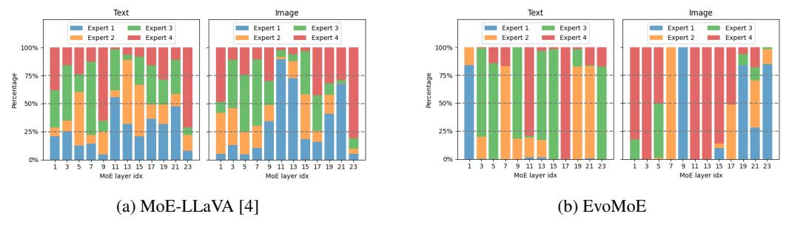

# 4.1 Experiments Setup

Model Details. EvoMoE is built on the MoE-tuning and LLaVA 1.5 frameworks, centering on the Evolution Strategy and the Dynamic Token-aware Router (DTR). The training framework suits various sizes, with experiments on LLMs with 0.5B, 1.8B, 2.7B, and 7B parameters showing strong generalization. Importantly, EvoMoE achieves state-of-the-art performance by activating only the top-1 expert, which offers a significant advantage in terms of the number of activated parameters.

Training Datasets. In Stage I, following MoE-LLaVA [\[25\]](#page-10-3), we use a diverse dataset collection, including MIMIC-IT [\[22\]](#page-10-8), LRV [\[27\]](#page-10-9), SViT [\[50\]](#page-11-9), and LVIS [\[43\]](#page-11-10), to enhance the MLLM's general multi-modal comprehension skills. Stage II employs the LLaVA-mix-665k [\[19\]](#page-10-10) dataset to develop evolution experts. In Stage III, the same LLaVA-mix-665k dataset is used to train the DTR.

Evaluation. We evaluate the effectiveness and robustness of EvoMoE across diverse scenarios through performance evaluations on an extensive range of multi-modal benchmarks, including VQA-v2 [\[13\]](#page-9-9), GQA [\[15\]](#page-9-10), SQA [\[32\]](#page-10-11), TextVQA [\[38\]](#page-11-11), POPE [\[24\]](#page-10-12), MME [\[12\]](#page-9-11), and MMBench [\[30\]](#page-10-13).

Implementation Details. In our experiments, CLIP-L [\[35\]](#page-11-12) and SigLIP-L [\[48\]](#page-11-13) were utilized as the image encoders. Throughout all experiments, the batch size was consistently maintained at 4, with a gradient accumulation of 2. For all the three stages of instruction tuning, the initial learning rate was 2e-5, and we consistently select the top-1 expert across all experiments. In the evolution strategy, the evolution rate is randomly chosen from one of three specified ranges at each training: [0.9–0.99], [0.8–0.89], and [0.7–0.79]. Each range corresponds to one of the three experts generated through the evolution process. Including the original trainable expert, this results in a total of four MoE experts.

## 4.2 Comparison with State-of-the-Art

We evaluated our method against state-of-the-art approaches on four image question-answering benchmarks and three multi-modal understanding toolkits. As illustrated in Table [1,](#page-6-0) the models were categorized according to the size of LLM into four groups: 0–1B, 1–2B, 2–3B, and 7B.

Compared with the state-of-the-art method MoE-LLaVA, which serves as a baseline for MoE-tuning, EvoMoE demonstrates strong multi-modal understanding capabilities across various LLM sizes and image resolutions. EvoMoE outperforms MoE-LLaVA in the LLMs Qwen2-0.5B, StableLM-1.6B, Qwen-1.8B, Phi-2.7B, and OpenChat-7B. It achieves average performance gains of 1.4% for the 0.5B model, 1.1% for the 1.6B model, 1.2% for the 1.8B model, 1.1% for the 2.7B model and 0.9% for the 7B model, all with fewer activated parameters (activating only top-1 expert). In particular, EvoMoE achieves remarkable improvements in the TextVQA, VQAv2, and GQA benchmarks. For instance, with the Qwen2-0.5B model, it surpasses the baseline by 2.8%, 2.4%, and 1.3%, respectively. In StableLM-1.6B, EvoMoE improves TextVQA performance by 1.4%. Additionally, it outperforms baselines in MMbench evaluations by 2.2%, 1.6%, and 1.0% with Qwen-1.8B, Phi-2.7B, and OpenChat-7B models, respectively. This is particularly noteworthy, given that the baseline approach relies on activating the top-2 experts, which results in a significantly higher number of activated parameters. Ultimately, under the same Phi-2.7 LLM, EvoMoE outperformed the baseline by both 1.6% on input image resolutions of both 336 and 384, demonstrating the flexibility of EvoMoE. Collectively, these results demonstrate that EvoMoE not only outperforms other sparse models but also achieves this with fewer activated parameters.

Table 1: **Comparison of MLLMs on image understanding benchmarks.** 'LLM' is the language model component, 'Act.' is the number of activated parameters, and 'Res.' is the input image resolution. Models 'Q', 'Q'', 'S', 'P', 'ML', 'G', and 'O' refer to Qwen [2], Qwen2 [45], StableLM [4], Phi-2 [17], Mobile LLaMA [18], Gemini [39] and OpenChat [42], respectively. 'AVG' is the weighted mean across all benchmarks, with MME values divided by 20 for simplify calculation. \* indicates results re-implemented using MoE-LLaVA [25]. Rows are colored based on the same baseline settings as our method for easier comparison.

| M 41 1            | 1134    |      | ъ    | Image       | Questio     | n Answ      | ering       | Benc        | hmark To      | olkit       | ANIC        |
|-------------------|---------|------|------|-------------|-------------|-------------|-------------|-------------|---------------|-------------|-------------|
| Methods           | LLM     | Act. | Res. | $VQA^{v2}$  | GQA         | SQA         | $VQA^t$     | POPE        | MME           | MMB         | AVG         |
| 0-1B              |         |      |      |             |             |             |             |             |               |             |             |
| Sparse Model      |         |      |      |             |             |             |             |             |               |             |             |
| MoE-LLaVA*        | Q'-0.5B | 0.6B | 336  | <u>72.0</u> | <u>56.1</u> | 58.0        | <u>39.6</u> | 84.4        | 1170.1        | <u>57.8</u> | 60.9        |
| EvoMoE            | Q'-0.5B | 0.7B | 336  | 74.4        | 57.4        | 59.1        | 42.4        | 85.0        | 1188.6        | 58.2        | 62.3        |
| 1-2B              |         |      |      |             |             |             |             |             |               |             |             |
| Sparse Model      |         |      |      |             |             |             |             |             |               |             |             |
| MoE-LLaVA [25]    | S-1.6B  | 2.0B | 336  | <u>76.7</u> | 60.3        | 62.6        | <u>50.1</u> | 85.7        | 1318.2        | 60.2        | 65.9        |
| EvoMoE            | S-1.6B  | 1.8B | 336  | 76.9        | 61.2        | 63.5        | 51.5        | 86.4        | 1359.7        | 60.9        | 67.0        |
| MoE-LLaVA [25]    | Q-1.8B  | 2.2B | 336  | 76.2        | 61.5        | 63.1        | 48.0        | <u>87.0</u> | 1281.6        | 59.7        | 65.7        |
| MoE-LLaVA*        | Q-1.8B  | 2.2B | 336  | 76.2        | 61.0        | 62.6        | 48.0        | 86.5        | 1288.1        | 59.4        | 65.3        |
| EvoMoE            | Q-1.8B  | 2.0B | 336  | 76.9        | 61.2        | 63.3        | 49.3        | 87.1        | 1315.6        | 61.6        | 66.5        |
| 2-3B              |         |      |      |             |             |             |             |             |               |             |             |
| Dense Model       |         |      |      |             |             |             |             |             |               |             |             |
| TinyGPT-V [46]    | P-2.7B  | 2.7B | 448  | -           | 33.6        | 41.2        | 11.4        | 50.5        | 507.8         | 35.5        | -           |
| Mini-Gemini [23]  | G-2B    | 2.0B | 336  | -           | -           | -           | 56.2        | -           | 1341.0        | 59.8        | -           |
| MobileVLM [10]    | ML-2.7B | 2.7B | 336  | -           | 85.4        | 59.0        | 46.7        | 84.6        | 1296.4        | 57.0        | -           |
| MobileVLM v2 [11] | ML-2.7B | 2.7B | 336  | -           | 61.1        | 70.0        | 57.5        | 84.7        | 1440.5        | 63.2        | -           |
| LLaVA-Phi [11]    | P-2.7B  | 2.7B | 336  | 71.4        | 68.4        | 66.4        | 48.6        | 85.0        | 1335.1        | 59.8        | 66.6        |
| Sparse Model      |         |      |      |             |             |             |             |             |               |             |             |
| Qwen-MoE* [44]    | P-2.7B  | 2.7B | 336  | 77.5        | 61.1        | 67.7        | 52.6        | 85.9        | 1434.0        | 65.4        | 68.9        |
| MoE-LLaVA [25]    | P-2.7B  | 3.6B | 336  | 77.6        | 61.4        | 68.5        | 51.4        | 86.3        | 1423.0        | 65.2        | 68.7        |
| EvoMoE            | P-2.7B  | 3.0B | 336  | 77.8        | 61.6        | 69.5        | 52.0        | 86.6        | 1450.5        | 66.8        | 69.6        |
| MoE-LLaVA [25]    | P-2.7B  | 3.6B | 384  | <u>79.9</u> | 62.6        | <u>70.3</u> | <u>57.0</u> | 85.7        | 1431.3        | <u>68.0</u> | <u>70.5</u> |
| EvoMoE            | P-2.7B  | 3.0B | 384  | 80.2        | <u>62.8</u> | 71.5        | 57.8        | <u>86.5</u> | <u>1450.1</u> | 69.6        | 71.6        |
| 7B                |         |      |      |             |             |             |             |             |               |             |             |
| Sparse Model      |         |      |      |             |             |             |             |             |               |             |             |
| MoE-LLaVA*        | O-7B    | 9.6B | 336  | <u>78.1</u> | <u>61.5</u> | <u>62.8</u> | <u>52.7</u> | <u>86.8</u> | <u>1384.5</u> | <u>64.8</u> | <u>67.9</u> |
| EvoMoE            | O-7B    | 7.3B | 336  | 78.9        | 62.6        | 63.8        | 53.8        | 87.3        | 1391.5        | 65.8        | 68.8        |

#### 4.3 Comprehensive Analysis

In this section, we perform an ablation study to explore EvoMoE's core contributions using the Qwen-1.8B model. We conduct experiments on four image QA benchmarks and three multi-modal understanding benchmarks, using the same training data as [25] for fair comparison.

**Design analysis of our framework.** We conduct several ablation studies to assess the effectiveness of the proposed framework. As depicted in Table 2, (a) represents a dense LLM without any MoE experts. (b) is a standard MoE model proposed by MoE-LLaVA [25] based on MoE-tuning, which includes four experts and a linear router. These results indicate that traditional MoE-tuning method does not provide a significant performance enhancement over dense LLMs on average accuracy. This is due to two challenges faced by MoE-tuning: expert uniformity and router rigidity. In (c), we replaced the linear router with our proposed DTR router based on the MoE-tuning approach. The results indicate that DTR addresses the issue of router rigidity, thereby enhancing performance. In (d), we tested our expert evolution strategy combined with a linear router. All newly created experts originate from the same dense LLM, which can be compared to (a). The results demonstrate that our expert evolution strategy significantly enhances performance while maintaining a model size comparable to dense LLMs, effectively addressing the issue of expert uniformity. Combined with the DTR router, our framework achieves optimal performance.

The Effectiveness of Evolution Strategy. Table 3 demonstrates the potential of our proposed expert evolution strategy in MLLMs. In this experiment, we eliminated the router and independently evaluated the multi-modal capabilities of each expert. By fixing  $\beta$  to a constant value, we systematically examined its impact on performance. Expert 1 is a FFN layer with  $\beta=1.0$ , while Experts 2 to 4 are evolved from Expert 1 by progressively reducing  $\beta$  values. Notably, the evolved experts consistently outperform Expert 1 across the majority of benchmarks. This performance advantage persists even

Table 2: Ablation study on MLLM evaluation benchmarks.

|        | M T[25]  | E            | DTD          | A4   | Image       | Questio     | n Answ      | ering   | Benc        | Benchmark Toolkit |             |      |  |
|--------|----------|--------------|--------------|------|-------------|-------------|-------------|---------|-------------|-------------------|-------------|------|--|
|        | M-T[25]. | Evo.         | DTR          |      | $VQA^{v2}$  | GQA         | SQA         | $VQA^T$ | POPE        | MME               | MMB         | AVG  |  |
| (a)    |          |              |              | 1.8B | 76.3        | 61.0        | 62.1        | 48.2    | 86.4        | 1286.7            | 59.7        | 65.4 |  |
| (b)    | ✓        |              |              | 2.2B | 76.2        | 61.0        | 62.6        | 48.0    | 86.5        | 1288.1            | 59.4        | 65.5 |  |
| (c)    | ✓        |              | $\checkmark$ | 2.4B | 76.2        | <u>61.1</u> | <u>63.0</u> | 48.6    | <u>86.8</u> | 1310.4            | <u>61.4</u> | 66.0 |  |
| (d)    |          | ✓            |              | 1.8B | 77.5        | 61.2        | 62.9        | 48.8    | 86.8        | 1311.4            | 61.3        | 66.3 |  |
| EvoMoE |          | $\checkmark$ | $\checkmark$ | 2.0B | <u>76.9</u> | 61.2        | 63.3        | 49.3    | 87.1        | 1315.6            | 61.6        | 66.5 |  |

Table 3: Ablation study for evolution strategy.

|          |     |            |      |      |             |             | ,,,    |      |
|----------|-----|------------|------|------|-------------|-------------|--------|------|
|          | β   | $VQA^{v2}$ | GQA  | SQA  | $VQA^T$     | POPE        | MME    | MMB  |
| Expert 1 | 1.0 | 76.3       | 61.0 | 62.1 | 48.2        | 86.4        | 1286.7 | 59.7 |
| Expert 2 | 0.9 | 76.4       | 60.8 | 62.7 | 48.6        | 87.3        | 1305.7 | 58.4 |
| Expert 3 | 0.8 | 76.7       | 60.9 | 62.4 | 49.0        | 86.6        | 1297.3 | 61.4 |
| Expert 4 | 0.7 | 77.1       | 61.2 | 62.8 | <u>48.7</u> | <u>86.4</u> | 1284.5 | 59.5 |

under large  $\beta$  decay, where the value is set to 0.9, equivalent to retaining only 10% of updates per step. These systematic improvements empirically validate our core hypothesis: experts generated through expert evolution exhibit significantly greater diversity compared to those generated through straightforward replication. Each evolved expert demonstrates specialized capabilities, excelling in different benchmarks, often outperforming the original expert and effectively addressing the challenge of expert uniformity. In the subsequent stage, we apply the proposed DTR to these evolved experts, enabling better utilization of their specialized capabilities and enhancing overall performance. In our experiments, to enhance generalization, we randomly sample the  $\beta$  value from a predefined range at each training step, rather than using a fixed value.

Table 4: Ablation study for DTR.

Table 5: Ablation study for expert diversity.

| -        | acre .       |              | CIOII        | staaj | 101 1       | , 111.           |             | 14010 5. 1     | ioiumon st  | aaj 10 | · cape | 11 41 10         | isity. |
|----------|--------------|--------------|--------------|-------|-------------|------------------|-------------|----------------|-------------|--------|--------|------------------|--------|
|          | Share        | Image        | Text         | GQA   | SQA         | $\mathbf{VQA}^t$ | POPE        |                | Method      | GQA    | SQA    | $\mathbf{VQA}^t$ | POPE   |
| Linear   |              |              |              |       |             |                  |             | (a)            |             | 61.0   | 62.6   | 48.0             | 86.5   |
| (-)      | /            |              |              | (10   | (2.6        | 40.0             | 065         | Initialization |             |        |        |                  |        |
| (a)      | ✓            |              |              | 61.0  | 62.6        | 48.0             | 86.5        | (b)            | Noise       | 60.8   | 63.1   | 47.2             | 86.1   |
| (b)      |              | $\checkmark$ | $\checkmark$ | 61.2  | <u>62.7</u> | 48.3             | 86.6        | (c)            | V-Evo.      | 61.3   | 63.0   | 48.0             | 86.7   |
| (c)      | $\checkmark$ | $\checkmark$ | $\checkmark$ | 61.1  | 62.2        | 48.2             | 86.4        | Training       |             |        |        |                  |        |
| HyperNet |              |              |              |       |             |                  |             | (d)            | Dropout     | 60.6   | 62.3   | 47.4             | 86.2   |
|          |              | ,            |              |       |             | 40.              | 0= 4        | (e)            | Contrastive | 61.5   | 62.6   | 47.5             | 86.3   |
| DTR      |              | ✓            | ✓            | 61.2  | 63.3        | 49.2             | 87.1        | (f)            | Local Loss  | 60.9   | 62.2   | 48.2             | 85.9   |
| (d)      | $\checkmark$ | $\checkmark$ | $\checkmark$ | 60.9  | <u>62.7</u> | <u>48.4</u>      | <u>86.7</u> | Ours           | Evolution   | 61.2   | 63.3   | 49.3             | 87.1   |

**Design analysis of DTR.** Figure 4 presents possible architectures for DTR. (a) presents a standard linear router that processes image and text tokens simultaneously. (b) introduces a modality-specific router tailored to differentiate between image and text. (c) incorporates a shared router, which influences the modality-specific router through weighted connections. (d) proposes the hypernetwork as the modality-specific router while also integrating a shared router to enhance flexibility.

Table 4 summarizes the ablation studies. The modality-specific router in (b) outperforms the single router in (a), emphasizing the importance of modality distinction. The HyperNet adaptation improves attention to input token distribution, further improving performance. However, adding a weighted shared router in (c) and (d) results in a decline in overall

Figure 4: **Design analysis of DTR.** (a) single router; (b) modality-specific router; (c) modality-specific router with shared routing; (d) hyperNet with shared routing.

performance. Ultimately, we adopt the structure of the DTR in Figure 3 in our framework, as it achieves the best performance. Figure 5 visualizes modality preferences of experts on the ScienceQA benchmark, with MoE-tuning results on the left and EvoMoE results on the right. The visualization reveals that traditional MoE-tuning exhibits almost uniform distributions across different inputs,

leading to router rigidity. In contrast, EvoMoE, using DTR, dynamically allocates tokens to suitable experts based on modality, allowing experts to learn specific patterns for efficient, input-guided processing.

Figure 5: Distribution of input modalities across different experts (a) Previous methods exhibited almost uniform distributions across different inputs, leading to router rigidity. (b) EvoMoE dynamically allocates input tokens to the most suitable experts based on their modality.

Increasing Expert Diversity. To address homogenization from expert replication, we implemented strategies to improve expert diversity, classified into initialization and training phases. As shown in Table [5,](#page-7-3) (a) shows the MoE baseline. (b) adds noise during expert initialization, while (c) Vanilla-Evolution shifts expert evolution to Stage I and fine-tunes all experts in Stage II. For training: (d) uses random dropout; (e) incorporates NCE loss [\[8\]](#page-9-15) among experts; and (f) introduces local loss [\[33\]](#page-10-17) to increase router entropy for better routing balance. These diversity strategies didn't significantly boost performance across all metrics, highlighting EvoMoE's superiority. For detailed comparison, see the Supplementary Material.

MoE Strategy Exploration. We further explored additional attempts concerning MoE in Table [6.](#page-8-1) Incorporating insights from advanced LLMs like DeepSeek-V3 [\[26\]](#page-10-1), it was found that removing the initial MoE layer, emphasized in DeepSeek-V3, is ineffective in MLLMs. While shared experts are common in LLM MoE implementations, they have not provided significant benefits in MLLMs. Additionally, we explored the introduction of additional trainable parameters at various stages: (1) In stage II, unfreezing all parameters (MSA&FFN) within the LLM led to optimal performance on several benchmarks (GQA, SQA, MMB), though improvements were not consistent across all benchmarks. (2) In stage III, training the entire set of experts alongside the DTR led to a significant performance drop. Lastly, our framework preserved performance using an alternating approach for MoE layers, whereas replacing all dense layers with MoE structures decreased performance.

Table 6: Ablation study on MoE exploration.

| Strategy             | VQAv2 | GQA  | SQA  | VQAt | POPE | MME    | MMB  |
|----------------------|-------|------|------|------|------|--------|------|
| LLM MoE Insights     |       |      |      |      |      |        |      |
| w/o first layer      | 76.3  | 61.1 | 62.4 | 48.5 | 86.4 | 1285.6 | 60.6 |
| Share Expert         | 76.2  | 61.0 | 62.6 | 48.8 | 86.6 | 1306.8 | 60.8 |
| Trainable Parameters |       |      |      |      |      |        |      |
| In Stage II          | 75.2  | 61.2 | 63.8 | 46.8 | 86.4 | 1263.8 | 61.9 |
| In Stage III         | 77.0  | 60.9 | 62.3 | 48.4 | 86.5 | 1271.2 | 60.9 |
| MoE Placement        |       |      |      |      |      |        |      |
| ALL Layers           | 74.4  | 61.0 | 62.5 | 47.6 | 86.3 | 1280.1 | 60.4 |
| EvoMoE               | 76.9  | 61.2 | 63.3 | 49.3 | 87.1 | 1315.6 | 61.6 |

