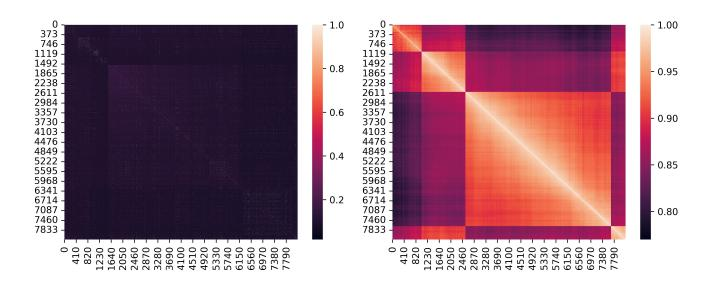

# **Auxiurary Results**

**Lemma 8.** Let  $X_1, \ldots, X_n$  be n independent random variables with

$$\mathcal{P}(X_i = 1) = p_i, \mathcal{P}(X_i = 0) = 1 - p_i.$$
 (14)

We consider the sum  $X = \sum_{i=1}^{n} X_i$ , with expectation  $\mathcal{E}(X) = \sum_{i=1}^{n} p_i$ . Then we have

(Lower tail) 
$$\mathcal{P}(\mathbf{X} \leq \mathcal{E}\mathbf{X} - \lambda) \leq e^{-\frac{\lambda^2}{2\mathcal{E}\mathbf{X}}},$$
 (15)  
(Upper tail)  $\mathcal{P}(\mathbf{X} \geq \mathcal{E}\mathbf{X} + \lambda) \leq e^{-\frac{\lambda^2}{2(\mathcal{E}\mathbf{X} + \lambda/3)}}.$ 

#### **Proof of Theorem 5**

Proof. 1) For the TCR, denote

$$s_i = |\{t < k : \boldsymbol{x}_t \text{ sent to expert } i, \boldsymbol{x}_k = \boldsymbol{o}_i\}|, \forall i \in [n]$$
 (16)

as the top class-irrelevant token number candidated to the i-th expert before the valid token. Then by Assumption 4, each class-irrelevant token uniformly gives to any expert, leading to  $s_i|(\boldsymbol{x}_k=\boldsymbol{o}_i)\sim\mathcal{B}(k-1,1/n)$  (Binomial distribution), i.e.,  $\forall t\in[k-1]$ ,

$$\mathcal{P}(s_i = t | \boldsymbol{x}_k = \boldsymbol{o}_i) = {k-1 \choose t} \cdot \left(\frac{1}{n}\right)^t \left(1 - \frac{1}{n}\right)^{k-1-t}.$$
(17)

Then we could derive that

 $\mathcal{P}(\boldsymbol{x} \text{ succeed in training})$ 

$$= \sum_{i=1}^{n} \mathcal{P}(\boldsymbol{o}_{i} \text{ sent to expert } i | \boldsymbol{o}_{i} \text{ is in } \boldsymbol{x}) \cdot \mathcal{P}(\boldsymbol{o}_{i} \text{ is in } \boldsymbol{x})$$

$$= \frac{1}{ns} \sum_{i=1}^{n} \sum_{k=1}^{s} p_{i} \mathcal{P}(s_{i} < C | \boldsymbol{x}_{k} = \boldsymbol{o}_{i})$$

$$= \frac{1}{ns} \sum_{i=1}^{n} p_{i} \left( C + \sum_{k=C+1}^{s} \mathcal{P}(s_{i} < C | \boldsymbol{x}_{k} = \boldsymbol{o}_{i}) \right).$$

Note that  $\mathcal{E}s_i = (k-1)/n$ . When  $k \geq 2nC$ , by lower tail bound in Lemma 8, we get

$$\mathcal{P}(s_i < C | \boldsymbol{x}_k = \boldsymbol{o}_i) \le e^{-\frac{(k-1-n(C-1))^2}{2(k-1)n}} \le e^{-\frac{k-1}{8n}}.$$
 (18)

Hence, we get the upper bound that

 $\mathcal{P}(x \text{ succeed in training})$ 

$$\stackrel{0}{\leq} \frac{1}{ns} \sum_{i=1}^{n} \sum_{k=1}^{s} p_{i} \mathcal{P}(s_{i} < C | \boldsymbol{x}_{k} = \boldsymbol{o}_{i})$$

$$= \frac{1}{ns} \sum_{i=1}^{n} p_{i} \left( 2nC + \sum_{k=2nC+1}^{s} \mathcal{P}(s_{i} < C | \boldsymbol{x}_{k} = \boldsymbol{o}_{i}) \right)$$

$$\leq \frac{1}{ns} \sum_{i=1}^{n} p_{i} \left( 2nC + \sum_{k=2nC}^{s-1} e^{-\frac{k}{8n}} \right)$$

$$\leq \frac{1}{ns} \sum_{i=1}^{n} p_{i} \left( 2nC + \frac{e^{-\frac{C}{4}}}{1 - e^{-\frac{1}{8n}}} \right)$$

$$\stackrel{(i)}{\leq} \frac{1}{ns} \sum_{i=1}^{n} p_{i} \left( 2nC + (8n+1)e^{-\frac{C}{4}} \right) \leq \frac{10C \sum_{i=1}^{n} p_{i}}{s},$$

where (i) uses the inequality that  $e^{-t} \leq 1/(1+t), \forall t \geq 0$ . Moreover, for  $1+\frac{nC}{4} \leq k \leq 1+\frac{nC}{2}$ , i.e.,  $2(k-1) \leq nC \leq 4(k-1)$ , by upper tail bound in Lemma 8, we get

$$\mathcal{P}(s_i < C | \boldsymbol{x}_k = \boldsymbol{o}_i) = 1 - \mathcal{P}(s_i \ge C | \boldsymbol{x}_k = \boldsymbol{o}_i)$$
$$\ge 1 - e^{-\frac{3(nC - k + 1)^2}{2n[2(k-1) + nC]}} \ge 1 - e^{-\frac{k-1}{4n}}.$$

Hence, we get the lower bound that

 $\mathcal{P}(\boldsymbol{x} \text{ succeed in training})$ 

$$\stackrel{2}{\geq} \frac{1}{ns} \sum_{i=1}^{n} \sum_{k=1}^{s} p_{i} \mathcal{P}(s_{i} < C | \boldsymbol{x}_{k} = \boldsymbol{o}_{i})$$

$$= \frac{1}{ns} \sum_{i=1}^{n} p_{i} \left( \sum_{k=\lceil 1+nC/4 \rceil}^{\lfloor 1+nC/2 \rfloor} \mathcal{P}(s_{i} < C | \boldsymbol{x}_{k} = \boldsymbol{o}_{i}) \right)$$

$$\stackrel{2}{\geq} \frac{1}{ns} \sum_{i=1}^{n} p_{i} \left( \frac{nC}{4} - 1 - \sum_{k=\lceil 1+nC/4 \rceil}^{\lfloor 1+nC/2 \rfloor} e^{-\frac{k-1}{4n}} \right)$$

$$\stackrel{2}{\geq} \frac{1}{ns} \sum_{i=1}^{n} p_{i} \left( \frac{nC}{4} - 1 - \frac{e^{-\frac{C}{16}}}{1 - e^{-\frac{1}{4n}}} \right)$$

$$\stackrel{(i)}{\geq} \frac{1}{ns} \sum_{i=1}^{n} p_{i} \left( \frac{nC}{4} - 2 - (4n+1)e^{-\frac{C}{16}} \right) \stackrel{2}{\geq} \frac{C \sum_{i=1}^{n} p_{i}}{5s},$$

where (i) uses the inequality that  $e^{-t} \leq 1/(1+t), \forall t \geq 0$ , and the final inequality needs  $C \geq 48$ , which can be satisfied in common experiments. Combining the upper and lower bounds, we obtain the desired result.

2) For the ECR, denote  $s_i$  as the class-irrelevant token number with the score larger than  $o_i$  for i-th expert. By Assumption 4, we derive that  $s_i \sim \mathcal{B}(s-1,q_i), \forall i \in [n]$ .

 $\mathcal{P}(\boldsymbol{x} \text{ succeed in training})$ 

$$= \sum_{i=1}^{n} \mathcal{P}(\text{expert } i \text{ choose } \boldsymbol{o}_{i} | \boldsymbol{o}_{i} \text{ is in } \boldsymbol{x}) \mathcal{P}(\boldsymbol{o}_{i} \text{ is in } \boldsymbol{x})$$

$$= \frac{1}{n} \sum_{i=1}^{n} \mathcal{P}(s_{i} \leq C - 1, s_{i} \sim \mathcal{B}(s - 1, q_{i}))$$

If  $C-1 \leq (s-1)q_i/2$ , by lower tail bound in Lemma 8 with  $\lambda=(s-1)q_i-(C-1)<\mathcal{E}s_i$ , we obtain that

$$\mathcal{P}(s_i < C - 1) < e^{-\frac{(s-1)q_i}{2} \left(1 - \frac{C - 1}{(s-1)q_i}\right)^2} < e^{-\frac{(s-1)q_i}{8}}. \quad (19)$$

If  $C \ge 2(s-1)q_i$ , by upper tail bound in Lemma 8 with  $\lambda = C - (s-1)q_i > 0$ , we obtain that

$$\mathcal{P}(s_i \le C - 1) = 1 - \mathcal{P}(s_i \ge C)$$

$$\ge 1 - e^{-\frac{[C - (s-1)q_i]^2}{2(C + 2(s-1)q_i)/3}} \ge 1 - e^{-\frac{3C}{16}}.$$

Hence, we conclude Eq.(10).

#### **Token Feature Distribution**

We also validate the feature distribution before and after MoE training shown in Figure 13. We can see before training, all 8192 tokens in one training sample are nearly orthogonal with correlation coefficient near zero, which verifies the isotropy distribution assumption in the first bullet of Remark 7. After training, the token features are nearly aligned

Figure 13: The correlation matrix of one training sample feature before (left) and after (right) training.

with correlation coefficien large than 0.8. We can also observe that neighbouring tokens share similar features, and clear block feature behavior, meaning that the token features are relatively separated and the number of tokens in each cluster is bounded, which somehow matches the distribution assumption in the second bullet of Remark 7.

