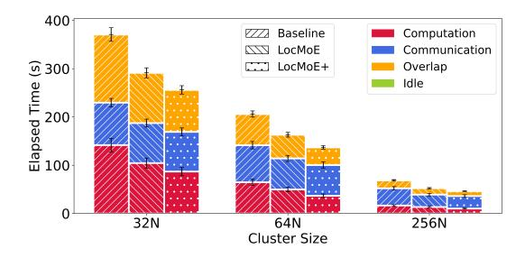
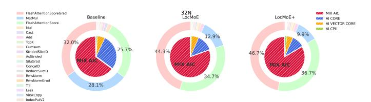
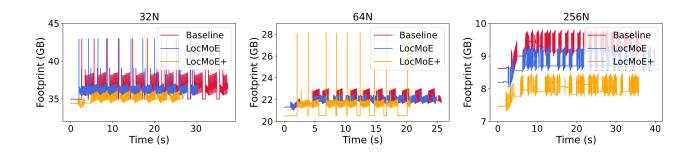
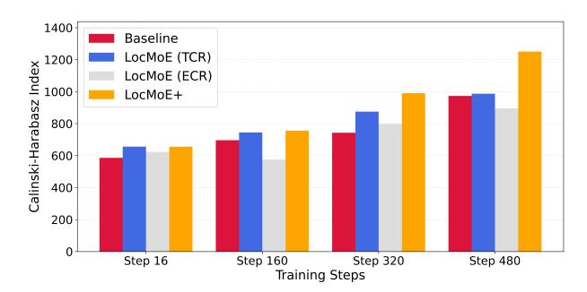
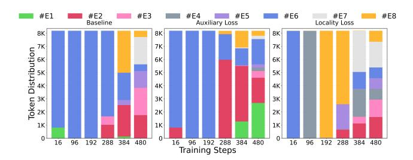
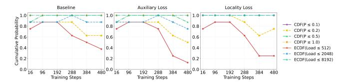

# Experiments

### Experimental Setup

We implement our approach using Mixtral 8×7B, a 46.7Bparameter model with Group Query Attention (GQA) and 32 sparse MoE blocks. Each block contains 8 experts, with tokens routed to their top-2 selections. To accommodate long-context applications, we extend the sequence length to 32,768 tokens. Our experiments span three cluster scales with tailored parallelization strategies: 32 NPUs (TP=4, PP=4, DP=2, EP=2), 64 NPUs (TP=8, PP=4, DP=2, EP=2), and 256 NPUs (TP=8, PP=8, DP=4, EP=2), maintaining a global batch size of 128 throughout. Additional experimental details are provided in the Appendix.

### Efficiency Promotion and Memory Footprint Reduction

We consistently employ Top-1 routing to align implementation with our theoretical framework. The baseline model uses constrained expert capacity rather than groupedGEMM, preventing token dropout with a capacity factor of 1.1. LocMoE incorporates distributional uniformity and estimates expert capacity via a theoreticallyderived lower bound formula from the initial batch, maintaining this value throughout training. Our approach ("Loc-MoE+" in figures) constrains score sum ranges, processes hidden states, and dynamically calculates expert capacity. The subsequent analysis examines training efficiency, convergence, and memory utilization across multiple Ascend cluster configurations.

Figure 4: The time consumption during training iterations with different schemes and cluster sizes.

Figure 4 presents the training overhead analysis across the initial 1000 training iterations. To ensure measurement stability and exclude initialization artifacts, we commence time profiling from the fifth iteration onward. The baseline model exhibits consistent temporal performance throughout the evaluation period. In contrast, LocMoE demonstrates a marginal decrease in execution time as training progresses, with this trend being particularly pronounced in the 32N and 64N configurations. This observation corroborates our hypothesis that locality-aware optimization achieves optimal efficiency when the number of experts meets or exceeds the number of computational nodes. Our proposed method introduces a modest computational overhead relative to Loc-MoE, attributable to the token rearrangement mechanism. However, this overhead diminishes progressively as token representations converge during training. Specifically, the convergence of token features leads to a reduction in the number of tokens requiring rearrangement, resulting in stabilized computational costs in later training phases. Empirically, our approach achieves a reduction in total training time ranging from 2.9% to 13.3% compared to LocMoE, and from 5.4% to 46.6% relative to the baseline configuration.

Figure 5 depicts the temporal distribution of computational phases across training. We sample performance metrics at ten equidistant intervals throughout training, capturing computation, communication, overlap, and idle time. While profiling introduces minor overhead, this methodology provides robust insights into system behavior.

Both LocMoE and our proposed method demonstrate reduced latency across all components, with computational overhead exhibiting more substantial improvements than communication costs. This efficiency gain follows a clear pattern: as cluster size expands, the computationcommunication overlap ratio decreases, accompanied by diminishing returns in computational speedup. This trend reflects the inherent scalability challenges in distributed MoE architectures.

Figure 5: The average composition of computation, communication, overlap, and idle with different schemes and cluster sizes.

Figure 6 validates that these efficiency improvements preserve model quality. All methods exhibit comparable convergence trajectories, confirming that our optimization strategy maintains training stability while delivering performance gains. The perplexity curves demonstrate that accelerated training does not compromise the fundamental learning dynamics of the model.

Figure 6: The perplexity during training iterations with different schemes.

Figure 7 presents the operator-level computational profiling across different hardware components. The system leverages AI CORE for matrix multiplication and convolution operations, AI VECTOR CORE for parallelized vector computations, MIX AIC for heterogeneous operator fusion, and AI CPU for specialized AI instruction execution. Our token selection strategy yields substantial performance gains: the FFN MatMul operator achieves a 17× speedup compared to the baseline and 2.6× improvement over LocMoE. This optimization translates to a 2.8× reduction in cumulative Mat-Mul execution time and a 2.6× decrease in Cube computational load. The rearrangement-associated operators (TopK and IndexPutV2) exhibit marginal overhead increases, representing an acceptable trade-off for the significant computational savings achieved through selective token processing.

Figure 7: The distribution of time consumption for operators.

Figure 8 analyzes memory consumption patterns during stable training phases, based on 100,000 memory profiling samples per device. Our approach demonstrates substantial memory efficiency gains, achieving 4.57-16.27% reduction compared to the baseline and 2.86-10.5% reduction compared to LocMoE. The memory optimization exhibits scaledependent characteristics: larger clusters show reduced computational overhead proportions and correspondingly narrower memory usage differentials. Furthermore, our method effectively eliminates transient memory spikes and reduces short-term memory fluctuations, contributing to more predictable and stable resource utilization throughout training.

Figure 8: print recorded in one acquisition cycle with different schemes and cluster sizes.

### Expert Homogenization and Load Distribution Analysis

The Calinski-Harabasz (CH) index (Lima and Cruz 2020) measurements reveal that bidirectional affinity selection significantly enhances token clustering quality in MoE architectures:

$$CH = \frac{\sum_{i=1}^{k} n_i ||c_i - c||^2}{\sum_{i=1}^{k} \sum_{x \in C_i} ||x - c_i||^2}$$
(13)

While baseline and single-mechanism approaches achieve comparable improvements, the integrated LocMoE+ method demonstrates superior performance, as shown in Figure 9. Combining token-to-expert and expert-to-token selection mechanisms creates synergistic effects that accelerate natural clustering tendencies during training. Our bidirectional approach establishes a positive feedback loop between token routing and expert affinity, fundamentally enhancing expert utilization efficiency through improved feature organization and specialization.

Figure 9: The Calinski-Harabasz index across training steps.

Figure 10 reveals fundamental differences in how various loss functions affect token distribution across experts. The baseline approach suffers from severe load imbalance, with certain experts becoming overloaded while others remain idle. The auxiliary loss method provides marginal improvements through regularization, yet distribution remains significantly skewed. The locality loss demonstrates transformative effects by incorporating architectural topology into the optimization objective, achieving balanced token allocation across all experts through KL divergence constraints that simultaneously minimize inter-node communication and prevent expert collapse.

Figure 10: The distribution of tokens assigned to experts with different loss function.

Figure 11 presents the cumulative distribution function (CDF) and empirical cumulative distribution function (ECDF) analysis across these routing methods throughout the training progression. The locality loss approach presents distinctly optimal characteristics across both CDF and ECDF measurements, maintaining consistently high performance levels throughout the training process with remarkable stability during later training phases. The sustained performance across different probability and load thresholds indicates that incorporating expert-token affinity into the routing objective creates robust optimization dynamics that preserve both routing quality and load distribution efficiency. These findings underscore the effectiveness of ETR in addressing the inherent challenges of expert-token assignment optimization, providing a principled foundation for scalable sparse model.

Figure 11: The CDF and ECDF of different schemes.

