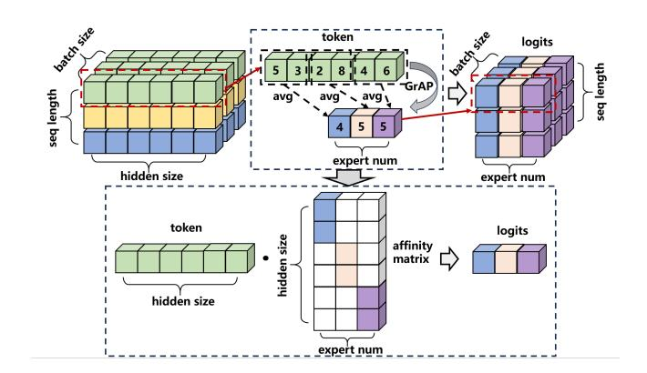
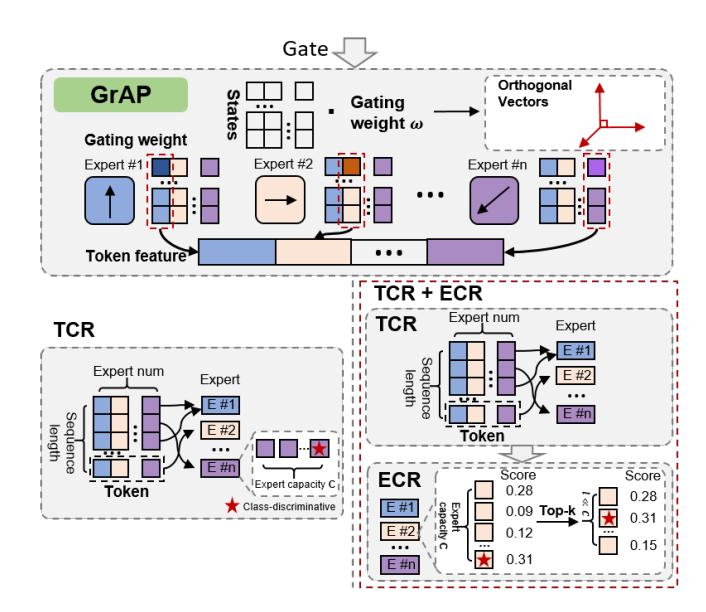

# Introduction

Large language models (LLMs) have demonstrated remarkable capabilities in understanding complex semantic relationships and generating coherent text (Zhao et al. 2023). However, as model parameters scale to billions or even trillions, the computational and communication costs grow prohibitively (Jiang et al. 2024b). The Mixture-of-Experts (MoE) architecture offers a promising solution by activating only a subset of model parameters for each input, enabling efficient model scaling without proportional increases in computational demands (Lepikhin et al. 2020; Fedus, Zoph, and Shazeer 2022). Recent MoE-based LLMs, such as DeepSeek-V3 (Liu et al. 2024a) and Mixtral (Jiang et al. 2024a), have achieved state-of-the-art performance across various benchmarks.

Despite these successes, MoE models face two fundamental challenges that limit their practical deployment and effectiveness. First, the routing efficiency problem: current routing mechanisms suffer from suboptimal token-toexpert assignments, leading to significant computational waste through excessive padding in All-to-All communications and underutilized expert capacity. Second, the expert homogenization problem: existing routing strategies often fail to maintain expert specialization, resulting in redundant computations where multiple experts learn similar representations. These challenges are particularly pronounced during early training phases when routing networks lack sophisticated assignment capabilities.

Previous approaches have attempted to address these issues separately. Load balancing techniques (Zhou et al. 2022b; Dai et al. 2022) focus on distributing tokens evenly across experts but often sacrifice routing quality. Expert specialization methods (Xie et al. 2024; Li et al. 2024) aim to maintain diversity but typically incur additional computational overhead. Critically, no existing work has demonstrated how to simultaneously improve both training efficiency and model performance through a unified routing mechanism.

This paper introduces Expert-Token Resonance (ETR), a novel bidirectional routing strategy that fundamentally rethinks how tokens and experts interact in MoE architectures. Our key insight is that optimal routing requires not only tokens selecting appropriate experts (token-choice routing, TCR) but also experts actively selecting their most relevant tokens (expert-choice routing, ECR). We theoretically prove that TCR achieves higher training success rates during early training when routing networks need refinement, while ECR excels in later stages when expert specialization becomes critical. By adaptively combining both paradigms,

\*These authors contributed equally.

ETR achieves what previous methods could not: simultaneous improvements in training efficiency and model performance.

Specifically, our contributions are threefold:

- 1. A theoretically-grounded bidirectional routing mechanism that dynamically balances token-choice and expert-choice routing based on training progress. We prove that this approach maximizes the training success rate—the probability of correct token-expert assignments—throughout the entire training process while reducing the required expert capacity lower bound by up to 40% compared to conventional methods.
- 2. An efficient affinity-based routing architecture leveraging Grouped Average Pooling (GrAP) layers that reduces computational complexity from  $O(d^2)$  to  $O(d^2/D)$  compared to traditional MLP routers, where d is the hidden dimension and D is the grouping factor. The orthogonality properties of GrAP naturally prevent expert homogenization while enabling precise affinity computations through cosine similarity.
- 3. Comprehensive empirical validation on Ascend NPU clusters demonstrating that ETR improves end-to-end training efficiency by 5.4%-46.6% compared to baseline MoE implementations and 2.9%-13.3% compared to state-of-the-art LocMoE, while simultaneously enhancing downstream task performance by 9.7%-14.5% and 1.7%-4.1%, respectively.

The significance of this work extends beyond incremental improvements. By addressing the fundamental trade-off between routing quality and computational efficiency, ETR enables practical deployment of larger MoE models that were previously constrained by communication bottlenecks. Our theoretical analysis provides new insights into the dynamics of expert-token interactions, opening avenues for future research in sparse model architectures.

#### **Related Work**

#### **Routing Mechanisms**

Routing design fundamentally determines MoE performance. Token-choice routing (TCR) (Shazeer et al. 2017a) allows tokens to select experts but suffers from load imbalance. Expert-choice routing (ECR) (Zhou et al. 2022a) ensures balanced loads by having experts select tokens, risking the loss of critical tokens. Recent dynamic routing strategies (Huang et al. 2024) adapt expert allocation to input complexity but remain unidirectional—either tokens choose experts or vice versa. This fundamental limitation prevents simultaneous optimization of routing quality and load balance.

#### **Expert Specialization**

Expert homogenization critically limits MoE performance. Prior work addressed this through fine-grained expert segmentation (Dai et al. 2024), competitive mechanisms (Pham et al. 2024), and theoretical analyses linking data clustering to specialization (Chen et al. 2022). However, these approaches require auxiliary losses or complex training procedures.

Figure 1: The illustrative diagram of GrAP.

#### **System Optimization**

System-level MoE optimizations focus on hardware utilization through block-sparse operations (Gale et al. 2022) and communication reduction via expert sharding (Balmau et al. 2025) or sequence migration (Chen et al. 2024). While these approaches improve specific bottlenecks, they overlook communication bubbles in All-to-All operations—a critical inefficiency.

#### **Positioning of This Work**

Recent surveys (Cai et al. 2024) reveal that existing MoE methods typically prioritize either routing quality or computational efficiency. Our ETR framework addresses previously overlooked communication inefficiencies and training bottleneck, suggesting potential for more efficient MoE deployment at scale.

#### Method

In this section, we present the efficient routing mechanism, and our adaptive bidirectional selection mechanism is detailed. Then, for traditional drop-and-pad strategies, a dynamic token distribution analysis module that optimizes the lower bounds of expert capacity are displayed. Moreover, we also describe the loss for expert load balancing.

#### Model Architecture.

**Backbone.** The MoE architecture, based on the Transformer framework, efficiently scales up model size with low computational overhead, benefiting from two primary structures: a sparse gating network for routing tokens and expert networks for processing specific token categories.

We consider the supervised classification for brevity where the training samples are  $\{(\boldsymbol{x}^{(i)}, y_i)\}_{i=1}^N \sim \mathcal{D}$ . Each training sample  $\boldsymbol{x}^\top = (\boldsymbol{x}_1^\top, \dots, \boldsymbol{x}_s^\top) \in \mathcal{R}^{sd}$  has s tokens with token feature  $\boldsymbol{x}_i \in \mathcal{R}^d, \forall i \in [s]$ , and label  $y \in \mathcal{N}^+$ . The objective is to learn the map of  $\boldsymbol{x}$  to the corresponding y. The general MoE structure are formulated as

$$MoE(\boldsymbol{x}) = \sum_{t=1}^{s} \sum_{i=1}^{n} G_i(\boldsymbol{x}_t) \cdot E_i(\boldsymbol{x}_t), \tag{1}$$

where n is the number of experts,  $G(\boldsymbol{x}_t) \colon \mathcal{R}^d \to \mathcal{R}^n$  is the gating weight vector of experts which maps the tokens of  $\boldsymbol{x}_t$  into the coresponding experts with weights, e.g.,  $G_i(\boldsymbol{x}) = \operatorname{Softmax}(\boldsymbol{W}\boldsymbol{x} + \boldsymbol{\epsilon})$  where the softmax is applied to each row, and  $E_i(\boldsymbol{x}_t) \colon \mathcal{R}^d \to \mathcal{R}$  is the i-th expert network, see (Liu et al. 2024b) for current different router methods. Generally,  $n \ll s$ , which saves much computation compared to the dense structure.

Cost-Efficient Sparse Expert-Token Affinity.  $W_{\rm aff}$  denotes the expert-token affinity matrix. After processing through the GrAP routing layer, tokens generate a diagonal sparse matrix as shown. Compared to the dense matrix produced by traditional routing layers, this reduces the parameter count to 1/D of the original, significantly decreasing the computational overhead of the expert routing layer.

As shown in Figure 1, GrAP performs average pooling with group segmented by the number of experts. With GrAP as the layer of feature extraction, the formulation of  $\boldsymbol{W}_{\rm aff}$  is as followed:

$$\mathbf{W}_{\text{aff}} = \begin{pmatrix} \mathbf{w}_1 & 0 & \cdots & 0 \\ 0 & \mathbf{w}_2 & \cdots & 0 \\ \vdots & \vdots & \ddots & \vdots \\ 0 & 0 & \cdots & \mathbf{w}_n \end{pmatrix}$$
 (2)

$$\mathbf{w}_i = \frac{n}{d} \cdot \mathbf{1} \left\{ \frac{i \cdot d}{n} \le j < (i+1) \frac{d}{n} \right\} \quad 0 \le j < d \quad (3)$$

The expert-token affinity matrix is employed as the gating weight to calculate the affinity score between each expert and token. We define the affinity score of t-th token and i-th expert as the cosine similarity between vectors  $x_t$  and  $w_i$ :

$$\delta_{ti} = \cos(\boldsymbol{x}_t, \boldsymbol{w}_i) := \boldsymbol{x}_t^{\top} \boldsymbol{w}_i / (\|\boldsymbol{x}_t\| \cdot \|\boldsymbol{w}_i\|) \tag{4}$$

The affinity score intuitively reflect how closely the two inputs are associated. From a perspective of semantic, the affinity scores derived from affinity metrics consisting of orthogonal vectors represent the degree of association between each token and various experts, as shown in Figure 2. Therefore, we leverage the affinity score as the principle of our affinity-driven active selection routing mechanism.

Figure 2: The illustration of affinity score.

**Routing Strategy.** We consider our affinity-driven active selection routing as a hybrid of TCR (Clark et al. 2022; Zhou et al. 2022b) and ECR. As the name suggested, TCR lets

Figure 3: The architecture of the gate network along with the hybrid TCR + ECR router.

each token choose its *top-scored* experts, and ECR lets each expert choose its *top-scored* tokens. Specifically, we use the result of the expert-token affinity metrics as the affinity score between tokens and experts. In conventional TCR routing strategy, the tokens are simply route to their Top-1 expert. In our hybird **TCR+ECR** routing strategy, experts also select tokens for processing from assigned tokens according to affinity scores:

$$\left(\tilde{E}_{t1}, \dots, \tilde{E}_{t\ell}\right) = \text{Top-}\ell\left(\left\{\delta_{t1}, \dots, \delta_{tn}\right\}\right),$$

$$\tilde{I}_{tk} \in [n], \forall t \in [s], k \in [\ell].$$
(5)

and then the expert to choose its Top- $\ell$  tokens where  $\ell$  is determined by a threshold of the sum of affinity scores:

$$(I_{1i}, \dots, I_{Ci}) = \text{Bottom-}C\left(\left\{t \in [s] : \exists j \in [\ell], \tilde{I}_{tj} = i\right\}\right),$$

$$I_{ki} \in [s] \cup \text{None}, \forall i \in [n], k \in [C].$$
(6

Such bidirectional selection mechanism motivates each expert to receive a certain number of tokens with the highest affinity score to itself, thereby achieving a resonance effect. The resonance effect can help mitigate the homogenization in MoE.

**Locality Loss.** Feed-forward network (FFN) layers are commonly employed in expert networks, allowing each expert to learn independently as a separate neural network, thus preventing interference between samples. This mechanism leads to a severe load imbalance, as experts frequently selected in the early stages are more likely to be chosen in later stages. To mitigate this skewness in token allocation, the auxiliary loss (Shazeer et al. 2017b) has been proposed. Building upon the auxiliary loss, our work introduces a loss bias term based on data locality, represented as  $L_{\rm loc} = \mu {\rm KL}(D_{\rm c}||D_{\rm l}) = -\mu \int D_{\rm c}(x) \ln[\frac{D_{\rm l}(x)}{D_{\rm c}(x)}] {\rm d}x$ , i.e., the

Kullback-Leibler (KL) divergence of the current distribution  $D_{\rm c}(x)$  and the fully localized distribution  $D_{\rm l}(x)$ . This loss term serves as a soft constraint, encouraging tokens to be sent to experts residing on the same node, thereby mitigating the substantial overhead incurred by partial inter-node communication.

#### **Training Strategy**

Token Distribution Dynamics under Expert Routing. The proposed hybrid TCR+ECR bidirectional routing mechanism operates through a two-stage process: tokens are initially assigned to experts based on the similarity between their feature fragments and the corresponding gating weights, followed by each expert selecting the Top- $\ell$  most relevant tokens through a scoring mechanism. This hybrid approach dynamically determines the number of tokens processed by each expert via an adaptive threshold, thereby ensuring the retention of class-discriminative tokens while optimizing computational efficiency.

**Dynamic Lower Bound Module for Expert Capacity in ETR** To explain the motivation of our method, we show some theoretical insights in this section.

**Assumption 1** (data assumption). Each input  $x \in \mathbb{R}^{sd}$  with s tokens is comprised of one class-discriminative pattern  $o_1, \ldots, o_n \in \mathbb{R}^d$ , with each decides the label in [n], and s-1 class-irrelevant patterns  $r \sim \mathcal{N}$  for certain distribution  $\mathcal{N}$ . For example,  $x = (r_1, r_2, o_1, r_3, \ldots, r_{s-1})$  has label 1, where  $r_i \stackrel{i.i.d.}{\sim} \mathcal{N}, \forall i \in [s-1]$ .

Based on Assumption 1, Chowdhury et al. (2023) demonstrated that the training of MoE go through two phases:

**Phase 1: Router training** This process ensures that each expert only receives the class-discriminative tokens related to the specific class.

**Phase 2: Expert training** This process is designed to establish each expert's ability to handle and solve problems.

To quantitatively measure the difference between TCR and ECR, we define **training success rate** of input motivated by the training process of MoE.

**Definition 2** (training success rate). We say the input  $x \in \mathbb{R}^{sd}$  with s tokens succeed in training if the class-discriminative pattern in x, e.g.,  $o_i$  is correctly dispatched to i-th expert. We further define **training success rate** as the probability that the input succeed in training.

Furthermore, to show the quantitative comparison of TCR and ECR in training success rate, we need following asssumptions and notations of token patterns.

**Assumption 3** (class-discriminative). We assume the location and feature of class-discriminative pattern is uniformly distribute in [s] and [n], i.e.,

$$i \sim \text{Unif}([s]), \boldsymbol{x}_i \sim \text{Unif}(\{\boldsymbol{o}_1, \dots, \boldsymbol{o}_n\}).$$
 (7)

We also assume that  $\forall i \in [n], \mathbf{o}_i$  should be sent to the i-th expert, and define the true positive probability in token choice setting is no worse than the uniform dispatch as below

$$\mathcal{P}(\delta_{o_i,i} \ge \delta_{x_i,i}, \forall j \in [s]) = p_i \ge 1/n, \forall i \in [n].$$
 (8)

**Assumption 4** (class-irrelevant). The distribution of class-irrelevant patterns is isotropy, i.e.,

$$\mathcal{P}(\boldsymbol{r} \sim \mathcal{N}, \delta_{\boldsymbol{r},i} \ge \delta_{\boldsymbol{x}_i,i}, \forall j \in [s]) = 1/n, \forall i \in [n]. \tag{9}$$

And we define the false positive probability in expert choice setting as

$$\mathcal{P}(\mathbf{r} \sim \mathcal{N}, \delta_{\mathbf{r},i} \ge \delta_{\mathbf{o}_{i},i}) = q_{i}, \forall i \in [n], \tag{10}$$

which measures the possibility that expert i chooses the wrong token r instead of the correct token  $o_i$ .

**Theorem 5.** Under Assumptions 3 and 4, the training success rate of TCR in each sample x is

$$\mathcal{P}(TCR \ succeed) = \Theta\left(C \sum_{i=1}^{n} p_i / s\right), \tag{11}$$

and the training success rate of ECR is  $\forall i \in [n]$ ,

$$\mathcal{P}(ECR \ succeed) \begin{cases} \leq \frac{1}{n} \sum_{i=1}^{n} e^{-\frac{(s-1)q_i}{8}}, & C \leq (s-1)q_i/2, \\ \geq 1 - e^{-3C/16}, & C \geq 2sq_i. \end{cases}$$
(12)

**Corollary 6.** In practice, For constant number of experts (Jiang et al. 2024a), i.e.,  $n = \Theta(1)$ , and C < s to save computation cost. We have the following lower bound for capacity C to ensure high training success rate:

- 1. Suppose  $q_i = \Theta(1)$ . Then TCR is much better than ECR, and we only need  $C = \Theta(s)$ .
- 2. Suppose  $\forall i \in [n], sq_i \leq C^*$  for some  $C^* > 0$ . Then ECR is much better than TCR, and we only need  $C \geq 2C^*$ .

**Remark 7.** Under the assumptions of orthogonal gating weights and uniform data distribution, we establish that the lower bound of expert capacity is given by  $C_{\min} = \frac{1}{n} \exp\{d\delta_{\max}^2/(2-\delta_{\max}^2)\}$ , where the capacity is intrinsically linked to the angular relationship between gating weights and tokens.

Building on Theorem 5 and the evolution of feature distributions during training, we demonstrate the optimality of transitioning from TCR to ECR. In early training stages, when class-irrelevant tokens exhibit near-isotropic distribution with  $q_i = \Theta(1)$ , TCR achieves superior training success rates of C/s compared to ECR's exponentially decaying rate of  $e^{-s}$ , necessitating a larger expert capacity of  $C = \Theta(s)$ . As training progresses and experts develop discriminative capabilities, the distribution shifts such that  $q_i \ll 1$  or  $sq_i \leq C^*$  for some constant  $C^* > 0$ , at which point ECR approaches unit success rate while TCR remains bounded by C/s, enabling efficient operation with reduced capacity  $C = \Theta(1)$  when  $C \geq 2C^*$ .

#### **Communication Optimization**

To mitigate the serial execution bottlenecks inherent in LLM training, we implement Communication Over Computation (CoC) optimization, which transforms sequentially dependent matrix multiplication and collective communication operations in parallel linear layers into unified, fine-grained kernels. By leveraging MTE's remote memory access capabilities, CoC fuses computation and communication primitives, enabling pipeline-parallel execution that overlaps previously serialized operations.

