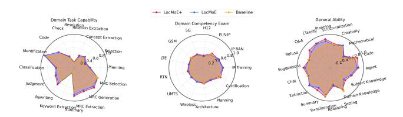

# The Performance of Downstream Tasks

The GDAD benchmark, comprising three distinct evaluation tasks, serves as the primary assessment framework for domain task capabilities, while TeleQnA provides specialized validation for telecommunications knowledge applications. Our integrated LocMoE+ approach consistently outperforms both baseline and single-mechanism variants across all evaluation metrics (see Table 1), achieving notable gains through bidirectional selection mechanisms. The consistent improvements observed across both general domain tasks and specialized telecommunications applications confirm that the synergistic combination of bidirectional selection mechanisms creates substantial performance advantages while validating the robustness and generalizability of our proposed architecture modifications.

Table 1: Domain performance promotion obtained by our approach on different datasets.

|              |      | GDAD                             |  |           |      |
|--------------|------|----------------------------------|--|-----------|------|
|              |      | GDAD-1 GDAD-2 GDAD-3 Avg TeleQnA |  |           |      |
| Baseline     | 47.8 | 43.0                             |  | 65.4 52.8 | 62.1 |
| LocMoE (TCR) | 55.5 | 47.6                             |  | 71.1 59.0 | 67.6 |
| LocMoE (ECR) | 45.8 | 45.6                             |  | 62.8 56.3 | 61.8 |
| LocMoE+      | 57.4 | 49.9                             |  | 74.5 61.5 | 68.8 |

Table 2 presents general performance evaluation results across three widely-recognized benchmarks—MMLU (Hendrycks et al. 2021) for comprehensive knowledge assessment, GPQA (Rein et al. 2023) for advanced reasoning capabilities, and HumanEval (Chen et al. 2021) for code generation proficiency—revealing distinct performance characteristics of our proposed methods. The results demonstrate that our bidirectional LocMoE+ approach achieves superior performance in reasoning and coding tasks while maintaining competitive general knowledge capabilities, with individual constraint routing mechanisms exhibiting complementary strengths across different evaluation dimensions. While the baseline maintains slight advantage in MMLU, the integrated LocMoE+ approach demonstrates that bidirectional selection mechanisms create meaningful improvements in task-specific capabilities without substantial degradation in general knowledge retention, suggesting that our architectural modifications enhance model specialization for complex reasoning and generation tasks while preserving foundational knowledge capabilities.

Table 2: General performance comparison of different MoE methods

| Method       | MMLU | GPQA | HumanEval |
|--------------|------|------|-----------|
| Baseline     | 71.8 | 29.2 | 40.2      |
| LocMoE (TCR) | 68.4 | 30.3 | 52.8      |
| LocMoE (ECR) | 45.8 | 32.5 | 57.6      |
| LocMoE+      | 70.4 | 33.5 | 67.8      |

To enhance conversational capabilities and downstream task adaptability, we conducted supervised fine-tuning on the pre-trained models. As shown in Figure 12, our approach demonstrates substantial improvements across multiple evaluation dimensions within the General and Domainspecific Assessment Dataset (GDAD). The method achieves an average improvement of approximately 20.1% across 16 sub-capabilities of Domain Task Capability compared to the baseline, with particularly notable gains in rewriting and summary capabilities. In the Domain Competency Exam assessments, our approach shows an average improvement of 16% relative to the baseline, with IP Training in digital communications demonstrating the most significant advancement. Among the 18 sub-capabilities of General Ability, the method exhibits an improvement of about 13.9% relative to the baseline, with planning capabilities showing the highest enhancement at 26.8%.

Figure 12: The performance on three categories of GDAD.

