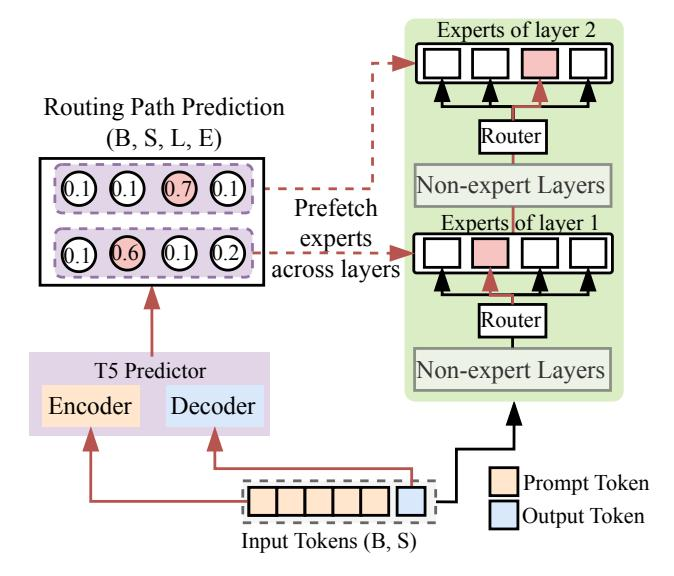

# 3.1 System Design Overview

Deploying MoE models under tight memory budgets, such as single-GPU settings, is challenging due to dynamic expert routing, low expert utilization, and heavy parameter movement. These issues are interdependent: inaccurate routing prediction limits scheduling, fragmented token batches activate unnecessary experts, and poor memory planning amplifies transfer overhead. *ExpertFlow* addresses these challenges through a unified design that integrates a routing path predictor (*RPP*), a token scheduler (*TS*), and an expert cache engine (*ECE*). The *RPP* provides early global routing signals, enabling the *TS* to reorganize tokens by predicted paths and the *ECE* to prefetch only the required experts. This prediction-informed coordination jointly optimizes expert execution, data movement, and memory usage, enabling efficient and scalable MoE inference on constrained hardware.

Figure 2: Routing Path Predictor (RPP). Given a batch of B sequences, each with S input tokens, RPP predicts MoE expert activations across L layers and E experts in a single pass. It outputs activation probabilities of shape (B, S, L, E) to support early expert prefetching.

