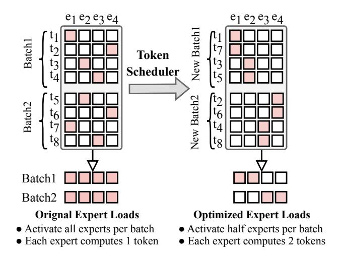

# 3.2 Routing Path Predictor (RPP)

3.2.1 Predictor Architecture. Existing predictors [12, 27] use MLPs to infer expert choices layer by layer, creating a sequential dependency that prevents early scheduling and prefetching. Expert-Flow replaces this design with a T5-style encoder—decoder architecture [22] (Fig. 2). The encoder embeds the full input sequence, and the decoder generates routing predictions in one pass. We attach *L* lightweight heads to the decoder, each producing logits over *E* experts for a specific MoE layer. This architecture exposes the complete routing plan before the first MoE layer executes, enabling early prefetching and coordinated memory planning.

3.2.2 Predictor Training. The predictor is trained to produce accurate routing paths for all L MoE layers, each comprising E experts, in a single forward pass. We log each token's expert selections and encode its routing path as a binary matrix  $r \in \{0,1\}^{L \times E}$ . The predictor outputs a probability matrix p of the same shape, and training is formulated as a multi-label classification task using binary cross-entropy:

$$\mathcal{L} = \frac{1}{LE} \sum_{l=1}^{L} \sum_{e=1}^{E} \left[ r_{l,e} \log p_{l,e} + (1 - r_{l,e}) \log (1 - p_{l,e}) \right]. \tag{1}$$

## 3.3 Token Scheduler (TS)

In the decoding stage, an adverse routing pattern can arise where each small batch activates almost all experts while each expert receives only one token. Fig. 3 (left) illustrates this worst case for a single MoE layer with four experts and two batches of size four: tokens in each batch select different experts, so every batch activates all experts, causing frequent expert swapping and low perexpert workload. To address this, we introduce the *Token Scheduler (TS)*, which rebatches tokens between two consecutive batches and groups tokens with similar expert selections into the same batch, as shown in Fig. 3 (right). This rebatching reduces the number of

active experts per batch while increasing the tokens per expert, improving cache reuse and GPU efficiency.

Figure 3: Token Scheduler (TS). Left: normal batch inference routes tokens to different experts, producing a worst-case pattern where all experts are active with only one token. Right: TS groups tokens with similar routing path into new batches, reducing active experts and increasing per-expert token load for better efficiency.

3.3.1 Mathematical Formulation. Each token's routing path is encoded as a binary matrix  $r_i \in \{0, 1\}^{L \times E}$ . For two adjacent batches with T tokens each, we merge all 2T tokens into a global set  $\mathcal{T} = \{1, 2, \ldots, 2T\}$  and seek to split it into two disjoint batches  $\mathcal{T}_1$  and  $\mathcal{T}_2$  of equal size. The routing matrices for the new batches,  $R_1$  and  $R_2$ , are obtained by applying an element-wise logical OR  $\vee$  over the routing paths of the tokens assigned to each batch  $R_1 = \bigvee_{i \in \mathcal{T}_1} r_i, R_2 = \bigvee_{i \in \mathcal{T}_2} r_i$ . The objective is to minimize the total number of activated experts across both batches:

$$\min_{\mathcal{T}_1, \mathcal{T}_2} \sum_{l=1}^{L} \sum_{e=1}^{E} \left( R_1^{l,e} + R_2^{l,e} \right), \tag{2}$$

where  $R_k^{l,e} = 1$  indicating that expert e at layer l is activated in batch k. This objective explicitly promotes expert-wise co-location of similar tokens to reduce cache misses and raise per-expert load.

3.3.2 *K-Means Clustering for Fast Token Rebatching.* Solving Eq. 2 exactly online is intractable, so we approximate it using a K-meansstyle clustering over routing-path similarity. For the 2T tokens, we construct a similarity matrix  $S \in \mathbb{R}^{2T \times 2T}$ , where  $S_{ij} = 1 - \frac{d_{ij}}{LE}$  measures how close the routing paths of tokens i and j are, with  $d_{ij}$  being their Hamming distance. We cluster tokens into two equalsize groups by iteratively assigning each token to the closest cluster under S and updating centroids as the tokens with the highest average intra-cluster similarity. The procedure converges quickly or stops after a preset iteration limit, yielding  $(\mathcal{T}_1, \mathcal{T}_2)$  as a fast approximation to Eq. 2 with negligible CPU overhead (<10ms).

3.3.3 Adaptive KV-Cache Management. Rebatching perturbs token orderings assumed by the transformer's key-value (KV) cache. TS therefore incorporates two lightweight primitives to preserve attention semantics: Merge, which reconstructs the KV cache by

aggregating token states according to global token order across the original batches; and **Reindex**, which updates token indices to the new layout for consistent KV lookup post-reordering.

3.3.4 Dual-Batch Inference Pipeline. We propose a Dual-Batch Inference Pipeline (Fig. 4) to hide the overhead of RPP and TS. The pipeline groups every two batches into one scheduling unit, which matches the requirement of TS to reorganize tokens across batches. During execution, model prefill and decoding for the current unit run in parallel with RPP and TS for the next unit. This interleaving avoids blocking and keeps the GPU well utilized.

Figure 4: Sequential pipeline versus our Dual-Batch pipeline.

