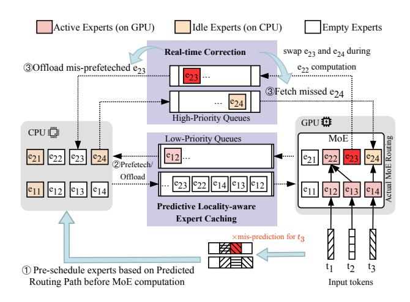
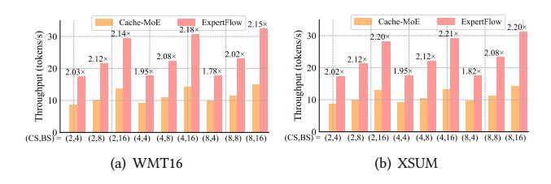
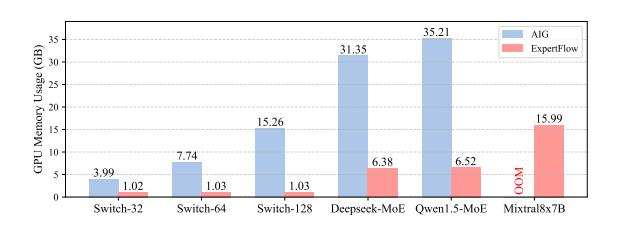
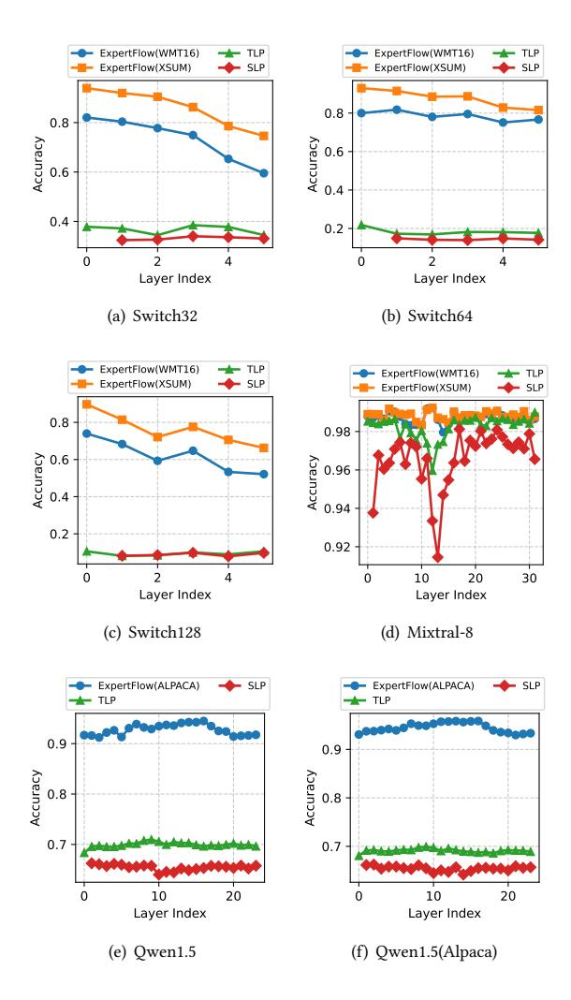
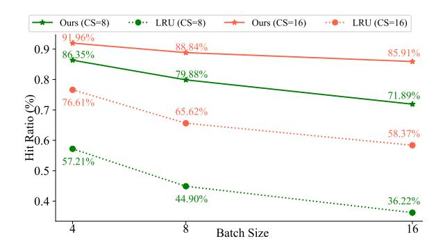

# 4 Evaluation

## 4.1 Setup

**Hardware Settings.** Our experiments were conducted on a single NVIDIA A40 GPU with 48 GB of memory and Intel(R) Xeon(R) Gold 6338 CPU @ 2.00GHz.

**Tasks and MoEs.** We evaluate on four datasets: Alpaca [30] for chat, WMT16 [2] for translation, XSUM [20] for summarization, and AIME2024 [11] for problem solving. Our experiments cover

Figure 5: The workflow of Expert Cache Engine (ECE). ECE pre-schedules experts to GPU based on routing predictions. During execution, it detects mispredictions (e.g., unwanted  $e_{23}$  or missed  $e_{24}$ ) and performs prioritized swaps while  $e_{22}$  runs, overlapping I/O with compute to maintain throughput.

| MoE          | L  | Act.P/P       | Act.E/E | E.P    |
|--------------|----|---------------|---------|--------|
| Switch-32    | 12 | 0.22/1.98 B   | 1/32    | 91.58% |
| Switch-64    | 12 | 0.22/3.79 B   | 1/64    | 95.61% |
| Switch-128   | 12 | 0.22/7.41 B   | 1/128   | 97.75% |
| Mixtral-8    | 32 | 12.90/46.70 B | 2/8     | 96.57% |
| Qwen1.5      | 24 | 2.70/14.30 B  | 4/60    | 88.95% |
| Deepseek-MoE | 27 | 2.80/16.40 B  | 6/64    | 94.14% |

Table 1: MoE Configurations. L, P, and E denote layers, total parameters, and experts per layer. Act.P and Act.E refer to activated parameters and experts per token. E.P is the expert-to-total parameter ratio.

six MoE models: Qwen1.5-MoE [31], Deepseek-MoE [5], Mixtral-8×7B [14], and Switch Transformer with 32, 64, and 128 experts [8]. Model specifications are provided in Table 1.

**Predictor Settings.** To evaluate robustness under domain shift, we consider two types of routing path predictors (*RPP*). An *indomain* predictor is trained on the same dataset used for inference, while a *cross-domain* predictor is trained on a different dataset. For example, when evaluating on WMT16, the in-domain *RPP* is trained on WMT16, whereas the cross-domain *RPP* is trained on XSUM.

#### 4.2 Inference Performance

4.2.1 Baselines. We compare against three representative methods. Cache-MoE [7] maintains a fixed per-layer expert cache with LRU replacement, falling back to CPU on misses. SE-MoE [35] preloads experts for multiple layers and employs ring scheduling to overlap compute and data movement. Pregated-MoE [12] trains MLP-based routers to select experts without runtime gating. All three are evaluated on Switch Transformers, which their implementations fully support. For Mixtral-8 and Qwen1.5, we report against Cache-MoE only, as other baselines lack architectural support and router weights; under these conditions, Cache-MoE is a strong baseline.

4.2.2 *In-domain Throughput.* We evaluate four model–dataset pairs (Switch on WMT16, Mixtral-8 on XSUM, Qwen1.5 on Alpaca and

Figure 6: Throughput across different MoE models and datasets. Our results are obtained using in-domain predictors.

Figure 7: Throughput comparison for Qwen1.5 on WMT16 and XSUM datasets. Our results are obtained using a cross-domain predictor trained on Alpaca.

Figure 8: GPU memory usage (GB) of All-in-GPU (AIG) and our offloading-based system for different MoE models.

Deepseek-MoE on AIME2024) under varying cache size (**CS**) and batch size (**BS**) (Fig. 6). For the Switch series (Fig. 6a), gains increase with the number of experts: at (CS=16, BS=32), our method yields 2.01×, 3.19×, and 5.86× speedups over *SE-MoE* on Switch-32/64/128, respectively. On Switch-128, tightening memory further amplifies benefits: reducing CS from 16 to 4 increases speedup from 5.86× to 9.99×. For Mixtral-8, Qwen1.5 and Deepseek-MoE (Figs. 6b–d), throughput improves with larger BS due to *TS*-enabled expert reuse; we outperform *Cache-MoE* by up to 1.99× (Mixtral-8), 2.12× (Qwen1.5) and 1.94× (Deepseek-MoE) via accurate prefetching and reduced load latency.

- 4.2.3 Cross-domain Throughput. To assess robustness, we apply an RPP trained on Alpaca to Qwen1.5 inference on XSUM and WMT16 (Fig. 7). Our method consistently surpasses Cache-MoE, achieving up to 2.18× (WMT16) and 2.21× (XSUM) at (CS=4, BS=16), indicating that the RPP captures expert-activation patterns that generalize across tasks.
- 4.2.4 Memory Cost. We compare peak GPU memory against an All-In-GPU (AIG) baseline that retains all parameters in GPU (Fig. 8). Our approach reduces memory by up to 93% across Switch models (e.g., Switch-128: 15.26 GB  $\rightarrow$  1.03 GB), from 31.35 GB to 6.38 GB on Deepseek-MoE, and from 35.21 GB to 6.52 GB on Qwen1.5. Notably, Mixtral-8×7B triggers OOM under AIG but completes with our system using only 15.99 GB.

## 4.3 Predictor Evaluation

- 4.3.1 Routing Path Datasets. For each combination of task (i.e., Alpaca, XSUM, and WMT16) and MoE model, we construct a Routing Path Dataset (*RPD*) to train and evaluate the routing predictor. We first sample 10,000 input sequences and run each sequence through the MoE model three times to collect diverse output tokens and the corresponding routing paths of both inputs and outputs. This yields 30,000 input–output–path triples per *RPD*. Each *RPD* is then split into training and test sets.
- 4.3.2 Predictor Settings. To balance between performance and size, we conducted grid search on predictor architecture settings. The final RPP has a feed-forward dimension of 2048, and a hidden size of 32, resulting in a 7.21 MB model size.
- 4.3.3 Evaluation Metrics. To assess prediction performance in an MoE model with L layers and E experts per layer, we define the batch-level accuracy ( $\mathbb{B}_{acc}$ ) as:

$$\mathbb{B}_{\mathrm{acc}} = \frac{1}{L} \sum_{i=0}^{L-1} \frac{\sum_{j=0}^{E-1} \mathbb{I}(R_{\mathrm{batch}}[i,j] = 1 \,\&\, \hat{R}_{\mathrm{batch}}[i,j] = 1)}{\sum_{i=0}^{E-1} \mathbb{I}(R_{\mathrm{batch}}[i,j] = 1)},$$

where  $R_{\text{batch}}$  and  $\hat{R}_{\text{batch}}$  are the ground-truth and predicted batchlevel routing matrices, respectively, both in  $\{0,1\}^{L\times E}$ . We apply a bitwise OR over the token-level routing paths  $r_i \in \{0,1\}^{L\times E}$  to get the batch-level results  $R_{\text{batch}} = r_1 \vee r_2 \vee \cdots \vee r_n$ .

4.3.4 Predictor Performance. Fig. 9 presents the performance of our routing path predictor (RPP) and two baselines: temporal-locality prediction (TLP), which uses the previous decoding step's routing, and spatial-locality prediction (SLP), which relies on the previous layer's expert assignment. Both are simple heuristics that lack context-awareness.

*RPP* consistently achieves high prediction accuracy across MoE models and datasets. It outperforms both TLP and SLP in all settings, with over 90% accuracy in most in-domain cases and only a modest drop (typically 5–10%) in cross-domain scenarios. For example, on Switch64 (Fig. 9b), our predictor maintains 80–90% accuracy in both domains, while baselines remain below 20%. This highlights *RPP*'s strong generalization ability. Additionally, TLP consistently surpasses SLP, suggesting that temporal cues are more predictive than layer-wise locality.

Despite differing routing mechanisms, *RPP* adapts well across models. On Switch models (a–c), accuracy declines with depth and expert count, reflecting increased uncertainty. Mixtral-8 (d) shows larger prediction variance for baselines due to its Top-2 routing, while *RPP* remains above 90% and more stable. On Qwen1.5 (e–f), our predictor achieves the highest accuracy (over 95%), with minimal domain shift impact. These results demonstrate *RPP*'s ability to capture complex and model-specific expert behaviors.

Figure 9: Layer-wise expert prediction accuracy across MoE models. "ExpertFlow(dataset)" indicates our predictor trained on the specified dataset (e.g., XSUM or WMT16). Orange and blue curves represent in-domain and cross-domain prediction accuracy, respectively. Subfigures (a-e) report accuracy on XSUM; (f) shows in-domain results on Alpaca. Our method consistently outperforms temporal-locality prediction (TLP) and spatial-locality prediction (SLP) baselines across all cases.

#### 4.4 Ablation Study

4.4.1 Expert Cache Hit Ratio. Fig. 10 compares expert cache hit ratios between LRU and our PLEC strategy on Switch-32. Our approach consistently outperforms LRU, with hit rates 15-36% higher across all configurations. At CS=16, PLEC maintains high hit ratios (91.90% to 85.91%, only 6.05% decrease) as batch size increases from 4 to 16, while LRU drops significantly (76.61% to 58.37%, an 18.24% decline). The performance gap widens at larger batch sizes, with PLEC achieving 71.89% hit ratio at CS=8/BS=16 compared to LRU's 36.22%. This stability demonstrates our predictive approach's effectiveness in allocating cache resources based on anticipated expert patterns, particularly beneficial in high-throughput scenarios.

4.4.2 Impact of Token Scheduler (TS) under Varying Expert Counts. We evaluate the TS on the Switch-series models to study its impact

Figure 10: Comparison of expert cache hit ratio on Switch-32 under different batch size and cache size (CS).

Table 2: Impact of the Token Scheduler (TS) on throughput.

| Model      | Throughput (tokens/second) |                |  |  |
|------------|----------------------------|----------------|--|--|
| Model      | w/o TS                     | with TS        |  |  |
| Switch-32  | 854.19                     | 881.91 (1.03×) |  |  |
| Switch-64  | 680.72                     | 788.30 (1.15×) |  |  |
| Switch-128 | 628.36                     | 735.35 (1.17×) |  |  |

under different expert counts. This setup allows us to isolate the effect of TS as model sparsity increases. As shown in Table 2, TS yields consistent throughput improvements:  $1.03\times$  on Switch-32,  $1.15\times$  on Switch-64, and  $1.17\times$  on Switch-128. While the absolute gains vary, a general trend of improved benefit with more experts is observed. This is attributed to the fact that, with a larger number of experts, token-to-expert assignments tend to become more fragmented. TS alleviates this by rebatching tokens with similar routing paths, improving load balance and computational efficiency across experts.

## 5 Conclusion

We introduced *ExpertFlow*, a unified system for memory-efficient MoE inference under tight GPU constraints. By integrating a **Routing Path Predictor**, a routing-aware **Token Scheduler**, and a predictive **Expert Cache Engine**, *ExpertFlow* enables early expert planning, higher expert utilization, and reduced CPU–GPU transfers, yielding up to 93.72% peak memory reduction and up to 10× throughput improvement across diverse MoE architectures when compared with strong offloading baselines. Accurate routing prediction also shows broader value for distributed expert placement, routing-guided pruning, and hierarchical caching, positioning *ExpertFlow* as a foundation for future system-level co-design that incorporates predictive routing into scalable sparse model deployment and training.

## Acknowledgments

This research is supported by the Career Development Fund (CDF) of the Agency for Science, Technology and Research (A\*STAR), Singapore (No. C243512012); partially by the National Natural Science Foundation of China (NSFC) (No. 62302123) and the Shenzhen Science and Technology Program (Nos. KJZD20240903104103005, KJZD20230923114213027, KJZD20230923115113026); and partially by the National Research Foundation (NRF), Singapore, through the AI Singapore Programme under the project titled "AI-based Urban Cooling Technology Development" (Award No. AISG3-TC-2024-014-SGKR).

