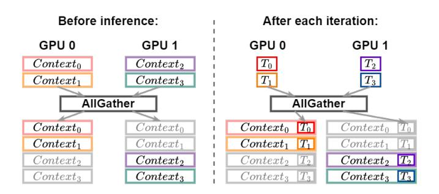
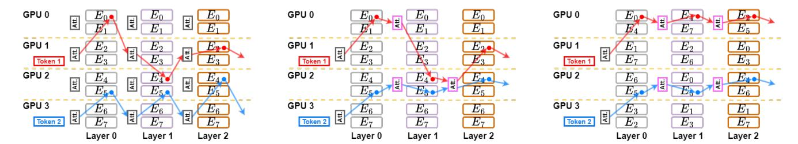

# B. Map Expert Affinity to Hardware Topology

Since the goal is to minimize the inference latency of MoE models with expert parallelism, we are interested in reducing the Alltoall communication overhead as much as possible. Therefore, identifying expert affinity in a pre-trained MoE model is our first step, properly mapping this affinity to the underlying hardware is a crucial task. Given a pre-trained MoE model, the inference could happen on a variety of hardware configurations, thus we need a ubiquitous mapping algorithm so that our design can seamlessly adapt to heterogeneous topologies without necessitating any modifications or fine-tuning of the MoE model.

#### IV. DESIGN OF EXFLOW

In this section, we first introduce the context-coherent expert parallelism. We will try to overcome the data locality constraint as mentioned above, as this is crucial when we later exploit expert affinity. Then we will introduce how to model expert affinity in an effective manner, and utilize it to largely accelerate the inference of GPT MoE models.

#### A. Token Context Coherence in Expert Parallelism

Before diving into our design, we would like to revisit the inference pipeline of GPT models. Given a pre-trained GPT model and an inference request, it takes l words per the request as the input, this is usually called **Prompts**. Prompts are essentially tokens. When the model tries to generate a response for this request, it will refer to prompts for context information. As GPT is indeed a generative model, it will generate one or a few words in each iteration, and append them to the current prompt tokens, which then become the context for generating words in the next iteration. Importantly, once generated, these tokens remain immutable in subsequent iterations, serving purely as context and not undergoing further transformations or updates by the network. For simplicity, we use the term context to represent prompts as well as tokens generated in previous iterations. Suppose we have n GPUs in the data parallel group, to achieve token context coherence across all GPUs in the group, we will focus on both the beforeinference and after-iteration parts involved in the overall MoE inference process, as shown in Fig 4.

Fig. 4: Before inference, we use Allgather to ensure every GPU has all contexts. After each iteration, another Allgather is performed on the newly generated tokens, we then append them to the current contexts for the next iteration.

At the start of inference, GPU i has  $g_i$  requests,  $i \in \{1, 2, ..., n\}$ , we will first perform an **AllGather** communication across GPUs where each GPU will broadcast its  $g_i$  contexts to all other GPUs. After this, every GPU in the group will have  $\sum_{i=1}^{n} g_i$  contexts, meaning that all contexts are now coherent across all GPUs. Note that, even though each GPU now has

Fig. 5: Each GPU has a capacity of 2 experts per layer. (a). Vanilla expert parallelism. Each token needs to come back to its original GPU to perform attention computation with its context. (b). Enabling token context coherence across all GPUs. Tokens do not need to go back to the original GPU to perform attention computation, because they can attend to their context on the local GPU. (c). Exploiting expert affinity to further reduce token communication. The placement of experts on each layer is now following an optimal pattern such that tokens will remain on local GPUs with the maximum probability.

contexts from other GPUs, it will still only generate tokens for its own requests, adhering to data parallelism principles.

Upon iteration completion, each GPU has generated some tokens for its own requests, in order to make sure contexts are still coherent in the next iteration, we need each GPU to broadcast these newly generated tokens to other GPUs. Thus, we also perform an additional AllGather operation across the group. By doing so, at the beginning of a new iteration, every GPU has the up-to-date context of all requests.

What are the benefits of ensuring token context coherence? In Fig [3,](#page-3-1) we mentioned the reason that current expert parallelism strictly requires two Alltoall operations, which is due to the data exclusion as current expert parallelism implicitly exhibits data parallel. Now, as the contexts are coherent and visible on all GPUs for all tokens, a token can perform in-place attention computation with its context, no matter which GPU it is currently on.

Fig [16](#page-14-0) shows a 3-layer MoE-8 model running on 4 GPUs, where each GPU holds two experts per layer. We have token 1 on GPU 1 and token 2 on GPU 3. Token 1 will be routed to E0 on layer 0, E4 on layer 1, E2 on layer 2 respectively. Token 2 will be routed to E5 on layer 0, E5 on layer 1, E4 on layer 2 respectively. Fig [16\(](#page-14-0)a) depicts the path that token 1 and token 2 will traverse following the vanilla expert parallel pattern. After each layer, both tokens need to go back to their original GPUs to compute the attention. Notably, for token 2, even if all the experts on its path are on GPU 2, it still has to frequently return to GPU 3 as its context is not coherently visible on GPU 2. For the given example, token 1 requires four cross-GPU communications, and token 2 requires six cross-GPU communications. Fig [16\(](#page-14-0)b) illustrates, however, the path both tokens take when we use context-coherent expert parallelism. For token 1, when it is routed to GPU 0 at layer 0, it finishes the E0 FFN, and performs an in-place attention computation with its context stored on GPU 0. Then, it does not have to come back to GPU 1, rather, it can directly go to E4 at layer 1, which saves 1 cross-GPU communication. For token 2, the improvement is extraordinary, since all the experts on its path are on GPU 2, it only requires one cross-GPU communication on layer 0, after which, all FFNs and attention can be performed in place on GPU 2. Note that, the gating

function is shared among all GPUs, so that no matter the token on which GPU, the gating function can always route it to the right expert.

Tab [I](#page-3-0) shows the overall communication volume in our context-coherent expert parallelism compared to existing methods, such as FasterMoE [\[13\]](#page-10-8), TA-MoE [\[14\]](#page-10-7), and Deepspeed-MoE [\[12\]](#page-10-6). In our design, we cut down half of Alltoalls, while introducing an AllGather at the end of every iteration. We find that as the model has more layers, the overhead of AllGather becomes less significant as it only happens at the last layer.

