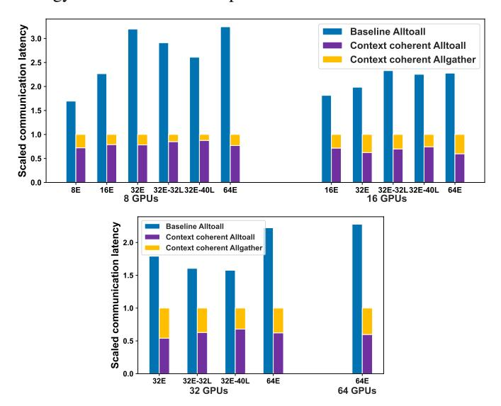

# *D. Solving Affinity's duality by Integer Programming*

In formula [2,](#page-4-0) [5,](#page-5-0) and [6,](#page-5-1) we provide straightforward objective functions to find such a placement of experts that ensures the best expert affinity. However, as we mentioned, these objective functions only stand in the perspective of one GPU. Finding the best expert placement strategy for all GPUs on all nodes is, however, a complicated combinatorial optimization problem.

To circumvent this, we pivot our focus to its associated Lagrange Dual Problem. The idea is to transform our maximization problem into an equivalent minimization problem, which is computationally more tractable. In essence, high affinity implies minimal token re-routing. Thus, the duality emerges from these intertwined objectives: one seeks positive reinforcement through affinity, and the other targets minimization of disruptions to this affinity. To transition to the dual problem, we must establish the relationship between maximizing this aggregate affinity and minimizing token re-routing costs. This naturally leads us to consider the disruptions to affinity, which can be quantified as token re-routing costs between GPUs.

Given our objective to minimize token re-routing, we form the dual function g(λ):

$$g(\lambda, E_{i,j}) = \inf_{E_{p,j+1}} \left[ P(E_{p,j+1}|E_{i,j}) - \lambda G(E_{p,j+1}, E_{i,j}) \right] \tag{7}$$

Where G(Ep,j+1, Ei,j ) represents the cost associated with rerouting tokens due to expert selections on disparate GPUs, and λ serves as a regularization term to balance affinity and token re-routing.

Since inter-node communication always has the highest latency and lowest bandwidth, our first priority is to reduce the amount of inter-node routing. Fig [1](#page-0-0) (b) shows an example of the staged expert affinity, where green arrows denote high expert affinity, red ones denote medium level of affinity, and blue ones denote the lowest expert affinity. Our goal is to keep high-affinity experts inside single GPUs, and keep mediumaffinity experts inside single nodes. In stage 1, we will reduce

the inter-node routing as much as possible, and in **stage 2**, we will minimize the intra-node routing based on stage 1 results. Therefore, we propose a coefficient-free objective function following a top-down optimization strategy.

Formula 8 is the objective function, where  $x_{i,j}^p$  is a binary variable, denoting whether  $E_{i,j}$  is held by GPU p,  $R_{k,j}$  is a binary variable, equaling to one denotes that for a token kat layer j, it will be routed to an expert outside of current node(or GPU). Note that, here we apply the exactly identical object function to both stage 1 and 2 (as mentioned above). In stage 1,  $R_{k,i} = 1$  represents an inter-node routing, while in stage 2, it represents an intra-node routing. For constraints, we need all nodes(or GPUs) to be load-balanced, meaning that for every layer, each node(or GPU) should hold the same number of experts, which is defined by formula 9, where E denotes the total number of experts per layer, and P denotes the total number of nodes(or GPUs). Furthermore, for completeness, we need formula 10 to make sure each expert is exclusively held by one node(or GPU). Formula 11 and 12 are the essential inequities that map the placement of experts to whether a specific routing is cross-node(or GPU) or not. After solving the above integer linear programming problem, variable  $x_{i,j}^p$ in the solution will be directly used as the expert placement strategy when loading the MoE model to GPUs.

$$\begin{array}{ll} \text{Minimize} & \sum_{k=1}^{N} \sum_{j=1}^{L-1} R_{k,j} & (8) \\ \text{Variable} & x_{i,j}^{p} \in \{0,1\}, R_{k,j} \in \{0,1\} \\ \text{Subject to} & \sum_{i=1}^{E} x_{i,j}^{p} = \frac{E}{P}, \\ & \forall j \in \{1,2,\ldots,L\}, p \in \{1,2,\ldots,P\} & (9) \\ & \sum_{p=1}^{P} x_{i,j}^{p} = 1, \\ & \forall j \in \{1,2,\ldots,L\}, i \in \{1,2,\ldots,E\} & (10) \\ & R_{k,j} \geq x_{i,j}^{p} - x_{i,i+1}^{p} & (11) \end{array}$$

#### E. Insensitivity of Expert Affinity

In order to precisely capture the inter-layer expert affinity in a pre-trained MoE model, we need to use enough tokens and trace their routing decision at each MoE layer. As the goal is to accelerate the inference, we also need to investigate whether expert affinity is insensitive to the distribution of the dataset. The reason is that we cannot predict the actual tokens and their contexts when the model is serving requests from users, therefore, the expert affinity we learned from the offline dataset must remain effective during online inference. We will further analyze this in the experiment.

 $R_{k,j} \ge x_{i,j+1}^p - x_{i,j}^p$ 

#### V. EXPERIMENTAL EVALUATION

#### A. Setups

**Hardware:** We conduct all experiments on Wilkes3 Ampere GPU cluster, where each node has 2 AMD EPYC 7763 64-Core processors, and 4 NVIDIA A100-SXM4-80GB GPUs, connected by NVLINK. For inter-node, it is equipped with dual-rail Mellanox HDR200 InfiniBand interconnect.

**Models:** We use the Deepspeed-Megatron [26], [27] library for pre-training. During inference, all models are with Top-1 gating and variable token capacity.1

| Model        | Base | Experts | Layers | D    |
|--------------|------|---------|--------|------|
|              |      | 8 16 |        | 1024 |
| MoE GPT-M    | 350M | 32      | 24     |      |
|              |      | 64      |        |      |
| MoE GPT-M    | 470M | 32      | 32     | 1024 |
| WICE OF T WI | 590M | 32      | 40     |      |
| MoE GPT-XL   | 1.3B | 16      | 24     | 2048 |

TABLE II: List of MoE models we used for experiments.

**Datasets:** We split the Pile [25] dataset into a training set and an evaluation set. The training set is used to train the model, during the training, we record tokens' expert routing decisions at every layer. We solve the objective function 8 based on the tracing logs and then determine the expert placement strategy. Then, we load the model onto GPUs following the placement strategy and benchmark the performance on the evaluation set.

Fig. 6: On various pre-trained GPT MoE models, we change the expert parallel size and test overall communication overhead. 32L and 40L denote the GPT models with 32 and 40 layers.

(12)

&lt;sup>1Code will be available at https://github.com/YJHMITWEB/ExFlow.

