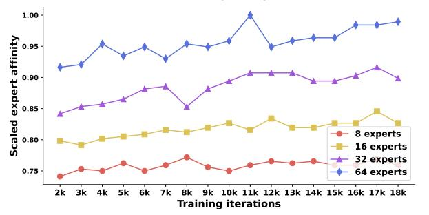

# *F. Evolving Properties of Expert Affinity during the MoE Model Training*

In this part, we want to investigate how expert affinity evolves with the model training. Fig [11](#page-8-1) shows the expert routing proportion at the start of training. Here we only show the stats of the last MoE layer for simplicity, as we validate that other MoE layers have similar distribution. At the onset of training, the model exhibits a highly skewed distribution, indicative of a pronounced imbalance among experts, which matches the result in other studies [\[13\]](#page-10-8). However, as the training advances, a more uniform and balanced distribution is observed. This is also reflected in Fig [12a,](#page-9-1) where we measure the expert affinity by solving formula [8](#page-6-1) at different iterations of the training. The first hundreds of iterations see only a few experts frequently activated per MoE layer, and the model can indeed have a very

(a) Scaled expert affinity during the training iteration 0 to 2000. We observe some oscillations in the beginning.

(b) Scaled expert affinity during the training iteration 2000 to 18000. As the training proceeds, expert affinity steadily increases.

Fig. 12: Investigate the expert affinity as the model is trained from scratch. The affinity is scaled for better visualization.

high expert affinity because most tokens are routed to a fixed set of experts at every layer. After passing the initial stage, the expert routing distribution becomes diverse, and therefore affinity decreases as there are more experts involved in the routing. After the first 2k iterations of training, the model starts to exhibit a much more steady expert affinity and it keeps increasing as experts become more domain-specific, thus the affinity gets more salient among experts at different layers.

