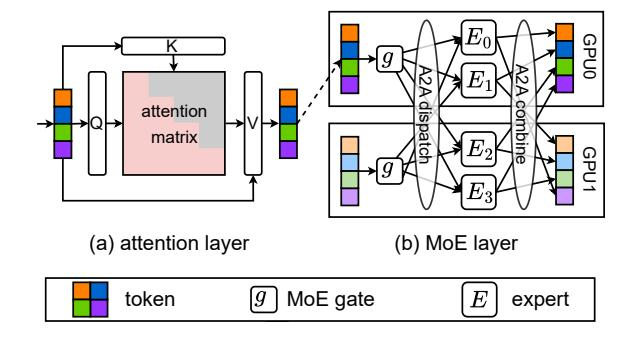
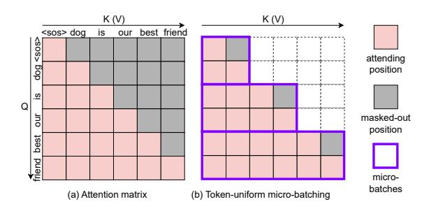
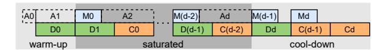

# 2 Background

#### <span id="page-2-4"></span>2.1 Transformer-MoE Block

Contemporary MoE models (Jiang et al., 2024a; Liu et al., 2024; Li et al., 2025) consist of stacked decoder-only Transformer-MoE blocks <sup>1</sup>, each containing an attention layer followed by an MoE layer (Figure 3). Only in attention layer do tokens compute to interact with each other, while the remaining part performs token-wise operations, allowing token-level input partitioning. For details of Transformer language modeling, please refer to Appx. A.

Causal attention in decoder models. The attention layer uses masked self-attention (Vaswani et al., 2017). For an input sequence  $(\mathbf{x_1}, \mathbf{x_2}, \dots, \mathbf{x_n})$ , it first projects each token  $\mathbf{x_i}$  into three vectors: query  $\mathbf{q_i}$ , key  $\mathbf{k_i}$ , and value  $\mathbf{v_i}$ , and then applies masked self-attention as:

$$Attn(\mathbf{x_t}; \mathbf{x_1}, \dots, \mathbf{x_{t-1}}) = \sum_{i=1}^{t} \operatorname{softmax}(\frac{\mathbf{q_t}^T \mathbf{k_i}}{\sqrt{d_k}}) \mathbf{v_i}$$
(1)

, where  $\mathbf{k}_i \in \mathbb{R}^{d_k}$ . Note that each query  $\mathbf{q_t}$  only requires  $\mathbf{k_1}, \mathbf{k_2}, \dots, \mathbf{k_{t-1}}$  and  $\mathbf{v_1}, \mathbf{v_2}, \dots, \mathbf{v_{t-1}}$  (i.e., KV pairs of its previous tokens) for masked attention. This causal property enables pipelining the attention computation along sequence dimension. While prior works (Li et al., 2021; Sun et al., 2024; Ma et al., 2024) focused on pipelined attention to optimize computational device utilization, we instead exploit this property to enhance communication-computation overlap in MoE model training.

<span id="page-2-1"></span>

Figure 3: A Transformer-MoE block consists of an attention layer followed by an MoE layer. (b) shows a 4-expert MoE layer with a top-1 gate under 2-way expert parallelism.

Mixture-of-Experts layer. An MoE layer comprises a gate and multiple expert networks. Given an input token  $\mathbf{x}$ , the gate assigns a score  $g(\mathbf{x})_i$  to indicate its affinity with each expert  $E_i$ . Based on these scores, the token is routed to top-k experts  $\tau$ . These experts process each token independently, and their outputs are aggregated as the final output, as shown in Equation 2. Since experts process data in token-wise manner, computation of MoE layer for a sequence of tokens is inherently chunkable on token level.

<span id="page-2-2"></span>
$$MoE(\mathbf{x}) = \sum_{i \in \tau} g(\mathbf{x})_i E_i(\mathbf{x})$$
 (2)

Expert parallelism (EP) (Shazeer et al., 2017) is commonly used for training larger MoE by distributing experts across multiple devices (e.g., GPUs), as illustrated in Figure 3b. Tokens are dispatched to experts residing on different devices, and results are collected back to the original devices for the following operations. This necessitates two symmetric A2A communications for exchanging tokens among devices, referred to as A2A dispatch and A2A combine, respectively. For more details about MoE, please refer to Appx. B.

#### <span id="page-2-3"></span>2.2 Comm.-Comp. Overlapping

To tackle the A2A bottleneck of MoE training, previous works proposed to hide A2A communication in computation. When training with relatively short sequences, *sequence-level overlapping* (Jiang et al., 2024b; Liu et al., 2024) can be applied to partition inputs on batch dimension, overlapping the A2A and computation of different sequences. This approach runs on the dimension of pipeline parallelism (Huang et al., 2019; Narayanan et al., 2019), requiring large enough

<span id="page-2-0"></span><sup>&</sup>lt;sup>1</sup>For brevity, we will refer to Transformer-MoE blocks simply as Transformer blocks in this paper.

training batch to be partitioned into micro-batches with less number of sequences. However, when training with long sequences, where maximum allowed batch size is decreased by large single sequence memory usage, this coarse-grained partitioning causes large pipeline bubbles (Li et al., 2021) and reduced overlapping efficiency. cases with extremely long sequences squeezing the batch size to be one, this approach becomes infeasible. On the other hand, token-level overlapping partitions inputs on token level (Hwang et al., 2022; He et al., 2022; Li et al., 2025), enabling finer granularity of pipelining and overlapping for long sequence training. Unfortunately, this token-level overlapping is designed only in MoE layer, as shown in Figure 2a, where the relatively small computation-to-communication ratio makes it hard to fully hide the A2A latency. We extend the existing token-level overlapping from MoE layers to the entire Transformer block, enabling fully overlap of A2A communication with computation.

#### 3 Attention-MoE Pipelining

For a given input sequence  $X = (\mathbf{x_1}, \mathbf{x_2}, \dots, \mathbf{x_n})$  of n tokens, a Transformer block computes the output sequence  $Y = (\mathbf{y_1}, \mathbf{y_2}, \dots, \mathbf{y_n})$ :

$$\mathbf{z_t} = \operatorname{Attn}(\mathbf{x_t}; \mathbf{x_1}, \dots, \mathbf{x_{t-1}}) \tag{3}$$

$$\mathbf{v_t} = \mathrm{MoE}(\mathbf{z_t}) \tag{4}$$

To establish an attention-MoE pipeline, we partition a Transformer block into four sequential pipeline stages: "attention computation  $\rightarrow$  A2A dispatch  $\rightarrow$  expert computation  $\rightarrow$  A2A combine", where the first stage is executed in the attention layer (Equation 3), while the remaining three stages operate in the MoE layer (Equation 4). Each sequence input to the Transformer block is sliced into micro-batches (i.e., sub-sequences) and fed into attention layer sequentially.

Attention computation can be pipelined by preserving the computed keys and values for each token. Denote  $X_{i:j}$  as the sub-sequence from the i-th to j-th token in the input sequence, with similar notation for keys  $K_{i:j}$ , values  $V_{i:j}$ , and attention outputs  $Z_{i:j}$ . Following Equation 1, computing attention for token  $\mathbf{x_t}$  requires only  $K_{1:t-1}$ ,  $V_{1:t-1}$  (i.e., keys and values of preceding tokens) and the token itself. This property allows us to partition inputs along the sequence dimension into microbatches, where each micro-batch only requires

access to keys and values from previous microbatches, as shown in Figure 5b. By maintaining computed keys and values during processing, attention computation can be performed in microbatches while overlapping with downstream MoE communication from previous micro-batches, as illustrated in Figure 2b. For instance, given an 8-token input sequence X sliced into micro-batches  $X_{1:4}$  and  $X_{5:8}$ , the attention layer first processes  $X_{1:4}$  to generate  $Z_{1:4}$ , storing  $K_{1:4}$  and  $V_{1:4}$  for subsequent use. The attention computation for  $X_{5:8}$  can then commence immediately, running in parallel with the A2A dispatch of  $Z_{1:4}$  in the MoE layer.

The MoE layer similarly supports pipelining to overlap expert computation with A2A communication of different micro-batches. The token-wise nature of MoE computation enables sequence partitioning into token micro-batches, as described in § 2.1. Combining both pipelined attention and MoE layers establishes a complete tokenlevel pipeline within each Transformer block (Figure 2b). Once the A2A combine stage completes processing the final micro-batch, the complete output sequence is formed by concatenating all micro-batch outputs before proceeding to the next Transformer block. During the backward pass, the pipeline schedule executes in reverse order while maintaining the same overlapping patterns as the forward pass.

#### <span id="page-3-1"></span><span id="page-3-0"></span>4 FOLDMOE System

Atop attention-MoE pipelining paradigm, we design training system FOLDMOE to maximize the communication-computation overlapping efficiency. This section introduces two key innovations: First, we propose *IAIM scheduling*, a schedule to address pipeline bubbles arising from stage imbalance. Second, we develop a *time-uniform micro-batching* strategy to reduce bubbles caused by micro-batch imbalance of attention. Finally, we show how to combine our system with existing long-sequence training methods.

#### 4.1 1A1M Scheduling

Trivially adopting an all-Attention-all-MoE schedule (aAaM) from MoE-only pipeline introduces large bubbles into the attention-MoE pipeline, as shown in Figure 2d. This problem arises from the uneven pipeline stages and false dependencies of aAaM schedule. The data dependence

<span id="page-4-1"></span>

(b) inter-microbatch dependencies Figure 4: Two categories of data dependencies in the attention-MoE pipeline.

<span id="page-4-0"></span>

Figure 5: Uneven attention computation of token-uniform micro-batching. (b) shows that a later micro-batches in the sequence have more previous positions to attend, incurring more computation than earlier micro-batches.

dencies of attention-MoE pipeline fall into two categories, as shown in Figure 4: (1) Inter-stage dependencies requiring sequential execution of the four pipeline stages for each micro-batch, and (2) Inter-microbatch dependencies mandating sequential attention computation across micro-batches. The aAaM schedule falsely delays expert computation and A2A combine by waiting for the attention stages of all following micro-batches. This creates large bubbles at the end of the pipeline where A2A combine can only overlap with the shorter expert computation.

To address the problem of aAaM, we propose to interleave the attention and expert computation across micro-batches (1-Attention-1-MoE schedule, 1A1M), to fully overlap two communication stages with two computation stages. As shown in Figure 2c, the 1A1M schedule executes A2A dispatch and expert computation of each micro-batch as soon as possible after its attention is completed, enabling the corresponding A2A combine to be executed earlier in the pipeline to overlap with computation. This design effectively reduces the bubbles caused by falsely stalled A2A combine stages at the end of the pipeline.

#### 4.2 Time-Uniform Micro-Batching

A conventional token-uniform micro-batching strategy (i.e., each micro-batch has the same number of tokens) leads to reduced overlapping effi-

<span id="page-4-2"></span>

Figure 6: Token buffer between attention and MoE layers to decouple their micro-batching. The sequence can be freely partitioned into micro-batches for time-uniform attention operation, without affecting the MoE layer's token-uniform micro-batching.

ciency in the attention-MoE pipeline. In attention layers, each micro-batch depends on previous ones, causing later micro-batches to perform more computations when attending to accumulated contexts under uniform sequence partitioning, as illustrated in Figure 5b. This computational imbalance across attention micro-batches leads to inefficient overlapping with time-uniform A2A communication, as shown in Figure 2b. To also obtain microbatches with fixed latency in attention layer for better overlapping with A2A, we propose a timeuniform micro-batching strategy, which (1) maintains uniform-size pipelining in MoE layer while allowing non-uniform partitioning in attention layers, and (2) determines a sequence slicing scheme maximizing overlap with A2A.

To effectively decouple micro-batching of attention and MoE layers, FOLDMOE introduces a token buffer between them, as shown in Figure 6b. This buffer temporarily stores tokens produced by the attention layer and emits fixed-size microbatches in a first-in-first-out manner to the MoE layer. The MoE layer can maintain uniform A2A communication and expert computation as long as the buffer contains sufficient unconsumed tokens to form a complete micro-batch when needed. For instance, consider an 8-token input sequence X sliced into two micro-batches:  $X_{1:6}$  and  $X_{7:8}$ . The attention layer processes these sequentially, producing  $Z_{1:6}$  and  $Z_{7:8}$ . Upon receiving  $Z_{1:6}$ , the token buffer retains  $Z_{5:6}$  and forwards  $Z_{1:4}$  as the first micro-batch for A2A dispatch and expert computation, generating  $Y_{1:4}$ . After receiving  $Z_{7:8}$ , the buffer combines it with the stored  $Z_{5:6}$  to emit  $Z_{5:8}$ , producing  $Y_{5:8}$ .

The sequence slicing problem for attention layer can be formulated as follows: given a training sequence length L and an overlap degree d, the sequence needs to be sliced into d microbatches to maximize pipeline overlapping. A slic-

<span id="page-5-0"></span>

Figure 7: Attention slicing is performed upon the 1A1M pipeline with fixed-size MoE micro-batches.

ing scheme S is defined as:

$$S=\{l_1,l_2,\cdots,l_d\}$$
 s.t.  $\sum_{i=1}^d l_i=L, \quad \sum_{i=1}^j l_i\geq \frac{j}{d}\cdot L$ 

where the second constraint ensures sufficient token availability in the buffer for the MoE layer. In a 1A1M pipeline, there are invariably two A2A stages during warm-up phase, three A2A stages during cool-down phase, and the saturated phase in between, as shown in Figure 7. An effective attention slicing strategy should minimize the warmup phase while maintaining uniform attention latency during the saturated phase to maximize overlap with A2A.

FOLDMOE employs a heuristic algorithm to produce a *quick-start time-uniform slicing scheme* for each sequence. Specifically, the algorithm aims to create a valid slicing scheme with a minimal initial micro-batch size to start the leading A2A as soon as possible, while ensuring subsequent micro-batches have approximately equal attention latencies. To estimate an ideal uniform latency for attention micro-batch, we follow (Hoffmann et al., 2022) to model the attention FLOPs for a *l*-token sequence attending to a *c*-token context (including the sequence itself) as:

$$FLOPs(l, c) = (4H + 3h)lc + 8H^2l$$
 (5)

where H denotes the model dimension (d\_model) and h is the number of attention heads. Each attention micro-batch incurs a computational cost of  $\mathrm{FLOPs}(l_i, \sum_i^L l_i)$ . The ideal uniform latency per micro-batch is calculated as  $\hat{t} = \sum_i^L \mathrm{FLOPs}(1,i)/d$ . As detailed in Algorithm 1, our algorithm begins with allocating a quick-start micro-batch of size L/d, then iteratively determines subsequent micro-batch boundaries by finding slices that yield attention latencies closest to  $\hat{t}$ . This process has a time complexity of O(L) for each set of training configurations (i.e., training sequence length and model specification).

The combination of sequence slicing strategy and token buffer management enables

```
Algorithm 1: Quick-start time-uniform attention slicing
```

```
Input: Total sequence length L, overlap
             degree d, ideal slice time \tilde{t}
    Output: Slicing scheme S
    /* Init a quick-start slice to S */
1 m \leftarrow \left\lceil \frac{L}{d} \right\rceil, S \leftarrow [];
 2 S.append(m);
    /* Cut one slice down from rest
        whenever latency exceeds \hat{t}
                                                          */
 start \leftarrow m:
 4 while start < L do
        end \leftarrow
          \max\{start + 1, (\operatorname{len}(S) + 1) \cdot m\};
        if L - end \ge d - \operatorname{len}(S) end
 6
             end \leftarrow \underset{end \le i \le L+1}{\operatorname{arg \, min}} | \text{FLOPs}(i - i)|
               start, i) - \hat{t}|;
        S.append(end - start);
10
        start \leftarrow end;
11 end
12 return S;
```

time-uniform micro-batching across the entire Transformer-MoE block, achieving full communication-computation overlap during the pipeline's saturated phase (see Figure 2d).

