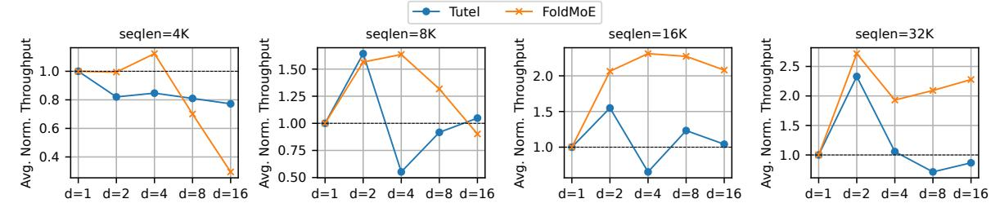
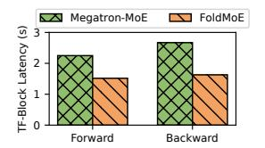
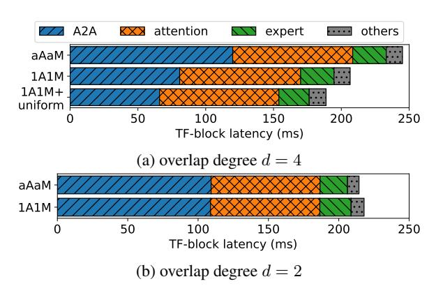

# 4.3 Combining with Other Long-Sequence Methods

FOLDMOE establishes the attention-MoE pipeline not beyond each Transformer block, overlapping communication and computation of a single device. This simplicity allows it to work with other established long-sequence training methods.

Combine with FlashAttention. FOLDMOE can seamlessly integrate FlashAttention (Dao et al., 2022; Dao, 2023), since they both maintain identical attention patterns with causal masking, whether processing the sequence in micro-batches or as a whole.

Combine with TP and SP. FOLDMOE is orthogonal to tensor parallelism (TP) (Shoeybi et al., 2019) in the sense that: TP slices and parallelizes *operators* across devices, while FOLDMOE slices data along the sequence dimension within a single device. On the other hand, sequence parallelism (SP) (Korthikanti et al., 2023),

Figure 8: End-to-end Performance of training MoE models on 16 GPUs with DP+TP/SP and EP.

Figure 9: Average normalized throughput of FOLDMOE and Tutel training GPT-MoE-M.

which operates within TP groups, also performs sequence-dimension partitioning as FOLDMOE. Fortunately, since SP exclusively operates on non-attention and non-MoE regions, e.g., layernorm (Lei Ba et al., 2016) and dropout (Srivastava et al., 2014), it does not affect the data integrity of FOLDMOE's attention-MoE pipelining.

#### 5 Evaluation

**Testbeds.** We evaluate FOLDMOE on a cluster with 2 AWS g5.48xlarge nodes, each containing 8 NVIDIA A10G-24G GPUs, and the nodes are linked by a 100 Gbps network.

Models and datasets. We evaluate the training workloads of the MoE counterparts of GPT-2 (Brown, 2020) models from 3 representative model sizes, GPT-MoE-L (large), GPT-MoE-M (mediam), GPT-MoE-S (small), as shown in Table 1. Wikipedia dataset is used as training data, and the training sequence length (seqlen) varies from 4K to 32K, with each seqlen being a power of 2. More details on model and experiment setups can be found in Appx. C.

**Baselines.** We compare FOLDMOE's training performance with Megatron-MoE (core\_r0.9.0) and Tutel (v0.3.2). The former serves as a vanilla non-overlapping baseline. Tutel is one of the state-of-the-art MoE training system that implements MoE-only overlapping between A2A and expert computation. For each experiment with Tutel, we turn on only its overlapping-related features, and

search through the overlap degree d (the number of partitions) of 2, 4, 8 and 16 to report the best result. The same search is also conducted for FOLD-MOE. We mainly focus on per-iteration training latency as our evaluation metric.

#### 5.1 Main Results

The main experiment conducts training on 16 GPUs, with 2-way cross-node DP and 8-way intranode TP+SP for attention layers, and 16-way EP for MoE layers. We show the speedups on periteration latency against Megatron-MoE for all configurations in Figure 8. FOLDMOE accelerates MoE training for all models: for GPT-MoE-S, FOLDMOE speeds up training against the best baselines by 1.14x, 1.19x, and 1.10x for seqlen 8K, 16K and 32K, respectively; for GPT-MoE-M, FOLDMOE significantly speeds up against Tutel by 1.12x, 1.49x, and 1.17x for seqlen 4K, 16K and 32K, respectively; for GPT-MoE-L, FOLDMOE accelerates training by 1.32x and 1.33x against Tutel for seqlen 16K and 32K, respectively.

#### 5.2 Ablation Study

Forward and backward pass overlapping. Both forward and backward pass of the training benefit from the attention-MoE pipelining of FOLDMOE. Figure 10 shows average training latency of Transformer blocks in GPT-MoE-L: under d=2, forward pass has 1.48x speedup and backward pass has 1.64x against the baseline; under d=8, forward/backward pass speedups increase to 1.94x

Figure 10: Latency of forward and backward pass of Transformer-block in GPT-MoE-M with 32K seqlen. Left: d=2. Right: d=8.

and 1.71x, respectively, benefiting from pipeline bubbles being further reduced.

System component effectiveness. We have developed FOLDMOE step by step, introducing aAaM, 1A1M schedule, and time-uniform microbatching for an efficient attention-MoE pipeline within each Transformer block. As shown in Figure 11a, 1A1M achieves better communication overlapping with computation, reducing the A2A latency on the critical path. Adding time-uniform micro-batching (1A1M+uniform) further minimizes pipeline bubbles, leading to optimal end-to-end performance. In the case of d=2 (Figure 11b), 1A1M degrades to aAaM due to insufficient token micro-batches for pipeline stage interleaving, maintaining the same critical path A2A latency.

Overlap degree. The overlap degree d serves as the sole configuration parameter for pipeline settings in both FOLDMOE and Tutel, determining the granularity of computation and communication partitioning. While a larger d can potentially yield higher speedups through reduced pipeline bubbles, it also introduces increased overhead from micro-batching operations, manifesting as smaller but more numerous GPU kernel launches. Figure 9 presents the average training throughput

Figure 11: Breakdown of average Transformer block latency on critical path of training GPT-MoE-L on 32K seglen with different FOLDMOE scheduling.

of the GPT-MoE-M block across various overlap degrees, normalized to the non-overlapping baseline (d=1). The results demonstrate a clear trade-off in FOLDMOE's performance: training throughput initially improves with increasing d due to better overlapping, reaches a peak, then declines as micro-batching overhead exceeds overlapping benefits. While Tutel exhibits a similar trade-off pattern, it is constrained by insufficient expert computation for overlapping. In contrast, FOLD-MOE achieves higher peak throughput and shows more gradual performance degradation by effectively utilizing the larger attention computation to hide A2A overhead.

#### **5.3** Training Convergence

FOLDMOE preserves the convergence characteristics of model training. To validate this, we trained GPT-MoE-S with 8K seqlen using 16-way DP/EP, comparing the loss curves between FOLD-MoE and Tutel at the same overlap degree d=2. As demonstrated in Figure 12a, models trained with FOLDMOE and Tutel exhibit identical convergence patterns, confirming that FOLDMOE maintains convergence fidelity. Figure 12b shows that FOLDMOE reaches the same training loss using less GPU hours than Tutel.

(a) FOLDMOE kept the same logical convergence efficiency as Tutel. The loss curve of both systems overlap in the figure.

(b) Reaching the same training loss 5.21 using the same overlap degree d=2, FOLDMOE takes 21% less time than Tutel.

Figure 12: Training loss curve of GPT-MoE-S over (a) logical training steps and (b) physical time.

#### 6 Conclusion

We present FOLDMOE, a system for efficient MoE training on long sequences through novel attention-MoE pipelining. By introducing a 1A1M pipeline schedule and time-uniform microbatching strategy, FOLDMOE enables effective token-level overlapping of A2A communication with computation across entire Transformer blocks. FOLDMOE is compatible with other long sequence training methods. Our evaluations show

that FOLDMOE accelerates the training of GPT-MoE models by up to 1.49x speedup using up to 32K sequence length on 16 GPUs compared to state-of-the-art systems.

### Limitations

While FOLDMOE demonstrates strong performance for training Transformer-based MoE models with long sequences, it is subject to two limitations: (1) Selection of an optimal overlap degree. Selecting an overlap degree (i.e., the number of micro-batches) is crucial for striking a balance between pipeline speedup and micro-batching overhead. This ideal overlap degree depends on model size, sequence length, and hardware specifics, and is currently left to be determined through light runtime profiling and manual tuning. (2) FOLD-MOE currently employs FP16 training to improve throughput. In long-sequence settings, rounding errors can accumulate across chunked layers, potentially causing minor numerical fluctuations in convergence. That said, as demonstrated in Figure [12,](#page-7-2) the impact on model quality remains negligible, with FOLDMOE preserving near-identical loss curves compared to baseline implementations and achieving faster convergence.

