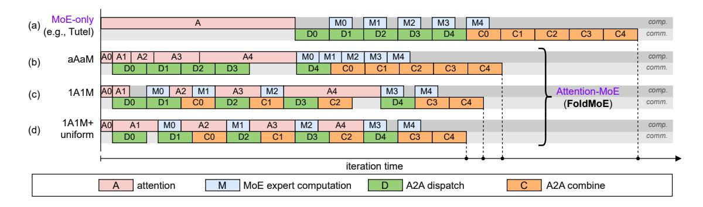

# FOLDMOE: Efficient Long Sequence MoE Training via Attention-MoE Pipelining

Guichao Zhu1†, Lintian Lei1†, Yuhao Qing1\*, Yichao Fu2, Fanxin Li1, Dong Huang1, Zekai Sun1, Heming Cui1\*

1The University of Hong Kong, 2University of California, San Diego {gczhu, leilt, qyhh}@connect.hku.hk, heming@cs.hku.hk

#### **Abstract**

Training LLMs with Mixture-of-Experts (MoE) architecture on long sequences poses significant challenges due to the all-to-all communication bottleneck of expert parallelism. While existing approaches attempt to hide the communication costs in computation through token-level pipelining within MoE layers, their effectiveness is limited by the insufficient computation. We present FOLDMOE, a high-performance MoE training system that enables token-level overlapping across entire Transformer blocks through novel attention-MoE pipelining. We propose an efficient pipeline schedule, and a novel token buffering design to decouple attention and MoE layer partitioning, along with a timeuniform micro-batching strategy for enhanced efficiency. Evaluations on GPT-MoE models with sequences up to 32K tokens show that FOLDMOE achieves up to 1.49x and 2.72x speedup over state-of-the-art token-level overlapping and non-overlapping baselines respectively.

#### 1 Introduction

Large Language Models (LLMs) excel in various language tasks (Floridi and Chiriatti, 2020; Brown, 2020), but scaling dense models for improved performance (Kaplan et al., 2020; Hoffmann et al., 2022) incurs high computational costs. Mixture-of-Experts (MoE) architectures (Jacobs et al., 1991; Shazeer et al., 2017) address this by replacing dense feed-forward networks with sparse expert networks, enhancing efficiency. This approach has proven effective in recent MoE-based models like Mixtral (Jiang et al., 2024a), DeepSeekV3 (Liu et al., 2024), and MiniMax01 (Li et al., 2025), which achieve superior sample efficiency.

Figure 1: Execution time breakdown of training a GPT-MoE model on 2 AWS g5.24xlarge instances (each with 4 NVIDIA A10G GPUs)

These recent models also showcase a clear trend toward longer sequence lengths, with Mixtral handling 32K tokens, DeepSeekV3 extending to 128K, and MiniMax01 pushing boundaries to an impressive 1M tokens. However, training MoE models on such long sequences presents significant challenges, particularly in distributed training environments. In the prevalent expert parallelism training (Shazeer et al., 2017), where experts are distributed across devices, all-to-all communication (A2A) is necessary for token routing. Due to bandwidth constraints, this A2A communication emerges as a primary bottleneck in long sequence training with enormous tokens, as it exhibits a higher complexity constant compared to expert computation (evident from Figure 1a, A2A curve has larger slope than the expert curve).

To mitigate the A2A bottleneck of MoE training, existing works have proposed a pipelining strategy to enable *token-level overlapping* between A2A communication and expert computation in MoE layer (Hwang et al., 2022; He et al., 2022; Li et al., 2025). This approach leverages the token-wise independence of MoE layer, creating a pipeline by partitioning (micro-batching) input tokens, and concurrently executing computation and communication of different micro-batches, as illustrated in Figure 2a. Unfortunately, the lightweight MoE

† Equal contribution. \* Corresponding author.

Figure 2: Different token-level overlapping strategies for training a single sequence on one Transformer-MoE block. Computation and communication are on two streams (*comp.* and *comm.*) to overlap. Existing works (a) pipeline only MoE layer for overlapping. Attention-MoE pipeline in (b) uses an aAaM schedule with large bubbles due to the imbalanced stages (attention and expert computation). FOLDMOE in (c) proposes a *IA1M schedule* to reduce these pipeline bubbles by interleaving attention and expert computation. In (d), FOLDMOE additionally uses *time-uniform micro-batching* to further reduce bubbles caused by imbalanced attention micro-batches, achieving the largest speedup.

computation makes it hard to fully hide the large A2A latency, especially in commodity cloud environments with limited and unstable network bandwidth. Our measurements show that expert computation only constitutes up to 21% of execution time share as sequence length increases to 32K, being substantially overshadowed by the A2A overhead (Figure 1b).

To incorporate more computation to overlap with A2A communication, we first propose to establish an attention-MoE pipeline within each Transformer block, enabling token-level overlapping beyond MoE layers. For long-sequence training, where the maximum allowed batch size (i.e., number of sequences per training step) is squeezed by sequence length due to memory constraints, the micro-batching of attention layer is performed on sequence dimension (Li et al., 2021; Ma et al., 2024; Sun et al., 2024), where each sequence is sliced into sub-sequences as token micro-batches. We leverage this token-level micro-batching strategy to overlap attention computation with A2A communication from previous micro-batches, establishing an all-Attention-all-MoE pipeline (aAaM) inside Transformer block, as shown in Figure 2b. The attention layer's quadratic complexity with respect to sequence length (see Figure 1a) provides sufficient computational workload to fully overlap A2A communication latency as sequences scale to be longer.

However, exploiting token-level overlapping in attention-MoE pipeline raises several challenges. First, the inherent latency disparities between attention and expert computation stages introduce large pipeline bubbles (i.e., idle time), as shown in Figure 2b. The distinct computational complexity of attention and MoE layers with respect to sequence length make it difficult to achieve complete communication overlap with either stage alone. Second, the non-uniform latency across attention micro-batches might also create pipeline bubbles. Due to the causal property, computational load of attention increases progressively for later tokens in the sequence. This uneven latency leads to inefficient overlapping illustrated in Figure 2c.

To this end, we present FOLDMOE, a longsequence MoE training system fully incorporating attention-MoE pipelining. The system introduces a novel 1-Attention-1-MoE schedule (1A1M), illustrated in Figure 2c, which interleaves attention and MoE computation to minimize pipeline bubbles caused by stage imbalance. To further address the bubble issue caused by latency-uneven attention micro-batches, we design a token buffer to decouple the micro-batching between attention and MoE layers, and a time-uniform sequence slicing algorithm to heuristically partition each sequence for attention pipelining, ensuring high overlapping efficiency of attention and A2A communication (see Figure 2d). FOLDMOE is compatible with existing long-sequence training techniques like FlashAttention (Dao et al., 2022), tensor parallelism and sequence parallelism (Shoeybi et al., 2019; Korthikanti et al., 2023).

Our contribution can be summarized as follows:

• For the first time, we extend token-level overlapping of A2A communication and computation to the entire Transformer block through

- attention-MoE pipelining, enabling efficient training of MoE models on long sequences.
- We design an efficient token-level attention-MoE pipeline schedule (*1A1M*) that effectively hides A2A communication overhead.
- We develop a novel token buffering design between attention and MoE layers to enable timeuniform token micro-batching without requiring architectural modifications.
- We implement FOLDMOE and demonstrate its effectiveness on GPT-MoE models with sequences up to 32K tokens, achieving up to 1.49x speedup over state-of-the-art token-level overlapping approaches.

