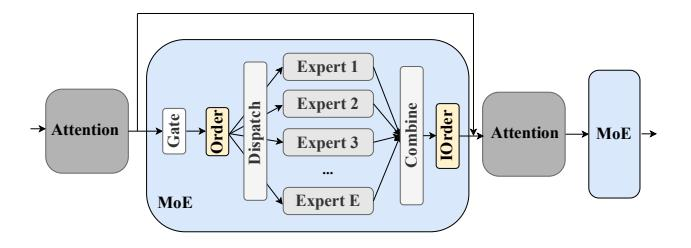
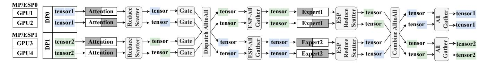

# 2 Background and Motivations

For ease of presentation, we provide a summary of the essential notations employed in the paper, presented in Table [1.](#page-2-0)

1Code Repository: <https://github.com/xpan413/FSMoE>.

**Table 1.** Notations.

| Name       | Description                                      |
|------------|--------------------------------------------------|
| P          | # of GPUs                                        |
| r          | # of the pipeline degree                         |
| В          | # of samples per GPU (or local mini-batch size)  |
| L          | # of tokens per sample (or sequence length)      |
| E          | total number of experts                          |
| k          | top-k experts should be selected for each token  |
| f          | factor to control expert's maximum token count   |
| M          | embedding size of a token                        |
| H          | hidden size of the feed-forward layer in experts |
| $N_{head}$ | # of heads in the attention layer                |
| $N_{DP}$   | # of workers in each DP group                    |
| $N_{MP}$   | # of workers in each MP group                    |
| $N_{EP}$   | # of workers in each EP group                    |
| $N_{ESP}$  | # of workers in each ESP group                   |
| $N_{PP}$   | # of workers in each PP group                    |

**Figure 1.** A typical MoE structure with *E* experts.

#### 2.1 Mixture-of-Experts Layer

In modern MoE models, which are typically built atop the Transformer [45] architecture, an MoE layer is used to replace the ffn layer. As shown in Fig. 1, the MoE layer comprises three core components: a gating function, an ordering function (and its reverse operation, i.e., the I-ordering function) and a set of E experts.

**Gating Function.** The gating function plays a pivotal role in assigning tokens to specific experts. During each training iteration, the input data (denoted as I) of the MoE layer has a shape of (B, L, M), where B represents the mini-batch size, L represents the sequence length per sample, and M represents the embedding size. To determine the activation of experts, I is divided into multiple parts based on the gating function.

GShard [22] employs a noisy Top-k Gate, denoted as G(I) = Softmax(KeepTopK(H(I), k)), where H(I) adds noises to the input I through a specific transformation:

$$H(I)_i = (I \cdot W_q)_i + \mathcal{N}(0, 1) \cdot \text{Softplus} ((I \cdot W_{\text{noise}})_i),$$

and the function KeepTopK(v, k) retains the top k values of a vector v, setting the rest to negative infinity:

$$\text{KeepTopK } (v,k)_i = \begin{cases} v_i & \text{if } v_i \text{ is in the top } k \text{ values of } v. \\ -\infty & \text{otherwise.} \end{cases}$$

In KeepTopK(v, k),  $W_a$  and  $W_{\text{noise}}$  are two trainable weights. In BASE [23] and StableMoE [49] models, the sigmoid gate is employed, defined by  $H(I)_i = (I \cdot W_a)_i$ . The output from the expert is scaled by  $\sigma(H(I)_i)$ . If this output contributes positively to I, optimizing the training goal (such as minimizing cross-entropy loss in language modelling) increases the gate value, favouring the selection of the same expert. In X-MoE [6], a low-rank linear projection  $W_{proj}I$  is employed to segregate the direct interaction between the hidden vector I and the expert embedding  $W_q$ . This approach effectively mitigates the issue of cascaded collapse in representations. Subsequently, these representations undergo an l2 normalization process to be scaled appropriately. The formula can be expressed as follows:  $s_i = \cos(W_{proj}I, W_q)$ . An expert choice method [51] independently selects top-k tokens for each expert, denoted as  $G(I) = \text{Softmax}(\text{KeepTopK}((I \cdot W_a)^{\mathsf{T}}, k)).$ 

The effectiveness of gating functions is assessed using specific models and datasets. For example, EC [51] is evaluated through casual language modelling tasks, whereas X-MoE [6] is assessed via masked language modelling tasks. When encountering new challenges, developers cannot determine the most suitable gating functions for the task without conducting practical tests. Therefore, incorporating a diverse range of gating functions enhances the robustness for developers.

**Ordering and I-Ordering Functions.** The ordering function transforms the input tensor layout before dispatched. Typically, the format changes from (B, L, M) to (E, T, M), where T denotes the maximum tokens per expert. T is determined using the formula  $T := k \times f \times B \times L/E$ , where f is a control factor. Each row of G (i.e., G[i,:,:]) aligns with the data for the i-th expert (i ranges from 1 to E). There are two main types of ordering functions: 1) GShard [22] ordering, which uses a combination of einsum and matrix multiplication, and 2) Tutel [17] ordering, which employs SIMT-efficient sparse operations. The I-ordering function serves as a reverse function of the ordering function, allowing for the data layout to be adjusted back to its original form

**Experts.** Typically, each expert in the MoE layer is a compact neural network consisting of several feed-forward layers followed by an activation function [20, 22]. Take a two-layer expert as an example, the first layer has a weight matrix with a shape of (M, H), while the second layer has a shape of (H, M), where H represents the size of the hidden layer so that the output of expert has the shape with the input. For an MoE layer with E experts, we denote the E-th expert as E-E-E-E-E-E-E-E-E-E-

Despite the expansion in the model size in MoE models, the increase in their computational cost is marginal. However, the size of these models has grown to such an extent that they cannot be loaded into the memory of a single device. As a result, distributed training becomes essential for training MoE models, leveraging multiple devices to handle the computational and memory demands, which easily introduces significant communication overheads. A benchmark of the training time breakdown with two popular MoE models is conducted on our 32-GPU and 48-GPU testbeds (details in §6) is shown in Table 2. It demonstrates that communication overhead typically contributes over 50% to the overall training, indicating the necessity of optimizing communication performance.

### 2.2 Paradigms of Parallelism

The hybrid parallelism with DP, MP, EP, and ESP is required to train large-scale MoE models on a GPU cluster.

**Data Parallelism.** In distributed DL, the data parallelism (DP) training technique has become a de-facto method [9, 19, 47], where a mini-batch of samples is distributed to the workers in the DP group. During backpropagation, the gradients of each worker in the same DP group are aggregated through an AllReduce operation (we call Gradient-AllReduce afterwards) so that they can use the identical gradient to update model parameters.

**Model Parallelism.** Model Parallelism (MP) [9, 29] is a technique that divides model parameters among multiple workers to facilitate parallel computation. Each worker performs its computations independently, and subsequently, the outputs from all workers are combined through an AllReduce collective operation. Notably, when the MP group is configured as the number of GPUs within a node, which is very common, the communication involved in MP is considered intra-node communication, while the collective communication for gradient aggregation involves inter-node communication.

**Expert Parallelism.** In Expert Parallelism (EP) [22, 40], experts are assigned to different GPUs, ensuring that each device handles a specific subset of experts. After the data passes through the gating function, the rows of the tensor G(G[i,:,:]) on each device correspond to the data assigned to the respective i-th expert ( $i = 1, 2, \dots, E$ ). As the experts are distributed across multiple devices, the dispatch operation uses a collective communication technique called AlltoAll Dispatch. This approach facilitates sending tokens to their respective experts for computation. Subsequently, the outputs generated by all experts are combined using another AlltoAll operation, known as AlltoAll Combine, for further processing.

**Expert-Sharding Parallelism.** When training large-scale MoE models, the number of workers *P* may exceed the number of experts *E*. In such cases, expert-sharding parallelism (ESP) [17, 39, 44] can be employed to distribute the workload evenly across all workers. ESP groups are formed to uniformly partition the experts among the GPUs within each

group, similar to MP. This enables parallel computation of expert outputs across all workers within the ESP group.

The combination of EP and ESP is required to place each MoE layer across multiple GPUs, which introduces additional communication operators [33, 44], namely ESP-AllGather and ESP-ReduceScatter. ESP-AllGather ensures that the input data is uniformly distributed among all workers within the ESP group, while ESP-ReduceScatter is used to aggregate the outputs of expert shards within the ESP group and split them back into the original structure of the input. The number of GPUs in an ESP group is denoted as  $N_{ESP}$ . Notably, when the ESP group is configured to align with GPUs within a node, the ESP-AllGather and ESP-ReduceScatter operations involve intra-node communication while the AlltoAll operation introduced by EP entails inter-node communication, enabling the overlaps between ESP-AllGather/ESP-ReduceScatter and AlltoAll. In this work, we mainly discuss the schedule under this case.

An example of training an MoE model [44] with DP, MP, EP, and ESP is shown in Fig. 2, where  $N_{\rm DP} = N_{\rm MP} = N_{\rm EP} =$  $N_{\rm ESP} = 2$ . In this example, two different tensors (or two mini-batches of samples) from the DP group go through the attention layer partitioned across two MP groups and are divided into half by using a ReduceScatter operation introduced by MP. Then two split tensors find selected experts partitioned across two ESP groups by the gating function and are dispatched into the corresponding devices across two EP groups (GPU1 and GPU3; GPU2 and GPU4) through an AlltoAll operation. Before the expert computation, split tensors should be combined through an AllGather collective across the two ESP groups called ESP-AllGather. Then, after the experts computation, tensors are divided into half again by another ReduceScatter operation introduced by ESP, which is called ESP-ReduceScatter, and they are sent back to their original workers through another AlltoAll operation. Finally, another AllGather operation is performed for these tensors across the MP groups to finalize the output. It is seen that it requires several key components and complicated parallelisms to train MoE models, which motivates our designed system to provide a flexible and scalable MoE training system.

#### 2.3 Motivations

A Flexible MoE framework. A flexible MoE framework should efficiently combine different routing functions [6, 12, 22, 23, 36, 40, 51], order functions [14, 17], expert blocks [3, 20], and AlltoAll algorithms [2, 17, 28, 39]. This integration should be achieved with minimal complex programming for additional customization. The aim is to comprehensively address all types of overlaps, like communication with communication or computing, particularly when dealing with diverse parallel groups like integrating DP, MP, EP, and ESP (§3).

**Table 2.** Time performance (iteration time in millisecond) of each operation in a transformer layer of two real-world models, GPT2-XL [38] and Mixtral7B [20], with B = 4 and L = 1024 for two testbeds in Table 3. The numbers in the brackets represent each operation's portion of the forward and backward time.

| Testbeds/Breakdown |                   | Communication |               |              |               | Computation  |            |            |             |
|--------------------|-------------------|---------------|---------------|--------------|---------------|--------------|------------|------------|-------------|
| 168                | Sibeus/Dieakuowii | AlltoAll      | AllReduce     | AllGather    | ReduceScatter | Experts      | Routing    | Order      | Attention   |
|                    | GPT2-Forward      | 6.9(31.16%)   | 0(0%)         | 4.6(20.83%)  | 5.4(24.46%)   | 3.1(14.04%)  | 0.1(0.45%) | 0.3(1.36%) | 1.7(7.7%)   |
|                    | GPT2-Backward     | 6.9(21.27%)   | 5.26(16.26%)  | 4.6(14.22%)  | 5.4(16.7%)    | 6.1(18.86%)  | 0.1(0.31%) | 0.4(1.24%) | 3.6(11.13%) |
| A                  | Mixtral-Forward   | 19.5(29.8%)   | 0(0%)         | 12.3(18.73%) | 13.7(20.86%)  | 15.6(23.76%) | 0.1(0.15%) | 0.3(0.46%) | 4.1(6.24%)  |
|                    | Mixtral-Backward  | 19.6(17.45%)  | 26.45(23.59%) | 12.3(10.97%) | 13.7(12.22%)  | 31.8(28.36%) | 0.1(0.09%) | 0.5(0.45%) | 7.7(6.87%)  |
|                    | GPT2-Forward      | 11.2(20.7%)   | 0(0.0%)       | 15.5(28.7%)  | 15.7(29.1%)   | 6.7(12.4%)   | 0.1(0.2%)  | 0.3(0.6%)  | 4.5(8.3%)   |
| В                  | GPT2-Backward     | 11.2(15.7%)   | 7.3(10.3%)    | 15.5(21.8%)  | 15.2(21.3%)   | 13(18.3%)    | 0.1(0.1%)  | 0.3(0.4%)  | 8.6(12.1%)  |
|                    | Mixtral-Forward   | 28.3(15.9%)   | 0.0(0.0%)     | 39.6(22.3%)  | 40.8(23.0%)   | 58.5(33.0%)  | 0.1(0.1%)  | 0.7(0.4%)  | 9.5(5.4%)   |
|                    | Mixtral-Backward  | 30.8(10.8%)   | 32.1(11.3%)   | 40.1(14.1%)  | 41.8(14.7%)   | 119.7(42.1%) | 0.2(0.1%)  | 1.2(0.4%)  | 18.1(6.4%)  |

**Figure 2.** An example of  $N_{\rm DP} = N_{\rm EP} = N_{\rm ESP} = 2$ . The attention is partitioned into two parts across MP groups, and the two experts are distributed to the two EP groups (GPU1 and GPU3, as well as GPU2 and GPU4) in EP, and each expert is further partitioned into two shards across the ESP group. The blue and green rectangles indicate the data tensors.

**Optimizing Network Communication.** As shown in Fig. 3a, various parallel paradigms (e.g., DP, MP, EP, ESP) comprise a substantial portion of the overall iteration time. To mitigate the communication cost associated with the MoE layer, prior research (e.g., Tutel [17], PipeMoE [42], Faster-MoE [14]) has explored overlapping AlltoAll with experts as illustrated in Fig. 3b. However, they do not explore the overlapping ESP-AllGather/ESP-ReduceScatter (intra-node communication) with AlltoAll Dispatch/Combine (inter-node communication), diminishing network efficiency. This motivates us to pipeline inter-node and intra-node communication as shown in Fig. 3c (§4).

Optimizing Forward and Backward Separately. Existing systems (e.g., Tutel [17] and DeepSpeed-MoE [39]) typically use the same pipeline degree (i.e., the number of split input chunks for the overlaps) for both forward and backward propagation during training. However, the ideal degree may vary between these two phases due to their distinct computational requirements. For example, backward propagation involves additional computations to calculate the gradient of weights. Our extensive experiments on 1,458 MoE configurations (details in Table 4) reveal that 912 cases exhibit varied optimal pipeline degrees, tested on a 32-GPU cluster with 8 nodes (details in Table 3). Therefore, adaptively determining the pipeline degrees for both forward and backward phases is needed to achieve better training efficiency (§4.4).

**Co-Design in Backward Propagation and Gradient Synchronization.** Since Gradient-AllReduce (introduced

by the weight synchronization in DP) and AlltoAll are both inter-node communication, Gradient-AllReduce can not be directly overlapped with the whole MoE layer as shown in Fig. 3b and Fig. 3c which only overlap Gradient-AllReduce with non-MoE parts. Consequently, designing overlaps for Gradient-AllReduce without considering MoE layers tends to result in sub-optimal solutions. A co-design that considers the AlltoAll operation and adjusts the partitioning of gradients for optimal overlapping remains unexplored (§5).

### 3 FSMoE: System Design

We propose FSMoE, a flexible and scalable MoE framework for distributed training. Our framework has three main characteristics: 1) modularization and non-invasive modification, 2) isolation of front-end API definition and back-end task scheduling, and 3) easy schedule of different tasks.

### 3.1 Modularization and Non-Invasive Modification

In our FSMoE framework, the MoE layer is divided into six distinct sub-modules, namely: *Gate, Order, I-Order, Dispatch, Combine, Expert.* 

Gate: The Gate sub-module determines how tokens are assigned to different experts for calculation. We pre-implement four routing functions: GShard routing [22], Sigmoid [8, 23] routing, X-MoE routing [6], and SoftMoE routing [36].

*Order & I-Order:* The *Order* sub-module transforms the input tensor layout before it is dispatched. Typically, the format changes from (B, L, M) to (E, T, M). We pre-implement two

types of ordering functions: 1) GShard [\[22\]](#page-13-4) ordering, which uses a combination of einsum and matrix multiplication, and 2) Tutel [\[17\]](#page-13-11) ordering, which employs SIMT-efficient sparse operations. The I-Order sub-module serves as a reverse operation of the Order sub-module, allowing for the data layout to be adjusted back to its original form.

Dispatch & Combine: The Dispatch sub-module handles the collective communication for the token-to-expert dispatch. It allows users to customize the collective communication algorithm without impacting our scheduler. To facilitate this customization, we pre-implement the default A2A algorithm provided by NCCL (NCCL-A2A) [\[1\]](#page-13-26), 1DH-A2A proposed by Hetu [\[31\]](#page-14-17), 2DH-A2A proposed by Tutel [\[17\]](#page-13-11) and DeepSpeed-MoE [\[39\]](#page-14-6). This customization ensures optimal dispatching based on user-specific needs. The Combine sub-module serves as a reverse operation of the Dispatch sub-module.

Expert: The Expert sub-module manages the computation task. Modules derived from "torch.nn.Module" can serve as the expert component. We offer two variants of these networks: the GPT feed-forward network [\[3\]](#page-13-24) and the Mixtral feed-forward network [\[20\]](#page-13-3).

Hooks: In our framework, we offer a range of hooks for non-intrusive modification, including BeforeMoeStartHook, BeforeDispatchHook, AfterDispatchHook, BeforeCombineHook, and AfterCombineHook, as well as BeforeMoeEndHook. These hooks facilitate various adjustments without requiring invasive changes. For example, in handling multimodal data, BeforeMoeStartHook and BeforeMoeEndHook can be utilized to reformat inputs to conform to the standard MoE layer configuration. In another scenario, such as communication compression, BeforeDispatchHook is used to compress the tensor before dispatch, while AfterDispatchHook serves to decompress it afterward, ensuring efficient extension without the need for fundamental code modifications.

