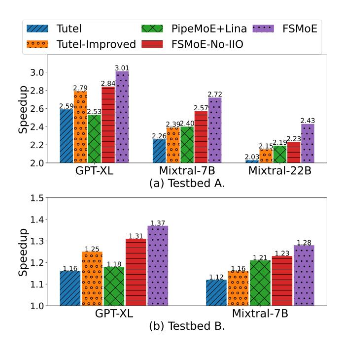
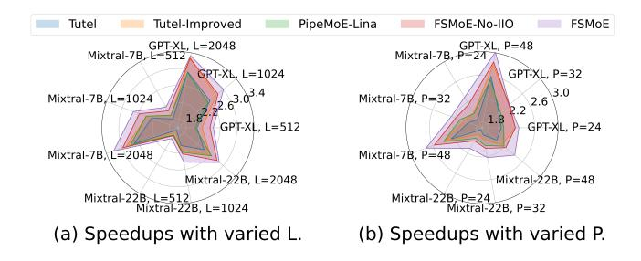

# 5 Scheduling for Backpropagation

Due to the inter-node communication in the MoE layer, Gradient-AllReduce of the gradient synchronization can not be directly overlapped with MoE layers. A dedicated codesign is necessary to further hide the time cost of Gradient-AllReduce. We propose to adaptively partition the gradients to achieve the maximal overlap of Gradient-AllReduce with other operations.

Our approach contains two steps. Step 1: We calculate the time cost of the parts that can be overlapped with Gradient-AllReduce (denoted as *overlappable parts*) for all layers. Then we slice the gradient and assign them to these overlap-able parts as far as possible. Step 2: We arrange the remaining gradient after the first step and set the remaining gradient partitioned to each MoE layer as variables to optimize the assignment.

#### 5.1 Performance Model

Similar to §4.1, the performance model of AllReduce can be represented as  $t_{ar}(n_{ar}) = \alpha_{ar} + n_{ar} \cdot \beta_{ar}$ , where  $t_{ar}$  denotes the elapsed-time,  $n_{ar}$  represents the amount of the communication message,  $\alpha_{ar}$  denotes the starup time and  $\beta_{ar}$  represents the transmission time per byte. The inverse function of  $t_{ar}(n_{ar})$  is represented as  $g_{qrad}^{inv}(t_{ar}) = (t_{ar} - \alpha_{ar})/\beta_{ar}$ .

#### 5.2 Step 1: Calculate Partitioned Gradients

In this step, we first optimize the pipeline degree of each MoE layer with  $t_{gar}=0$  by Algorithm 1 to calculate the time cost of *overlappable parts*. Then we try to slice the gradient and assign them to *overlappable parts* of each layer in order to minimize the training time. According to the above performance model, we are able to calculate the gradient assigned to each layer.

For convenience, we denote an MoE layer and other operations before the next MoE layer as a generalized layer. We denote the gradient for a generalized layer i as  $n^i_{arad}$  and the

time cost of *overlappable parts* as  $t^i_{olp}$ . The number of gradients assigned to each layer in this step can be represented as

$$n_{first}^{i} = g_{grad}^{inv}(\min(t_{grad}(n_{grad}^{i-1}), t_{olp}^{i})).$$
 (3)

If  $n_{arad}^{i-1}$  is not fully overlapped,  $n_{arad}^{i}$  should be updated by

$$n_{grad}^i = n_{grad}^i + g_{grad}^{inv}(\max(t_{grad}(n_{grad}^{i-1}) - t_{olp}^i, 0)). \quad (4)$$

Notably, the time cost of overlappable parts,  $t_{olp}$ , can be divided into sparse MoE parts  $t_{olp,moe}$  and dense parts  $t_{olp,dense}$ . The dense parts  $t_{olp,dense}$  can be measured before the training, while  $t_{olp,moe}$  can be calculated during the optimization of the pipeline degree. Specifically, when  $t_{gar}=0$ , we will encounter Case2, Case3 and Case4 mentioned in §4.2. And  $t_{olp,moe}$  can be formulated as following

$$t_{olp,moe}(r) = \begin{cases} r \cdot t_{exp,r} + t_{ag,r} + t_{rs,r} - 2(r-1)t_{a2a,r}, & \text{Case 2} \\ t_{ag,r} + t_{rs,r}, & \text{Case 3} \\ r \cdot t_{ag,r} + r \cdot t_{rs,r} - 2(r-1)t_{a2a,r}, & \text{Case 4} \end{cases}$$

After the above process, we will enter the second step if gradients still remain.

#### 5.3 Step 2: Optimize Partitioning

The second step is to assign the remaining gradients after the first step. Note that with different input time costs of Gradient-AllReduce, the optimization algorithm (Algorithm 1) would produce different degrees and time costs. It indicates that the remaining gradients can be further partitioned into MoE layers to minimize the training time.

We denote the remained gradient for the generalized layer i as  $n_{rem}^i$  and the Algorithm 1 as  $f_{moe}^i(t_{gar})$  who takes the time cost of Gradient-AllReduce as the input and produces the time cost of the MoE layer i. Then, set the remaining gradient assigned to the MoE layer i as  $x_g^i$ . The optimization model can be represented as

minimize: 
$$f_g(X_g) = \sum_{i=1}^{n_l} f_{moe}^i \left( t_{grad}(x_g^i) \right),$$

s.t. 
$$0 \le x_g^i < n_{rem}^i + \sum_{j=i-1}^{n_l} (n_{rem}^j - x_{gar}^j), 0 < i < n_l,$$
 (5)

where  $n_l$  represents the number of layers. As the optimization will be conducted only once before the training, we do not need to care too much about the time cost. Therefore, we simply adopt the differential evolution algorithm [35] when we solve the above optimization problem.

### **6 EVALUATION**

#### 6.1 Experimental Settings

We mainly compare our FSMoE with Tutel [17] (w/ its optimized version PipeMoE [42]) which designs an adaptive schedule to determine the pipeline degree of the overlaps,

**Table 3.** The server configurations in our testbeds.

| Name    | Testbed A                      | Testbed B                    |
|---------|--------------------------------|------------------------------|
| CPU     | Dual Intel(R) Xeon(R) Platinum | Dual Intel(R) Xeon(R) Gold   |
|         | 8358 CPU @ 2.60GHz             | 6230 CPU @ 2.10GHz           |
| GPU     | 8x Nvidia RTXA6000 @1.46GHz    | 4x Nvidia RTX2080Ti @1.35GHz |
|         | 48GB Mem                       | 11GB Memory                  |
| Memory  | 512GB DDR4                     | 512GB DDR4                   |
| NVlink  | 112.5GB/s (4x)                 | -                            |
| PCIe    | 4.0 (x16)                      | 3.0 (x16)                    |
| Network | Mellanox MT28908 @ 200Gb/s     | Mellanox MT27800 @ 100Gb/s   |

**Table 4.** Configurations of attention and MoE layers.  $N_{\text{hscale}} = H/M$ . f = \* means tokens will not be dropped when gating. *ffn-type* means the type of experts in MoE.

| -                | Candidate Values               |  |  |
|------------------|--------------------------------|--|--|
| В                | {1,2,4}                        |  |  |
| $N_{\rm heads}$  | {8,16,32}                      |  |  |
| L                | {512,1024,2048}/{256,512,1024} |  |  |
| M                | {1024, 2048, 4096}             |  |  |
| $N_{\rm hscale}$ | {2,3,4}                        |  |  |
| f                | {1.2,2.4,*}                    |  |  |
| ffn-type         | {simply,Mixtral}               |  |  |

with a focus on pipelining communications and computations in a typical structure of the MoE model in DP+MP+EP+ESP shown in Fig. 2. Additionally, we compare the end-to-end training performance of FSMoE with DeepSpeed-MoE [2, 39], which is a dedicated MoE training system. The code we implemented is accessible at https://github.com/xpan413/FSMoE.

**Testbeds**: Experiments are carried out on two distinct testbeds: Testbed-A, a 48-GPU cluster comprising six interconnected nodes, and each node is equipped with four Nvidia A6000 GPUs. Testbed-B, a 32-GPU cluster comprising eight interconnected nodes, and each node is equipped with four Nvidia GeForce RTX2080Ti GPUs. More details on the server configuration can be found in Table 3. The software environments are Ubuntu-20.04, CUDA-11.3, PyTorch-1.12 and NCCL-2.12.

**MoE model configurations.** We select a combination of input parameters whose ranges are shown in Table 4 to cover a variety of typical configurations of attention and MoE layers. L is set to {256, 512, 1024} on Testbed-B due to the memory limit of 2080Ti. Notably, we select a range of  $N_{\rm hscale} = H/M$  rather than directly setting H, which is more common in real-world scenarios. f = \* means tokens will not be dropped when gating. ffn-type means the type of experts in MoE. simple represents the conventional two feedforward dense layers and Mixtral means the experts using in Mixtral [20]. Additionally,  $N_{MP}$  and  $N_{ESP}$  are both set to 4 in Testbed-B where ESP-AllGather and ESP-ReduceScatter

are intra-node communications while Allto All and Gradient-AllReduce are inter-node communications. Similarly,  $N_{MP}$  and  $N_{ESP}$  are both set to 8 in Testbed-A.

#### 6.2 Performance Model

We require the input parameters that are related to the cluster for the performance models of computation and communication. We measure the elapsed time with a range of sizes for GEMM computation and four types of communication to fit the performance models in Eq. 1 using microbenchmark tools. In particular, we utilize the NCCL-2.12 collective communication primitives along with nccl-tests3 to evaluate communication durations across diverse message sizes. Meanwhile, we employ the torch.matmul4 function in Py-Torch to assess the GEMM execution times for matrices of varying shapes. For communication modeling, float-type elements are chosen in a range from  $2^{18}$  to  $24 \times 2^{18}$ , with steps of 218, to simulate different tensor sizes. Likewise, for the GEMM modeling, float-type elements are picked from a range between  $2^{19}$  and  $12 \times 2^{19}$ , with  $2^{19}$  increments. Each measurement is averaged over five runs to ensure consistency. The results are shown in Fig. 5. It is seen that our linear models with intercept terms (i.e., startup time) can well fit the measured performance. Specifically, the  $r^2$  for our GEMM model is 0.9987, and the corresponding  $r^2$  for the communication tasks are as follows: AllReduce: 0.9999896, AlltoAll: 0.9999, AllGather: 0.9999653, and ReduceScatter: 0.9999599. The total time required for both computation and communication in the performance models is under 100 seconds. Fitting through the least squares method takes under 10ms. Following fitting, the empirical time cost for SLSQP in solving r averages 193ms over 1458 configured cases. When dealing with a new GPU cluster, it is only necessary to estimate the parameters one time using micro-benchmarks prior to model training, without impacting the training efficiency.

**Table 5.** Averaged speedups of four schedules over Tutel (w/its optimized version PipeMoE) on configured layers in Table 4. Tutel-Improved means using PipeMoE with Gradient-AllReduce overlapped with non-MoE parts, while FSMoE-No-IIO indicates using FSMoE without the overlaps between inter and intra node communications.

| Schedule       | Speedup   |           |  |
|----------------|-----------|-----------|--|
| Schedule       | Testbed-A | Testbed-B |  |
| Tutel          | 1.00×     | 1.00×     |  |
| Tutel-Improved | 1.09×     | 1.08×     |  |
| FSMoE-No-IIO   | 1.12×     | 1.16×     |  |
| FSMoE          | 1.18×     | 1.22×     |  |

&lt;sup>3https://github.com/NVIDIA/nccl-tests

**Figure 5.** Performance models. Markers are measured values and lines are predicted values with estimated parameters. (a)  $\alpha_{gemm}$ =4.26e-2,  $\beta_{gemm}$ =2.29e-11 on Testbed-A. (b)  $\alpha_{a2a}$ =2.87e-1,  $\beta_{a2a}$ =2.21e-7,  $\alpha_{ag}$ =3.37e-1,  $\beta_{ag}$ =2.32e-06,  $\alpha_{rs}$ =3.95e-1,  $\beta_{rs}$ =2.34e-7,  $\alpha_{ar}$ =5.11e-1,  $\beta_{ar}$ =4.95e-6 on Testbed-A. (c)  $\alpha_{gemm}$ =9.24e-2,  $\beta_{gemm}$ =4.42e-11 on Testbed-B. (d)  $\alpha_{a2a}$ =1.75e-1,  $\beta_{a2a}$ =3.06e-7,  $\alpha_{ag}$ =3.20e-2,  $\beta_{ag}$ =1.68e-7,  $\alpha_{rs}$ =3.91e-2,  $\beta_{rs}$ =1.67e-7,  $\alpha_{ar}$ =8.37e-2,  $\beta_{ar}$ =5.99e-7 on

### 6.3 Performance on Configured Layers

Testbed-B.

We conducted a comparison between our proposed method FSMoE and PipeMoE [42] in the structure illustrated in Fig. 2, using various configurations as outlined in Table 5. Notably, the gradient aggregation of a configured layer is added in order to validate our gradient partitioning method and schedule to overlap Gradient-AllReduce. For better comparison, experiments on two additional schedules (Tutel-Improved and FSMoE-No-IIO) are further conducted. Tutel-Improved means PipeMoE with Gradient-AllReduce overlapped with non-MoE parts, while FSMoE-No-IIO means FSMoE without the overlaps between inter-node and intra-node communications. The experimental results indicate that with a simple overlap between Gradient-AllReduce with non-MoE parts, we can achieve a speed up of 1.08× to 1.09× over Tutel (w/ PipeMoE). And with our gradient partitioning and well overlaps among inter-node and intra-node communication as well as computation tasks, FSMoE achieves an average speedup of 1.18× to 1.22× over Tutel across 1458 cases. By comparing the speed up of our FSMoE and FSMoE-No-IIO

&lt;sup>4https://pytorch.org/docs/stable/generated/torch.matmul.html

**Figure 6.** Speedups of FSMoE, FSMoE-No-IIO, Tutel, Tutel-Improved, PipeMoE+Lina (PipeMoE with the additional schedule introduced by Lina [24] that partitions the gradient into fixed chunk size) over DeepSpeed-MoE (DS-MoE) on MoE models (GPT2-XL, Mixtral-7B and Mixtral-22B).

**Figure 7.** Speedups of five schedules over DS-MoE on Testbed-A with different configurations.

over Tutel in Table 5, we see that the overlaps between internode and intra-node communications further improve the performance.

#### 6.4 Performance on MoE Models

To evaluate the end-to-end training performance, we conduct experiments with Mixtral-7B [20] and an MoE model based on GPT-2 [38] on two testbeds. In addition, experiments in Mixtral-22B are also conducted on Testbed-A. We set B=1, k=2, f=1.2 during the experiment. To enable the overlap between inter and intra communication,  $N_{ESP}=N_{MP}$ , which is 8 and 4 on Testbed-A and Testbed-B, respectively. Furthermore, the number of experts ( $N_{EP}$ ) is the same as the number of nodes, which is 6 and 8 on

**Figure 8.** Speedups of five schedules over DS-MoE on Testbed-A when PP is enabled.

Testbed-A and Testbed-B, respectively. *L* is set to 256 on Testbed-B and to 1024 on Testbed-A. Ensuring the models to be held on Testbed-B (32x 2080Ti 11GB), we set the number of layers for Mixtral-7B to 7. Due to the memory limit, the number of layers for Mixtral-22B is set to 33 on Testbed-A. For further analysis, experiments on two additional schedules are conducted. Tutel-Improved indicates Tutel with the overlaps between Gradient-AllReduce with non-MoE parts using PipeMoE. PipeMoE+Lina means PipeMoE with the additional schedule introduced by Lina [24] that partitions the gradient into fixed chunk size (e.g., 30MB) and overlaps the partitioned gradient aggregation with expert computations and non-MoE parts in backpropagation.

The results in Fig. 6 indicate that FSMoE achieves a speedup of 1.28× to 3.01× compared to DeepSpeed-MoE (DS-MoE) while Tutel can only achieve a speedup of 1.16× to 2.59×. Additionally, FSMoE can achieve an average speedup of 1.19× over Tutel, 1.12× over Tutel-Improved, 1.14× over PipeMoE+Lina and 1.07× over FSMoE-No-IIO, which validates the efficiency of our adaptive gradient partitioning method and pipelining schedule. It is worth mentioning that Lina's idea of partitioning gradients and scheduling the gradient aggregation can not handle various configurations due to the fixed chunk size. Thus, its performance is hit or miss. And our FSMoE can adaptively partition the gradient and adjust the pipelining degree to achieve better results.

**Performance on MoE Models With PP Enabled.** We also conduct experiments on Testbed-A when PP is further enabled ( $N_{PP}=2$ ), implemented using GPipe [15]. The results are shown in Fig 8. The results indicate that FSMoE can achieve an average speedup of 2.46× over DS-MoE, 1.16× over Tutel, 1.10× over Tutel-Improved, 1.12× over PipeMoE+Lina and 1.05× over FSMoE-No-IIO.

**Performance on MoE Models with Varied** L **and Varied** P. Moreover, we analyze the performance of FSMoE with varied L and P on Testbed-A. L is varied in  $\{512, 1024 \text{ and } 2048 \}$  while P is varied in  $\{16, 32 \text{ and } 48 \}$ . The results are

shown in Fig 7. The results indicate that FSMoE can achieve an average speedup of 2.17×, 2.72 × and 3.14× over DS-MoE and 1.17×, 1.19 × and 1.17× over Tutel when L is varied in {512, 1024 and 2048 } and P=48. FSMoE can achieve an average speedup of 2.25×, 2.27 × and 2.72× over DS-MoE, 1.20×, 1.16× and 1.19× over Tutel when P is varied in {16, 32 and 48 } and L=1024. It indicates the robustness of FSMoE.

**Support Multiple Gating Functions.** Table 6 underscores the ability of our framework to support multiple gating functions while maintaining improved efficiency. Our framework shows potential scalability and flexibility in handling complex MoE architectures.

**Table 6.** Time performance on Testbed-B (average iteration time in milliseconds) of various gating on real-world MoE GPT2-XL. The lower is better. Speedup are provided in parentheses.

| Gating       | DeepSpeed-MoE    | FSMoE                        |  |  |
|--------------|------------------|------------------------------|--|--|
| Gshard [22]  | 968.1 ± 1.4      | $707.7 \pm 1.6(1.37 \times)$ |  |  |
| X-MoE [6]    | $1064.0 \pm 1.5$ | $746.9 \pm 2.8(1.42 \times)$ |  |  |
| Sigmoid [23] | $986.6 \pm 1.4$  | $721.0 \pm 1.8(1.37 \times)$ |  |  |
| EC [51]      | $909.9 \pm 1.8$  | $685.5 \pm 1.5(1.33 \times)$ |  |  |

#### 7 Related Work

In optimizing the training performance of MoE models, there are three main orthogonal directions that have been explored. These directions include MoE algorithms, AlltoAll algorithms, and scheduling algorithms. While MoE algorithms focus on workload balancing and designing gating functions, and AlltoAll algorithms aim to improve data dispatch and combine efficiency, our primary focus lies on MoE systems and scheduling algorithms that aim to reduce communication time, so we mainly introduce the related studies in this direction.

Tutel [17] and DeepSpeed-MoE [39] stand out as specialized optimized systems for training MoE models. These frameworks incorporate a multitude of optimization techniques. However, their current capabilities are limited to manual configuration of the pipeline degree or heuristic search methods within a constrained search space. Contrasting Tutel, FasterMoE [14] allows partitioning input tokens into two groups for the overlaps between expert computations and AlltoAll communications. Built on Tutel, PipeMoE [42] proposes an innovative and optimal partitioning methodology for input tokens. Lina [24] aims to alleviate network contention during backpropagation by addressing the challenges associated with AllReduce and AlltoAll operations.

Subsequently, various studies concern the fine-grain overlap between communication and computation. T3 [34] introduces a hardware-software co-design approach to seamlessly integrate serialized communication with computation, thus reducing resource conflicts. Wang et al. [46] enhance overlapping by using semantically equivalent graph transformations, implemented in XLA. Punniyamurthy et al. [37] tackle the issue of collective communication overhead in DLRM. FLUX [4] and CoCoNet [18] break down the initial communication and computation into much smaller, more detailed tiles compared to current methods. Subsequently, it combines the tiled computation and communication into a unified kernel. Shi et al. [41] propose to exploit simultaneous communication streams to improve the bandwidth utilization of AllReduce communications. Their approaches could enhance our method by addressing the competition for resources between communication and computation.

### 8 Conclusion

In this work, we present a flexible training system named FS-MoE to optimize task scheduling. To achieve this goal: 1) we design unified abstraction and online profiling of MoE modules across various MoE implementations, 2) we co-schedule intra-node and inter-node communications with computations to minimize communication overhead, and 3) we design an adaptive gradient partitioning method for gradient aggregation and a schedule to adaptively pipeline communications and computations. Experimental results on two clusters up to 48 GPUs show that our FSMoE outperforms the state-of-the-art MoE training systems (DeepSpeed-MoE and Tutel) with speedups of 1.18× to 1.22× on 1458 customized MoE layers and 1.19× to 3.01× on real-world MoE models based on GPT-2 and Mixtral.

### Acknowledgments

We extend our heartfelt gratitude to the anonymous reviewers whose insightful and constructive feedback has been instrumental in elevating the quality of this paper. Their astute comments and suggestions have significantly contributed to refining our research work. The research was supported in part by National Science Foundation of China (NSFC) grants under Grant No. 62272122, and Grant No. 62302123, Guangdong Provincial Key Laboratory of Novel Security Intelligence Technologies under Grant 2022B1212010005, the Guangzhou Municipal Joint Funding Project with Universities and Enterprises under Grant No. 2024A03J0616, Shenzhen Science and Technology Program under Grant No. KJZD20230923115113026 and KJZD20230923114213027, a RGC RIF grant under the contract R6021-20, RGC TRS grant under the contract T43-513/23N-2, a Hong Kong RIF grant under the Grant No. R6021-20, Hong Kong CRF grants under Grant No. C2004-21G, C7004-22G, C1029-22G, and C6015-23G, and RGC GRF grants under the contracts 16200221, 16207922 and 16207423. Shaohuai Shi and Xiaowen Chu are the corresponding authors.

