# **FUSCO: High-Performance Distributed Data Shuffling** via Transformation-Communication Fusion

Zhuoran Zhu12, Chunyang Zhu2, Hao Lin2, Xu Fu2, Yiming Zhou1, Quanlu Zhang2, Zhenhua Li1, Feng Qian3, Chao Yu14, Boxun Li2, Guohao Dai52, Yu Wang1

1Tsinghua University 2Infinigence AI 3University of Southern California 4Zhongguancun Academy 5Shanghai Jiaotong University

#### **Abstract**

Large-scale Mixture-of-Experts (MoE) models rely on *expert* parallelism for efficient training and inference, which splits experts across devices and necessitates distributed data shuffling to route each token to its assigned experts. However, existing communication libraries handle this shuffling poorly; its overhead can account for over half of end-to-end runtime.

We present FUSCO, an MoE-friendly communication library that achieves efficient and lightweight data shuffling through fused data transformation and communication, based on the key observation that MoE's expert-major data layout conflicts with the device-major layout expected by communication operations. FUSCO captures the fine-grained data layout, which is then interpreted by a pipelined communication engine that performs the required shuffling efficiently along the communication path. Lightweight planning and load-balancing mechanisms complement the engine by eliminating redundant communication and dispersing traffic.

Evaluations on representative benchmarks illustrate that FUSCO achieves up to  $3.84\times$  and  $2.01\times$  speedups over NCCL and DeepEP (the state-of-the-art MoE communication library), respectively. In end-to-end MoE tasks, compared to NCCL and DeepEP, FUSCO reduces the training latency by  $1.17-1.39\times$  and  $1.10-1.19\times$ , and lowers the first-token generation latency in inference by  $1.09-1.25\times$  and  $1.06-1.16\times$ .

#### 1 Introduction

The Mixture-of-Experts (MoE) models [3,4,6,7,9,15,29,35] have emerged as a major architectural direction to scale modern neural networks, allowing for substantial model size increases without a proportionate rise in computational demands. Their core idea is to organize model parameters into a large collection of experts and activate only a small subset of experts for each input token. This sparse activation mechanism allows an MoE model to scale its parameter capacity by orders of magnitude while keeping the computation cost per token roughly constant, enabling each token to be routed to a small subset of specialized experts within the model.

In the past few years, the MoE architecture has been widely adopted in large language models [3, 35], multimodal systems, and domain-specific models, reflecting its flexibility and

effectiveness in accommodating diverse and complex workloads. The steady increase in expert counts, routing strategies, and deployment scales has positioned MoE as a foundational paradigm for building high-capacity neural networks.

As MoE models continue to grow in size and deployment scope, their training and inference increasingly rely on *expert parallelism* [7,29], a distributed execution style in which the model's experts are partitioned across devices to expose more capacity without inflating per-device memory or compute cost. In this style, data communications among devices are driven by the placement of experts, triggering a global shuffle that routes each token to the device hosting its designated expert. Prior works [7, 11] and our performance profiling of MoE training and inference show that data shuffling time tends to rise with the degree of expert parallelism, accounting for 22%–61% of end-to-end runtime. This overhead increasingly becomes the dominant factor in overall runtime, revealing a critical performance bottleneck.

With an in-depth instrumentation of the shuffle operations, we pinpoint the root cause of this inefficiency as *the disaggregated design of data transformation and communication*. Each collective transfer requires data to be laid out in device-major order, whereas the MoE model requires data to be laid out in expert-major order. This misalignment highlights that communication is not merely a passive transfer of data; rather, it inherently provides the expressive data-movement patterns for such data rearrangement operations.

Existing communication libraries, such as NCCL [18], MSCCL [14], and DeepEP [3,36], however, offer limited such support for distributed data shuffling, forcing MoE training and inference frameworks to implement a complex multistage pipeline: each MoE layer must 1) rearrange tokens by destination rank, 2) perform an all-to-all tokens exchange across devices, 3) rearrange the received tokens again according to expert layouts, 4) execute expert computation, and 5) apply the symmetric reverse sequence to restore tokens to their original positions. While this workflow appears straightforward, our performance profiling of modern MoE systems shows that such shuffling often dominates the end-to-end latency, with memory rearrangements and transfer orchestration exceeding the cost of the expert computation itself.

This paper presents FUSCO, an MoE-friendly communi-

cation library built around a single guiding principle: fusing data transformation and communication. Rather than treating layout changes as local preprocessing and postprocessing, FUSCO embeds fine-grained data-layout semantics directly into the communication operations themselves. To this end, FUSCO models the structured data to be exchanged (such as tokens in MoE and image patches in vision transformers) as a sequence of *segments*; each segment represents a contiguous logical unit of work, though a sequence of segments may be scattered in memory. To capture the movement of structured data, FUSCO introduces the segment descriptor, which records the memory information of each segment. Each descriptor specifies how to gather data from non-contiguous memory, or how to scatter data from contiguous memory into designated non-contiguous locations.

At the heart of FUSCO lies the Data-Fused Communication Engine (dComm), which efficiently rearranges data segments according to their descriptors through a pipelined design that overlaps memory operations and network transfers. dComm is complemented by lightweight planning and load-balancing mechanisms, which together construct a two-level communication plan. The planner first analyzes the shuffle's routing structure to generate two-level descriptors: a global level for cross-node movement and an expert level for intra-node placement, organized by expert. Simultaneously, the load balancer assigns communication roles and distributes traffic across GPUs, balancing cross-node demand to prevent hotspots and sustain high throughputs. Once the communication plan is established, dComm executes it directly, with no need to rearrange data before, during, or after communication.

We implement FUSCO on top of NCCL [\[18\]](#page-12-4), a widely used multi-GPU communication library, allowing it to focus on algorithmic improvements while maintaining broad generality. FUSCO provides a simple interface for MoE layers, enabling seamless integration with existing LLM training and inference frameworks [\[15,](#page-12-2)[37\]](#page-13-3). That is to say, FUSCO provides a drop-in replacement of NCCL for MoE frameworks.

We evaluate FUSCO on an eight-node cluster with mainstream hardware configurations. Compared to NCCL and DeepEP (the state-of-the-art MoE communication library) [\[36\]](#page-13-2), FUSCO achieves 1.60–3.84× and 1.13–2.01× speedups, respectively, across three representative communication benchmarks. In end-to-end tasks, FUSCO speeds up MoE training by 1.17–1.39× over NCCL and 1.10–1.19× over DeepEP, and reduces MoE inference time-to-first-token by 1.09–1.25× and 1.06–1.16×, respectively.

In summary, this paper makes three key contributions:

- We identify the root cause of inefficient MoE data shuffling, showing that the disaggregated treatment of data transformation and communication leads to excessive latency.
- We present FUSCO, a novel communication library based on the principle of fused data and communication, which efficiently streamlines distributed data shuffling.

• We implement FUSCO on top of NCCL and show that it benefits realistic MoE training and inference workloads.

Our code and data will be made publicly available.

#### 2 Background and Motivation

#### 2.1 Mixture-of-Experts Models

The transformer architecture [\[32\]](#page-13-4) is the foundation of most current modern large-scale pre-trained models [\[3,](#page-11-0) [35\]](#page-13-1). To improve the computational accuracy of the transformer model, William et al. [\[5\]](#page-11-3) proposed the Mixture of Experts architecture to improve the accuracy of the transformer model, and their experiments demonstrated that it works effectively. Figure [1](#page-2-0) shows the structure of the MoE model. The attention layer computes the product of each token's query vector *Q* and key vector *K* to obtain the attention matrix, which is then used to perform a weighted sum over the value vector *V* to produce the output vector *X*. Then the vector *X* is provided to a multilayer perceptron (MLP) layer. The MLP layer is consisted of a router and multiple expert feed-forward neural network (FFN). The router performs distributed shuffling to dispatch tokens to different experts for computation. Each expert is a FFN that processes its assigned tokens, and the outputs are combined through a weighted summation to produce the final vector *Output*.

In contrast to the traditional transformer model, the MoE model uses a router-based approach to allocate tokens, allowing each expert to focus on a particular subtask. Consequently, the MoE model can handle diverse and complex data much more effectively. Many studies have explored methods to optimise the training and serving of the MoE model. For example, DeepSeek [\[3\]](#page-11-0) has already shown that it is possible to train a 671B-parameter MoE model efficiently and achieve strong model performance with 2,048 GPUs. However, the parallel efficiency of the MoE model still shows a significant gap in comparison with that of the standard Transformer model. One of the most challenging issues is achieving efficient collective communication on the MoE model.

To scale up the training or serving of the MoE model to extremely large clusters, a common approach is to employ expert parallelism, which involves dividing the experts across different GPUs. This distribution of experts changes how tokens must be organized and moved during each MoE layer. Tokens initially reside in a contiguous layout in device memory, but this structure disappears once routing decisions are applied: they must be regrouped by expert and sent to the GPUs that host those experts, whether local or remote. After expert computation, the activations are combined and restored to the original token order. In this work, total data shuffle refers precisely to this end-to-end process, encompassing the token reordering, permutation and routing operations in the dispatch and combine all-to-all collectives that restructure data before and after expert computation.

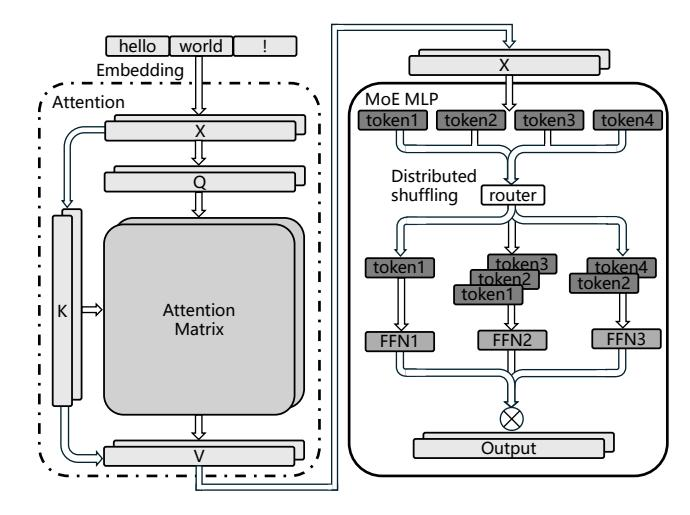

Figure 1: The common architecture of an MoE model.

A typical forward pass of the MoE layer consists of several tightly coupled stages. Tokens are first permuted according to routing results, then exchanged among GPUs through an all-to-all communication. Experts then require an additional permutation to form sub-batches before applying the feed-forward network. After the computation, a symmetrically reversed sequence of permutation and all-to-all communication restores the original token order. Each stage scans and modifies the entire token buffer, and the pipeline leaves little room for overlap or optimization.

#### 2.2 MoE System Performance Profiling

Performance profiling of modern MoE systems shows a general trend of increasing shuffle overhead with higher expert parallelism. Figure 2 illustrates this trend: both training and inference throughput increase as more GPUs participate in expert parallelism, while the fraction of time spent on data shuffling within the total all-to-all latency shows an overall upward trend.

The observed growth in shuffle fraction is primarily due to distributing tokens across more devices. As expert parallelism involves more GPUs, the all-to-all communication spans a wider set of devices, increasing the volume of data transfer and the cost of global synchronization. Each token must be exchanged and reordered across participating GPUs, which adds latency relative to computation. Despite these overheads, feedforward computation within experts remains efficient, resulting in overall throughput improvements. These effects indicate that, at higher degrees of expert parallelism and larger cluster scales, distributed data shuffling becomes a more prominent performance consideration, even on clusters with high-bandwidth interconnects. Optimizing shuffle operations will therefore be critical to sustaining high throughput in future large-scale MoE deployments.

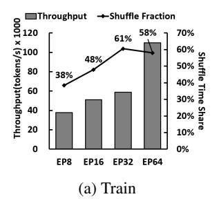

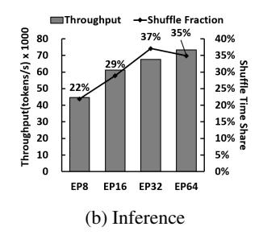

Figure 2: Training and inference throughput and shuffle time fraction across different expert parallelism degrees

Table 1: Breakdown of MoE shuffling cost.

|                       | Intra-node (NVLink) | Inter-node (RoCE) |
|-----------------------|---------------------|-------------------|
| Total latency (ms)    | 0.349               | 0.96              |
| Communication (ms)    | 0.109               | 0.72              |
| Rearrangement (ms)    | 0.24                | 0.24              |
| Rearr. ratio of total | 68.8%               | 25%               |

#### 2.3 Inefficiencies of Distributed Data Shuffling

Redundant data copy and rearrangement. A key source of inefficiency in distributed data movement arises from the repeated copying and rearrangement of data surrounding collective communication operations. Although the communication itself is often considered the dominant cost, the local permutations and buffer reorganizations required before and after each transfer can account for a surprisingly large fraction of end-to-end latency. Each communication is preceded and followed by a fine-grained rearrangement of tensor chunks, often involving tens to hundreds of megabytes of data.

As is typical in the disaggregated design of data transformation and communication, each collective transfer requires data to be laid out in device-major order, whereas the model executes in token-major order. Consequently, every transfer is bracketed by a pair of inversely symmetric rearrangements of tensor chunks—once before and once after communication. As a result, every all-to-all operation is bracketed by a pair of inversely symmetric permutations Profiling indicates that layout rearrangement is far from negligible. Depending on tensor size and expert-parallel degree, the permutation and repacking steps can consume 30–60% of the total shuffling time, occasionally surpassing the communication phase itself. Worse, these copies occur entirely on the critical path, serializing with collective calls and exacerbating pipeline bubbles.

A breakdown of the shuffling pipeline further underscores this bottleneck. Using PyTorch's [22] index\_select as the representative rearrangement operator, we evaluate rearranging and routing data size of 32 MB under typical intra-node and inter-node bandwidth settings. As shown in Table 1, the local rearrangement required to permute tokens before and

after each all-to-all constitutes a dominant share of the shuffle overhead—nearly 69% within a node and still about 25% across nodes. This disproportionate cost demonstrates that MoE shuffling is constrained not only by network bandwidth but also by the memory-bound permutation and repacking steps that bracket the collective, which persist as major inefficiencies even as communication latency grows with scale.

This redundant copying not only inflates latency but also wastes substantial memory bandwidth that could otherwise be used for computation. The tight interdependence between data rearrangement and all-to-all communication means that naively optimizing communication alone provides diminishing returns. Reducing the number of data copies or eliminating layout conversions altogether is essential for improving MoE throughput at scale.

Redundant data communication. Traditional all-to-all shuffling exemplified by NCCL's collective primitives [\[18\]](#page-12-4) is oblivious to both token redundancy and the underlying network hierarchy. In real MoE workloads, routing frequently assigns the same token to multiple experts residing on the same node [\[7,](#page-12-0)[12\]](#page-12-7). Under current communication kernels, this token is serialized and transmitted multiple times over the inter-node fabric even though the payloads are identical. This phenomenon reflects that redundant data communication has become a fundamental bottleneck for MoE communication efficiency, which unnecessarily consumes scarce bandwidth provided by InfiniBand [\[17\]](#page-12-8) and other NICs.

NCCL-style collectives [\[18\]](#page-12-4) expose only rigid, topologyagnostic communication patterns, which leaves no mechanism to express such shared routing intent. As a result, the communication stack cannot exploit locality. Identical payloads are sent repeatedly across nodes, intra-node reuse opportunities are ignored, and link bandwidth is utilized far below the hardware's potential.

Recent systems such as HierMoE [\[12\]](#page-12-7) and DeepSeek-V3 (DeepEP [\[3,](#page-11-0) [36\]](#page-13-2)) have acknowledged this redundancy and incorporate token deduplication. However, their approaches remain limited. Their deduplication is largely local and static, and their optimizations are tailored to specific hardware characteristics, limiting generality and portability.

Achieving peak performance requires a communication stack that is redundancy aware and hierarchy aware. It must detect repeated tokens across experts within the same node, dynamically select locality-preserving routing paths, and eliminate redundant send and receive operations throughout the MoE layer. Only with such capabilities can systems avoid wasting inter-node bandwidth and fully exploit the bandwidth hierarchy of modern GPU clusters.

#### 2.4 Fusing Data and Communication

As discussed in [§2.3,](#page-2-3) distributed data shuffling is a critical component in scaling Mixture-of-Experts (MoE) models, as it directly affects both training throughput and inference efficiency. However, existing communication libraries and frameworks [\[14,](#page-12-5) [18,](#page-12-4) [36\]](#page-13-2) fall short of delivering high-performance distributed shuffling. This gap motivates a rethinking of how data rearrangement and communication can be better integrated.

Our key insight is that rearrangement is, in essence, a data layout transformation, and communication provides the expressive data-movement patterns required to perform it. Communication operations inherently determine how data is partitioned, routed, and placed across devices. This observation motivates a co-designed approach that fuses the layout transformation and the communication step itself.

The feasibility of this fusion stems from the granularity and characteristics of modern Transformer workloads. Data is naturally organized at the token level, with typical sizes between 4KB and 14KB—large enough to amortize the cost of light-weight per-unit transformation relative to overall communication. Within a single machine, communication already entails GPU memory copies, which can be augmented with simple mapping logic without introducing additional synchronization or memory passes. Across machines, the bandwidth asymmetry between the NIC and GPU memory provides more slack: while the NIC transmits at tens of GB/s, GPUs can perform substantially faster memory operations in parallel. This gap allows the required mapped-copy transformations to complete entirely within the communication window. By attaching minimal metadata to each transfer, these mapped copies naturally embed the desired data rearrangement into the communication pipeline itself.

Overall, fusing data and communication offers a principled way to rethink distributed data shuffling. By collapsing what is traditionally a sequence of disjoint memory transformations and network transfers into a single integrated operation, this approach reduces redundant work and aligns more closely with the capabilities of modern heterogeneous systems. Such fusion opens up opportunities for better utilization of both GPU and network resources, and provides a pathway toward more efficient and scalable distributed execution. These observations motivate the design of FUSCO, which brings the idea of fused data and communication to distributed MoE workloads.

#### 3 Design

This section presents the design of FUSCO. [§3.1](#page-4-0) provides an overview of the system architecture, while [§3.2,](#page-4-1) [§3.3](#page-5-0) and [§3.4](#page-6-0) detail the core components: Structured Transfer Engine, Communication Planner, and Online Load Balancer, respectively, highlighting the key design decisions that drive efficiency and scalability.

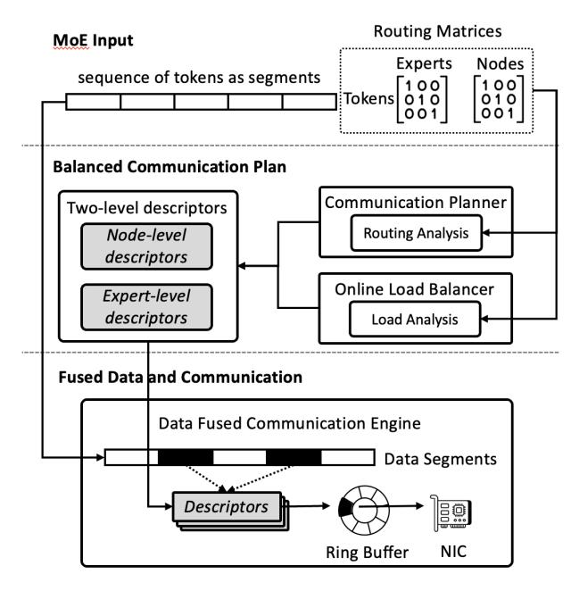

Figure 3: The system architecture of FUSCO.

## 3.1 Overview

Figure [3](#page-4-2) presents the architecture of FUSCO, which reorganizes distributed data shuffling around a single unifying idea: fusing data transformation with communication. At the core of FUSCO's design is the Data-Fused Communication Engine (dComm), which serves as the system's execution substrate. It models the data being sent across GPUs as a set of segments (e.g., tokens in MoE), where each segment is a contiguous memory region, though segments themselves may be non-contiguous in memory. The segments' movement across GPUs and nodes is captured using the core Segment Descriptor abstraction. Then, dComm interprets these descriptors to perform the corresponding data shuffles and employs a pipelined execution strategy to maximize throughput and hardware efficiency.

As dComm depends on the descriptors for efficient data shuffling, FUSCO constructs them using the Communication Planner and the Online Load Balancer, based on the token–expert assignments produced by MoE router. The Communication Planner analyzes these assignments and builds a hierarchical plan that captures intra-node data movement and inter-node segment transfers. To address skewed token distribution on experts, the Online Load Balancer estimates each GPU's transmission volume and applies a greedy routing algorithm that groups GPUs across nodes into communication groups with similar workloads. Since each group uses an independent physical channel (e.g., IB, RoCE), executing them in parallel maximizes channel utilization.

Together, the dComm Engine and the Balanced Communication Planning form a general distributed data-shuffling system that efficiently handles arbitrary shuffling across GPUs

and nodes. This design eliminates any need for intermediate or post-communication data rearrangement and achieves high utilization of communication channels on skewed data communication distribution.

#### 3.2 Data-Fused Communication Engine

The Data-Fused Communication Engine (dComm) is the core communication subsystem of FUSCO. It unifies data rearrangement and multi-GPU communication through a shared abstraction, i.e., the *Segment Descriptor*, which captures the data layout and enables piggybacked rearrangement and direct data transfer. dComm pipelines these operations to fully utilize both GPU memory bandwidth and interconnect channels (e.g., NVLink, IB).

Segment descriptor. dComm models communication payloads (e.g., tokens) as a collection of logical segments, enabling the expression of the fine-grained data shuffling. Inspired by the classic segment descriptor mechanism in virtual memory management [\[8,](#page-12-9) [31\]](#page-13-5) of operating systems, dComm defines its own *segment descriptor*, which records the memory address of the segment and its size in bytes. For the data transfer of a GPU, dComm assembles a descriptor list, i.e., a sequence of such segment descriptors, that specifies how the payload is segmented and where each segment should be read from (as sender) or written to (as receiver). This unified metadata allows dComm to perform end-to-end transformation of structured data layouts, supporting arbitrary rearrangements within a single transfer.

Figure [4](#page-5-1) illustrates how segment descriptors manage structured payload transfers. In dComm, a payload is decomposed into multiple logical segments, and both the sender and receiver maintain a descriptor for each segment. Descriptors are stored consecutively in memory, forming a dense array that enables the system to locate any segment's descriptor by simply tracking the cumulative number of bytes transferred.

During a transfer, each logical segment has a corresponding descriptor on both the sender and receiver sides, forming a clear one-to-one mapping. The sender reads the memory address and size from the descriptor of the current segment to fetch data from the source tensor, advancing sequentially through the descriptor array as segments are transmitted. On the receiver side, the descriptor for the corresponding logical segment indicates where to write the incoming data, ensuring precise placement of each segment. Because descriptors are stored consecutively, the system can efficiently determine the active segment based on the total bytes transferred, enabling lightweight indexing and accurate handling of each segment without extra coordination between endpoints.

Pipelined workflow. Though the segment descriptor abstraction provides a unified way to specify and locate logical segments, efficiently moving and rearranging data ac-

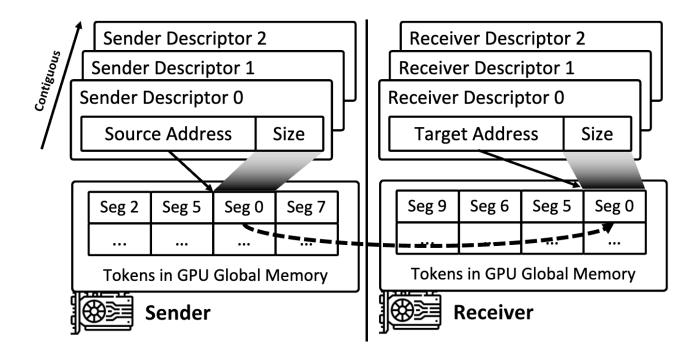

Figure 4: Segment descriptor and its relations with the communication payloads (e.g., tokens in MoE).

cording to these descriptors remains challenging: *the system must minimize GPU memory copy overhead while sustaining high throughput*. dComm addresses this challenge through a pipelined execution workflow that tightly integrates descriptor-based data manipulation with data movement.

For intra-node transfers, where both sender and receiver reside on the same machine, dComm leverages GPUDirect P2P [\[21,](#page-12-10) [33,](#page-13-6) [34\]](#page-13-7) to perform direct GPU-to-GPU copies. dComm integrates descriptor interpretation into the copy path so that layout transformation happens inlined during data transfer, without any extra memory passes.

Cross-node transfers are more complex as they have NIC in the loop, where NIC requires moderately large packages for high communication throughput. Figure [5](#page-5-2) shows the ideal sender-side pipeline, with GPU execution on top and NIC activity below; the receiver-side follows a mirrored structure. To saturate the NIC communication bandwidth, dComm transmits data in *slices*, each of which bundles multiple logical segments. A slice is substantially larger than any individual segment, which amortizes descriptor processing cost, reduces per-transfer overhead, and ensures the NIC can be continuously fed without stalling.

The communication workflow follows a classic producerconsumer pattern and is fully pipelined, as shown in Figure [5.](#page-5-2) The GPU acts as the producer, it consults descriptors to fetch the corresponding segments and executes the layout transformation which is piggybacked on the copy operation from GPU global memory to the ring buffer. The NIC serves as the consumer, streaming these slices over the network as soon as they are ready. Because the RDMA transmission time for a slice typically exceeds the GPU's slice-preparation time, GPU-side memory operations can be overlapped with NIC activity. This design embeds metadata interpretation and layout transformation directly into the data transfer path, allowing fine-grained transformation to occur concurrently with network transmission.

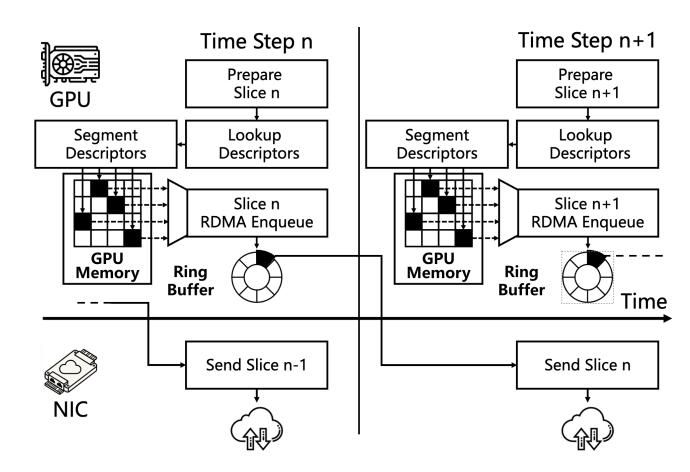

Figure 5: Pipelined workflow in dComm. The data preparation on GPU and the data communication on NIC are fully pipelined.

#### 3.3 Communication Planner

While dComm provides a fused execution engine that interleaves data layout transformation with communication, it relies on precisely constructed metadata that captures both the MoE routing information and the physical communication topology of the cluster. The Communication Planner generates this metadata and determines how dComm should be invoked, acting as the bridge between high-level token routing decisions from MoE router and low-level fused data movement.

Topology-aware hierarchical routing scheme. To maximize data-shuffling efficiency in dComm, the Communication Planner must account for the underlying communication topology, i.e." both intra-node links (e.g., PCIe, NVLink) and inter-node networks (e.g., IB, RoCE). This is crucial for common patterns where a token must be delivered to multiple GPUs within the same node. In expert-parallel MoE architectures [\[7,](#page-12-0) [29\]](#page-13-0), for instance, a token may be routed to several experts located on different GPUs on one node. A naïve implementation would send separate copies of the token across the network, causing redundant cross-node transfers. As the top-*k* fan-out increases, these duplicated transfers increase linearly.

To address this problem, we design a hierarchical routing scheme which decomposes each communication path into topology-aligned hops, manipulating data (e.g., deduplication, expansion) on each hop. The beauty of this design is that, though there are multiple hops, the Segment Descriptors are integrated uniformly across all the hops, ensuring minimal data copying.

Specifically, for each remote node, the sender designates a single *forwarder* GPU. If a token is routed to multiple experts on that node, the sender sends only one copy to the forwarder, which then redistributes it to the other GPUs via

intra-node fabrics. This hierarchical routing brings two key benefits: it alleviates the inter-intra-node bandwidth imbalance by shifting most redistribution to the faster intra-node links, reducing cross-node traffic; and it limits each sender's cross-node degree to one per destination node, simplifying RDMA queue management and NIC scheduling. Without dComm, the scheme remains functionally correct but would require additional memory passes, making the performance benefits far less compelling.

Descriptor-level communication plan. Building on this principle, the planner converts the MoE router's token-routing decisions into a descriptor-level communication plan that dComm can directly execute. This construction relies on two routing matrices: the token–expert matrix *A* ∈ N *T*×*K*, which specifies the experts assigned to each token, and the token–node matrix *B*, derived from *A* under a fixed expert placement, which maps each token to the destination nodes hosting its selected experts.

Based on the matrix *A* and *B*, the planner constructs two levels of descriptors as follows:

- *Node-Level Forwarding Descriptors*: For each token *t*, the planner first retrieves its address and size in the sender's tensor and creates a preliminary send descriptor containing this metadata. It then iterates over all destination nodes *n* ∈ *B*[*t*]. For each node, if *n* has not yet been assigned a descriptor for token *t* (i.e., this is the first appearance of *n* in *B*[*t*]), the planner adds this send descriptor to the per-node descriptor lists, thereby deduplicating multiple expert-level destinations on the same node. On the receiver side, the designated forwarder of node *n*, which is chosen by the Online Load Balancer (§ [3.4\)](#page-6-0), receives a corresponding descriptor indicating the exact placement offset for token *t* in its receive buffer.
- *Expert-Level Distribution Descriptors*: For each tokenexpert (*t*,*e*) pair that resides on node *n*, the planner first determines the token's local address after the node-level forwarding stage, i.e., the position of token *t* within the forwarder's receive tensor. It then creates a send descriptor referencing this local slice. Next, the planner identifies the GPU responsible for expert *e* and computes the exact offset within that GPU's expert-activation tensor where token *t* should be placed. A corresponding receive descriptor is generated with this offset. Together, these send/receive descriptors specify the fine-grained intra-node routing for each (*t*,*e*) pair, allowing dComm to place activations directly at their final expert locations without any auxiliary rearrangement.

After constructing both levels of descriptors, the planner passes this metadata to dComm, which then executes the entire communication pipeline, i.e., from sender to forwarder and from forwarder to the final receiver, using these descriptors as its direct execution plan.

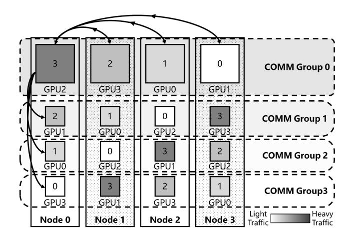

Figure 6: The communication groups on 4 nodes, each of which has 4 GPUs. And an example construction of load balanced groups.

#### 3.4 Online Load Balancer

The Communication Planner enforces the one-copy-per-node policy by designating a forwarder GPU in each destination node for incoming tokens. However, this strategy raises the question of which GPU in the node should serve as the forwarder. The choice is important, as directing too many flows into the same GPU can create a network hotspot and hurt throughput. In contrast, spreading the forwarder role across multiple GPUs balances the workload and better utilizes the node's intra- and inter-connect bandwidth.

We define the concept of *communication group* which contains exactly one GPU from each node, and the GPUs within a group serve as each other's forwarding endpoints, as shown in Figure [6.](#page-6-1) Based on the Communication Planner's scheduling decisions, we compute each GPU's cross-node traffic load *L* which represents the total volume of data the GPU must transmit to remote nodes. We then define the group load as the sum of the loads of all GPUs in that group. The load-balancer's goal is to partition the GPUs into groups so as to minimize the maximum group load.

Formally, this defines a combinatorial max–min optimization problem [\[1\]](#page-11-4): if there are *N* nodes with *M* GPUs per node, the number of possible group assignments is on the order of *O*((*M*!) *N*). Exhaustive search in this space is infeasible under millisecond-scale MoE communication constraints. Hence, we design a lightweight greedy scheduling algorithm to compute a near-balanced assignment efficiently, without coordination across the nodes.

Algorithm [1](#page-7-0) summarizes the greedy algorithm: 1) Sorting GPUs by load *L*: for each node *n*, sort its local GPUs in descending order of load to obtain a permutation *Pn*. 2) Circular shifting: for each node *n*, circularly rotate the permutation *Pn* by *n* positions (assuming nodes are indexed 0,1,...,*N* −1) to form a shifted permutation *Sn*. 3) Forming groups: for each

### Algorithm 1: Online Group-Balanced Assignment Input: Cross-node traffic load of each GPU Output: Group assignments *G* 1 for *each node n* do 2 *Pn* ← sort local GPUs by descending load 3 for *each node n* do 4 *Sn* ← circular shift of *Pn* by node index *n* 5 for *each group gi* ∈ *G* do 6 for *each node n* do 7 assign the GPU at position *i* in *Sn* to group *gi* ; 8 return *G*

group index *i* = 0,1...,*M* −1, from group *gi* by taking the *i*-th GPU from each shifted permutation *Sn*. In other words, group *gi* contains one GPU from each node-specifically, the GPU at position *i* of *Sn* for every node *n*. Figure [6](#page-6-1) shows an example of the balanced groups.

This procedure ensures that each group *gi* contains exactly one GPU from every node. Because each node's sorted permutation is shifted by a unique offset, the highest-load GPU from each node ends up in a different group. The procedure operates concurrently on each node, i.e., sorting the *M* local GPUs with the cost of *O*(*M* log*M*) complexity. The subsequent circular shifts and group construction require only linear work in *M* which is typically small in modern GPU servers (e.g., 4–8 GPUs per node). As a result, the algorithm is extremely fast, adding negligible overhead to millisecond-scale communication, and can be executed fully locally without creating any centralized bottleneck.

#### 4 Implementation

We implement FUSCO on top of NCCL [\[18\]](#page-12-4), a widely used multi-GPU communication library. FUSCO reuses NCCL's transport layer, device registration, and connectionmanagement stack, requiring no changes to NCCL's core network protocols. Our system optimizations occur above NCCL's network abstraction layer, allowing FUSCO to focus on algorithmic improvements while remaining agnostic to the underlying interconnect. Because NCCL transparently supports TCP/IP, InfiniBand [\[17\]](#page-12-8)/RoCE, and heterogeneous GPU topologies, FUSCO inherits portability across diverse cluster networks without requiring network-specific tuning.

Our low-level communication primitive is implemented in roughly 2,000 lines of C++/CUDA and exposed as a standalone collective primitive analogous to send/recv/allgather. This component constitutes the dComm runtime, including on-device descriptor interpretation, pipeline coordination, and the fused data and communication. We implement custom high-performance CUDA communication kernels that serve

as the execution engine behind this primitive. These kernels consume the segment descriptors supplied by the primitive and apply the required data-movement logic directly along the copy path, eliminating intermediate buffer materialization. Each kernel is specialized for its corresponding descriptor pattern and optimized to efficiently execute the prescribed copy operations.

Above the runtime, we implement 1,000 lines of Python code to realize the communication planner and online balancer. This module is built on top of PyTorch [\[22\]](#page-12-6) and uses its GPU operators (e.g., sum, argsort, gather, scatter) to efficiently construct all metadata required for hierarchical routing, segment layout formation, and descriptor generation. The planner invokes dComm through our extended PyTorch distributed backend and produces deterministic communication descriptors for each MoE layer. We integrate FUSCO into existing expert-parallel frameworks with 500 lines of Python. A thin adaptation layer bridges the framework's token-routing path with our planner and dComm primitive for both training and inference, without requiring any changes to model logic or expert kernels.

#### 5 Evaluation

We evaluate FUSCO with respect to our goal of achieving high efficiency and robustness in distributed data shuffling under diverse traffic patterns. First, we describe the experimental setup in [§5.1.](#page-7-1) Second, we present the results of our communication benchmarks in [§5.2,](#page-8-0) including FUSCO 's performance under different traffic patterns. Next, we evaluate FUSCO 's end-to-end performance in [§5.3,](#page-9-0) showing its efficiency in realistic MoE training and inference workloads. Finally, we provide a detailed performance breakdown in [§5.4](#page-10-0) by isolating key components of FUSCO and analyzing their individual contributions.

#### 5.1 Experimental Setup

The experiments are conducted on a cluster of eight nodes, each of which is equipped with two Intel Xeon Platinum 8558 CPUs (48 cores per socket, 192 threads per node), eight NVIDIA H100 GPUs with 80GB HBM3 each, and ten 400 Gbps Mellanox ConnectX-7 NICs for inter-node communication. Intra-node GPUs are interconnected via NVLink [\[19\]](#page-12-11), with eighteen NVLink links per GPU, thereby providing a theoretical aggregate bandwidth of approximately 480GB/s per GPU. The interconnections between NICs and GPUs are facilitated by PCIe bridges. Each node is configured with Linux kernel 5.15.0 on Ubuntu 24.04, NVIDIA driver 535.183.06, CUDA 12.9, NCCL 2.26.3 [\[18\]](#page-12-4), and PyTorch 2.7.0 [\[22\]](#page-12-6).

We compare FUSCO against two representative baselines. The first is NCCL, a widely used, general-purpose library for collective GPU communication and the default backend in most large-scale deep learning frameworks. NCCL offers

Table 2: Parameters and setup of MoE models used in communication benchmarks

| EP | Hidden Dimension | Top-k | Number of Experts |
|----|------------------|-------|-------------------|
| 64 | 7168             | 8     | 256               |

highly optimised primitives for multi-GPU and multi-node configurations, making it by which performance is evaluated. The second baseline is DeepEP [\[36\]](#page-13-2), a state-of-the-art communication library specifically designed for expert parallelism. Built on NVSHMEM [\[24\]](#page-12-12), DeepEP enables efficient data exchange across GPUs and achieves superior performance on Mixture-of-Experts models.

#### 5.2 MoE Communication Benchmarks

We conducted precise benchmarks of communication time within the MoE model, dividing it into three stages: preprocessing, rearrangement and communication. During the preprocessing stage, the routing results are converted into specific communication schedules and decisions. In the rearrangement stage, tokens are rearranged to align with either the communication or local expert layout. Finally, the communication stage executes the all-to-all data exchange, encompassing both dispatch and combine operations.

We evaluate FUSCO 's performance under various communication traffic patterns based on the three aforementioned test stages. The first set of tests uses routing traffic captured during the inference of Deepseek-V3 [\[3\]](#page-11-0) using ShareGPT datasets [\[28\]](#page-13-8). In addition, two controlled edge-case scenarios are constructed to represent the communication characteristics of specific MoE model situations. Table [2](#page-8-1) lists the MoErelated settings used in our benchmarks, which are consistent with the parameters used by the DeepSeek-V3 model.

Real-world traffic. Figure [7](#page-8-2) shows the benchmark results of our FUSCO, NCCL [\[18\]](#page-12-4), and DeepEP [\[36\]](#page-13-2) in a real production environment. Experiments were conducted with sequence lengths of 4k, 8k, 16k, and 32k, which are representative of typical MoE workloads.

The results indicate that our FUSCO consistently outperforms both NCCL and DeepEP across all sequence lengths. Moreover, the breakdown of per-stage time further reveals that FUSCO eliminates the data-rearrangement phase entirely, whereas both NCCL and DeepEP exhibit a stable and nontrivial portion of time spent on these redundant transformations. This further validates the effectiveness of our fused data-communication mechanism in improving the shuffling performance of the MoE model.

Compared with NCCL, FUSCO achieves a speedup of between 1.60× and 1.66×. Compared with DeepEP, our method achieves a speedup of between 1.13× and 1.34×. Additionally, we observe a reduction in the optimization effect of

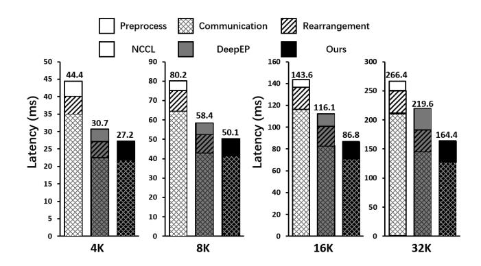

Figure 7: Latency across preprocessing, rearrangements and communication stages under real-world MoE traffic pattern, compared with NCCL and DeepEP

FUSCO at smaller sequence lengths, such as 4k. We attribute this outcome to two main factors. On the one hand, DeepEP's NVSHMEM-based one-sided operations [\[24,](#page-12-12) [36\]](#page-13-2) incur lower software overhead for small message sizes, which is more beneficial in low-traffic scenarios. On the other hand, FUSCO introduces a small communication preprocessing cost that is largely independent of input size. When the overall communication volume is low, this fixed cost becomes more noticeable, thereby reducing FUSCO 's relative advantage.

Traffic pattern study. To further demonstrate the performance advantages of FUSCO, we evaluate two additional controlled environments. Figure [8](#page-9-1) shows the results when all the routed experts of one token are located on the same node, resulting in theoretically minimal traffic across nodes, as only a single copy of the data needs to be sent over the inter-node bandwidth rather than being replicated top-*k* times (Some libraries, such as NCCL, may not fully exploit this optimization).

Such situations may arise in real production environments. For instance, during inference with expert parallelism, the MoE model can place experts with similar activation patterns on the same node. In this configuration, FUSCO achieves a speedup of between 3.47× to 3.84× over NCCL and between 1.95× to 2.01× over DeepEP. These performance improvements are primarily due to FUSCO 's ability to eliminate unnecessary cross-node communications. NCCL does not provide optimizations to avoid unnecessary cross-node communications, and therefore shows little improvement in this environment. In contrast, both DeepEP and FUSCO benefit substantially from the eliminating redundant communication. Moreover, the additional performance advantage of FUSCO over DeepEP arises from its efficient two-level descriptor design and fully pipelined, data-fused communication path.

Finally, we evaluate an environment in which different nodes experience severe communication load imbalance. Figure [10](#page-9-2) shows the distribution of GPU network loads across all nodes, with the x-axis representing normalized load from

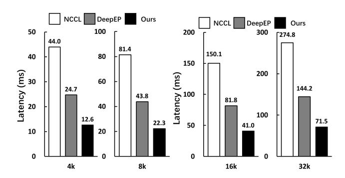

Figure 8: Benchmark results of three communication libraries under single-node routed traffic pattern

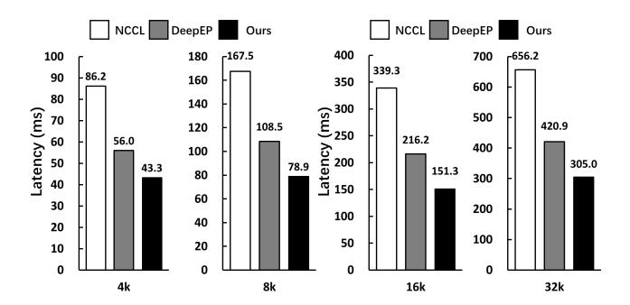

Figure 9: Benchmark results of three communication libraries under load-imbalanced traffic pattern

0 (no data to send) to 1 (all data needs to be sent to other nodes) and the y-axis representing probability density. As illustrated, the distribution is bimodal, with most GPUs experiencing either very low or very high network load, and relatively few GPUs under moderate load. Figure [9](#page-9-3) shows the results. In this environment, FUSCO achieves a speedup of between 1.99× to 2.24× speedup over NCCL and between 1.29× to 1.42× speedup over DeepEP. Compared to the realworld environment, all communication libraries demonstrate reduced performance, with average throughput reductions of 58%, 47%, and 42% for NCCL, DeepEP, and FUSCO, respectively. This observation highlights the critical impact of load balancing on communication efficiency. Nevertheless, FUSCO retains an advantage due to its Balancer mechanism, which mitigates skew-induced stalls by redistributing excess traffic across available GPU links and improving the regularity of the overall communication schedule.

#### 5.3 End-to-End Performance

To provide a comprehensive evaluation of FUSCO, we conduct end-to-end tests on both model training and inference serving. All experiments are configured with an expert parallelism level of 64 and a constant sequence length of 16k. In this section, we select two representative state-of-the-art MoE

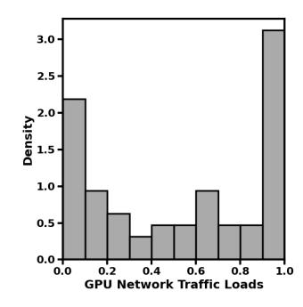

Figure 10: Histogram density distribution of GPU network traffic loads across all nodes

models with distinct architectures and scales, Qwen3 [\[25,](#page-12-13) [35\]](#page-13-1) and DeepSeek-V3 [\[3\]](#page-11-0), to thoroughly assess FUSCO 's impact across full-model workflows.

For model training, We have integrated FUSCO into Megatron-LM [\[15\]](#page-12-2), a widely used and highly optimised framework for training transformer models. We use FUSCO as the all-to-all operation for the MoE model during model training. Experiments were conducted on 64 NVIDIA H100 GPUs, each with 80 GB of memory. Due to memory constraints, we kept the layer size the same but reduced the number of layers, measuring performance using per-iteration training time. Figure [11a](#page-10-1) shows iteration times for both models across three communication libraries. The results demonstrate that FUSCO significantly reduces iteration latency, delivering a speedup of between 1.17× to 1.39× over NCCL and between 1.1× to 1.19 × over DeepEP. These improvements translate into substantial gains in training throughput while preserving the accuracy of the MoE model.

For model inference serving, we have integrate FUSCO into SGLang [\[37\]](#page-13-3), an inference framework optimised for efficiently serving large LLMs. We replace the all-to-all operation with FUSCO in the MoE model used during the prefill stage. We configured SGLang with a pre-fill decoding disaggregation [\[38\]](#page-13-9) setup and evaluated its performance using timeto-first-token (TTFT). Figure [11b](#page-10-1) presents the TTFT results for the two models. These results show that FUSCO enables faster responses for the model inference serving, achieving a speedup of between 1.09× to 1.25× over NCCL and between 1.06× to 1.16× over DeepEP. However, the end-to-end performance improvement is smaller than that achieved in model training because communication accounts for only 52% of total latency in our inference experiments, compared to 62% in the training experiments.

In particular, we observe that the advantages of FUSCO increase with model scale. As the size of the MoE model increases, the communication cost in MoE models also increases. As a result, the benefits of fusion become more pronounced, which is consistent with the communication-centric benchmark results presented in § [5.2.](#page-8-0)

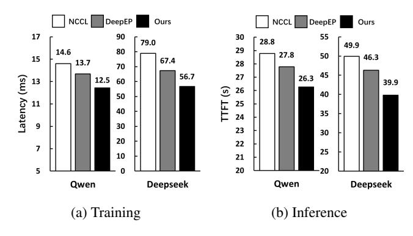

Figure 11: End-to-end training and inference performance of three communication libraries on two representative models

#### 5.4 Performance Breakdown

To better illustrate the performance contributions of the three major mechanisms in FUSCO, we respectively disable the Data-Fused Communication Engine (dComm), the Communication Planner, and Online Load Balancer. When the dComm is disabled, its fused communication path is replaced by NCCL operations, and the necessary communication data rearrangements are performed explicitly. If the Communication Planner is disabled, the system reverts to the default all-to-all strategy, whereby each token is transmitted independently to its destination GPU. Furthermore, when the Online Load Balancer is disabled, a commonly used static placement scheme is adopted that clusters GPUs with the same local index across nodes. All experiments follow the benchmarking methodology described in [§5.2](#page-8-0) and use a constant sequence length of 16k tokens.

Table 3: Performance breakdown of FUSCO under three different traffic patterns

|                   |       |         |         | FUSCO dComm-off Planner-off Balancer-off |
|-------------------|-------|---------|---------|------------------------------------------|
| real-world        | 86.84 | 119.48  | 124.35  | 95.13                                    |
| degradation       | –     | -27.32% | -30.17% | -8.72%                                   |
| single-node       | 40.99 | 61.47   | 125.42  | 42.36                                    |
| degradation       | –     | -33.32% | -67.32% | -3.2%                                    |
| imbalanced 151.30 | –     | 219.83  | 207.45  | 181.48                                   |
| degradation       |       | -31.17% | -27.07% | -16.63%                                  |

As shown in Table [3,](#page-10-2) consistently disabling the Data-Fused Communication Engine in both the previously tested production environment and the two simulated environments consistently results in a performance degradation of approximately 30%. This equates to 27.3% in the realworld environment, 33.3% in the intra-node-only communication environment and 31.2% in the communication load imbalance environment. This indicates that the dComm plays a pivotal role in FUSCO, which completely eliminates the overhead associated with

data rearrangement via a pipelined scheduling strategy. Furthermore, these performance gains exceed the rearrangement overhead observed in § [2.3,](#page-2-3) suggesting that naively applying two-level routing without fusion may introduce redundant reshuffles, which the dComm effectively eliminates.

The Communication Planner also has a significant impact on performance in these environments. Disabling the planner results in performance drops of 30.2% in the real-world environment and 27.1% in the communication load imbalance environment. The effect is even more pronounced in the single-node routed setting, where performance drops by 67.3%. The performance drop is primarily caused by the lack of token deduplication when planning is disabled, which leads to a sharp increase in cross-node communication in such setting. In our hardware setup, intra-node bandwidth is approximately 480 GB/s, whereas inter-node bandwidth is only around 50 GB/s. Consequently, unoptimised routing exacerbates inter-node contention, resulting in reduced overall performance.

Unlike the previous two mechanisms, the Online Load Balancer only provides benefits in specific environments. Disabling it results in a performance drop of 8.7% in the realworld environment, 16.6% in the communication load imbalance environment, and just 3.2% in the single-node routed setting. This indicates that the balancer effectively mitigates intra-node load imbalance across nodes by redistributing tokens during the planning phase. However, the current implementation uses a greedy heuristic and only balances senderside load due to scheduling time constraints. Although its impact is less pronounced than that of the other modules, it enhances the overall robustness of FUSCO.

#### 6 Related Work

Mixture-of-Experts models. Mixture-of-Experts models [\[3,](#page-11-0) [7,](#page-12-0) [35\]](#page-13-1) has become a key technique for scaling LLMs by decoupling model capacity from computational cost. Sparsely-Gated MoE [\[29\]](#page-13-0) showed that activating only a small subset of experts allows models to scale to hundreds of billions of parameters without proportional FLOP growth, delivering significant gains in machine translation and language modeling.Building on this idea, GShard [\[9\]](#page-12-1) and GLaM [\[4\]](#page-11-1) advanced distributed expert parallelism and leveraged collective communication to support efficient large-scale MoE training across massive accelerator clusters. More recent systems such as DeepSpeed-MoE [\[26\]](#page-12-14), Megatron [\[15\]](#page-12-2), and FasterMoE [\[6\]](#page-11-2) further refine expert dispatching, load balancing, and communication scheduling, significantly improving MoE scalability in practice.

Despite these advances, MoE still faces a fundamental tension: while sparse expert activation dramatically increases model capacity, it also introduces substantial communication pressure [\[6,](#page-11-2) [23,](#page-12-15) [27\]](#page-12-16) and highly dynamic workload distribution [\[6\]](#page-11-2). Prior studies report that all-to-all communication in the token dispatch path can account for 30–60% [\[7,](#page-12-0) [11\]](#page-12-3) of end-to-end MoE training time, and the variability of token routing leads to severe inter-GPU load imbalance, degrading both throughput and hardware utilization [\[27\]](#page-12-16). As a result, blocking all-to-all communication and imbalanced expert workloads remain dominant bottlenecks, highlighting the need for new techniques that jointly optimize communication efficiency and load balance.

Collective communication and optimization. Collective communication [\[18,](#page-12-4) [36\]](#page-13-2) plays a fundamental role in largescale distributed training, where primitives such as all-reduce and all-to-all largely determine end-to-end system throughput. All-to-all communication is widely recognized as a dominant bottleneck [\[2,](#page-11-5) [13,](#page-12-17) [16,](#page-12-18) [23\]](#page-12-15), and its cost is further amplified in scale-out deployments where load imbalance [\[6\]](#page-11-2) and limited inter-node bandwidth [\[27\]](#page-12-16) exacerbate both latency and bandwidth inefficiency.

To address these challenges, prior work explores several complementary directions: optimizing all-to-all primitives, employing load-balancing techniques to maximize bandwidth utilization, compressing token data to reduce payload size, and redesigning MoE architectures to inherently lower communication demand. Lina [\[10\]](#page-12-19) and HierMoE [\[12\]](#page-12-7) smooth expert utilization across GPUs to reduce cross-device traffic, while ScheMoE [\[30\]](#page-13-10), Megatron-LM [\[15\]](#page-12-2), and Tutel [\[7\]](#page-12-0) introduce topology-aware or hierarchical routing to reduce redundant transfers via multi-level communication paths. LSH-MoE [\[16\]](#page-12-18) decreases payload size by clustering similar tokens. Systems such as FuseLink [\[27\]](#page-12-16) pursue deeper communication–computation overlap, though fully overlapping all-to-all remains difficult. DeepSeek-V3 [\[3,](#page-11-0) [36\]](#page-13-2), further advances this space by customizing its communication stack. By pairing warp specialization with a constrained cross-node routing strategy and a fully pipelined IB–NVLink [\[17,](#page-12-8) [19\]](#page-12-11), data path, the system attains high communication efficiency and low SM overhead, surpassing standard NCCL [\[18\]](#page-12-4) implementations.

Prior efforts, however, exhibit notable limitations. Many primitive-level optimizations, including those in DeepSeek-V3, are tightly coupled to specific hardware capabilities (e.g., InfiniBand [\[17\]](#page-12-8), NVLink [\[19\]](#page-12-11), IBGDA [\[20\]](#page-12-20)) and rely on customized kernels, limiting their portability across diverse system configurations. Compression and clustering-based methods may introduce quality degradation or unstable benefits, while achieving robust communication–computation overlap remains difficult due to the blocking nature of all-to-all and its heavy engineering burden. Architectural redesigns further compromise model portability and complicate training pipelines, yet still cannot bypass the fundamental communication lower bound. In contrast, FUSCO sidesteps these limitations by unifying data rearrangement and communication into a single execution path, providing a broadly applicable solution independent of specialized hardware features.

#### 7 Conclusion

In this paper, we present FUSCO, a communication library that adopts a fused data transformation and communication approach for efficient distributed shuffling. FUSCO introduces a common abstraction to capture data layout pattern, and a pipelined communication engine that performs shuffling directly along the communication path. This design, together with balanced communication planning, removes redundant rearrangements, reduces transfer overheads, and improves traffic balance across devices. Our evaluation shows that FUSCO delivers substantial communication efficiency gains and accelerates end-to-end MoE training and inference over NCCL and DeepEP. We believe the principles behind FUSCO can generalize to a wide range of distributed workloads where communication is tightly intertwined with data rearrangement.

## References

- [1] Hassene Aissi, Cristina Bazgan, and Daniel Vanderpooten. Min–max and min–max regret versions of combinatorial optimization problems: A survey. *European journal of operational research*, 197(2):427–438, 2009.
- [2] Jiamin Cao, Shangfeng Shi, Jiaqi Gao, Weisen Liu, Yifan Yang, Yichi Xu, Zhilong Zheng, Yu Guan, Kun Qian, Ying Liu, et al. Syccl: Exploiting symmetry for efficient collective communication scheduling. In *Proceedings of the ACM SIGCOMM 2025 Conference*, pages 645–662, 2025.
- [3] DeepSeek-AI, Aixin Liu, Bei Feng, Bing Xue, Bingxuan Wang, Bochao Wu, Chengda Lu, Chenggang Zhao, Chengqi Deng, Chenyu Zhang, and et al. Deepseek-v3 technical report, 2025.
- [4] Nan Du, Yanping Huang, Andrew M Dai, Simon Tong, Dmitry Lepikhin, Yuanzhong Xu, Maxim Krikun, Yanqi Zhou, Adams Wei Yu, Orhan Firat, et al. Glam: Efficient scaling of language models with mixture-of-experts. In *International conference on machine learning*, pages 5547–5569. PMLR, 2022.
- [5] William Fedus, Barret Zoph, and Noam Shazeer. Switch transformers: Scaling to trillion parameter models with simple and efficient sparsity. *Journal of Machine Learning Research*, 23(120):1–39, 2022.
- [6] Jiaao He, Jidong Zhai, Tiago Antunes, Haojie Wang, Fuwen Luo, Shangfeng Shi, and Qin Li. FasterMoE: modeling and optimizing training of large-scale dynamic pre-trained models. In *Proceedings of the 27th ACM SIGPLAN Symposium on Principles and Practice of Parallel Programming*, pages 120–134, Seoul Republic of Korea, April 2022. ACM.

- [7] Changho Hwang, Wei Cui, Yifan Xiong, Ziyue Yang, Ze Liu, Han Hu, Zilong Wang, Rafael Salas, Jithin Jose, Prabhat Ram, et al. Tutel: Adaptive mixture-of-experts at scale. *Proceedings of Machine Learning and Systems*, 5:269–287, 2023.
- [8] Intel Corporation. *Intel 64 and IA-32 Architectures Software Developer's Manual*, 2024. Volume 3: System Programming Guide. Classic segmentation and segment descriptor mechanism.
- [9] Dmitry Lepikhin, HyoukJoong Lee, Yuanzhong Xu, Dehao Chen, Orhan Firat, Yanping Huang, Maxim Krikun, Noam Shazeer, and Zhifeng Chen. Gshard: Scaling giant models with conditional computation and automatic sharding. In *International Conference on Learning Representations*.
- [10] Jiamin Li, Yimin Jiang, Yibo Zhu, Cong Wang, and Hong Xu. Accelerating distributed {MoE} training and inference with lina. In *2023 USENIX Annual Technical Conference (USENIX ATC 23)*, pages 945–959, 2023.
- [11] Xudong Liao, Yijun Sun, Han Tian, Xinchen Wan, Yilun Jin, Zilong Wang, Zhenghang Ren, Xinyang Huang, Wenxue Li, Kin Fai Tse, et al. Mixnet: A runtime reconfigurable optical-electrical fabric for distributed mixture-of-experts training. In *Proceedings of the ACM SIGCOMM 2025 Conference*, pages 554–574, 2025.
- [12] Wenxiang Lin, Xinglin Pan, Lin Zhang, Shaohuai Shi, Xuan Wang, and Xiaowen Chu. HierMoE: Accelerating MoE Training with Hierarchical Token Deduplication and Expert Swap, August 2025. arXiv:2508.09591 [cs].
- [13] Xuting Liu, Behnaz Arzani, Siva Kesava Reddy Kakarla, Liangyu Zhao, Vincent Liu, Miguel Castro, Srikanth Kandula, and Luke Marshall. Rethinking machine learning collective communication as a multi-commodity flow problem. In *Proceedings of the ACM SIGCOMM 2024 Conference*, pages 16–37, 2024.
- [14] Microsoft. MSCCL codebase. URL: [https://github.](https://github.com/microsoft/msccl) [com/microsoft/msccl](https://github.com/microsoft/msccl).
- [15] Deepak Narayanan, Mohammad Shoeybi, Jared Casper, Patrick LeGresley, Mostofa Patwary, Vijay Korthikanti, Dmitri Vainbrand, Prethvi Kashinkunti, Julie Bernauer, Bryan Catanzaro, Amar Phanishayee, and Matei Zaharia. Efficient large-scale language model training on GPU clusters using megatron-LM. In *Proceedings of the International Conference for High Performance Computing, Networking, Storage and Analysis*, pages 1–15, St. Louis Missouri, November 2021. ACM.
- [16] Xiaonan Nie, Liu Qibin, Fangcheng Fu, Shenhan Zhu, Xupeng Miao, Xiaoyang Li, Yang Zhang, Shouda Liu,

- and Bin Cui. Lsh-moe: Communication-efficient moe training via locality-sensitive hashing. *Advances in Neural Information Processing Systems*, 37:54161–54182, 2024.
- [17] NVIDIA. NVIDIA InfiniBand. URL: [https://www.nvidia.com/en-us/networking/](https://www.nvidia.com/en-us/networking/products/infiniband/) [products/infiniband/](https://www.nvidia.com/en-us/networking/products/infiniband/).
- [18] NVIDIA. NVIDIA NCCL. URL: [https://](https://developer.nvidia.com/nccl) [developer.nvidia.com/nccl](https://developer.nvidia.com/nccl).
- [19] NVIDIA. NVIDIA NVLink. URL: [https://www.](https://www.nvidia.com/en-us/data-center/nvlink/) [nvidia.com/en-us/data-center/nvlink/](https://www.nvidia.com/en-us/data-center/nvlink/).
- [20] NVIDIA. NVSHMEM InfiniBand GPUDirect Async (IBGDA) Transport. URL: [https://docs.nvidia.](https://docs.nvidia.com/nvshmem/release-notes-install-guide/prior-releases/release-280.html) [com/nvshmem/release-notes-install-guide/](https://docs.nvidia.com/nvshmem/release-notes-install-guide/prior-releases/release-280.html) [prior-releases/release-280.html](https://docs.nvidia.com/nvshmem/release-notes-install-guide/prior-releases/release-280.html).
- [21] NVIDIA Corporation. Nvidia gpudirect technology overview. Technical report, NVIDIA, 2018. Covers GPUDirect RDMA and Peer-to-Peer.
- [22] Adam Paszke, Sam Gross, Francisco Massa, Adam Lerer, James Bradbury, Gregory Chanan, Trevor Killeen, Zeming Lin, Natalia Gimelshein, Luca Antiga, et al. Pytorch: An imperative style, high-performance deep learning library. *Advances in neural information processing systems*, 32, 2019.
- [23] Yanghua Peng, Yibo Zhu, Yangrui Chen, Yixin Bao, Bairen Yi, Chang Lan, Chuan Wu, and Chuanxiong Guo. A generic communication scheduler for distributed dnn training acceleration. In *Proceedings of the 27th ACM Symposium on Operating Systems Principles*, pages 16– 29, 2019.
- [24] Sreeram Potluri, Arun Venkatesh, Mortuza Ibtesham, et al. Nvshmem: Gpu-accelerated openshmem. In *Proceedings of the International Conference on High Performance Computing, Networking, Storage and Analysis (SC)*. IEEE, 2019. NVIDIA NVSHMEM.
- [25] Qwen Team. Qwen3-235b model. URL: URL: [https:](https://huggingface.co/Qwen/Qwen3-235B) [//huggingface.co/Qwen/Qwen3-235B](https://huggingface.co/Qwen/Qwen3-235B).
- [26] Samyam Rajbhandari, Conglong Li, Zhewei Yao, Minjia Zhang, Reza Yazdani Aminabadi, Ammar Ahmad Awan, Jeff Rasley, and Yuxiong He. Deepspeed-moe: Advancing mixture-of-experts inference and training to power next-generation ai scale. In *International conference on machine learning*, pages 18332–18346. PMLR, 2022.
- [27] Zhenghang Ren, Yuxuan Li, Zilong Wang, Xinyang Huang, Wenxue Li, Kaiqiang Xu, Xudong Liao, Yijun Sun, Bowen Liu, Han Tian, et al. Enabling efficient gpu

- communication over multiple nics with fuselink. In *19th USENIX Symposium on Operating Systems Design and Implementation (OSDI 25)*, pages 91–108, 2025.
- [28] ShareGPT Teams. Sharegpt. [https://sharegpt.](https://sharegpt.com/) [com/](https://sharegpt.com/), 2023.
- [29] Noam Shazeer, Azalia Mirhoseini, Krzysztof Maziarz, Andy Davis, Quoc Le, Geoffrey Hinton, and Jeff Dean. Outrageously large neural networks: The sparsely-gated mixture-of-experts layer. In *International Conference on Learning Representations*, 2017.
- [30] Shaohuai Shi, Xinglin Pan, Qiang Wang, Chengjian Liu, Xiaozhe Ren, Zhongzhe Hu, Yu Yang, Bo Li, and Xiaowen Chu. ScheMoE: An Extensible Mixtureof-Experts Distributed Training System with Tasks Scheduling. In *Proceedings of the Nineteenth European Conference on Computer Systems*, pages 236–249, Athens Greece, April 2024. ACM.
- [31] William Stallings. *Operating systems: internals and design principles*. Prentice Hall Press, 2011.
- [32] Ashish Vaswani, Noam Shazeer, Niki Parmar, Jakob Uszkoreit, Llion Jones, Aidan N Gomez, Łukasz Kaiser, and Illia Polosukhin. Attention is all you need. *Advances in neural information processing systems*, 30, 2017.
- [33] Xingda Wei, Rong Chen, and Haibo Chen. Fast rdmabased ordered key-value store using remote learned cache. In *Proceedings of the 14th USENIX Conference on Operating Systems Design and Implementation*, pages 117–135, 2020.
- [34] Jilong Xue, Youshan Miao, Cheng Chen, Ming Wu, Lintao Zhang, and Lidong Zhou. Fast distributed deep learning over rdma. In *Proceedings of the Fourteenth EuroSys Conference 2019*, pages 1–14, 2019.
- [35] An Yang, Anfeng Li, Baosong Yang, Beichen Zhang, Binyuan Hui, Bo Zheng, Bowen Yu, Chang Gao, Chengen Huang, Chenxu Lv, et al. Qwen3 technical report. *arXiv preprint arXiv:2505.09388*, 2025.
- [36] Chenggang Zhao, Shangyan Zhou, Liyue Zhang, Chengqi Deng, Zhean Xu, Yuxuan Liu, Kuai Yu, Jiashi Li, and Liang Zhao. Deepep: an efficient expert-parallel communication library. URL: [https://github.com/](https://github.com/deepseek-ai/DeepEP) [deepseek-ai/DeepEP](https://github.com/deepseek-ai/DeepEP).
- [37] Lianmin Zheng, Liangsheng Yin, Zhiqiang Xie, Chuyue Livia Sun, Jeff Huang, Cody Hao Yu, Shiyi Cao, Christos Kozyrakis, Ion Stoica, Joseph E Gonzalez, et al. Sglang: Efficient execution of structured language model programs. *Advances in neural information processing systems*, 37:62557–62583, 2024.

[38] Yinmin Zhong, Shengyu Liu, Junda Chen, Jianbo Hu, Yibo Zhu, Xuanzhe Liu, Xin Jin, and Hao Zhang. Distserve: Disaggregating prefill and decoding for goodputoptimized large language model serving. In *18th USENIX Symposium on Operating Systems Design and Implementation (OSDI 24)*, pages 193–210, 2024.