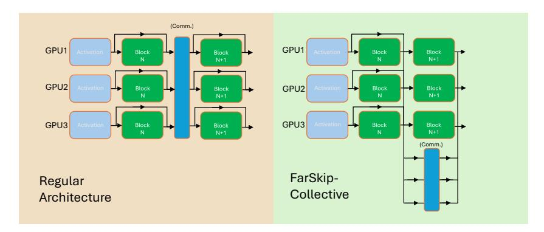
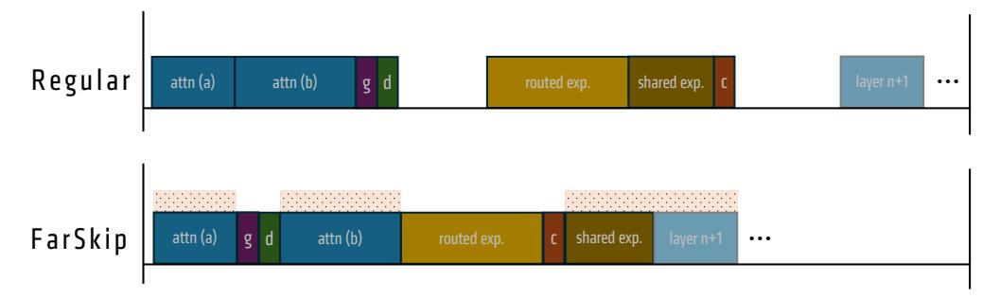
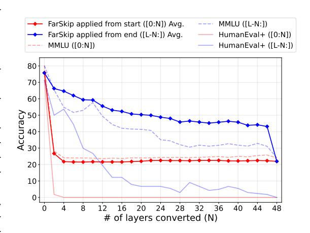

# 1 Introduction

Mixture of Experts (MoE) models have emerged as the de-facto model architecture for leading large language models (LLMs) in recent years [\[34,](#page-14-0) [11,](#page-13-0) [7\]](#page-13-1). MoEs activate a sparse subset of their total parameters, usually via a mixture of experts layer to replace the dense MLP sub-block. The sparsity and reduced computational cost of MoEs makes them amenable to even larger parameter scaling with new open-source MoE models routinely exceeding 500B total parameters [\[9,](#page-13-2) [18,](#page-13-3) [25\]](#page-14-1). Because of the fixed memory capacity of compute accelerators, MoEs require even more distribution for training and inference setups as compared to their dense LLM counterparts [\[8\]](#page-13-4).

However, distributed training and inference is not without a cost as activations and model weights need to be communicated between devices quickly; especially when the communication operations are *blocking*, where the communication can only commence at a particular stage of processing and the next operation in the compute graph relies on it. Blocking communication patterns result in *exposed* idle time when the accelerator is not running computations; this commonly appears in popular parallelism techniques such as Expert, Sequence, and Tensor Parallelism [\[27,](#page-14-2) [34\]](#page-14-0) and is especially tricky to overcome during inference. The new age of large and sparsely activated MoE architectures along with improved hardware computation speeds exacerbates these issues as communication becomes a relatively larger portion of the end-to-end workload [\[42\]](#page-15-0).

In this work we present a method to modify models' architectures to use available activations for the next computation at the onset of the communication call, which may be outdated or partially materialized, in order to avoid the blocking communication and start the next computation during the communication operation. We name our approach FarSkip-Collective as we start the next computation immediately using available activations and run the communication collective in parallel, far-skipping the communicated result to the residual of the next layer and making that activation available for future layers. By running communication overlapped with computation, as long as the duration of the computation leading up to the next residual is longer than the communication we avoid idle compute time.

Mathematically, FarSkip-Collective is "dropping" connections of the network as the input to the next computation is now a residual which does not include the latest communicated output block. Characteristically, this can damage the capabilities of the model architecture. We therefore focus on evaluating whether the modified architecture connectivity can perform on par with regular MoE connectivity and study the capabilities of models exhaustively over a wide array of evaluations and model scales.

By developing FarSkip-Collective Self-Distill (FCSD) we answer in the affirmative, demonstrating that state-of-the-art open-source MoE models of scales ranging from 16B to 109B can be fully converted into FarSkip-Collective models with minimal loss of capabilities of the model with a maximum average performance drop of 2.5% across the three models [\[31,](#page-14-3) [25,](#page-14-1) [10\]](#page-13-5) each benchmarked over eleven evaluation datasets. FCSD is a simple yet effective knowledge distillation recipe we identified via a systemic study which can be applied to any model with the absence of a powerful teacher.

Independently of this work, we became aware of recent works exploring similar approaches, modifying the model architecture and running computations with either "outdated" [\[41\]](#page-15-1) or "partial" [\[29,](#page-14-4) [20\]](#page-13-6) activations to overlap communication. In contrast with our work, existing approaches focus has been limited to tensor-parallelism in dense models. Such works have also only studied the problem of model capabilities at smaller-scale models or achieved only partial modification of the model layers. It therefore remained unclear whether the modified connectivity architecture can be applied to overlap communication in all layers and perform at the scale of today's state-of-the-art MoE LLMs. Indeed it is not uncommon for model architecture modification to show promise at a smaller scale but scale poorly as compared with regular transformers when studied at frontier-LLM scale with more challenging tasks. We find the results with FCSD encouraging in that even at the 100B+ model scale over a wide range of generation and likelihood-based tasks, FarSkip-Collective can achieve within 1% on average from the original model's accuracy.

Just because the new model architecture obviates dependencies in the model that regularly lead to blocking communication, it does not imply the architecture will automatically overlap computation and communication in practice if not implemented carefully. To this end, we realize the overlapping opportunities of the models by developing performant and overlapped implementations for training and inference. For training, we develop on top of Megatron-LM [\[27\]](#page-14-2) and achieve 88.4% computationcommunication overlapping of the Expert Parallelism communication (87.6% in forward, 89.0% in backward) using asynchronous execution of communication collectives and novel scheduling techniques at the PyTorch API layer. On the inference side, we implement our method on top of vLLM & SGLang and integrate our approach with HIP/CUDA-graphs achieving up to 97.6% communication overlap. Overall we implement our approach for wide use across different hardware and avoid low-level kernel optimizations in favor of more general implementation at the PyTorch API level. We plan to open-source our implementation and modified model checkpoints and provide easy integration with the upstream frameworks.

We summarize our contributions as follows:

- We present FarSkip-Collectives, a method to convert the execution dependency of model layers that eliminates blocking communication patterns in MoEs, thereby allowing inference and training speed-ups.
- We demonstrate at the 100B+ parameter scale that MoEs using the FarSkip-Collective architecture modifications retain the capabilities of modern MoEs while speeding-up their execution in distributed settings. In particular we fully convert the Llama 4 Scout MoE (109B) while maintaining average accuracy of the model within 1.0% of the instruction-tuned open-sourced model release.
- We develop FCSD, an efficient and general knowledge self-distillation recipe to convert existing LLMs into FarSkip models using < 10B training tokens, and convert DeepSeek-V2 Lite (16B), Qwen-3-30B MoE (30B), and Llama 4 Scout (109B) achieving within 2.5% of their original performance.

Figure 1: FarSkip-Collective modifies the connectivity between sub-blocks to avoid blocking communication in collectives. Computation continues with available activations, partial (e.g., Block N output) or outdated (e.g., Activation).

- For large-scale training, we integrate our method into Megatron-LM and achieve 88.4% communication overlap for the previously blocking all-to-all communication collectives responsible for MoE expert parallelism in the forward and backward passes.
- For model inference, we provide an optimized implementation of FarSkip in vLLM & SGLang that overlaps the communication for distributed inference. For example, for the modified Llama-4 Scout model, we achieve 18.5% speed-up in Time To First Token.

The rest of the paper is organized as follows, in Section 2 we present background followed by our approach in Section 3 and explicit optimized implementation of the method in Section 4. In Section 5, we present our experimental results and review related works in Section 6 followed by conclusion (Section 7).

#### 2 Background

#### 2.1 MoE parallelism at training and inference

Two of the key parallelism techniques for MoE training and inference are Tensor and Expert Parallelism.

**Tensor Parallelism** In Tensor Parallelism (TP), an MLP or a Self-Attention sub-block will be split by slicing the sub-block's dense weight matrices evenly across their columns or rows. Let  $A \in \mathbb{R}^{B \times d}$  be a model input activation for a modern MLP layer of the form

$$\mathrm{MLP}(A) = \sigma(AW_1^\top \cdot g(AW_2^\top))W_3^\top,$$

with  $g, \sigma$  being entrywise non-linearities and  $W_1, W_2 \in \mathbb{R}^{c \times d}, W_3 \in \mathbb{R}^{d \times c}$ . TP of size k will split the matrices into

$$\begin{split} W^i_{\{1,2\}} &= \left(W_{\{1,2\}}\right)_{[i*c/k:(i+1)*c/k,:]} \in \mathbb{R}^{(c/k)\times d}, \\ W^i_3 &= \left(W_3\right)_{[:,i*c/k:(i+1)*c/k]} \in \mathbb{R}^{d\times (c/k)}, \end{split}$$

for  $0 \le i \le k-1$ . Then computation of each TP rank can run independently until the end of the sub-block where an all-reduce communication collective is applied to construct the final output.

$$MLP(A)_i = \sigma(AW_1^{i\top} \cdot g(AW_2^{i\top}))W_3^{i\top}, \tag{1}$$

$$MLP(A) = all-reduce(MLP(A)_i).$$
(2)

The selection of Column-Parallel  $W^i_{\{1,2\}}$  split followed by Row-Parallel  $W^i_3$  split makes it possible to only apply communication once at the end of the MLP sub-block.

For multi-head self-attention (or efficient variants) implemented with TP, the computation is decomposed into independent computations partitioned across the different attention heads; this allows for a similar implementation employing Column-Parallelism (Q,K,V) followed by Row-Parallelism (O) and a single all-reduce.

**Expert Parallelism** The key parallelism component of MoE layers is Expert Parallelism (EP). An MoE layer with E experts generalizes the MLP as

$$MoE(A) = \sum_{j=1}^{E} G(A)_{j} \cdot MLP^{j}(A),$$

where  $G(A) = s(AW_R^\top)$  is a linear classification layer followed by a sparse router selection function s() activating only a subset of the  $\mathrm{MLP}^j(A)$  refers to a distinct "expert" for  $1 \leq j \leq E$ . With EP of rank k, subsets of  $\sim E/k$  experts will be distributed across the k parallel ranks. Unlike TP, during training different input token activations will be mapped to the different experts based on the router selection G(A). Mechanically, specific tokens  $A_{[l,:]} \in \mathbb{R}^d$  will be grouped and mapped to a subset of experts  $P_l \subset \{1, \ldots E\}$  requiring permutation of A followed by an all-to-all collective that sends and receives data between the ranks according to the router-defined data partition map.

$$A_i = R_i \times A$$
 placed on rank  $i$  (Dispatch),

with  $R_i \in \{0,1\}^{B_i \times d}$  being the indicator of G(A); this is referred to as "Dispatch" and will have different bandwidth requirements depending on various factors such as the expert parallel size k and the sparsity of s (e.g., the assigned "TopK" value). After each expert receives its dedicated tokens and computes  $\mathrm{MLP}^j(A)$  of the relevant experts on its rank, a dual all-to-all collective, referred to as "Combine" is applied to aggregate and sum the routed experts' activations back into the output activation of the MoE layer. In addition, modern MoE designs will also typically include a "shared-experts" MLP layers that will process all tokens in addition to the routed MoE experts.

Putting these together, typical training execution of an MoE transformer layer would follow 1) the attention sub-block computation (including layer-norm) 2) potential post-attention communication collective if TP or CP is enabled 3) layer-norm, gating, and router scores computation (duplicated on each rank) 4) Dispatch communication 5) routed expert computation and potentially shared-experts computation, and finally 6) Combine collective communication to aggregate the routed experts from the different ranks. This execution leads to three potential blocking communication bubbles: (a) post-attention blocking communication if TP/CP is used, (b) during Dispatch and (c) during Combine, although (c) may be partially overlapped if a shared expert is present.

For inference, there are different approaches for MoE execution, with only some involving all-to-all "Dispatch + Combine" [8]. In this work, we focus on the approach implemented by vLLM and SGLang [45, 19] where an optimized all-reduce is used instead of the all-to-all collective and input activations to the routed experts are replicated and indexed across the expert parallel ranks.

#### 2.2 Model Distillation

FarSkip-Collective modifies the model architecture followed by self-distillation to recover the original model's capabilities. As a basic approach, one can simply fine-tune the model with high-quality data via Supervised Fine-tuning (SFT) according to

$$\mathcal{L}_{SFT}(\theta) = -\mathbb{E}_{(x,y)\sim\mathcal{D}} \left[ \sum_{t=1}^{|y|} \log p_{\theta}(y_t \mid x, y_{< t}) \right], \tag{3}$$

where  $\theta$  denotes the model parameters, and  $(x,y) \sim \mathcal{D}$  are input–output supervision pairs with |y| output tokens in the pair. When converting the model with a target model in mind (e.g., in our case aiming to recover the original model), one may train with knowledge distillation [14, 17] with the Kullback-Leibler divergence (KL) which is defined against a fixed teacher model q. Logit-based knowledge distillation optimizes  $p_{\theta}$  to match the teacher's predictive distribution according to

$$\mathcal{L}_{KD}(\theta) = \mathbb{E}_{x \sim \mathcal{D}} \left[ \sum_{t=1}^{|y|} KL(q(\cdot \mid x, y_{< t}) \parallel p_{\theta}(\cdot \mid x, y_{< t})) \right]. \tag{4}$$

In addition to an objective on the model outputs, one may also increase alignment of a model to a teacher model q by aligning the model with the intermediate representations of the teacher [39] as

$$\mathcal{L}_{L2}(\theta) = \sum_{i=1}^{L} \| o_i(\theta) - t_i \|_2^2, \tag{5}$$

where  $o_i$  and  $t_i$  denote the matching hidden activations of the student and teacher models, respectively, over L layers.

Figure 2: FarSkip-Collective MoE layer main operator execution. g,d and c refer to gating+routing, Dispatch start, and Combine start respectively. For communication operations, we only denote the starting point of the operation. The overlapping window enabled by FarSkip-Collective is illustrated with the shaded area above the operators.

### 3 FarSkip-Collective Framework

Modern networks use residual connections, meaning that self-attention, MLP, or MoE sub-block outputs are incrementally added to the residual activation. Denote the output activation of a network after k layers as  $o_k$ , and denote the ith sub-block (layer) of the network as  $f_i$ , the output  $o_k$  is computed as

$$o_k = f_1(o_0) + f_2(o_1) + \dots + f_k(o_{k-1}).$$
 (6)

Since the computation of  $f_k$  can involve blocking communication,  $o_k$  is blocked from being used as an input to the computation of  $f_{k+1}$  and  $o_{k+1}$  until  $o_k$  is ready, which can lead to idle computation resources during sub-block communication.

We propose to use an available activation instead, denoted as  $o_k^*$ , as the input to  $f_{k+1}$  and compute the next layer while the communication collective is running to produce  $o_k$ .  $o_{k+1}$  will be updated with the communicated  $o_k$  once it is ready; however, now the communication of  $o_k$  can be "far-skipped" and overlapped over the duration of the computation of  $f_{k+1}(o_k^*)$  with  $o_k^*$  as the input.

$$o_k = o_0 + f_1(o_0) + f_2(o_1^*) + \dots + f_k(o_{k-1}^*).$$
 (7)

We consider two options for the modified  $o_k^*$  input,

$$\begin{cases} o_k^* = o_{k-1} \quad \text{("outdated")} \\ \text{or} \\ o_k^* = o_{k-1} + f_k^*(o_{k-1}^*) \quad \text{("partial")} \end{cases} \tag{8a}$$

Here,  $f_k^*$  denotes the independent computation piece of block  $f_k$  which is ready before the collective, e.g.,  $\operatorname{MLP}_i(A)$  in Eq. 2. In both cases, the output activation  $o_k$  will consist of the same number of blocks as before, but the difference will be in terms of the input activation into each block.  $f_{k+1}$  still has access to all of the previous block representations except for the full representation of block  $f_k$ ; nonetheless, all future layers  $f_j$  for  $j \geq k+2$  will have access to the full  $f_k$ .

Skipping more computations enables greater overlapping but more of the input is omitted which can degrade the model's capabilities. When converting pre-trained MoEs with FarSkip-Collective, we use a combination of the partial and outdated approaches to maximize overlap opportunities along with accuracy. In particular, for the attention sub-block of layer k,  $o_k^*$  will correspond to (8b) the partial activation of the shared-expert part of the MLP computation but will not include the routed-experts that need to be communicated via the Combine collective. For the MoE sub-block inputs, we follow (8a) which will pass the final output of the previous layer which will contain all previous outputs except for the recent kth attention sub-block output. Let  $o_k^*$  (attn) be the input to the kth attention sub-block. We propose to use the partial activation

$$\operatorname{attn-in}_k := o_k^*(\operatorname{attn}) = o_{k-2} + \operatorname{attn-out}_{k-1} + \operatorname{shared-exp-out}_{k-1}.$$

For the MLP block input,  $o_k^*(mlp)$  is the outdated activation

$$\operatorname{mlp-in}_k := o_k^*(\operatorname{mlp}) = o_{k-1}.$$

Compared with  $\operatorname{attn-in}_k$ ,  $\operatorname{mlp-in}_k$  has one additional input and can be decomposed as,  $\operatorname{mlp-in}_k = \operatorname{attn-in}_k + \operatorname{routed-exp-out}_{k-1}$ . With this connectivity, we have that each input is at most one subblock apart for better accuracy. At the same time, the shared-expert and attention computation is independent of the preceding routed experts which means the Combine operation can be overlapped with the sub-block's operations and the MLP input is now independent of the attention calculation which means that the Dispatch can also be overlapped with the Attention sub-block. We provide the details of the execution and overlapping of FarSkip-Collective in the next section.

We leave more aggressive multi-block variants of "far-skipping" as future work, which may be useful if the communication duration exceeds that of the full sub-block's computation time, for example in the case of extremely sparse and large-scale MoEs or in the case of network-topology aware MoEs.

#### 3.1 Distilling existing models with the FarSkip-Collective Framework

The FarSkip-Collective method modifies the architecture connectivity without changing the model's parameter layout making it possible to use an existing checkpoint with FarSkip-Collective connectivity using the same main kernels and with relatively few modifications to the model's definition. In Fig. 3, we demonstrate this by loading the original Qwen-3-30B MoE model checkpoint into models with various numbers of FarSkip-Collective layers activated and evaluate its performance on different benchmarks. We observe that as we increase the number of converted layers, the model performance degrades considerably and the model achieves random baseline accuracy on MMLU and 0% on HumanEval+ when all layers are converted. This is unsurprising, since we pass different input activations than the ones the model was trained with, leading to out-of-distribution outputs.

We, however, show that by continuing training the original checkpoint via KL Knowledge Distillation using typical instruction-tuning data, we are able to recover the original model's performance in a small fraction of the compute needed to retrain it from scratch with the FarSkip-Collective architecture  $(\sim 100-1000 \times \text{ cheaper})$ . We systematically study different approaches for the distillation training which we present in Tab. 2 and find that using KL-based knowledge distillation with the original model as the teacher (self-distillation) performs best or on par as compared to the different approaches we tested. We also study the effect of different aspects such as the batch-size and learning rate and find that they play a big role in the final model performance and training stability. Based on our empirical evaluation we propose a simple and robust "FarSkip-Collective Self-Distillation" (FCSD) recipe to convert any MoE model into the FarSkip-Collective connectivity. Compared with fine-tuning directly with instruction-tuned data, self-distillation to the original model's probabilities provides more granular signal for recovering the existing representations of the model. Using the teacher's model probability distribution as the training signal also reduces the reliance on meticulously curated and high quality SFT data as the FarSkip-Collective model is not aligned to the output data itself. Since the modified architecture only modifies the connectivity of the original model, (i.e., all the model parameters have the same shapes etc.) KL knowledge distillation is effective in coarsely aligning with the original model quickly and improves with continued training. Nonetheless later in training when the student and teacher models are already roughly aligned, KL knowledge distillation may lead to training instabilities as relatively small discrepancies between the teacher and student model lead to occasional large gradients. We tested different approaches to overcome this but find that training with early stopping enables us to avoid the issue. For the early stopping validation we use the MBPP+[23] dataset as a fast proxy for detecting instabilities and evaluate every 1000 training steps with a patience of 20 evaluations and performance delta of 2%. MBPP+ provides for quick evaluation and being a code-generation dataset it is sensitive to damaging distribution shifts caused by training instabilities. When evaluating other methods we apply the same early stopping procedure for fair comparison.

### 4 Explicit overlapping of FarSkip models

Modern GPUs, equipped with hundreds of independent Compute Units (Streaming Multiprocessors), can process multiple Queues (Streams) of kernels independently by scheduling work on different sets of processing units at the same time [44, 30, 8]. Both computation and communication operations utilize compute units to run operations, with communication operations only utilizing a fraction of the total available units, allowing for overlap with computation. Computation-communication overlap, however, requires dedicated implementation, and aside from standard predefined patterns, modern frameworks such as PyTorch and JAX will not accomplish this automatically. Therefore, even though the modified FarSkip-Collective model will logically facilitate parallel and non-blocking flow through the computational graph, without careful explicit implementation, the models will not automatically overlap communication with computation. Below, we describe our explicit implementation of

Figure 3: Accuracy of Qwen-3-30B MoE modified with N FarSkip-Collective layers without training. Modified layers applied to the last N layers (blue) and first N layers (red).

the FarSkip-Collective framework which enables high degree of overlapping of communication calls with computation. As a design choice, we aim to make our implementation generalizable and as hardware-independent as possible by sticking to the framework level as opposed to lower-level kernels or Triton. To enable scheduling of non-blocking communication calls, we rely on torch.dist's async\_op=True parameter or using the torch.cuda.Stream() context that provides more granular control of scheduling of kernels on the non-main queue. Note that by overlapping operations, one diverts some of the processing units, which can lead to unavoidable slowdown in computations as compared to when they are solely executed on the hardware.

#### 4.1 Training

For training, we consider MegatronLM [27] GPT training with MoE layers. We mainly consider the settings which include shared experts, Multi-head Latent Attention (MLA) and running with EP and no TP for attention, following the DeepSeek's V3 model training recipe. Regularly in this setup, the all-to-all collective will lead to two communication bubbles as part of Dispatch and Combine, appearing both during the forward and backward pass of each layer. With the blocking dependency removed by our modified architecture, we modify the execution order discussed in Section 2. In particular, we split the attention sub-block calculation into two parts: a) MLA preparation of (q, k, v)and b) core-attention + output projection. This enables us to easily launch a communication kernel asynchronously between the two parts and then immediately continue the attention calculation. For the DeepSeek model setup, we execute the FarSkip-Collective MoE layer forward pass as 1) attention part (a) computation; 2) synchronize Combine communication if last layer was a FarSkip-Collective MoE layer; 3) MoE gating and router scores computation; 4) initiate Dispatch (async-op mode will queue and yield immediately); 5) attention part (b) computation; 6) synchronize Dispatch communication followed by routed expert computation; 7) initiate Combine (async-op mode); 8) run shared experts computation. We provide a visual demonstration of this execution as compared with the regular operation flow in Fig. 2 which enables us to maximize the window of communication overlap during the forward call as

$$T_{\text{Dispatch}} + T_{\text{Combine}} \le T_{\text{overlappable computation}} = T_{\text{layer}} - (T_{\text{Routed Experts}} + T_{\text{Gate}}).$$
 (9)

With FarSkip-Collective, the only computations of the layers that cannot be overlapped are the routed experts and gating operator. This is since with the modified architecture the routed experts will require the output of the previous Dispatch and will serve as the input for the next Combine call, and the gating operation will require the output of previous Combine call and serve as an input to the next Dispatch call.

For the backward pass, we would like to overlap the Combine and Dispatch gradient calls which will also trigger blocking all-to-all communication collectives. If run naively, one will need to run the backward communication outside of async-op mode as its outputs will need to be synchronized for the next gradient in the graph, making the communication blocking again. The standard approach to explicitly control the operator ordering and ensure proper synchronization is to use a custom torch.autograd.Function for the *entire* MoE transformer block layer backward computation (implementing just Dispatch and Combine with a custom backward or sub-parts does not enable one to define the synchronization points outside of it, which is needed to overlap). Implementing such a large layer's backward computation graph manually, however, is tedious and error-prone as each of the operations and model weights needs to be wired correctly to their next input.

Instead, we present two innovative techniques that continue to rely on the automatic autograd for backward propagation while cleanly achieve overlap. First, we implement an async all-to-all custom autograd function with a stateful dictionary of both forward and backward communication handles. During the forward pass, the forward all-to-all communication handles are being generated by the collective in async-op mode; nonetheless the backward all-to-all communication handles do not exist yet but have a dedicated key in the layer's stateful dictionary. When backward is called on the operator, it runs backward in async-op mode and will populate the dictionary with the corresponding backward communication handles. This enables us to store and access the backward handle while not directly controlling the execution of the backward call. We then implement a backward-hook which we hook to the input tensor nodes of the all-to-all communication operator and will trigger synchronization of communication right before the processing of the inputs. This makes it possible to run the all-to-all communication in the backward pass asynchronously while ensuring the gradients are ready when accessed.

As we are trying to optimize overlap in the forward pass, the communication in the forward pass is implemented so that as soon as the computation leading to the input of the communication finishes, the communication launches, which enables us to maximize the overlapping window in the forward pass. In the backward pass, however, this leads to the opposite effect as the inputs to communication calls will now be launched immediately after the backward communication call and the handles are forced to be synchronized and wait for the communication to finish immediately after launching. To resolve this, we "hijack" the priority ordering of torch.autograd via the Sequence Number PyTorch autograd's internal implementation[1](#page-7-0) . In torch autograd, the computational graph will be processed according to a topological sorting algorithm of the dependencies between nodes; however, when multiple nodes are ready for processing at the same time, autograd uses Sequence Numbers ordered based on node's creation during forward to decide the ordering of which node will be processed first. With FarSkip-Collective, the dependency drops means that one can process an entire sub-block's backward pass autograd nodes before reaching a dependency barrier on the input to the communication call. Harnessing this, we reprioritize the autograd priority queue to process nodes in the sub-block's computation and de-prioritize the processing of the computations leading to the input of the communication call by reassigning them custom Sequence Numbers. With this, those nodes will be launched only after the sub-block backward computations took place, allowing for large overlap opportunities without handwriting of large backward functions. Using our optimized implementation, we achieve an overlap of 88.4% of the all-to-all communication time when training a DeepSeek-V2 Lite with EP8 on a single node as observed in Tab. [3.](#page-10-0) Note that the first all-to-all in backward and last all-to-all of forward pass cannot be overlapped as there are no additional potential computations to overlap them with.

#### 4.2 Inference

For inference, we implemented FarSkip in vLLM and later extended it to SGLang. SGLang and vLLM serve as modern LLM inference engines with TP, EP, and PP support for MoEs such as DeepSeek. Unlike other MoE EP implementations that use a pair of all-to-all collectives for Dispatch and Combine, in vLLM and SGLang model activations are replicated across the ranks but model weights including expert weights are still distributed via EP. This approach eliminates the need for Dispatch and Combine and is implemented with optimized all-reduce operations applied to the activations after the MLP layers finish. For the attention sub-block, vLLM and SGLang adopt regular

1 See "forward-backward correlation" section discussion of Sequence Number autograd internals [https://docs.pytorch.org/docs/stable/autograd.html#torch.autograd.profiler.emit\\_nvtx](https://docs.pytorch.org/docs/stable/autograd.html#torch.autograd.profiler.emit_nvtx)

Table 1: Original and distilled FarSkip-Collective model performance on downstream evaluation tasks.

| Model                    | Params | PIQA | ARC-E | ARC-C | HS   | CSQa | WG   | HEval+ | MMLU | OBook | GSM-8K | MBPP+ | Avg  |
|--------------------------|--------|------|-------|-------|------|------|------|--------|------|-------|--------|-------|------|
| DeepSeek-V2-Lite (Orig.) | 16B    | 80.1 | 80.2  | 53.8  | 80.8 | 69.1 | 72.1 | 40.2   | 56.8 | 45.2  | 70.1   | 60.8  | 64.5 |
| DeepSeek-V2-Lite (FCSD)  | 16B    | 79.9 | 78.9  | 50.0  | 76.9 | 70.1 | 68.4 | 41.5   | 50.5 | 41.8  | 64.2   | 59.8  | 62.0 |
| DeepSeek-V2-Lite (SFT)   | 16B    | 78.2 | 74.3  | 43.8  | 74.1 | 65.5 | 69.0 | 11.0   | 48.0 | 41.2  | 54.3   | 45.8  | 55.0 |
| Qwen-3-30B MoE (Orig.)   | 30B    | 80.5 | 84.8  | 61.9  | 79.7 | 84.8 | 72.9 | 73.8   | 80.2 | 45.0  | 86.9   | 84.4  | 75.9 |
| Qwen-3-30B MoE (FCSD)    | 30B    | 80.4 | 83.3  | 58.5  | 77.2 | 84.9 | 74.0 | 73.2   | 74.0 | 42.8  | 87.6   | 74.4  | 73.7 |
| Qwen-3-30B MoE (SFT)     | 30B    | 77.8 | 69.4  | 44.9  | 75.6 | 68.9 | 65.6 | 0.6    | 63.1 | 41.4  | 76.0   | 71.7  | 59.5 |
| Llama-4-Scout (Orig.)    | 109B   | 81.1 | 87.3  | 64.6  | 82.9 | 84.4 | 76.6 | 62.2   | 80.0 | 45.2  | 88.6   | 83.6  | 76.0 |
| Llama-4-Scout (FCSD)     | 109B   | 80.8 | 87.0  | 62.4  | 82.0 | 82.4 | 75.8 | 63.4   | 75.9 | 44.4  | 89.8   | 81.7  | 75.1 |
| Llama-4-Scout (SFT)      | 109B   | 80.7 | 80.3  | 52.4  | 80.0 | 72.0 | 76.2 | 14.0   | 69.7 | 43.8  | 78.6   | 73.5  | 65.6 |

TP approach with an all-reduce collective. Both of the all-reduce calls are regularly blocking as the activations are needed in the next layer.

To implement FarSkip-Collective for the MoE layer, we run the all-reduce in async-op mode and synchronize it only before the next MoE computations, as those activations are no longer needed for Dispatch. For the attention layer, we focus on modifying the output projection layer that will regularly run a RowParallelLinear layer that includes the all-reduce and modify it to run in async-op mode and apply the synchronization call only before the next attention layer. For specialized attention such as MLA in DeepSeek models, prefill and generation will run different fused kernels, and we treat each case separately but apply an all-reduce async-op call in each scenario. To integrate FarSkip with HIP/CUDA-graphs we use graph-compatible communication API calls and use direct Python binding (PyNCCL). We test our inference pipeline using the self-distilled models fine-tuned with FCSD and observe that our distillation recovers the model performance in chat-based generation (see Appendix for sample generation).

