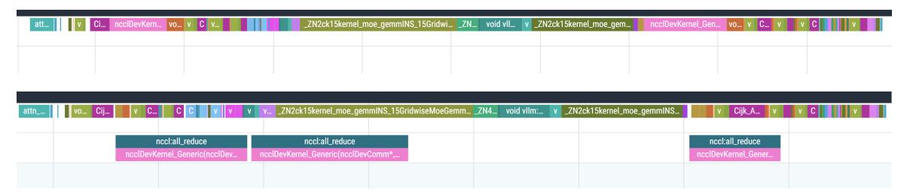
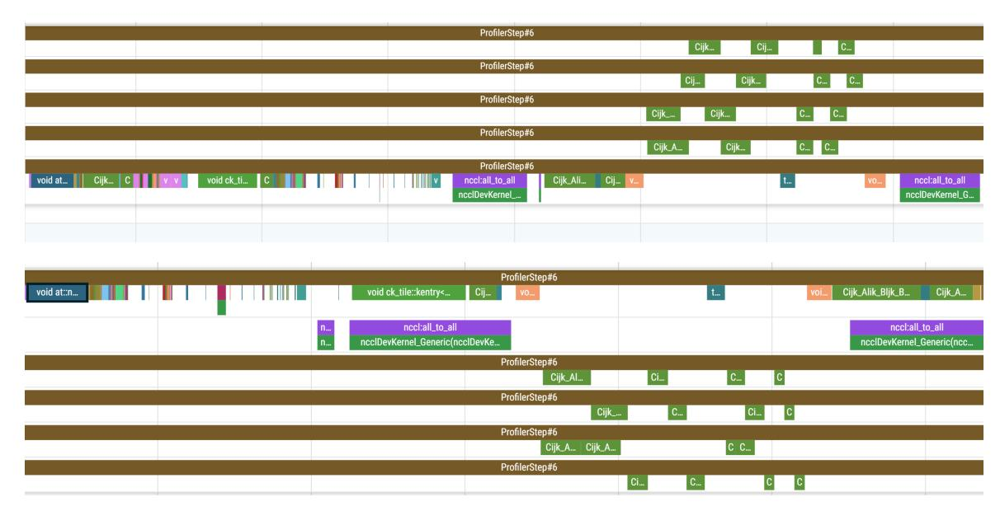
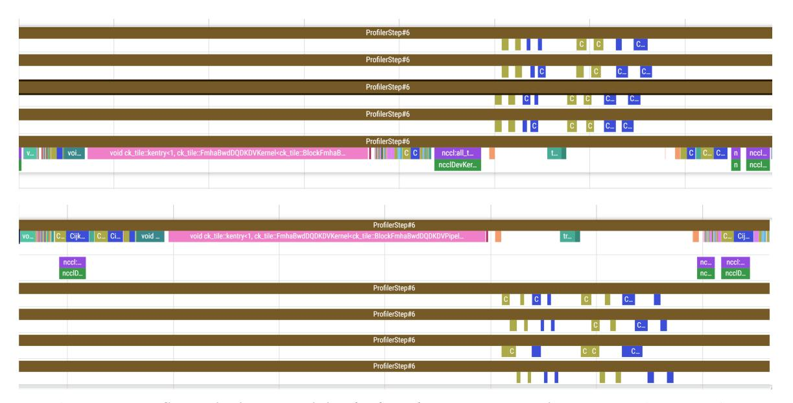

# C FarSkip-Collective Layer Traces

We present excerpt layer traces of explicitly overlapped FarSkip Models during training and inference. In each trace we show the duration of one layer. As FarSkip reduces the total duration of a layer, the FarSkip traces are more zoomed-in compared when compared with the regular layer traces.

Figure 10: DeepSeek-V2 vLLM prefill inference layer execution (Top) regular connectivity (Bottom) FarSkip-Collective. In the bottom figure the all-reduce collectives are overlapped during the attention and MoE sub-blocks by running asynchronously on a second hardware queue.

Figure 11: DeepSeek-V2-Lite pre-training *forward*-pass layer execution (Top) regular connectivity (Bottom) FarSkip-Collective. In the bottom, all-to-all communication is overlapped with computation, the first call corresponds to Dispatch which gets overlapped with the core-attention computation. In the second call, the all-to-all corresponds to Combine and is overlapped with the shared-expert and the next layer's q, k, v computation for attention.

Figure 12: DeepSeek-V2-Lite pre-training *backward*-pass layer execution (Top) regular connectivity (Bottom) FarSkip-Collective. The backward-pass operator execution order is "hijacked" from the default torch.autograd Sequence Number ordering to re-order operations for overlap. In particular, routed-expert backward computation launches immediately after the finished synchronization point of the Combine all-to-all backwards gradient and the Dispatch gradient launches before the gradient of the first part of attention (q, k, v calculation) to allow for overlapping with it before synchronization.