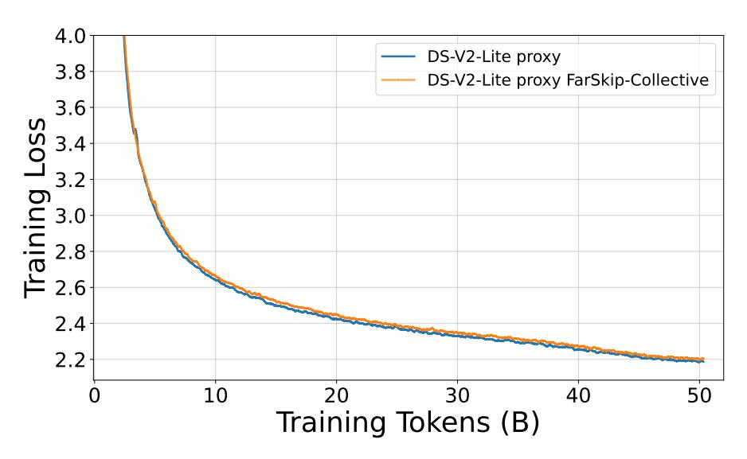

# References

- [1] Jacob Austin, Augustus Odena, Maxwell Nye, Maarten Bosma, Henryk Michalewski, David Dohan, Ellen Jiang, Carrie Cai, Michael Terry, Quoc Le, and Charles Sutton. Program synthesis with large language models. *arXiv preprint arXiv:2108.07732*, 2021.
- [2] Yonatan Bisk, Rowan Zellers, Ronan Le Bras, Jianfeng Gao, and Yejin Choi. Piqa: Reasoning about physical commonsense in natural language. In *Thirty-Fourth AAAI Conference on Artificial Intelligence*, 2020.
- [3] Sidney Black, Stella Biderman, Eric Hallahan, Quentin Anthony, Leo Gao, Laurence Golding, Horace He, Connor Leahy, Kyle McDonell, Jason Phang, Michael Pieler, USVSN Sai Prashanth, Shivanshu Purohit, Laria Reynolds, Jonathan Tow, Ben Wang, and Samuel Weinbach. Gpt-neox-20b: An open-source autoregressive language model. In *Proceedings of BigScience Episode #5 – Workshop on Challenges & Perspectives in Creating Large Language Models*, pages 95–136, virtual+Dublin, 2022. Association for Computational Linguistics.
- [4] Mark Chen, Jerry Tworek, Heewoo Jun, Qiming Yuan, Henrique Ponde de Oliveira Pinto, Jared Kaplan, Harri Edwards, Yuri Burda, Nicholas Joseph, Greg Brockman, Alex Ray, Raul Puri, Gretchen Krueger, Michael Petrov, Heidy Khlaaf, Girish Sastry, Pamela Mishkin, Brooke Chan, Scott Gray, Nick Ryder, Mikhail Pavlov, Alethea Power, Lukasz Kaiser, Mohammad Bavarian, Clemens Winter, Philippe Tillet, Felipe Petroski Such, Dave Cummings, Matthias Plappert, Fotios Chantzis, Elizabeth Barnes, Ariel Herbert-Voss, William Hebgen Guss, Alex Nichol, Alex Paino, Nikolas Tezak, Jie Tang, Igor Babuschkin, Suchir Balaji, Shantanu Jain, William Saunders, Christopher Hesse, Andrew N. Carr, Jan Leike, Josh Achiam, Vedant Misra, Evan Morikawa, Alec Radford, Matthew Knight, Miles Brundage, Mira Murati, Katie Mayer, Peter Welinder, Bob McGrew, Dario Amodei, Sam McCandlish, Ilya Sutskever, and Wojciech Zaremba. Evaluating large language models trained on code. *arXiv preprint arXiv:2107.03374*, 2021.
- [5] Peter Clark, Isaac Cowhey, Oren Etzioni, Tushar Khot, Ashish Sabharwal, Carissa Schoenick, and Oyvind Tafjord. Think you have solved question answering? try arc, the ai2 reasoning challenge. *arXiv:1803.05457v1*, 2018.

- [6] Karl Cobbe, Vineet Kosaraju, Mohammad Bavarian, Jacob Hilton, Reiichiro Nakano, Christopher Hesse, and John Schulman. Training verifiers to solve math word problems, 2021.
- [7] Damai Dai, Chengqi Deng, Chenggang Zhao, RX Xu, Huazuo Gao, Deli Chen, Jiashi Li, Wangding Zeng, Xingkai Yu, Yu Wu, et al. Deepseekmoe: Towards ultimate expert specialization in mixture-of-experts language models. *arXiv preprint arXiv:2401.06066*, 2024.
- [8] DeepSeek-AI. Deepseek-v3 technical report. *arXiv preprint arXiv:2412.19437*, 2024.
- [9] DeepSeek-AI. Deepseek-r1: Incentivizing reasoning capability in llms via reinforcement learning, 2025.
- [10] DeepSeek-AI, Zhihong Shao, Damai Dai, et al. Deepseek-v2: A strong, economical, and efficient mixture-of-experts language model. *arXiv preprint arXiv:2405.04434*, 2024.
- [11] William Fedus, Barret Zoph, and Noam Shazeer. Switch transformers: Scaling to trillion parameter models with simple and efficient sparsity. *Journal of Machine Learning Research*, 23(120):1–39, 2022.
- [12] Tom Gunter, Zirui Wang, Chong Wang, Ruoming Pang, Andy Narayanan, Aonan Zhang, Bowen Zhang, Chen Chen, Chung-Cheng Chiu, David Qiu, Deepak Gopinath, Dian Ang Yap, Dong Yin, Feng Nan, Floris Weers, Guoli Yin, Haoshuo Huang, Jianyu Wang, Jiarui Lu, John Peebles, Kewei Ye, Mark Lee, Nan Du, Qibin Chen, Quentin Keunebroek, Sam Wiseman, Syd Evans, Tao Lei, Vivek Rathod, Xiang Kong, Xianzhi Du, Yanghao Li, Yongqiang Wang, Yuan Gao, Zaid Ahmed, Zhaoyang Xu, Zhiyun Lu, et al. Apple intelligence foundation language models. *arXiv preprint arXiv:2407.21075*, 2024.
- [13] Dan Hendrycks, Collin Burns, Steven Basart, Andy Zou, Mantas Mazeika, Dawn Song, and Jacob Steinhardt. Measuring massive multitask language understanding. *Proceedings of the International Conference on Learning Representations (ICLR)*, 2021.
- [14] Geoffrey Hinton, Oriol Vinyals, and Jeff Dean. Distilling the knowledge in a neural network. *arXiv preprint arXiv:1503.02531*, 2015.
- [15] Jordan Hoffmann, Sebastian Borgeaud, Arthur Mensch, Elena Buchatskaya, Trevor Cai, Eliza Rutherford, Diego de Las Casas, Lisa Anne Hendricks, Johannes Welbl, Aidan Clark, et al. Training compute-optimal large language models. *arXiv preprint arXiv:2203.15556*, 2022.
- [16] Yanping Huang, Youlong Cheng, Ankur Bapna, Orhan Firat, Dehao Chen, Mia Xu Chen, HyoukJoong Lee, Jiquan Ngiam, Quoc V. Le, Yonghui Wu, and Zhifeng Chen. Gpipe: Efficient training of giant neural networks using pipeline parallelism. In *Advances in Neural Information Processing Systems*, volume 32, pages 103–112, 2019.
- [17] Yoon Kim and Alexander M. Rush. Sequence-level knowledge distillation. In Jian Su, Kevin Duh, and Xavier Carreras, editors, *Proceedings of the 2016 Conference on Empirical Methods in Natural Language Processing*, pages 1317–1327, Austin, Texas, November 2016. Association for Computational Linguistics.
- [18] Team Kimi, Yifan Bai, Yiping Bao, Guanduo Chen, Jiahao Chen, Ningxin Chen, Ruijue Chen, Yanru Chen, Yuankun Chen, Yutian Chen, et al. Kimi k2: Open agentic intelligence. *arXiv preprint arXiv:2507.20534*, 2025.
- [19] Woosuk Kwon, Zhuohan Li, Siyuan Zhuang, Ying Sheng, Lianmin Zheng, Cody Hao Yu, Joseph E. Gonzalez, Hao Zhang, and Ion Stoica. Efficient memory management for large language model serving with pagedattention. In *Proceedings of the ACM SIGOPS 29th Symposium on Operating Systems Principles*, 2023.
- [20] Itay Lamprecht, Asaf Karnieli, Yair Hanani, Niv Giladi, and Daniel Soudry. Tensor-parallelism with partially synchronized activations. *arXiv preprint arXiv:2506.19645*, 2025.
- [21] Fanxin Li, Shixiong Zhao, Yuhao Qing, Xusheng Chen, Xiuxian Guan, Sen Wang, Gong Zhang, and Heming Cui. Fold3d: Rethinking and parallelizing computational and communicational tasks in the training of large dnn models. *IEEE Transactions on Parallel and Distributed Systems*, 34(5):1432–1449, 2023.

- [22] Jijie Li, Li Du, Hanyu Zhao, Bo wen Zhang, Liangdong Wang, Boyan Gao, Guang Liu, and Yonghua Lin. Infinity instruct: Scaling instruction selection and synthesis to enhance language models, 2025.
- [23] Jiawei Liu, Chunqiu Steven Xia, Yuyao Wang, and Lingming Zhang. Is your code generated by chatGPT really correct? rigorous evaluation of large language models for code generation. In *Thirty-seventh Conference on Neural Information Processing Systems*, 2023.
- [24] Jiawei Liu, Chunqiu Steven Xia, Yuyao Wang, and Lingming Zhang. Is your code generated by chatgpt really correct? rigorous evaluation of large language models for code generation. In *Thirty-seventh Conference on Neural Information Processing Systems*, 2023.
- [25] Meta AI. The llama 4 herd: The beginning of a new era of natively multimodal ai innovation. Meta AI Blog, April 2025.
- [26] Todor Mihaylov, Peter Clark, Tushar Khot, and Ashish Sabharwal. Can a suit of armor conduct electricity? a new dataset for open book question answering. In *EMNLP*, 2018.
- [27] Deepak Narayanan, Mohammad Shoeybi, Jared Casper, Patrick LeGresley, Mostofa Patwary, Vijay Korthikanti, Dmitri Vainbrand, Prethvi Kashinkunti, Julie Bernauer, Bryan Catanzaro, Amar Phanishayee, and Matei Zaharia. Efficient large-scale language model training on gpu clusters using megatron-lm. In *Proceedings of the International Conference for High Performance Computing, Networking, Storage and Analysis*, pages 1–15, 2021.
- [28] Maxim Naumov, Dheevatsa Mudigere, Hao-Jun Michael Shi, Jianyu Huang, Narayanan Sundaraman, Jongsoo Park, Xiaodong Wang, Udit Gupta, Carole-Jean Wu, Alisson G. Azzolini, Dmytro Dzhulgakov, Andrey Mallevich, Ilia Cherniavskii, Yinghai Lu, Raghuraman Krishnamoorthi, Ansha Yu, Volodymyr Kondratenko, Stephanie Pereira, Xianjie Chen, Wenlin Chen, Vijay Rao, Bill Jia, Liang Xiong, and Misha Smelyanskiy. Deep learning recommendation model for personalization and recommendation systems. *CoRR*, abs/1906.00091, 2019.
- [29] Rohan Baskar Prabhakar, Hengrui Zhang, and David Wentzlaff. Kraken: Inherently parallel transformers for efficient multi-device inference. In *Advances in Neural Information Processing Systems*, volume 37, 2024.
- [30] PyTorch Team. Distributed w/ torchtitan: Introducing async tensor parallelism in pytorch. PyTorch Discussion Forum, 2024.
- [31] Team Qwen. Qwen3 technical report, 2025.
- [32] Jeff Rasley, Samyam Rajbhandari, Olatunji Ruwase, and Yuxiong He. Deepspeed: System optimizations enable training deep learning models with over 100 billion parameters. In *Proceedings of the 26th ACM SIGKDD International Conference on Knowledge Discovery & Data Mining*, KDD '20, pages 3505–3506, New York, NY, USA, 2020. Association for Computing Machinery.
- [33] Keisuke Sakaguchi, Ronan Le Bras, Chandra Bhagavatula, and Yejin Choi. Winogrande: An adversarial winograd schema challenge at scale. *arXiv preprint arXiv:1907.10641*, 2019.
- [34] Noam Shazeer, Azalia Mirhoseini, Krzysztof Maziarz, Andy Davis, Quoc Le, Geoffrey Hinton, and Jeff Dean. Outrageously large neural networks: The sparsely-gated mixture-of-experts layer. *arXiv preprint arXiv:1701.06538*, 2017.
- [35] Alon Talmor, Jonathan Herzig, Nicholas Lourie, and Jonathan Berant. CommonsenseQA: A question answering challenge targeting commonsense knowledge. In *Proceedings of the 2019 Conference of the North American Chapter of the Association for Computational Linguistics: Human Language Technologies, Volume 1 (Long and Short Papers)*, pages 4149–4158, Minneapolis, Minnesota, June 2019. Association for Computational Linguistics.
- [36] Hugo Touvron, Thibaut Lavril, Gautier Izacard, Xavier Martinet, Marie-Anne Lachaux, Timothée Lacroix, Baptiste Rozière, Naman Goyal, Eric Hambro, Faisal Azhar, Aurelien Rodriguez, Armand Joulin, Edouard Grave, and Guillaume Lample. Llama: Open and efficient foundation language models, 2023.

- [37] Ben Wang and Aran Komatsuzaki. Gpt-j-6b: A 6 billion parameter autoregressive language model. <https://github.com/kingoflolz/mesh-transformer-jax>, May 2021.
- [38] Shibo Wang, Jinliang Wei, Amit Sabne, et al. Overlap communication with dependent computation via decomposition in large deep learning models. In *ASPLOS*, pages 93–106, 2023.
- [39] Mingyu Yang, Mehdi Rezagholizadeh, Guihong Li, Vikram Appia, and Emad Barsoum. Zebrallama: Towards extremely efficient hybrid models. In *Advances in Neural Information Processing Systems*, volume 39, 2025. NeurIPS 2025.
- [40] Rowan Zellers, Ari Holtzman, Yonatan Bisk, Ali Farhadi, and Yejin Choi. Hellaswag: Can a machine really finish your sentence? In *Proceedings of the 57th Annual Meeting of the Association for Computational Linguistics*, 2019.
- [41] Muru Zhang, Mayank Mishra, Zhongzhu Zhou, William Brandon, Jue Wang, Yoon Kim, Jonathan Ragan-Kelley, Shuaiwen Leon Song, Ben Athiwaratkun, and Tri Dao. Ladder-residual: parallelism-aware architecture for accelerating large model inference with communication overlapping. *arXiv preprint arXiv:2501.06589*, 2025.
- [42] Chenggang Zhao, Chengqi Deng, Chong Ruan, Damai Dai, Huazuo Gao, Jiashi Li, Liyue Zhang, Panpan Huang, Shangyan Zhou, Shirong Ma, Wenfeng Liang, Ying He, Yuqing Wang, Yuxuan Liu, and Y. X. Wei. Insights into deepseek-v3: Scaling challenges and reflections on hardware for ai architectures. *arXiv preprint arXiv:2505.09343*, 2025.
- [43] Henry Hengyuan Zhao, Pan Zhou, Difei Gao, and Mike Zheng Shou. Genqa: Generating millions of instructions from a handful of prompts. *arXiv preprint arXiv:2406.10323*, 2024.
- [44] Yanli Zhao, Andrew Gu, Rohan Varma, Liang Luo, Chien-Chin Huang, Min Xu, Less Wright, Hamid Shojanazeri, Myle Ott, Sam Shleifer, Alban Desmaison, Can Balioglu, Pritam Nguyen, Bernard Chauhan, Yuchen Hao, Ajit Mathews, and Shen Li. Pytorch fsdp: Experiences on scaling fully sharded data parallel. *Proceedings of the VLDB Endowment*, 16(12):3848–3860, 2023.
- [45] Lianmin Zheng, Liangsheng Yin, Zhiqiang Xie, Chuyue Sun, Jeff Huang, Cody Hao Yu, Shiyi Cao, Christos Kozyrakis, Ion Stoica, Joseph E. Gonzalez, Clark Barrett, and Ying Sheng. Sglang: Efficient execution of structured language model programs. In A. Globerson, L. Mackey, D. Belgrave, A. Fan, U. Paquet, J. Tomczak, and C. Zhang, editors, *Advances in Neural Information Processing Systems*, volume 37, Vancouver, Canada, December 2024.
- [46] Kan Zhu, Yilong Zhao, Liangyu Zhao, Gefei Zuo, Yile Gu, Dedong Xie, Yufei Gao, Qinyu Xu, Tian Tang, Zihao Ye, Keisuke Kamahori, Chien-Yu Lin, Stephanie Wang, Arvind Krishnamurthy, and Baris Kasikci. Nanoflow: Towards optimal large language model serving throughput. In *Proceedings of the 19th USENIX Symposium on Operating Systems Design and Implementation*, OSDI '25, Santa Clara, CA, USA, 2025. USENIX Association.

### **Appendix**

### A Pre-training results

Figure 8: MoE pretraining loss with regular and FarSkip-Collective architectures. We pretrain 16B parameter MoE for 50B tokens using the DeepSeek-V2-Lite model architecture. We observe FarSkip-Collective closely matches the loss of the regular model.

Table 4: Pretraining evaluation results of Regular and FarSkip-Collective architectures on pre-training tasks.

| Model                              | Train Tokens | Train Loss | ARC-C | ARC-E | BoolQ | HS | MMLU | OBook | PIQA | SCIQ | WG | Avg |
|------------------------------------|-----------------|---------------|-------|-------|-------|----|------|-------|------|------|----|-----|
| DS-V2-lite Reg. DS-V2-lite Far. |                 |               |       |       |       |    |      |       |      |      |    |     |

We test the pre-training of the FarSkip-Collective architecture by pre-training an MoE model from scratch using the DeepSeek-V2 Lite model architecture and configuration (64 experts) in Megatron-LM. We train the model on 50B training tokens randomly sampled from a larger corpus of high quality mix of publicly available data using a sequence length of 4096 tokens and a batch size of 4194304 tokens. With 2.4B active parameters, this corresponds to simplistic Chinchilla scaling estimate with respect to the model's active parameters [15]. We denote the model as "proxy" in that we use the DeepSeek-V2-Lite model architecture but not the training recipe and data. We repeat the training with the exact settings but with FarSkip-Collective turned off (original MegatronLM implementation) as a baseline. We observe the loss curves of both models match closely and that the FarSkip-Collective model achieves a final training loss of 2.205 as compared with 2.187 averaged over the last 50 steps. For evaluation we use the evaluation datasets from the Llama-1 paper [36] to discern early signal from the pre-training and observe that FarSkip-Collective performs on par with the regular model architecture achieving 54.7 vs. 54.4 of the regular model on average. This result further reinforces the viability of the FarSkip-Collective MoE model modification in addition to the larger-scale self-distillation results in the main paper.

