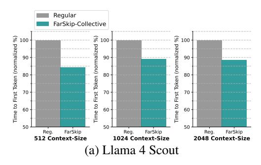
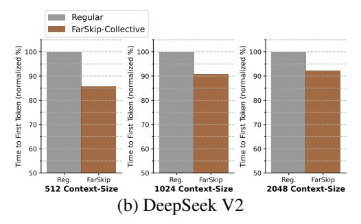
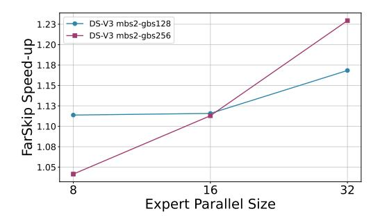
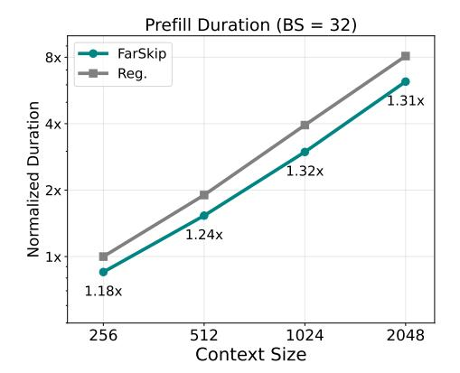
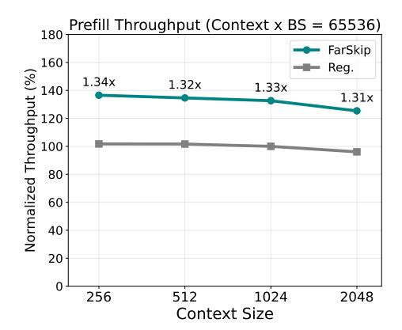
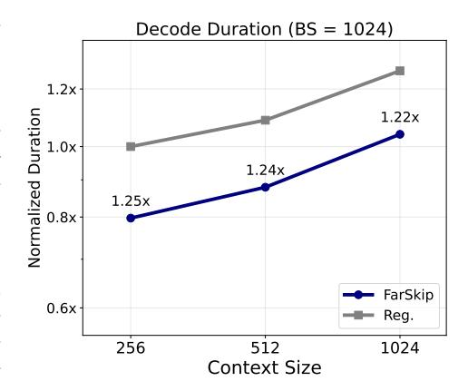

# 5 Experiments

In this section we describe our experiments evaluating the model capabilities of FarSkip-Collective models, followed by evaluation of the FarSkip-enabled overlapped implementation.

#### 5.1 Model Capabilities

We present the main results of our distillation experiments in Tab. 1, where we consider three open-source state-of-the-art MoEs at different scales: DeepSeek-V2-Lite (16B-A3B), Qwen-3-30B MoE (30B-A3B), and Llama-4 Scout (109B-A17B). Each model's checkpoint corresponds to the instruction-tuned / chat version of the open-source model release. We apply FarSkip-Collective to all of the model's layers and train each model for up to 10B tokens of SFT data [43, 22]. We train with standard settings using AdamW, cosine-annealing learning rate scheduler, and 1000-step warm-up period. We use relativity large batch-size and learning rate with FCSD and run short sweeps to identify the best batch-size and learning rate for each model. In particular we conduct two sweeps for 2000 training steps each, first for batch-size selection among  $\{2^{16}, 2^{17}, 2^{18}\}$  with a learning rate of 2e-5 followed by a learning rate sweep among {2e-5,4e-5,8e-5} where we use the training loss for selection. We observe rapid initial improvement on all benchmarks using the KL

Table 2: Downstream performance of different training settings of FarSkip-Collective distillation for Qwen-3-30B MoE. We evaluate different training settings and conversion settings trained for 500M tokens. (\* for  $0.25 \times BS$  and  $4 \times BS$  we keep the same number of training steps)

| MODEL                 | ARC-C | HEVAL+ | GSM-8K | MMLU | Avg-11 |
|-----------------------|-------|--------|--------|------|--------|
| ORIGINAL              | 61.9  | 73.8   | 86.9   | 80.2 | 75.9   |
| KL (FAR 50%)          | 60.0  | 67.1   | 83.9   | 77.5 | 74.6   |
| KL (FAR 75%)          | 58.8  | 67.7   | 85.3   | 75.4 | 74.3   |
| KL (FAR 90%)          | 59.3  | 73.8   | 85.1   | 73.4 | 74.1   |
| KL (FAR 100%)         | 54.6  | 61.6   | 79.6   | 64.1 | 68.2   |
| KL                    | 54.6  | 61.6   | 79.6   | 64.1 | 68.2   |
| KL + INTER. L2        | 53.8  | 48.8   | 80.6   | 58.9 | 65.4   |
| SFT                   | 44.4  | 1.2    | 76.0   | 64.5 | 58.1   |
| KL <b>≉</b> емвер.    | 55.5  | 56.1   | 79.5   | 63.3 | 67.6   |
| KL $0.25 \times BS^*$ | 53.2  | 53.7   | 78.4   | 60.6 | 65.7   |
| KL 4×BS*              | 54.1  | 50.6   | 82.5   | 62.4 | 66.6   |

Figure 4: Time To First Token (prefill stage) with vLLM inference engine under varying prompt length. Each model is served with EP=8 for the MLP sub-block and TP=8 for attention serving 16 concurrent requests.

objective and further gradual improvement as training continues. We also observe occasional training instabilities where the distilled FarSkip-Collective model exhibits mode-collapse later in training. We tested different approaches to overcome this in Tab. 2, and resort to using early stopping with MBPP+. As a baseline conversion method, we test standard SFT training with the same training schedule and sweep selection for the batch-size and learning rate. In addition we apply the same early stopping as FCSD. Overall, SFT significantly underperforms the FCSD recipe and the resulting model exhibits catastrophic forgetting, particularly in generation tasks. With our knowledge distillation training, even for code generation task such as HumanEval+ which are more easily affected by distribution shifts, FarSkip-Collective models are able to achieve performance on par with the original instruction-tuned checkpoint, demonstrating the inherent capacity of the modified architecture. Especially since the models were not originally trained with this connectivity and are forced to adapt to it after pre-training. For pre-training from scratch, we also observe on par performance at smaller-scale pre-training, where we pre-train a DeepSeek-V2-Lite model architecture (16B) for 50B tokens (see Appendix).

In Tab. 2, we study the effect of different distillation techniques and the effect of partial conversion of the model into FarSkip-Collective layers. We train Qwen-3-30B MoE using a short training schedule of 500M tokens using a batch size of  $2^{17}$  tokens, 2e-5 learning rate annealed to 1e-5 and test 1) SFT training (Eq. 3) 2) KL + Inter. L2 Combining KL with intermediate activation L2 loss (Eq. 4 + Eq. 5) for which we sweep over different L2 loss coefficients. 3) KL & EMBED. freezing the embedding and LM-head layers to reduce training instabilities 4) varying batch-sizes but maintaining the same number of training steps. Overall we observe that using the KL objective is the most effective and that freezing the embedding layers does not lead to a significant effect in the model's performance. In addition we study the effect of applying FarSkip-Collective to only a subset of the layers, with the layers applied to from the end, i.e., 75% corresponds to the last 75% layers of the model converted into FarSkip-Collective layers (cf. Fig. 3). In this settings we still optimize all of the model's parameters and observe that converting fewer layers makes the conversion task significantly easier especially for generation-based datasets such as HEval+.

We continue to study the effect of the number of modified layers in Fig. 3 where we use the original checkpoint of Qwen-3-30B MoE and evaluate it under different number of modified layers without training. The x-axis corresponds to how many layers are being replaced with FarSkip connectivity (N) and we test replacement of layers modifying 1) the first N layers along with the 2) the last N layers. e.g., layers  $L-N \leq k < L$  ("FarSkip-Collective applied from the end") and  $0 \leq k < N$  ("FarSkip-Collective applied from the start"). Modifying the initial layers is more detrimental for performance, which we suspect is the result of two factors. 1) corrupting the early layers will cascade down as corrupted input to later layers and 2) for layer k,  $f_k$  will have full access to  $\frac{k-1}{k}$  of the previous layers via the residual connection, making it less probable to have lost critical dependency connection for larger k.

#### 5.2 Explicit Overlapping

We measure the single-node performance of our overlapped implementation in Megatron-LM in Tab. 3, specifically focusing on the all-to-all collectives appearing in the MoE layers. We benchmark training on 1xMI325X 8GPU machine and consider two models, DeepSeek-V2 Lite (16B) training

Figure 5: DeepSeek-V3 (L=6) FarSkip-Collective training speed-up under different Expert-Parallelism sizes and batch size configurations.

Table 3: Computation-communication overlap of all-to-all collectives in overlapped FarSkip-Collective MegatronLM training with EP=8. We evaluate the training of DeepSeek-V2 Lite and a shortened DeepSeek-V3 model with 6 layers.

| Method                 | all-to | -all % | overlap |                        |
|------------------------|--------|--------|---------|------------------------|
|                        | fwd    | bwd    | Total   | end-to-end speed-up |
| DS-V2 Lite Reg.        | 0.0    | 0.0    | 0.0     | 1.0x                   |
| DS-V2 Lite Far.        | 87.6   | 89.0   | 88.4    | 1.11x                  |
| DS-V3 ( $L=6$ ) Reg.   | 0.00   | 0.0    | 0.0     | 1.0x                   |
| DS-V3 ( $L = 6$ ) Far. | 92.9   | 84.1   | 88.9    | 1.04x                  |

with a micro-batch size of 8 and global batch-size of 128, and a short DeepSeek-V3 (DS-V3) model with 6 layers (71B) with a micro batch-size of 1 and global batch-size of 64. Both models are trained with EP8 and sequence length of 4096. We use the short DS-V3 (L=6) model as it has the same layer dimensions as the full model and allows us to study the computation-communication trade-off of a layer while isolating orthogonal factors such as Pipeline-Parallelism (PP). We observe using FarSkip-Collective leads to high degree of overlapping in both the forward (87.6%, 92.9%) and backward pass (89.0%, 84.1%) leading to 11% and 4% end-to-end speed-ups in single-node settings for DS-V2 Lite and DS-V3 respectively. This benchmark does not incorporate optimizations such as fused MLA attention that will enable additional acceleration and will make the exposed communication in the model even more critical.

We extend the training benchmarking of FarSkip-Collective to multi-node training scenarios on a 4 node system with 4xMI325X each equipped with 8GPUs and inter-node communication bandwidth of 400Gbps between nodes. We study the end-to-end speed-up of the DS-V3 L=6 model with FarSkip as compared with the regular model training when increasing the number of nodes from 1 to 4 in porportion with the Expert-Parallelism size, while keeping the micro (mbs) and global (gbs) batch-sizes fixed (strong-scaling). In Fig. 5 we observe that FarSkip-Collective improvement scale as we increase the EP size, with EP=32 leading to 1.22x end-to-end training speed-up.

For inference with vLLM, we benchmark the prefill phase which has a considerable communication component where we consider the DeepSeek-V2 (235B) and Llama 4 Scout (109B) models. We test both models using 1xMI300X 8GPU machine. In the benchmarking we adopt standard practices and use FP8 quantization and fused-MoE forward kernel (for routed experts). With this setup we evaluate the Time-To-First Token (TTFT) with different input context lengths (L=512, 1024, 2048), per-device batch size of BS=2 and EP=8. For the attention layer the vLLM implementation will mirror the EP size with TP=8. We observe speed-ups of 8.2% - 16.8% and 12.2% - 18.5% in both DeepSeek-V2 and in Llama-4 using FarSkip-Collective. The smaller number of experts in Llama-4 as compared with DeepSeek-V2 leads to faster computation and makes exposed communication more critical. In addition, we achieve communication overlap of the all-reduce of 95.3% and 97.6% for Llama-4 and DeepSeek-V2 (compared with 0% overlap in regular execution). In the appendix we share layer execution traces for both training and inference that illustrate the computation-communication overlap enabled by our implementation.

For SGLang inference, we evaluate the DeepSeek-V3 (671B) model architecture equipped with FarSkip-Collective for large-scale MoE inference for both prefill and decoding. In the prefill phase, e.g. benchmarking Time-to-First-Token (TTFT) FarSkip enables up to 1.34x speed-up with TP=8, EP=8. The prefill stage is compute-bound and Fig. 6 (left) demonstrates linear scaling of the duration of TTFT with the numbers of tokens processed. In both Fig. 6 (left) and (right) we also observe a fairly consistent speed-up provided by FarSkip. The duration and speed-up behavior can be attributed to the fact that both the compute-bound computation portion and the bandwidth-bound blocking communication portion scale directly with the number of tokens processed.

Figure 6: DeepSeek-V3 Time To First Token (prefill stage) with SGLang under varying batch-size and prompt length. Each model is served with EP=8 for the MLP sub-block and TP=8 for attention.

Unlike the prefill phase, LLM decoding is memorybandwidth-bound; especially in large MoEs such as DeepSeek-V3. In single-node settings, the large parameter count that needs to be loaded per-GPU, translates to slower decoding and also leads to reduced maximum batch-size due to the limited memory capacity left for the KV cache. On the communication side, the all-reduce calls are applied to just the newly predicted tokens which will have smaller message-sizes as compared to prefill, especially with the smaller batches dictated by single-node serving. Together, this makes computation time (that is dictated by memory bandwidth) dominate the singlenode large MoE workload as compared with communication. Nonetheless, in a multi-node set-up FarSkip leads to a significant benefit. Distributing the MoE experts over a larger number of GPUs both directly decreases the computation time and increases the communication time. With wide-EP, the number of experts and parameters per GPU directly decrease and allow for significantly larger batch-sizes. This

Figure 7: Time Between Tokens (decode stage) with SGLang DeepSeek-V3 for 2-node inference under varying prompt length. Each model is served with EP=16 for the MLP subblock and TP=16 for attention.

increases the throughput significantly making large MoE decoding suitable for large-scale distributed setups in general. At the same time, by switching to multi-node serving one relies on scale-out interconnects and the bigger batch-sizes also lead to larger message sizes. Together these changes shift the computation-communication balance making FarSkip-Collective significant in this setting. To this end, we evaluate DeepSeek-V3 decoding with TP=16, EP=16 in the large-batch setting (BS=1024) on a 2-node system connected with 8 400Gbs NICs for inter-node communication. In Fig. 7 we observe consistent speed-up with FarSkip under varying prompt lengths as multi-node settings allow for larger batch-sizes.

### 6 Related Work

Computation-communication overlap in distributed deep learning traditionally focuses on "bit-exact" approaches that retain the mathematical formulation of the model and instead focus on improved execution of the algorithm on hardware. Most existing parallelism techniques aim to achieve minimal exposed communication [44, 32]. A common theme to achieve overlap is decomposing operators into smaller pieces and scheduling computation and communications in tandem, this includes operator decomposition such as AsyncTP [38, 30], and multi-layer pipelines [46, 16, 21].

More specific to this work are model architectural changes aimed at reducing exposed communication at runtime. Our work is similar to the recent work of [41] that follows the "outdated" formulation (8a)

to enable computation-communication overlapping of dense models with TP. In contrast our work studies MoEs and proves out the connectivity approach at large-scale models (100B+) applied to all of the model layers. On the implementation side, we develop optimized overlapped implementation for expert parallelism for both training (forward & backward) and inference. In the "partial" formulation front (8b), our work is most similar to [\[29\]](#page-14-4) and [\[20\]](#page-13-6) nonetheless both operate only on dense models and TP at order of magnitude smaller scales as compared with state of art models when studying model capabilities. More broadly [\[28\]](#page-14-9) designs the model architecture for computation-communication pipelining of the communication and computation heavy layers, and the works of [\[3,](#page-12-1) [37\]](#page-15-8) reduce the required communication in Transformer blocks via parallel MLP & attention sub-blocks. Further the work of [\[12\]](#page-13-12) reduces required model communication for large-scale models via "track-parallelism".

