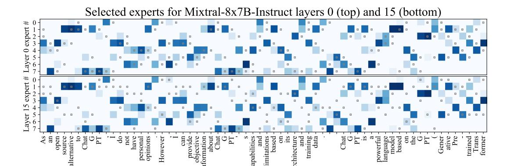

# 3 Method

In this work, we aim to systematically find the optimal way to inference modern Mixture-of-Experts LLMs on desktop or low-end cloud instances. More specifically, we focus on the task of generating tokens interactively, i.e. generate multiple tokens per second at batch size 1[5](#page-2-1) .

The generative inference workload consists of two phases: 1) encoding the input prompt and 2) generating tokens conditioned on that prompt. The key difference between these two phases is that prompt tokens are encoded in parallel (layer-by-layer), whereas the generation runs sequentially (token-by-token and layer-by-layer). In general, phase 1 works relatively well with existing Mixtureof-Experts algorithms, since each layer can only be loaded once for the entire prompt. In turn, when generating tokens, one must load layer once per each token generated. In practice, this means that inference speed is limited by how fast one can fetch parameters from system memory.

Below, we look for patterns in how the MoE model loads its experts and propose ways to exploit these patterns to speed up inference time.

4To learn more about these methods, please refer to surveys such as [Gholami et al.](#page-8-5) [\(2021\)](#page-8-5); [Liang et al.](#page-8-13) [\(2021\)](#page-8-13)

5As opposed to running a processing a large batch of texts over many seconds, as in [Sheng et al.](#page-9-4) [\(2023\)](#page-9-4)

Figure 1: An example of expert loading pattern in Mixtral-8x7B-Instruct for select layers. Blue cells indicate that a certain expert was active when encoding a certain token; deeper blue indicates higher gating weight. Small gray squares show which experts are cached with an LRU cache for k=2.

