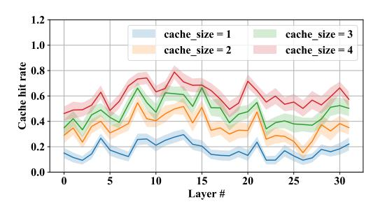
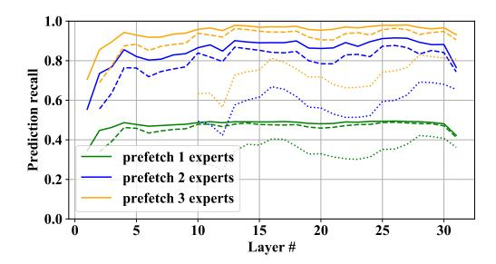

# 4 Experiments

In this section, we verify our earlier hypotheses about MoE behavior and benchmark the inference latency in different conditions. We focus our evaluations on Mixtral-8x7B and Mixtral-8x7B-Instruct models since they represent the current state of the art among open-access MoE models. We organize this section as follows: Section [4.1](#page-5-0) measures the effectiveness of expert caching and pre-loading in isolation, Section [4.2](#page-5-1) compares different model compression algorithms and verifies our hypotheses from Section [3.3.](#page-4-3) Finally, Section [4.3](#page-6-0) measures the inference latency in several hardware setups.

7Notably, Google Colab RAM cannot fit Mixtral-8x7B with a reasonable compression rate

8This corresponds to tensor.pin\_memory() command in PyTorch.

Figure 2: (**left**) LRU cache hit ratio for different cache size k; (**right**) speculative loading recall when pre-loading a different number of experts. Regular lines represent loading 1 layer ahead; **dashed** line stands for 2 layers ahead; **dotted** line is 10 layers ahead.

#### 4.1 Expert LRU Cache and Speculative Loading

In this section, we benchmark the effectiveness of the two expert offloading strategies: LRU caching and and speculative loading, as defined in Sections 3.1 and 3.2 respectively. For this evaluation, we measure "expert recall" — the fraction of times when an expert needed for inference was already available on GPU.

For this evaluation, we run Mixtral-8x7B-Instruct model on the OpenAssistant dataset (Köpf et al., 2023). We test LRU caching by running the model on recorded conversations and measuring the recall (aka "hit ratio" from caching perspective) for different cache sizes k. Next, we test speculative loading in isolation by "guessing" which experts should be loaded (by applying the next layer's gating function on current layer activations), then measuring how often the actual next experts get loaded this way. A recall of 1.0 corresponds to a situation where both (2) Mixtral active experts were pre-fetched. We test speculative loading in three settings: 1, 2 and 10 layers ahead.

### 4.2 Mixed MoE Quantization

Next, we test how different Quantization schemes affect MoE performance and size. We also use Mixtral-8x7B, but this time, we use non-instruction-tuned variant since it fits better with the available benchmarks. We measure WikiText2 perpliexity Merity et al. (2016), C4 perplexity Raffel et al. (2020), as well as 5-shot MMLU accuracy Hendrycks et al. (2021). Our objective for this section is to find the best trade off between size and performance for offloading with the target setups. Note that out of 46.7B total parameters in the Mixtral-8x7B model, the experts constitute 45.1B (96.6%). The rest of the model parameters are allocated to embeddings, self-attention layers, MoE gates and minor layers such as LayerNorm.

| Attn quant | Experts quant | Model size, GB | Wiki2 | C4   | MMLU   | Attn quant | Experts quant | Model size, GB | Wiki2 | C4   | MMLU   |
|---------------|---------------|-------------------|-------|------|--------|---------------|---------------|-------------------|-------|------|--------|
| FP16          | FP16          | 86.99             | 3.59  | 6.52 | 70.51% | 3-bit         | FP16          | 85.08             | 3.99  | 6.90 | _      |
|               | 4-bit         | 25.82             | 3.67  | 6.58 | 70.3%  |               | 4-bit         | 23.92             | 4.06  | 6.97 | 66.54% |
|               | 3-bit         | 23.21             | 3.96  | 6.78 | 69.32% |               | 3-bit         | 21.31             | 4.34  | 7.21 | 65.79% |
|               | 2-bit         | 19.33             | 4.52  | 7.31 | 66.66% |               | 2-bit         | 17.46             | 4.90  | 7.82 | 61.83% |
| 4-bit         | FP16          | 85.16             | 3.68  | 6.59 | _      | 2-bit         | FP16          | 84.96             | 4.98  | 7.92 | _      |
|               | 4-bit         | 23.99             | 3.76  | 6.66 | 69.11% |               | 4-bit         | 23.79             | 5.08  | 8.06 | 59.0%  |
|               | 3-bit         | 21.37             | 4.05  | 6.87 | 68.47% |               | 3-bit         | 21.18             | 5.36  | 8.34 | 57.67% |
|               | 2-bit         | 17.54             | 4.61  | 7.42 | 65.58% |               | 2-bit         | 17.30             | 5.97  | 9.11 | 55.26% |

Table 1: Perplexity and model size evaluation of Mixtral-8x7B with different quantization for shared attention (Attn quant) and experts (Experts quant) layers. For comprarison, a Mistral-7B 4-bit quantized model has Wiki2 perplexity 5.03, C4 perplexity 7.56 and MMLU score 61.3%. See Section 4.2 for details. Green values correspond to the configurations we chose for full system evaluation.

|                               | 2-bit Experts |                  |       |            |       | 3-bit Experts    |       |            |  |
|-------------------------------|---------------|------------------|-------|------------|-------|------------------|-------|------------|--|
| Algorithm                     |               | A100 3080 Mobile | 3060  | T4 (Colab) |       | A100 3080 Mobile | 3060  | T4 (Cloud) |  |
| Full algorithm                | 3.061         | 2.655            | 2.278 | 2.092      | 2.845 | 2.475            | 2.038 | 1.603      |  |
| W/o expert pre-loading        | 2.918         | 2.227            | 2.051 | 1.567      | 2.683 | 2.024            | 1.857 | 1.365      |  |
| W/o LRU cache & pre-loading   | 2.265         | 1.758            | 1.547 | 1.168      | 2.055 | 1.595            | 1.346 | 1.061      |  |
| Naive offloading (accelerate) | 1.392         | 1.059            | 0.919 | 0.661      | 1.246 | 0.914            | 1.791 | 0.580      |  |

Table 2: Inference speed for Mixtral-8x7B in low-tier , measured in tokens per second.

As discussed earlier, we use HQQ [Badri & Shaji](#page-7-11) [\(2023\)](#page-7-11) data-free quantization algorithm and consider the following quantization schemes:

- 1. FP16 (no quantization)
- 2. HQQ 4-bit with group size 64, scale group size 256
- 3. HQQ 3-bit with group size 64, scale group size 128
- 4. HQQ 2-bit with group size 16, scale group size 128

Note that the actual model size with n-bit quantization is larger than n bits per parameter. This is because the quantized data format also stores quantization scale and zero point for each group of weights. Notably, the above 2-bit quantization scheme uses, on average, 2.6 bits per parameter due to a large number of quantization schemes. We also keep embeddings, logits, MoE gates and normalization layers in 16-bit format.

Table [1](#page-5-2) summarizes our results: overall, it seems advantageous to quantize experts to 3 or 2 bits while keeping attention layers to a higher bitwidth (16 or 4 bits). Based on these evaluations, we chose two quantization schemes (highlighted in green) that offer favourable performance-size trade-offs within the target hardware constraints.

## 4.3 Practical offloading performance

Finally we evaluate the performance of the Mixtral8x7B-Instruct model using the offloading techniquesproposed throughout this report. Based on the perplexity evaluations from the previous section, we chose 4-bit HQQ quantization for the shared attention layers and 2- or 3-bit quantization for experts. We evaluate this system by generating tokens via sampling on OpenAssistant [\(Köpf et al.,](#page-8-14) [2023\)](#page-8-14) conversations and measuring the average number of tokens generated per second with batch size 1. For this evaluation, we always sample proportionally to the predicted probabilities, i.e. without temperature or nucleus sampling.

We consider four hardware configurations: a free-tier Colab instance with a T4 GPU (16GB VRAM, PCIe Gen.3), a past generation gaming laptop with RTX 3080 Mobile (16GB, PCIe Gen.4), a midrange gaming desktop with RTX 3060 (12GB, PCIe Gen.3) and a high-end data-center server with A100-80GB-SXM. Note that the A100 server could run the model without offloading. We use offloading on A100 mostly to provide a reference for other setups. Finally, when evaluating 3-bit models, we use a cloud T4 from Microsoft Azure because the free-tier colab instances did not have enough RAM for this specific configuration. We use k = 2 for RTX 3060 and k = 4 for all other GPUs.

As shown in Table [2,](#page-6-1) all evaluated setups can generate 2-4 tokens per second with the full algorithm. Using pre-loading appears to be most beneficial on RTX 3060, possibly due to lower LRU cache size. Cursiously, RTX 3060 (desktop) performs nearly equally with a much higher end 3080 Mobile. We attribute this to the fact that both GPUs are still bottlenecked by host-to-device bandwidth, limited by the PCIe architecture. Finally, all schemes significantly outperform naive offloading that loads the entire MoE layer.

