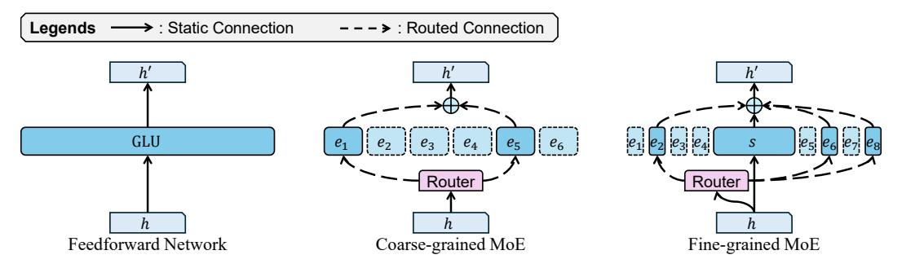
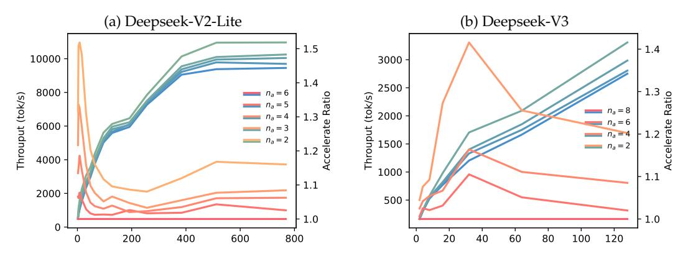
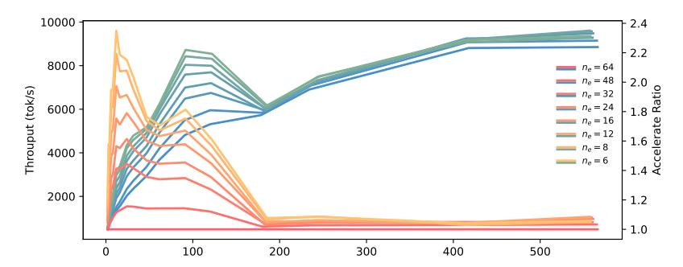

# 1 Introduction

The introduction of the Transformer (Vaswani et al., 2017) has significantly improved the training efficiency of sequence models, making the training of ultra-large-scale models feasible. Building upon this foundation, GPT-style decoder-only Transformer models (Radford et al., 2018; 2019; Brown et al., 2020; OpenAI, 2023), guided by scaling laws (Kaplan et al., 2020), have rapidly gained prominence (Touvron et al., 2023a;b; Dubey et al., 2024). Their exceptional scalability has made them the mainstream choice for constructing large-scale generative language models (Chowdhery et al., 2023). To further expand model size while controlling both inference and training costs, one promising direction is the sparsification of the feed-forward network (FFN), which constitutes the majority of parameters in LLMs.

The FFN module in LLMs is typically implemented as either a Multi-Layer Perceptron (MLP, Murtagh, 1991) or a Gated Linear Unit (GLU, Dauphin et al., 2017). Both first project the hidden state to an intermediate state via an upsampling transformation, followed by an activation function, and then downsampled to produce the new hidden state. The

\*Corresponding Author, †Equal Contribution

Figure 1: The comparison of FFN, coarse-grained MoE, and fine-grained MoE.

intermediate state in MLP and GLU can be easily partitioned: a large one can be divided into multiple smaller ones while maintaining strict equivalence. This enables a strategy where an excessively large intermediate state is split into multiple smaller states, with only a subset of them being selectively activated through gating. Parameters corresponding to each partition is referred to as an "expert", and this architecture is known as the Sparse Mixture-of-Experts (MoE, [Shazeer et al.,](#page-14-6) [2017\)](#page-14-6). MoE was demonstrated to be effective in Transformer architectures by [Fedus et al..](#page-12-0) Mixtral-8x7B [\(Jiang et al.,](#page-13-1) [2024\)](#page-13-1) is the most famous large-scale open-source MoE LLM.

The deployment of Large Language Models (LLMs) has long been a significant challenge. Due to the autoregressive decoding, model parameters are repeatedly accessed during inference [\(Yu et al.,](#page-16-0) [2022\)](#page-16-0) but with only a few computation, leading to low arithmetic intensity. According to the Roofline model [\(Williams et al.,](#page-15-1) [2009\)](#page-15-1), this harms the computational efficiency of the system. Several existing works have optimized this aspect by enlarging batch size [\(Kwon et al.,](#page-13-2) [2023;](#page-13-2) [Zheng et al.,](#page-16-1) [2024;](#page-16-1) [Ye et al.,](#page-16-2) [2024\)](#page-16-2). While significant progress has been made in improving the training efficiency of MoE models [\(He et al.,](#page-13-3) [2021;](#page-13-3) [2022;](#page-13-4) [Zhai](#page-16-3) [et al.,](#page-16-3) [2023;](#page-16-3) [Rajbhandari et al.,](#page-14-7) [2022\)](#page-14-7), accelerating MoE modules during inference remains an underexplored area. In particular, the theoretical performance of MoE-based inference systems under varying batch sizes has yet to be thoroughly investigated.

Traditional MoE models employ a relatively conservative number of experts, typically eight in total and two actived per token. Moreover, these experts are generally initialized from a pre-trained dense small model. [Dai et al.](#page-10-1) introduced several modifications. They significantly increased the number of experts, both total and activated, while reducing the size of each expert. Additionally, all experts were randomly initialized. To mitigate the instability associated with training smaller experts, they introduced a larger shared expert which is always chosen as a backbone. The release of Deepseek V2 [\(DeepSeek-AI et al.,](#page-10-2) [2024a\)](#page-10-2), featuring 236 billion parameters, demonstrated the scalability of this paradigm. [DeepSeek-AI et al.](#page-11-1) further optimized the expert selection mechanism by incorporating grouping constraints and sigmoid activation, instead of softmax, leading to the development of the Deepseek V3 model. We refer to the deepseek approach as fine-grained MoE, while the conventional MoE paradigm is termed coarse-grained MoE. As shown in Figure [1.](#page-1-0)

Fine-grained MoE enhances the model's adaptability, allowing for more flexible parameter utilization during inference. Studies have explored discarding certain parameters at inference time to improve decoding speed. These approaches include expert pruning, where specific experts are removed and not loaded into memory [\(Chen et al.,](#page-9-2) [2022;](#page-9-2) [Lee et al.,](#page-13-5) [2024;](#page-13-5) [Lu et al.,](#page-14-8) [2024;](#page-14-8) [Xie et al.,](#page-15-2) [2024;](#page-15-2) [Yang et al.,](#page-15-3) [2024b\)](#page-15-3), and expert skipping, where the number of activated experts per token is reduced [\(Lu et al.,](#page-14-8) [2024\)](#page-14-8). Although some prior work has explored related topics, it has predominantly focused on designs tailored for coarse-grained MoE rather than the more promising fine-grained variant.

In summary, this paper presents an efficiency analysis of fine-grained MoE models under varying batch sizes during inference. We aim to address the question of whether MoE models can achieve efficiency gains only in large-scale service scenarios. Furthermore, we investigate the impact of different expert reduction strategies on both model performance and computational efficiency to assess whether this direction warrants further exploration, particularly in fine-grained MoE and its sigmoid-activated variant, in which the model exhibits different dynamical behaviors, necessitating a distinct analytical approach.

## 2 Background and Related Works

#### 2.1 FFN and MoE

Feed-forward network is usually an MLP or a GLU, given in Equation 1, where  $ACT(\cdot)$  denotes the activation function, and  $\otimes$  denotes the element-wise product.

$$MLP(h) = W_{d} \cdot ACT(W_{u} \cdot h)$$

$$GLU(h) = W_{d} \cdot (ACT(W_{u} \cdot h) \otimes (W_{g} \cdot h))$$
(1)

We use GLU to represent FFN from now on since it's the more common practice in current days (Shazeer, 2020; Chowdhery et al., 2023).

A mixture of experts layer can be represented as the weighted combination of multiple GLUs, where the weights r are given by a linear classifier called router. We define router logits as r'. Moreover, there is usually two function to modify the logits,  $F_r(\cdot)$  to manipulate Topk selection for load balancing, and  $F_w(\cdot)$  to normalize logits into the final weights. An MoE layer with  $n_e$  experts and  $n_a$  activated is given in Equation 2

$$MoE(h) = \sum_{i=1}^{n_e} r_i \cdot GLU_i(h)$$

$$r' = W_r \cdot h, \quad r_i = \begin{cases} F_w(r'_i), & r'_i \in Topk \left(F_r(r'), k = n_a\right) \\ 0, & \text{otherwise.} \end{cases}$$
(2)

## 2.2 LLM Serving Efficiency

Although modern LLM service systems offer a variety of system-level objectives (SLOs, Wang et al., 2024) for performance analysis, we focus on the most fundamental metric, **throughput**, to avoid unnecessary complexity. Throughput reflects the efficiency of computation under fixed input-output sequence lengths, effectively measuring the utilization of the hardware's computational capacity.

Previous works, such as Orca (Yu et al., 2022) and vLLM (Kwon et al., 2023), have constructed analytical frameworks based on the Roofline (Williams et al., 2009) model, which suggests that higher overall computational intensity leads to reduced per-token computation time. A core principle in LLM inference optimization is maximizing batch size to enhance computational efficiency. This is exemplified by continuous batching in vLLM and chunk attention (Ye et al., 2024), which facilitates batch processing of KV cache segments with shared prefix tokens.

#### 2.3 Model Pruning

Model pruning refers to the process of reducing a model's parameter count to enhance inference speed while minimizing performance degradation. Pruning can be performed at different levels of granularity. For instance, LayerSkip (Gromov et al., 2025) enables skipping entire layers, while other methods apply pruning within layers by sparsifying the attention of FFN (Frantar & Alistarh, 2023; He et al., 2024). In the context of LLMs, pruning is not limited to model parameters. It can also extend to components such as the KV cache, where various approaches have been proposed to selectively remove stored key-value pairs, further optimizing memory usage and computational efficiency.

For MoE models, related research has primarily focused on expert pruning (Chen et al., 2022; Yang et al., 2024b; Xie et al., 2024; Lu et al., 2024; Lee et al., 2024; Muzio et al., 2024; Li et al., 2024; Chen et al., 2025). For coarse-grained MoE, pruning was a relatively straightforward approach due to the high homogeneity among experts. However, in fine-grained MoE, these

methods face significant challenges. Nevertheless, the increased number of experts, both global and active, also presents new opportunities for optimization.

## 3 Preliminaries

#### 3.1 Notations

Previously we defined d as the hidden size,  $d_i$  as the intermediate size for FFNs,  $n_e$  as the expert counts,  $n_a$  as the active (chosen) experts per token,  $F_r$  as the modifier function of router logits for expert selection, and  $F_w$  as the weight modifier. We denote L as the sequence length, results in hidden state  $h \in \mathbb{R}^d$ ,  $H \in \mathbb{R}^{d \times L}$ ,  $W_u$ ,  $W_g \in R^{d_i \times d}$ , and  $W_d \in R^{d \times d_i}$ . The memory I/O, FLOPS, and arithmetic intensity (AI) based on the triplet of  $(d, d_i, L)$  is given in Equation 3.

$$I/O(d, d_i, L) = 3d_i d + 2L(d + d_i)$$

$$FLOPS(d, d_i, L) = 6L(d_i d)$$

$$AI(d, d_i, L) = \frac{6L(d_i d)}{3d_i d + 2L(d_i + d)}$$
(3)

To better evaluate the size of each state, we further define  $d_e$  as the intermediate size of experts,  $d_s$  as the intermediate size of of shared expert, and  $d_a$  as the activated intermediate size where  $d_a = d_e \times n_a$ .

#### 3.2 Evaluation Method

We selected two representative fine-grained MoE models for evaluation: DeepSeek-V2-Lite and DeepSeek-V3. Their fundamental characteristics are presented in Table 1.

| Model            | $n_e$ | $n_a$ | d    | $d_e$ | $d_s$ | $d_a$ | $d_a/(d_s+d_a)$ | <i>F</i> w |
|------------------|-------|-------|------|-------|-------|-------|-----------------|-----------------------|
| Deepseek-V2-Lite | 64    | 6     | 2048 | 1408  | 10944 | 8448  | 45.6%           | softmax               |
| Deepseek-V3      | 256   | 8     | 7168 | 2048  | 18432 | 16384 | 47.1%           | sigmoid               |

Table 1: Model information of Deepseek-V2-Lite and V3.

To evaluate the model's performance, we selected several benchmark datasets, including ARC (Easy and Challenge, Clark et al., 2018), BoolQ (Clark et al., 2019), OpenBookQA (OBQA, Mihaylov et al., 2018), RTE (Bentivogli et al., 2009), and Winogrande (Sakaguchi et al., 2021). If not specified, the performance score is the average of all above benchmarks, with 36 as the baseline (can be achieved through pure guessing).

#### 3.3 Hardware and Implementation Details

Implementation details of Section 4 is given in Appendix B. Implementation details of Section 5 and 6 is given in Appendix C.

It is important to emphasize that one of the most critical controlled variables in our efficiency experiments is the number of input and output tokens, as highlighted in Appendix A. Unless otherwise specified, all tests were conducted with randomly sampled 1024 input tokens, while the model was instructed to generate an additional 1024 tokens during inference, since increasing the proportion of input tokens can significantly enhance overall throughput.

### 4 Severing Efficiency of MoE

#### 4.1 Weakened Batch Effect

The feed-forward layer constitutes the majority of model parameters, accounting for approximately 66% in earlier models and up to 88% in some modern models (Qwen-2.5-3B,

Yang et al., 2024a). In a single-batch setting, it dominates computation time. During the prefill phase, all tokens in a sequence pass through the FFN simultaneously, meaning that once parameters are loaded into memory, they are reused multiple times. This amortizes the parameter loading cost across multiple tokens. Figure 2a depicted relationship between L and AI. When the batch size is small, increasing the number of parallel tokens significantly improves system performance. Notably, doubling the number of tokens from one to two incurs virtually no additional latency, despite the computational workload doubling. This phenomenon is illustrated in Figure 2b, showcasing the relationship between L and per-token latency ( $\mu$ s). It can be observed that at around L = 150, the efficiency maxed out.

In MoE models, although sparse activation reduces computational demands, resulting in a much lower FLOP requirement than the total parameter count, additional experts must be loaded into memory as the number of tokens increases. Since tokens rarely reuse the same expert within a batch, this creates an additional memory access overhead. Consequently, even without considering scheduling overhead (which can be significant), MoE is inherently not faster than FFN when operating under the same activated parameter count.

We evaluated the efficiency of the MoE module across different sequence lengths, as shown in Figure 2c. Our findings indicate that the MoE module incurs higher latency and reaches its peak efficiency more slowly compared to Figure 2b. However, we observed that larger models tend to achieve maximum efficiency more easily, primarily due to their inherently higher AI upper bound.

Figure 2: Simulation experiment results. X-axis represents sequence length *L*.

## 4.2 Expert Parallel

Although MoE is less efficient than FFN in terms of batch processing speedup, it requires significantly less inter-device communication under the same computational demands. When deploying models across multiple computing devices (e.g., GPUs or compute nodes), the most effective method for maximizing hardware utilization is tensor parallelism (TP).

For a dense FFN, TP is implemented by partitioning the intermediate states across multiple devices. Specifically, in a system with  $n_d$  devices, each device stores only a fraction of the parameters from  $W_{\{u,d,g\}}$ , corresponding to a subpartition of length  $d_i/n_d$  along the intermediate dimension. As previously discussed, the FFN structure allows for straightforward partitioning, enabling computations to be executed in parallel across the  $n_d$  devices. However, the primary drawback of TP lies in its high communication overhead. The total inter-device data transfer volume, even in the most optimized scenarios, cannot be lower than  $2(n_d-1)Ld$ . This is because each hidden state value must be exchanged across all devices twice, once for mapping and once for reducing, significantly limited it's applicability: TP is only seen across GPUs within a node, but not across nodes.

MoE inherently overcomes this communication bottleneck through expert parallelism (EP). In an EP setting, different experts are distributed across different devices, meaning that each token's state is transmitted only to its selected experts. Consequently, in the worst-case scenario, EP requires only  $2n_aLd$  communication operations. Given that the typical value of  $n_d$  is 8, whereas  $n_a$  is typically 2 for coarse-grained models, EP reduces data transfer volume to approximately 28% of that in TP. In fine-grained MoE, a similar optimization can

be achieved by grouping experts according to the EP paradigm, where all experts residing on the same device belong to the same group. By constraining each token to select experts from a limited number of groups (e.g., selecting from only 2 out of 8 possible groups), we can achieve the same benefits while further optimizing communication overhead.

In a typical multi-GPU setup, intra-node bandwidth using NVLink is approximately 160 GB/s, whereas inter-node connectivity via InfiniBand achieves around 50 GB/s, roughly 31% of intra-node bandwidth DeepSeek-AI et al. (2024b). This indicates that, under such configurations, EP can be effectively implemented across nodes, rather than requiring intra-node TP, while maintaining comparable latency. This property effectively compensates for the efficiency limitations discussed in the previous section: experts within a layer can be distributed across multiple nodes, allowing each node to handle a larger and more concentrated set of requests, thereby increasing arithmetic intensity.

## 5 Inference Time Expert Skipping

Compared to coarse-grained MoE, which typically activates only two experts, fine-grained MoE selects 6 to 8 experts from a pool of 64 to 256. This provides an opportunity to reduce the number of activated experts  $n_a$ , potentially improving efficiency. However, merely reducing  $n_a$  has limited impact on the overall model size, meaning it does not significantly lower the deployment barrier. Additionally, due to the presence of a large shared expert backbone, the actual reduction in computational cost is also relatively constrained.

Despite these challenges, we aim to explore this aspect from a language modeling perspective. More fine-grained control over  $n_a$  can provide insights into the adaptability of MoE models by analyzing their capacity requirements across different components. We conduct our experiments on DeepSeek-V2-Lite and DeepSeek-V3, detailed result can be found in Appendix E.

#### 5.1 Efficiency

In terms of efficiency, we investigated the impact of varying the number of activated experts  $(n_a)$  while retaining all experts. To simplify the testing scope and procedure, we used a consistent  $n_a$  across all layers, ranging from 2 to the model's original  $n_a$ . Based on this setup, we further evaluated the models under different request loads to analyze their performance. Our experiment results are depicted in Figure 3.

Figure 3: How expert skipping influence throughput. X-axis represents the concurrency.

By analyzing the throughput trend, we observed that reducing the number of activated experts  $n_a$  has no significant impact on the number of concurrent requests required to reach peak throughput. However, the speedup ratio curve presents a much more complex pattern.

Notably, we observe substantial acceleration at both low and high concurrency levels, while the acceleration effect is limited at moderate concurrency. In fact, at low concurrency, the

speedup ratio can reach 50% (when  $n_a=2$ ), surpassing the theoretical compute reduction upper bound for fine-grained MoE without considering MLA layers ( $d_a/(d_s+d_a)$ , 45%). This is because at low concurrency, the system is memory I/O-bound, and reducing  $n_a$  immediately lowers the required parameter loading, leading to a higher proportion of acceleration. At moderate concurrency, the system remains memory I/O-bound, but since a sufficient number of tokens are processed simultaneously, reducing  $n_a$  does not significantly reduce the total number of experts selected across all requests, resulting in limited acceleration. At high concurrency, the system shifts to a compute-bound regime, where reducing  $n_a$  lowers computational demands, thereby increasing throughput. In this case, the throughput gain aligns more closely with the compute reduction ratio.

#### 5.2 Performance and Structure Searching

We aim to identify an inter-layer expert allocation strategy that maximizes model performance while maintaining a fixed total number of experts activated per token. In addition, we investigate the impact of different expert reduction strategies on model performance. Our current focus is on customized reductions at the layer level.

Specifically, we define expert allocation using a four-tuple (b, h, e, p), where:

- The first layer selects *b* experts, i.e.,  $n_a(1) = b$ .
- The *p*-th layer selects *h* experts, i.e.,  $n_a(p) = h$ .
- The final layer selects *e* experts, i.e.,  $n_a(-1) = e$ .
- For the other layers, expert counts are determined through linear interpolation.

This formulation allows us to explore various expert allocation patterns, including ascending, descending, peak, and valley-shaped distributions, depicted in Figure 6, Appendix D. These experiments help us analyze the relative importance of experts across different layers from a language modeling perspective.

Figure 4: How expert skipping influence performance

Figure 4 presents our results. For softmax-based models such as DeepSeek V2, as shown in Figure 4a, we observe that even relatively aggressive expert skipping does not lead to a significant degradation in performance. On average, reducing the number of active experts from the full set to only two results in a performance drop of approximately 7.5%, while in the best-case scenario, the performance loss is limited to around 6%. Moreover, when an average of 3.3 experts is retained, the performance degradation remains within 1%.

In the V3 model, as shown in Figure 4b, we observe a similar performance curve when reducing  $n_a$ . However, compared to the smoother performance of V2-Lite, the V3 model exhibits greater instability across different reduction strategies. This instability may stem from the inherent properties of the sigmoid function, where expert weights tend to polarize

Figure 5: Throughput and speedup of expert pruning.

toward 0 or 1. In contrast, in softmax-based models, the weights of lower-ranked experts are significantly smaller than that of the top-ranked expert. We argue that using sigmoid instead of softmax offers a greater advantage in fine-grained MoE models, as it enables more effective utilization of the selected experts. However, this also limits its applicability in expert skipping, if skipping removes experts whose weights have already converged to 1, a substantial performance drop may occur.

Furthermore, among various expert skipping strategies, our experiments indicate that the descending reduction strategy offers the best trade-off between efficiency and performance on V2-Lite, but the ascending strategy yields the best performance in V3. We believe this behavior difference is an intrinsic characteristic of the model. The opposite trends observed in V2-Lite and V3 suggest that the optimal expert skipping strategy could be model-dependent, implying that a universal skipping strategy may not exist.

