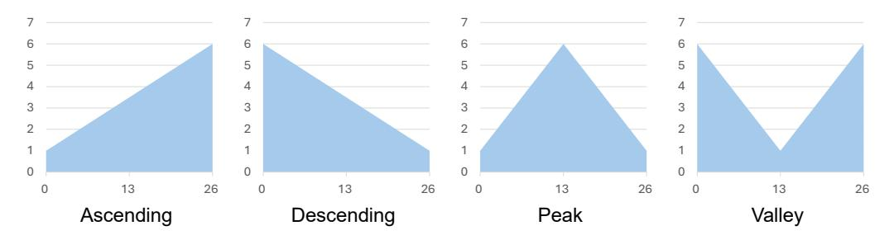

# **C Implementation Detail of Section [5](#page-5-0)**

### **C.1 Deepseek-V2-Lite**

## *C.1.1 Hardware*

Please reference Table [6.](#page-17-3)

| Item   | Type                                 | Quantity |
|--------|--------------------------------------|----------|
| CPU    | Intel Xeon Silver 4314 CPU @ 2.40GHz | 24       |
| GPU    | NVIDIA Tesla A800 80G PCI-e          | 2        |
| Memory | 16GB ECC DDR4@2666MHz                | 15       |

Table 6: Hardware Information

#### *C.1.2 Software*

We utilize sglang build v0.4.4 post 1 (commit ad4e58bf67ec833ff4d036af5129ec6e1633efc4) as the backend and sglang.bench for profiling.

#### **C.2 Deepseek-V3**

#### *C.2.1 Hardware*

Please reference Table [7.](#page-17-4)

| Item   | Type                                   | Quantity |
|--------|----------------------------------------|----------|
| CPU    | Intel Xeon Platinum 8558 CPU @ 2.10GHz | 48x2     |
| GPU    | NVIDIA Tesla H200 141G SXM5            | 8        |
| Memory | 64GB ECC DDR4@2666MHz                  | 32       |

Table 7: Hardware Information

Figure 6: Structure shapes in Section [5.](#page-5-0)

### *C.2.2 Software*

We utilize sglang build v0.4.4 post 1 (commit ad4e58bf67ec833ff4d036af5129ec6e1633efc4) as the backend and sglang.bench for profiling.

