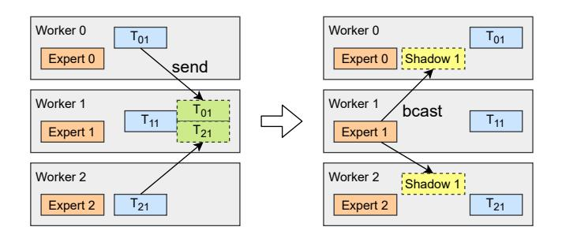
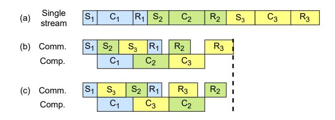

# 4.1 Light-Weight Dynamic Shadowing Strategy

In MoE models, popular experts can be selected by more than half the input tokens, causing severe load imbalance, as Figure 4 suggests. Although the embedding of a single input token is orders of magnitude smaller than model parameters, batches of input coming from all other workers may be equal or even larger than model parameters. Therefore, a trade-off comes that whether the latency of transferring so many embedding vectors can be replaced by replicating model parameters of popular experts.

<span id="page-5-2"></span>

**Figure 6.** An example of dynamic shadowing. Instead of sending input to worker 1, expert 1 is replicated.

As shown in Figure 6, some experts are replicated on all workers, namely shadowed experts, so that their parameters, instead of their input tokens, are transferred over the network. Their related computation is performed locally, intuitively reducing the load of the worker that contains a popular expert.

However, dynamic shadowing is challenging, as the popularity of experts changes with the training process, and the decisions taken every iteration may differ. Additionally, parameters cannot be cached like a trivial distributed memory system, as they are updated in every iteration and requiring gradients to be gathered globally as part of the update process. If they are cached on every worker, they should be updated in every iteration, introducing significant extra overhead.

To address this challenge, we leverage our performance model to analyze whether an expert should be shadowed at runtime. We predict the end-to-end latency of a training iteration to check performance gain, and act accordingly. We elaborate our analysis below.

In the original imbalance situation, the communication and computation are dominated by a set of popular experts. We model the workload of a single worker w from a total of N workers by calculating its batch size  $B_w$  as  $B_w = \sum_{i=1}^N T_{iw}$  where  $T_{iw}$  tokens are sent from worker i to worker w.

A single iteration of training an MLP layer contains 1 GeMM in forward, and 2 in backward to compute the gradient of the inputs. There are 4 rounds of all-to-all communication, 2 in each forward and backward. In a simplified case where the network has a fixed bandwidth, the training latency is calculated as follows.

$$Lat_{\text{imbl}}(B) = \max_{w} \left\{ 3 \frac{4B_{w}\alpha H^{2}}{P} + 4 \frac{B_{w}H}{W_{\text{net}}} \right\}$$
 (7)

To shadow a popular expert, we have to first broadcast its parameters to all workers and then run the computation over the local tokens using the fetched model. In the backward stage, each worker computes the gradients separately of its fetched experts, followed by a reduce operation. Finally, the parameter update operation is performed at the worker where the popular expert is originally placed.

In this scenario, the overhead of performing imbalanced computation is replaced by 2 collective communication operators over 2 parameters of size  $\alpha H^2$  each. Since multiple popular experts are being sent to many other workers, load imbalance is less likely to happen. The latency of shadowing r models is calculated as follows.

$$Lat_{\text{shadow}}(r, B') = \max_{w} \left\{ 3 \frac{4B'_{w} \alpha H^2}{P} \right\} + 2r \frac{2\alpha H^2}{W_{\text{net}}}$$
(8)

In case that the shadowing strategy is faster, either of the following conditions is expected.

$$B_{\text{max}} > r\alpha H$$
 (9)

or

$$\frac{3(B_{\text{max}} - B'_{\text{max}})\alpha H}{r\alpha H - B_{\text{max}}} > \frac{P}{W_{\text{net}}}$$
 (10)

The first condition suggests that the total overhead of transferring the input is higher than transferring the model. The second condition indicates that the reduced computation latency is more than the increased communication overhead. In either case, dynamic shadowing is enabled to reduce end-to-end latency. Otherwise, the communication is too expensive and model exchange does not bring benefit to reducing latency, thus not performed. Such situation typically occurs when the workload is balanced across different workers. Represented by arrow (1) in Figure 5, the latency

of computation is shortened thanks to the reduced idling, resulting in a lower  $R_{CC}$  and higher  $\overline{P}$ .

We select the experts to shadow at runtime in every iteration. A light-weight algorithm, as shown in Algorithm 1, is performed on every worker. As matrix T always has to be available across all workers, no extra communication is introduced. It returns a set of experts to be shadowed, according to the formulas above.

#### <span id="page-6-0"></span>**Algorithm 1** Select experts to shadow

```
1: function SelectShadowExperts(B[N])
          B_{\max} \leftarrow \max\{B\}
 3:
          c_{\min} \leftarrow Lat_{\mathrm{imbl}}(B_{\max})
          E_s \leftarrow \emptyset
 4:
          for i, B_i \in DescendingSort(B) do
 5:
                B_i \leftarrow T_{ii}
                                                   \triangleright Remove all T_{ii} from B_i
 6:
                for all j \neq i do
 7:
                     B_i \leftarrow B_i + T_{ii} > Compute T_{ii} at j
 8:
 9:
                B'_{\max} \leftarrow \max\{B\}
10:
                c \leftarrow Lat_{\text{shadow}}(|E_s| + 1, B'_{\text{max}})
11:
                if c < c_{\min} then
                     c_{\min} \leftarrow c
13:
                     E_s \leftarrow E_s \cup \{i\}
15:
16:
                     return E_s
17:
                end if
          end for
18:
19: end function
```

#### 4.2 Asynchronous Fine-Grained Smart Scheduling

As our DDL-Roofline shows, when communication and computation are performed separately, a program cannot move beyond the semi-ideal curve. Besides, due to the inherently large amount of communication, increasing  $R_{CC}$  is hard. Therefore, we propose a smart scheduling approach that partitions the task into smaller parts, and re-schedule fine-grained communication and computation operations with efficiency in mind. Fine-grained scheduling allows computation and communication to be performed asynchronously, thus better utilizing the hardware, enabling the leap beyond the semi-ideal curve as arrow (2) suggests in Figure 5.

In expert parallelism, communication follows a complicated all-to-all pattern. We first split up all-to-all communication by dividing workers into fine-grained groups. We use a grouped pairwise exchange algorithm [33] to perform all-to-all. The groups form a ring of size n, and send data to other groups with a stride increasing from 0 to n-1. For group assignment, we follow a heuristic that closely connected workers are placed in the same group, resulting in faster connections among workers of the same group. The group size is jointly determined by connection topology, and related computation granularity.

<span id="page-7-0"></span>

Viewing from worker 0, in  $S_{0,1}$ , worker 0 sends data to group 2 at the same time when receiving data from group 1. And it behaves similarly in  $R_{0,1}$ ,  $S_{0,2}$  and  $R_{0,2}$ . They are not plotted due to space limit.

Figure 7. Fine-grained operation split-up.

In either forward or backward stage of an MoE layer, 2 symmetric all-to-all are involved, with computation between them. We split computation according to the pairwise exchanging, making room for re-organizing them. 3n operations are performed in n steps, by all workers in the n groups. In step j, workers in group i perform the following 3 operations, instantiated by an example in Figure 7.

- $S_{i,j}$ : **sends** tokens to group  $t_{i,j} = (i j)$  and receives tokens from  $f_{i,j} = (i + j)$  (both modulo n).
- $C_{i,j}$ : **computes** on tokens from  $f_{i,j}$  using local experts.
- $R_{i,j}$ : **receives** outputs of local tokens from  $t_{i,j}$  and sends output back to  $f_{i,j}$

Thereby, both communication and computation are split into fine-grained tasks, with a specific order as a requirement. Figure 8a shows a faithful schedule that sequentially perform the operations. Its latency equals that of the original synchronous execution mode, using coarse-grained operators. As long as dependencies are met, the operations can be performed out of order.

<span id="page-7-1"></span>

**Figure 8.** Scheduling tasks on separate streams on a worker and minimizing overhead.

Recall that the goal of the schedule is to perform the operations in parallel. A communication and a computation stream are created for each worker to execute different types of operators. As shown in Figure 8b, in its communication stream, it first executes  $S_{i,0}, S_{i,1}, \ldots, S_{i,n-1}$  and then from  $R_{i,0}$  to  $R_{i,n-1}$ . Its computation stream executes from  $C_{i,0}$  to  $C_{i,n-1}$ . By performing the operations in parallel, the end-to-end latency is significantly reduced. However, all operations must

respect their data dependencies and wait for previous tasks to be executed before starting itself.

We illustrate our approach to minimize overhead with a two-stream schedule. We make the assumption that the computation stream is busy most of the time. We highlight that, in the opposite case that communication takes most of the time, the optimization would have little effect, according to the DDL-Roofline. As the computation stream is fully occupied, the main opportunity for optimization is to reduce the latency of the first *S* and the last *R*. An example is given by Figure 8c. As group 2 introduces lower overhead than group 3, placing it at the last place of the schedule lowers the end-to-end latency. Note that  $S_{i,0}$  receives tokens from the local group, which is expected to be the fastest operation, as no upper level connection is involved.  $R_{i,n-1}$  only exchanges data with neighbors of group *i*. From a global view, all groups in step n-1 are organized as a ring, and exchange data along the ring. This makes the best use of the network bandwidth among all steps other than step 0. As a result, the fastest 2 operations, i.e.  $S_{i,0}$  and  $R_{i,n-1}$ , are placed at the first and the last in the smart schedule, minimizing overhead.

#### 4.3 Contention-Avoiding Expert Selection Strategy

In an MoE model, the ultimate goal is to train all the experts with a large enough amount of input samples, rather than treating each token with their most desired expert. As the fit score is used as weight to aggregate the output of each expert, changing the selection of experts does not introduce numerical incorrectness. Both GShard [11] and BASE Layer [12] change the expert selection strategy to fulfill a specific purpose. We observe that expert selection strategy can be co-designed with the training system for better efficiency. However, the accuracy of the model can be affected by the selection strategy. The experts may be fed with tokens that are less relevant to its expertise, making it less powerful. Therefore, beside throughput, better fitting between tokens and experts is appreciated.

We design a **topology-aware gate** that directs inputs to the experts with lower latency. By considering network topology of the specific hardware, training throughput can be increased. In a common cluster with tree-like topology, the bandwidth of upper level connections is commonly lower than local connections. Different from other regular collective communication, all-to-all leads to much higher contention on those connections.

Assume that a switch connects N nodes with M workers on each node. The traffic between a worker and the host is roughly  $T_w = \frac{MN-1}{MN}BH$ . Meanwhile, traffic across the network interface of each node is  $T_n = \frac{M(N-1)}{N}BH$ , about  $M \times \text{larger than } T_w$ .

To reduce congestion, we allow up to  $L = \frac{W_{\text{net}}}{MW_{\text{local}}}B$  tokens to be directed to another node. Here,  $W_{\text{net}}$  and  $W_{\text{local}}$  denotes

the communication bandwidth inter- and intra- nodes, respectively. Specifically, if there are more than L tokens whose best-fit selection is on another node, L of them with the highest score are allowed to go. The rest of them are left together with other tokens to re-select their desired experts within the local node. The traffic across the network is reduced to  $\frac{W_{\rm net}}{W_{\rm local}}BH$ , taking the same time as local communication does. As a result, congestion of upper-level links is less likely to happen, and the communication overhead is decreased. With reduced communication overhead, the model can be trained for more iterations in the same amount of time. Besides, the best-fit pairs of expert and token are preserved, reducing the impact of limited room for selection of others.

Note that for other types of topology, another specialized topology-aware gate shall be designed to increase the performance. By demonstrating this topology-aware gate on specific tree topology as an instance, we advocate a co-design methodology. With the guidance of the DDL-Roofline model, gates with high-throughput can be easily designed, and their performance patterns can be better understood.

#### <span id="page-8-0"></span>5 Evaluation

#### 5.1 Experimental Setup

We evaluate FasterMoE on 2 representative clusters. *johnny* is a cluster with 16 GPUs on 2 worker nodes. Each worker node has 8 NVIDIA Tesla V100-PCIE GPUs connected to 2 CPU sockets via PCIe switches. Although equipped with Infiniband EDR, the bandwidth degrades to 50Gb/s due to the lack of ×16 PCIe slots onboard. *johnny* cluster represents a common class of hardware widely used in DL training. *trevor* is a partition of a supercomputer. 4 NVIDIA V100-SXM2 GPUs present in each node with NVLink interconnecting them to form a heterogeneous ring, where half of the edges have double bandwidth via a bond of two links. Infiniband EDR at 100Gb/s is used for communication. We regard *trevor* as a representative of supercomputers, used for both deep learning and other traditional HPC tasks. 64 GPUs in 16 nodes are allocated for our experiments on *trevor*.

#### 5.2 Methodology

The models used for evaluation are shown in Table 2. MoE-GPT and MoE-BERT-Deep are trained on *johnny*. MoE-BERT-Wide is trained on *trevor*.

The end-to-end latency including forward and backward stages in all MoE layers of a model is measured based on an expert selection dataset, which is recorded in real model training process. This dataset is first used to validate the accuracy of our performance predictor. Expert selection of an MoE layer is fed to the performance predictor and real programs at the same time. The predicted latency is then compared with the actual one. It is also reused for approaches that do not modify expert selection, including the data parallelism approach using ZeRO optimizer [25], the expert

<span id="page-8-1"></span>Table 2. Specifications of models for evaluation

| Model name                        | Size                    | Layers | Experts | Н                    | α | Cluster |
|-----------------------------------|-------------------------|--------|---------|----------------------|---|---------|
| MoE-GPT-S<br>MoE-GPT<br>MoE-GPT-L | 0.86B<br>3.42B<br>13.7B | 12     | 16      | 1024<br>2048<br>4096 | 2 | johnny  |
| MoE-BERT-Deep<br>MoE-BERT-Deep-L  | 1.71B<br>27.4B          | 24     | 16      | 1024<br>4096         | 2 | johnny  |
| MoE-BERT-Wide<br>MoE-BERT-Wide-L  | 3.27B<br>13.1B          | 12     | 64      | 1024<br>2048         | 2 | trevor  |

parallelism approach using *FastMoE* [7], and FASTERMOE without topology-aware gate.

In the data parallelism approach, the MoE models are replicated across all workers, and then optimized by ZeRO Optimizer, a widely used data parallelism approach to train large models. It partitions optimizer states, gradients, and parameters, stage by stage, in order to ultimately fit a large model into the limited memory on each worker. The stage 3 of ZeRO, i.e. partitioning every tensor across all workers, is used as the baseline. We also show the results of stage 1 and 2 to get a wider vision of data parallelism, although they have larger memory footprint, thus infeasible for the large models that stage 3 or FASTERMOE targets.

An implementation of expert parallelism using *FastMoE* is used as another baseline, which has similar memory footprint to ZeRO stage 3, but the model is partitioned differently. Dynamic shadowing and smart scheduling in FASTERMOE are enabled when comparing with these baseline systems.

In other state-of-the-art systems of expert parallelism, including GShard [11] and BASE Layer [12], expert selection is modified, similar to the topology-aware gate in FASTER-MOE. The experts will be trained over different bunches of data compared with the original selection, thus leading to different model parameters. Therefore, comparison between FASTERMOE and them are made by training MoE-GPT on *johnny* cluster, and checking their training loss.

We implement FasterMoE based on *FastMoE* [7]. Dynamic shadowing and smart scheduling are implemented by extending its functionality. Both the topology-aware gate and GShard's [11] load balancing policy are implemented as custom gates in *FastMoE*. DeepSpeed's [27] implementation of ZeRO Optimizer [25] is used over a single-worker version of *FastMoE*. To train models, we use Megatron-LM [20] as a baseline, altering its MLP module for MoE training. BASE Layer [12] is implemented by FairSeq [21], and it is used as a plugin layer.

